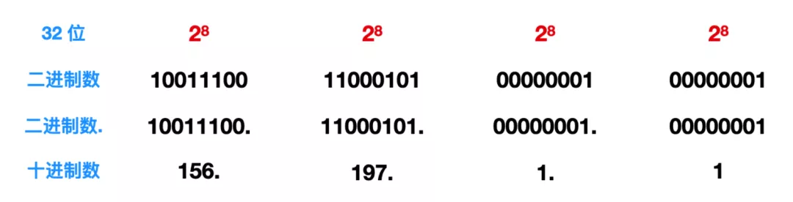
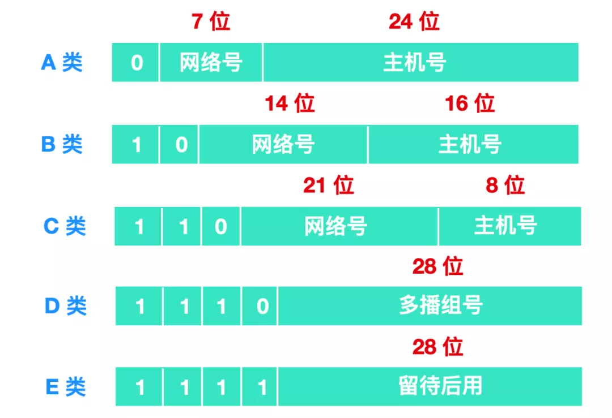
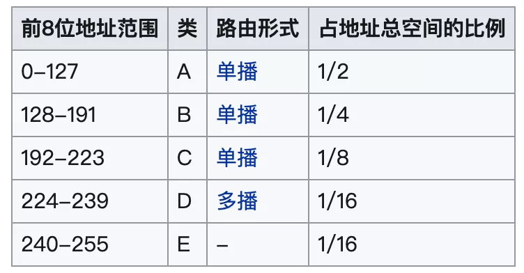
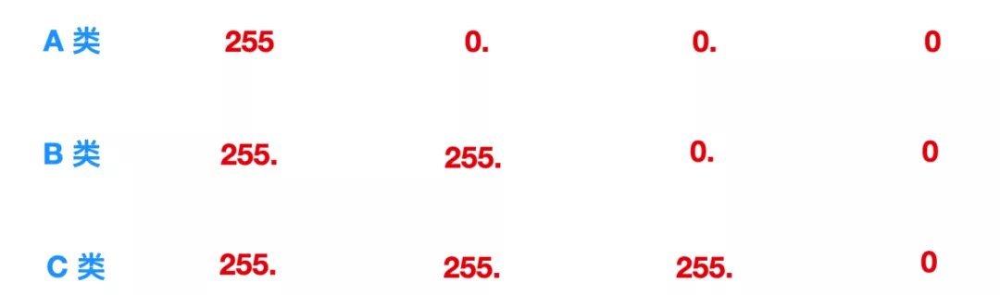
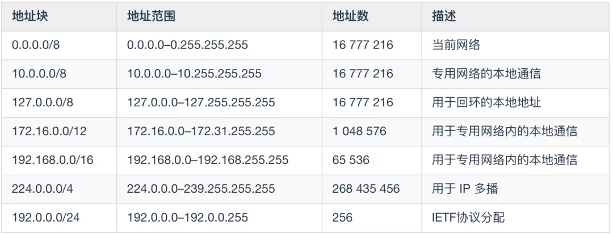

#### 网络协议

计算机网络协议技就是网络规则，是各种硬件和软件共同遵循的守则。网络协议融合于其它所有的软件系统中，在网络中协议是无所不在的。
网络协议遍及OSI通信模型的各个层次，从比较常见的`TCP/IP`、`HTTP`、`FTP`协议，到`OSPF`、`IGP`等特殊协议，有上千种之多。
局域网常用`TCP/IP`、`NetBEUI`、`IPX/SPX`这三种通信协议。`TCP/IP`协议是最重要、最基础、最麻烦的一个，上网时需要详细设置IP地址、网关、子网掩码、DNS服务器等参数，不过随着技术的进步，现在基本是自动获取了。

`TCP/IP`协议族中互为关联的协议有上百个之多，且都有不同的功能，分布在不同的协议层.

常用协议如下：

1、UDP：用户数据包协议，位于传输层，和IP协议配合使用，因为不能提供数据包的重传，所以适合传输较短的文件；

2、NFS：网络文件服务器，可使多台计算机透明地访问彼此的目录；

3、FTP：远程文件传输协议，允许用户将远程主机上的文件拷贝到自己的计算机上；

4、SMTP：简单邮政传输协议，用于传输电子邮件；

5、Telnet：提供远程登录功能，一台计算机用户可以登录到远程的另一台计算机上，如同在远程主机上直接操作一样.

6、HTTP协议（HyperText Transfer Protocol，超文本传输协议）是因特网上应用最为广泛的一种网络传输协议，所有的WWW文件都必须遵守这个标准。 HTTP是一个基于TCP/IP通信协议来传递数据（HTML 文件, 图片文件, 查询结果等）。

#### IP 协议

路由器对分组进行转发后，就会把数据包传到网络上，数据包最终是要传递到客户端或者服务器上的，那么数据包怎么知道要发往哪里呢？起到关键作用的就是 IP 协议。

IP 主要分为三个部分，分别是 IP 寻址、路由和分包组包。

#### IP 地址

一个数据包要在网络上传输，那么肯定需要知道这个数据包到底发往哪里，也就是说需要一个目标地址信息，IP 地址就是连接网络中的所有主机进行通信的目标地址，因此，在网络上的每个主机都需要有自己的 IP 地址。

在 IP 数据报发送的链路中，有可能链路非常长，比如说由中国发往美国的一个数据报，由于网络抖动等一些意外因素可能会导致数据报丢失，这时我们在这条链路中会放入一些 中转站，一方面能够确保数据报是否丢失，另一方面能够控制数据报的转发，这个中转站就是我们前面聊过的路由器，这个转发过程就是 路由控制。

路由控制(Routing) 是指将分组数据发送到最终目标地址的功能，即使网络复杂多变，也能够通过路由控制到达目标地址。因此，一个数据报能否到达目标主机，关键就在于路由器的控制。

这里有一个名词，就是跳，因为在一条链路中可能会布满很多路由器，路由器和路由器之间的数据报传送就是跳，比如你和朋友通信，中间就可能会经过路由器 A-> 路由器 B -> 路由器 C 。

那么这个跳转的范围是多少呢？

通常这个一跳是指从源 MAC 地址到目标 MAC 地址之间传输帧的区间，这里引出一个新的名词，MAC 地址是啥？

`MAC`地址指的就是`计算机的物理地址(Physical Address)`，它是用来确认网络设备位置的地址。在 OSI 网络模型中，网络层负责 IP 地址的定位，而数据链路层负责 MAC 地址的定位。MAC 地址用于在网络中唯一标示一个网卡，一台设备若有一或多个网卡，则每个网卡都需要并会有一个唯一的 MAC 地址，也就是说 MAC 地址和网卡是紧密联系在一起的。

路由器的每一跳都需要询问当前中转的路由器，下一跳应该跳到哪里，从而跳转到目标地址。而不是数据报刚开始发送后，网络中所有的通路都会显示出来，这种多次跳转也叫做`多跳路由`。

#### IP 地址定义

我们现在又两个版本的 IP 地址，`IPv4` 和 `IPv6`，我们首先看一下现如今还在广泛使用的 IPv4 地址。

`IPv4` 由 32 位正整数来表示，在计算机内部会转化为二进制来处理，但是二进制不符合人类阅读的习惯，所以我们根据易读性的原则把 32 位的 IP 地址以 8 位为一组，分成四组，每组之间以 `.` 进行分割，再将每组转换为十进制数。

如下图所示:

面这个 32 位的 IP 地址就会被转换为十进制的 156.197.1.1。

每个这样 8 位位一组的数字，自然是非负数，其取值范围是 [0,255]。

IP 地址的总个数有 `2^32` 次幂个，这个数值算下来是 `4294967296` ，大概能允许 43 亿台设备连接到网络。实际上真的如此吗？

实际上 IP 不会以主机的个数来配置的，而是根据设备上的 网卡(NIC) 进行配置，每一块网卡都会设置一个或者多个 IP 地址，而且通常一台路由器会有至少两块网卡，所以可以设置两个以上的 IP 地址，所以主机的数量远远达不到 43 亿。

#### IP 地址构造和分类

IP 地址由 网络标识 和 主机标识 两部分组成，网络标识代表着网络地址，主机标识代表着主机地址。网络标识在数据链路的每个段配置不同的值。
网络标识必须保证相互连接的每个段的地址都不重复。而相同段内相连的主机必须有相同的网络地址。IP 地址的 主机标识 则不允许在同一网段内重复出现。

例如：我们所在的小区的某一栋楼就相当于是网络标识，某一栋楼的第几户就相当于是我的`主机标识`。这样可以通过xx省xx市xx区xx路xx小区xx栋来定位我的`网络标识`，这一栋的第几户就相当于是我的`主机标识`。

IP 地址分为四类，分别是 A类、B类、C类、D类、E类，它会根据 IP 地址中的第 1 位到第 4 位的比特对网络标识和主机标识进行分类。

* A 类：(1.0.0.0 - 126.0.0.0)（默认子网掩码：255.0.0.0 或 0xFF000000）第一个字节为网络号，后三个字节为主机号。该类 IP 地址的最前面为 0 ，所以地址的网络号取值于 1~126 之间。一般用于大型网络。

* B 类：(128.0.0.0 - 191.255.0.0)（默认子网掩码：255.255.0.0 或 0xFFFF0000）前两个字节为网络号，后两个字节为主机号。该类 IP 地址的最前面为 10 ，所以地址的网络号取值于 128~191 之间。一般用于中等规模网络。

* C 类：(192.0.0.0 - 223.255.255.0)（子网掩码：255.255.255.0 或 0xFFFFFF00）前三个字节为网络号，最后一个字节为主机号。该类 IP 地址的最前面为 110 ，所以地址的网络号取值于 192~223 之间。一般用于小型网络。

* D 类：是多播地址。该类 IP 地址的最前面为 1110 ，所以地址的网络号取值于 224~239 之间。一般用于多路广播用户。

* E 类：是保留地址。该类 IP 地址的最前面为 1111 ，所以地址的网络号取值于 240~255 之间。

而根据不同的 IP 范围，就有不同的地总空间分类:

#### 子网掩码

子网掩码(subnet mask) 又叫做网络掩码，它是一种用来指明一个 IP 地址的哪些位标识的是主机所在的网络。子网掩码是一个 32位 地址，用于屏蔽 IP 地址的一部分以区别网络标识和主机标识。

一个 IP 地址只要确定了其分类，也就确定了它的网络标识和主机标识。

由此，各个分类所表示的网络标识范围如下：

用 1 表示 IP 网络地址的比特范围，0 表示 IP 主机地址的范围。

将他们用十进制表示，那么这三类的表示如下:

#### 保留地址

在IPv4 的几类地址中，有几个保留的地址空间不能在互联网上使用。这些地址用于特殊目的，不能在局域网外部路由。

#### IP 协议版本

目前，在全球 Internet 中共存有两个IP版本：IP 版本 4（IPv4）和 IP 版本6（IPv6）。IP 地址由二进制值组成，可驱动 Internet 上所有数据的路由。IPv4 地址的长度为 32 位，而 IPv6 地址的长度为 128 位。

Internet IP 资源由 Internet 分配号码机构（IANA）分配给区域 Internet 注册表（RIR），例如`APNIC`，该机构负责根 DNS ，IP 寻址和其他 Internet 协议资源。

然而IP 协议中非常重要的两个版本就是 IPv4 和 IPv6。

#### IPv4

IPv4 的全称是 `Internet Protocol version 4`，是 Internet 协议的第四版。IPv4 是一种无连接的协议，这个协议会尽最大努力交付数据包，也就是说它不能保证任何数据包能到达目的地，也不能保证所有的数据包都会按照正确的顺序到达目标主机，这些都是由上层比如传输控制协议控制的。也就是说，单从 IP 看来，这是一个不可靠的协议。

IPv4 的数据报格式如下:

