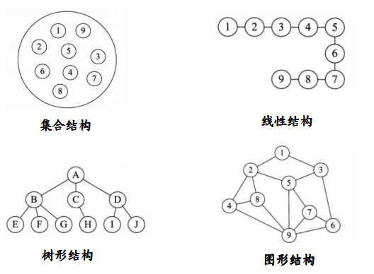
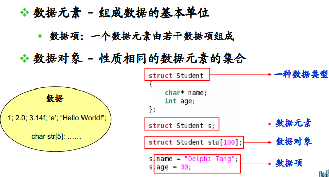

### 数据结构

数据结构是一门研究非数值计算的程序设计问题中的操作对象，以及它们之间的关系和操作等相关问题的学科。通常我们的程序设计=数据结构+算法,学好数据结构也是我们学习编程的重要一部分.

数据结构，本质上是数据之间的结构关系，或者理解成数据元素相互之间存在的一种或多种特定关系的集合。数据结构中的结构，也就是我们研究的主体对象。在数据结构中我们很少研究数据，因为数据在内存中的表现形式对于我们都是一样的，也就是二进制。传统上，我们把数据结构分为逻辑结构和物理结构。

数据结构，按照视点的不同,我们把数据结构分为逻辑结构和物理结构。

#### 逻辑结构

逻辑结构指反映数据元素之间的逻辑关系的数据结构，其中的逻辑关系是指数据元素之间的前后关系，而与他们在计算机中的存储位置无关。

逻辑结构分为以下四类：

1. 集合结构

集合结构中的数据元素同属于一个集合，他们之间是并列的关系，除此之外没有其他关系。

2. 线性结构

线性结构中的元素存在一对一的相互关系。

3. 树形结构

树形结构中的元素存在一对多的相互关系。

4. 图形结构

图形结构中的元素存在多对多的相互关系。

这四种类型之间的图形结构是:

#### 物理结构

物理结构又叫存储结构，指数据的逻辑结构在计算机存储空间的存放形式。通俗的讲，物理结构研究的是数据在存储器中存放的形式。 
存储器主要针对于内存而言，像硬盘、软盘、光盘等外部存储器的数据组织通常用文件结构来描述。

数据在内存中的存储结构，也就是物理结构，分为两种：顺序存储结构和链式存储结构。

1. 顺序存储结构

顺序存储结构是把数据元素存放在地址连续的存储单元里，其数据间的逻辑关系和物理关系是一致的。数组就是顺序存储结构的典型代表。

2. 链式存储结构

链式存储结构是把数据元素存放在内存中的任意存储单元里，也就是可以把数据存放在内存的各个位置。这些数据在内存中的地址可以是连续的，也可以是不连续的。

和顺序存储结构不同的是，链式存储结构的数据元素之间是通过指针来连接的，我们可以通使用指针来找到某个数据元素的位置，然后对这个数据元素进行一些操作。

因此呢,数据结构是相互之间存在一种或多种特定 关系的数据元素的集合 。 同样是结构，从不同的角度来讨论，会有不同的分类.

逻辑结构分为: 集合结构, 线性结构, 树形结构, 图形结构.

物理结构分为: 顺序存储结构, 链式存储结构.

