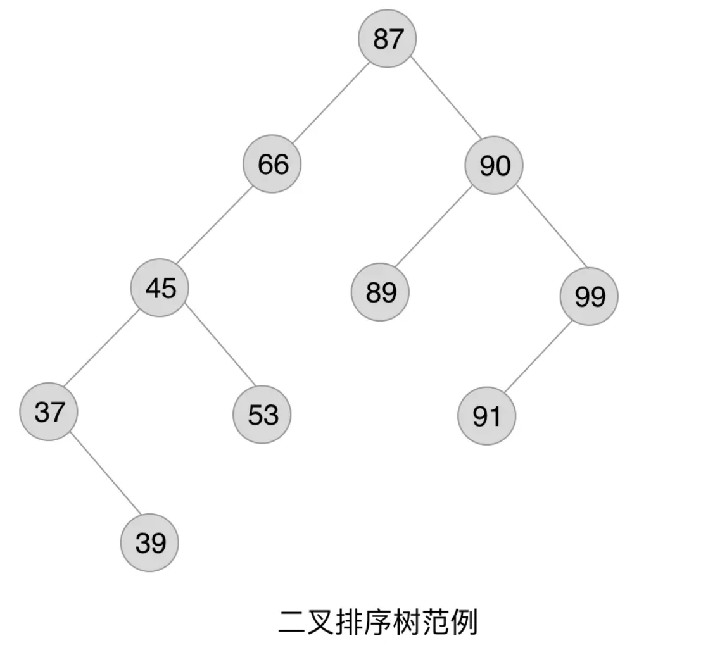
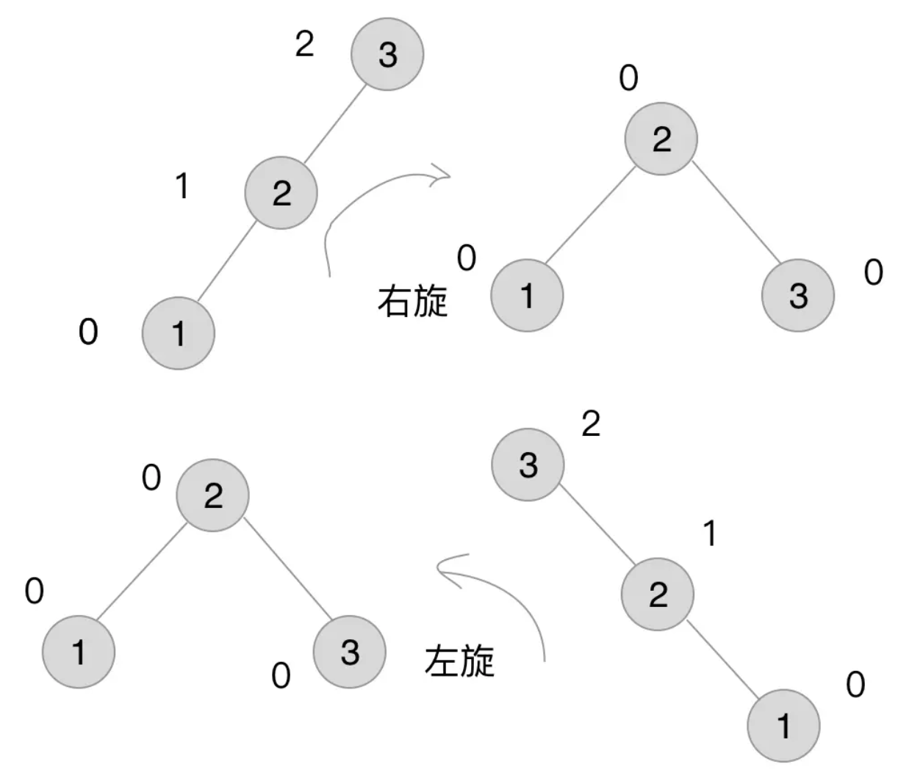
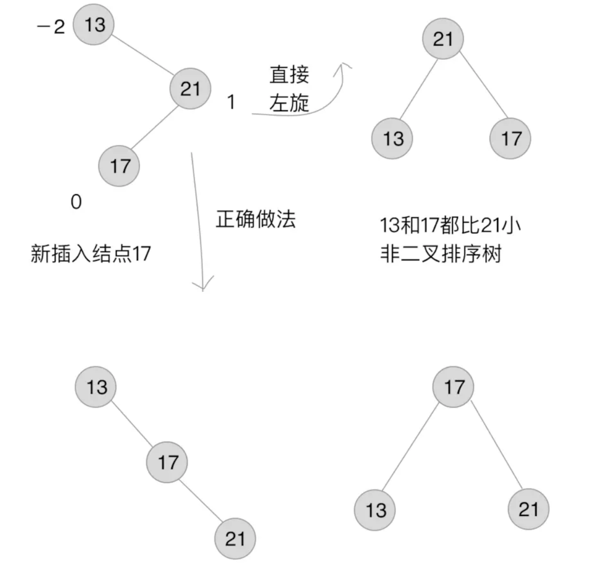
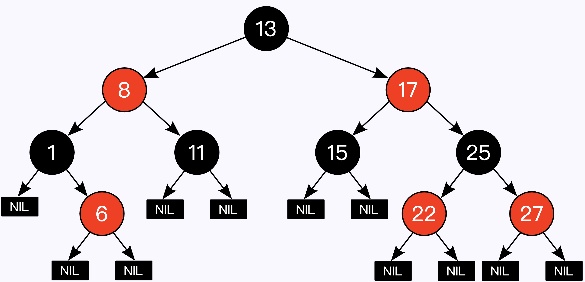

### 算法

什么是算法呢?算法是描述解决问题的方法。算法 (Algo付出m) 这个单词最早出 现在被斯数学家阿勒·花刺子密在公元 825 年(相当于我们中国的唐朝时期)所写的
《印度数字算术》中。 

如今普遍认可的对算法的定义是 :算法是指解题方案的准确而完整的描述，是一系列解决问题的清晰指令，算法代表着用系统的方法描述解决问题的策略机制。即算法是描述解决问题的方法.

* [一、算法介绍](#算法介绍)
* [二、算法分析](#算法分析)
    * [数学模型](#数学模型)
    * [注意事项](#注意事项)
    * [ThreeSum](#threesum)
    * [倍率实验](#倍率实验)
* [三、排序](#排序)
    * [选择排序](#选择排序)
    * [冒泡排序](#冒泡排序)
    * [插入排序](#插入排序)
    * [希尔排序](#希尔排序)
    * [归并排序](#归并排序)
    * [快速排序](#快速排序)
    * [堆排序](#堆排序)
    * [小结](#小结)
* [四、并查集](#并查集)
    * [Quick Find](#quick-find)
    * [Quick Union](#quick-union)
    * [加权 Quick Union](#加权-quick-union)
    * [路径压缩的加权 Quick Union](#路径压缩的加权-quick-union)
    * [比较](#比较)
* [五、栈和队列](#栈和队列)
    * [栈](#栈)
    * [队列](#队列)
* [六、符号表](#符号表)
    * [初级实现](#初级实现)
    * [二叉查找树](#二叉查找树)
    * [2-3 查找树](#2-3-查找树)
    * [红黑树](#红黑树)
    * [散列表](#散列表)
    * [小结](#小结)
* [七、其它](#其它)
    * [汉诺塔](#汉诺塔)
    * [哈夫曼编码](#哈夫曼编码)
* [八、算法练习](#算法练习)   
* [参考资料](#参考资料)


#### 算法介绍

算法是求解一个问题所需要的步骤所形成的解决方法，每一步包括一个或者多个操作。无论是现实生活中还是计算机中，解决同一个问题的方法可能有很多种，在这N多种算法中，肯定存在一个执行效率最快的方法，那么这个方法就是最优算法。

算法具有五个基本特征：输入、输出、有穷性、确定性和可行性。

1. 输入

一个算法具有零个或者多个输出。以刻画运算对象的初始情况，所谓0个输入是指算法本身定出了初始条件。

2. 输出

算法至少有一个输出。也就是说，算法一定要有输出。输出的形式可以是打印，也可以使返回一个值或者多个值等。也可以是显示某些提示。

3. 有穷性

算法的执行步骤是有限的，算法的执行时间也是有限的。

4. 确定性

算法的每个步骤都有确定的含义，不会出现二义性。

5. 可行性

算法是可用的，也就是能够解决当前问题。

算法的设计要求:

1. 正确性

对于合法输入能够得到满足的结果,算法能够处理非法处理，并得到合理结果.算法对于边界数据和压力数据都能得到满足的结果。

2. 可读性

算法要方便阅读，理解和交流，只有自己能看得懂，其它人都看不懂，谈和好算法。

3. 健壮性

通俗的讲,一个好的算法应该具有捕获异常/处理异常的能力。另外，对于测试人员的压力测试、边界值测试等刁难的测试手段，算法应该能够轻松的扛过去。

4. 高性价比

利用最少的时间和资源得到满足要求的结果，可以通过(时间复杂度和空间复杂度来判定)。

通常判定一种算法的效率可以采用事后统计法和事前分析估算.

事后统计法缺点: 必须编写相应的测试程序，严重依赖硬件和运行时的环境，算法的数据采集相当的困难。

事前分析估算：　主要取决于问题的规模。

这里解释下时间复杂度和空间复杂度.

时间复杂度:

时间复杂度是对排序数据的总的操作次数。反映当n变化时，操作次数呈现什么规律。

公式： `T(n) = O( f(n) )` ,其中f(n)是问题规模n的函数，也就是执行某个操作的次数。

在没有特殊说明的情况下，我们所分析的时间复杂度都是指最坏的时间复杂度。


空间复杂度：

空间复杂度是指算法在计算机内执行时所需存储空间的度量，它也是数据规模n的函数。 


公式： S(n) = O( f(n) ),其中f(n)是在问题规模为n时所占用的内存空间大小。 

大O表示法同样也适合空间复杂度。


#### 常见算法

我们都知道，线性表分为无序线性表和有序线性表。 

无序线性表的数据并不是按升序或者降序来排列的，所以在插入和删除时，没有什么必须遵守的规矩而可以插入在数据尾部或者删除在数据尾部（将待删除的数据和最后一个数据交换位置），但是在查找的时候，需要遍历整个数据集，影响了效率。 
有序线性表的数据则想法，查找的时候因为数据有序，可以用二分法、插值法、斐波那契查找法来实现，但是，插入和删除需要维护有序的结构，会耗费大量的时间。 
为了提高插入和删除的效率，二叉排序树登场了。

1. 二叉搜索树 (Binary Search Tree)
2. 平衡二叉查找树 ( Balanced Binary Search Tree )
3. 红黑树 (Red-Black Tree )
4. B-树和B+树 (B-Tree )

* 二叉搜索树 (Binary Search Tree)

二叉搜索树的特点:

* 所有非叶子结点至多拥有两个树（Left和Right）；
* 若它的左子树不空，则左子树上所有结点的值均小于它的根结点的值；
* 若它的右子树不空，则右子树上所有结点的值均大于它的根结点的值；
* 它的左、右子树也分别为二叉搜索树。

二叉搜索树种最关键的是的特点是，左子树结点一定比父结点小，右子树结点一定比父结点大 .
<p align="center">

</p>

二叉搜索树查找:

通过观察上面的二叉搜索树，可以知道，查找树中一个值，可以从根结点开始查找，和根结点的值做比较，比根结点的值小，就在根结点的左子树中查找，比根结点的值大，就在根结点的右子树中查找。其他结点的行为与根结点的行为也是一样的。

以此出发，可以得到递归算法：

* 如果树是空的，则查找结束，无匹配。
* 如果被查找的值和根结点的值相等，查找成功。否则就在子树中继续查找。如果被查找的值小于根结点的值就选择左子树，大于根结点的值就选择右子树。 在理想情况下，每次比较过后，树会被砍掉一半，近乎折半查找。

遍历打印可以使用 中序遍历 ，打印出来的结果是从小到大的有序数组。

二叉搜索树插入:

新结点插入到树的叶子上，完全不需要改变树中原有结点的组织结构。插入一个结点的代价与查找一个不存在的数据的代价完全相同。

二叉排序的插入是建立在二叉排序的查找之上的，原因很简单，添加一个结点到合适的位置，就是通过查找发现合适位置，把结点直接放进去。 
先来说一下插入函数,SearchBST(BiTree T, int key,BiTree f,BiTree *p)中指针p具有非常重要的作用:

* 若查找的key已经有在树中，则p指向该数据结点。
* 若查找的key没有在树中，则p指向查找路径上最后一个结点，而这里的最后一个结点的位置和key应该被放入的位置存在着简单关系（要么当树空时直接插入作为根结点， 要么当树非空时新结点作为查找路径终止结点的左孩子或者右孩子插入 ）。

二叉搜索树删除:

* 被删除的节点是叶子节点，这时候只要把这个节点删除，再把指向这个节点的父节点指针置为空就行

* 被删除的节点有左子树，或者有右子树，而且只有其中一个，那么只要把当前删除节点的父节点指向被删除节点的左子树或者右子树就行。

* 被删除的节点既有左子树而且又有右子树，这时候需要把左子树的最右边的节点或者右子树最左边的节点提到被删除节点的位置，为什么要这样呢，根据二叉查找树的性质，父节点的指针一定比所有左子树的节点值大而且比右子树的节点的值小，为了删除父节点不破坏二叉查找树的平衡性，应当把左子树最大的节点或者右子树最小的节点放在父节点的位置，这样的话才能维护二叉查找树的平衡性。（我是找的右子树的最小节点）

二叉树的删除可以算是二叉树最为复杂的操作，删除的时候要考虑到很多种情况：
1. 被删除的节点是叶子节点
2. 被删除的节点只有左子节点
3. 被删除的节点只有右子节点
4. 被删除的有两个子节点

二叉搜索树的效率总结: 查找最好时间复杂度O(logN)，最坏时间复杂度O(N)。 插入删除操作算法简单，时间复杂度与查找差不多。

* 平衡二叉查找树 ( Balanced Binary Search Tree )

平衡二叉查找树 （Height-Balanced Binary Search Tree） 是一种二叉排序树，其中每一个结点的左子树和右子树的高度差不超过1（小于等于1）。 
二叉树的平衡因子 （Balance Factor） 等于该结点的左子树深度减去右子树深度的值称为平衡因子。平衡因子只可能是－1，0，1。 
距离插入结点最近的，且平衡因子的绝对值大于1的结点为根的自述，称为最小不平衡子树。

平衡二叉搜索树就是二叉树的构建过程中，每当插入一个结点，看是不是因为树的插入破坏了树的平衡性，若是，则找出最小不平衡树。在保持二叉树特性的前提下，调整最小不平衡子树中各个结点之间的链接关系，进行相应的旋转，使之成为新的平衡子树。因此主要是注意：步步调整，步步平衡 。

<p align="center">

</p>

左旋和右旋的过程我们可以看到平衡因子从（0，1，2）变为（0，0，0），即是一种将非平衡状态转换为平衡状态的过程，这也是AVL树步步调整的核心。 

再来观察一种复杂的情况:

<p align="center">

</p>

新插入一个结点17，使得13的BF（－2）和21的BF（1）符号相反，如果直接左旋，调整后的树就不再是二叉排序树了。因此，正确做法是先在step1中调整符号，然后才能在step2中进行平衡操作。 

由此，可以总结出平衡操作中非常必要的符号统一操作：
```markdown
最小不平衡子树的BF和它的子树的BF符号相反时，就需要对结点先进行一次旋转使得符号相同，再 反向旋转一次 才能够完成平衡操作。
```

*  红黑树（Red–black tree）

红黑树（Red–black tree）是一种自平衡二叉查找树，是在计算机科学中用到的一种数据结构，典型的用途是实现关联数组。它在1972年由鲁道夫·贝尔发明，被称为"对称二叉B树"，它现代的名字源于Leo J. Guibas和Robert Sedgewick于1978年写的一篇论文。红黑树的结构复杂，但它的操作有着良好的最坏情况运行时间，并且在实践中高效：它可以在 在 O(log n)}时间内完成查找，插入和删除，这里的n是树中元素的数目。


B/B+ 树就是N叉（N-ary）平衡树了，每个节点可以有更多的孩子，新的值可以插在已有的节点里，而不需要改变树的高度，从而大量减少重新平衡和数据迁移的次数，这非常适合做数据库索引这种需要持久化在磁盘，同时需要大量查询和插入操作的应用。


红黑树用途和好处:

红黑树和AVL树一样都对插入时间、删除时间和查找时间提供了最好可能的最坏情况担保。这不只是使它们在时间敏感的应用，如实时应用（real time application）中有价值，而且使它们有在提供最坏情况担保的其他数据结构中作为基础模板的价值；例如，在计算几何中使用的很多数据结构都可以基于红黑树实现。

红黑树在函数式编程中也特别有用，在这里它们是最常用的持久数据结构（persistent data structure）之一，它们用来构造关联数组和集合，每次插入、删除之后它们能保持为以前的版本。除了O(log n)}的时间之外，红黑树的持久版本对每次插入或删除需要O(log n)的空间。

红黑树是2-3-4树的一种等同。换句话说，对于每个2-3-4树，都存在至少一个数据元素是同样次序的红黑树。在2-3-4树上的插入和删除操作也等同于在红黑树中颜色翻转和旋转。这使得2-3-4树成为理解红黑树背后的逻辑的重要工具，这也是很多介绍算法的教科书在红黑树之前介绍2-3-4树的原因，尽管2-3-4树在实践中不经常使用。

红黑树相对于AVL树来说，牺牲了部分平衡性以换取插入或者删除操作时少量的旋转操作，整体来说性能要优于AVL树。

红黑树性质:

红黑树是每个节点都带有颜色属性的二叉查找树，颜色为红色或黑色。在二叉查找树强制一般要求以外.树中的结点包含5个属性：color、key、left、right和p。如果一个结点没有子结点或父结点，则该结点相应指针属性值为NIL。

红黑树要求：

1. 节点是红色或黑色。
2. 根是黑色。
3. 所有叶子都是黑色（叶子是NIL节点）。
4. 每个红色节点必须有两个黑色的子节点。（从每个叶子到根的所有路径上不能有两个连续的红色节点。）
5. 从任一节点到其每个叶子的所有简单路径都包含相同数目的黑色节点。


<p align="center">

</p>


这些约束确保了红黑树的关键特性：从根到叶子的最长的可能路径不多于最短的可能路径的两倍长。结果是这个树大致上是平衡的。因为操作比如插入、删除和查找某个值的最坏情况时间都要求与树的高度成比例，这个在高度上的理论上限允许红黑树在最坏情况下都是高效的，而不同于普通的二叉查找树。

要知道为什么这些性质确保了这个结果，注意到性质4导致了路径不能有两个毗连的红色节点就足够了。最短的可能路径都是黑色节点，最长的可能路径有交替的红色和黑色节点。因为根据性质5所有最长的路径都有相同数目的黑色节点，这就表明了没有路径能多于任何其他路径的两倍长。

在很多树数据结构的表示中，一个节点有可能只有一个子节点，而叶子节点包含数据。用这种范例表示红黑树是可能的，但是这会改变一些性质并使算法复杂。为此，本文中我们使用"nil叶子"或"空（null）叶子"，如上图所示，它不包含数据而只充当树在此结束的指示。这些节点在绘图中经常被省略，导致了这些树好像同上述原则相矛盾，而实际上不是这样。与此有关的结论是所有节点都有两个子节点，尽管其中的一个或两个可能是空叶子。

红黑树相比于BST和AVL树有什么优点？

红黑树是牺牲了严格的高度平衡的优越条件为代价，它只要求部分地达到平衡要求，降低了对旋转的要求，从而提高了性能。
红黑树能够以O(log2 n)的时间复杂度进行搜索、插入、删除操作。此外，由于它的设计，任何不平衡都会在三次旋转之内解决。当然，还有一些更好的，但实现起来更复杂的数据结构能够做到一步旋转之内达到平衡，但红黑树能够给我们一个比较“便宜”的解决方案。

相比于BST，因为红黑树可以能确保树的最长路径不大于两倍的最短路径的长度，所以可以看出它的查找效果是有最低保证的。在最坏的情况下也可以保证O(logN)的，这是要好于二叉查找树的。因为二叉查找树最坏情况可以让查找达到O(N)。

红黑树的算法时间复杂度和AVL相同，但统计性能比AVL树更高，所以在插入和删除中所做的后期维护操作肯定会比红黑树要耗时好多，但是他们的查找效率都是O(logN)，所以红黑树应用还是高于AVL树的。实际上插入，AVL 树和红黑树的速度取决于你所插入的数据.如果你的数据分布较好,则比较宜于采用 AVL树(例如随机产生系列数)，但是如果你想处理比较杂乱的情况,则红黑树是比较快的。

* AVL是严格平衡树，因此在增加或者删除节点的时候，根据不同情况，旋转的次数比红黑树要多；
* 而红黑树是弱平衡的，用非严格的平衡来换取增删节点时候旋转次数的降低；
* 所以简单说，查找的次数远远大于插入和删除，那么选择AVL树；如果搜索、插入删除次数几乎差不多，应该选择RB树。

红黑树的应用:
* 在Java中， TreeMap和TreeSet，Java 8中HashMap中TreeNode节点都采用了红黑树实现。 
* C++中，STL的map和set也应用了红黑树； 
* Linux进程调度Completely Fair Scheduler； 
* 用红黑树管理进程控制块epoll在内核中的实现，用红黑树管理事件块； 
* Nginx中，用红黑树管理timer等；
* 红黑树的各种操作的时间复杂度是O(lgn)，逻辑上很近的节点（父子）物理上可能很远，无法利用局部性，IO次数多查找慢，效率低。


#### 算法练习

* 数组

1. 实现一个支持动态扩容的数组
2. 实现一个大小固定的有序数组，支持动态增删改操作
3. 实现两个有序数组合并为一个有序数组

* 链表

1. 实现单链表、循环链表、双向链表，支持增删操作
2. 实现单链表反转
3. 实现两个有序的链表合并为一个有序链表
4. 实现求链表的中间结点

* 栈

1. 用数组实现一个顺序栈
2. 用链表实现一个链式栈
3. 编程模拟实现一个浏览器的前进、后退功能

* 队列

1. 用数组实现一个顺序队列
2. 用链表实现一个链式队列
3. 实现一个循环队列

* 递归
1. 编程实现斐波那契数列求值f(n)=f(n-1)+f(n-2)
2. 编程实现求阶乘n!
3. 编程实现一组数据集合的全排列

* 排序

1. 实现归并排序、快速排序、插入排序、冒泡排序、选择排序
2. 编程实现O(n)时间复杂度内找到一组数据的第K大元素

* 二分查找

1. 实现一个有序数组的二分查找算法
2. 实现模糊二分查找算法（比如大于等于给定值的第一个元素）

* 散列表

1. 实现一个基于链表法解决冲突问题的散列表
2. 实现一个LRU缓存淘汰算法

* 字符串

1. 实现一个字符集，只包含a～z这26个英文字母的Trie树
2. 实现朴素的字符串匹配算法

* 二叉树

1. 实现一个二叉查找树，并且支持插入、删除、查找操作
2. 实现查找二叉查找树中某个节点的后继、前驱节点
3. 实现二叉树前、中、后序以及按层遍历

* 堆

1. 实现一个小顶堆、大顶堆、优先级队列
2. 实现堆排序
3. 利用优先级队列合并K个有序数组
4. 求一组动态数据集合的最大Top K

* 图

1. 实现有向图、无向图、有权图、无权图的邻接矩阵和邻接表表示方法
2. 实现图的深度优先搜索、广度优先搜索
3. 实现Dijkstra算法、A*算法
4. 实现拓扑排序的Kahn算法、DFS算法

* 回溯

1. 利用回溯算法求解八皇后问题
2. 利用回溯算法求解0-1背包问题

* 分治

1. 利用分治算法求一组数据的逆序对个数

* 动态规划

1. 0-1背包问题
2. 最小路径和
3. 编程实现莱文斯坦最短编辑距离
4. 编程实现查找两个字符串的最长公共子序列
5. 编程实现一个数据序列的最长递增子序列


#### 参考资料

* [Visualizations Algorithms](https://www.cs.usfca.edu/~galles/visualization/Algorithms.html)
* [Algorithms](https://algs4.cs.princeton.edu/home/)
