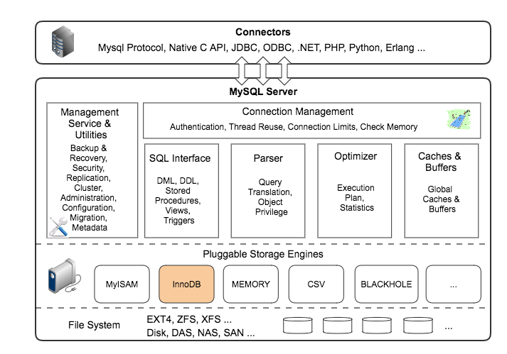

### 数据库

数据库这块我们先从在开发中常用的数据库Mysql开始，MySQL是一个关系型数据库管理系统，由瑞典MySQL AB 公司开发，目前属于 Oracle 旗下公司。MySQL 最流行的关系型数据库管理系统，在 WEB 应用方面MySQL是最好的 RDBMS (Relational Database Management System，关系数据库管理系统) 应用软件之一。

MySQL基础:

[MySQL的多存储引擎架构](#MySQL的多存储引擎架构)

#### MySQL的多存储引擎架构

MySQL作为一个大型的网络程序、数据管理系统，架构非常复杂。

