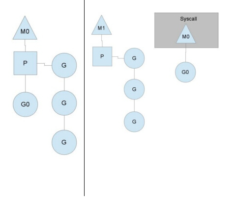
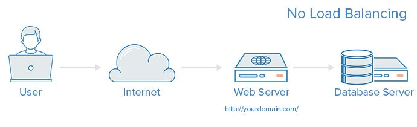
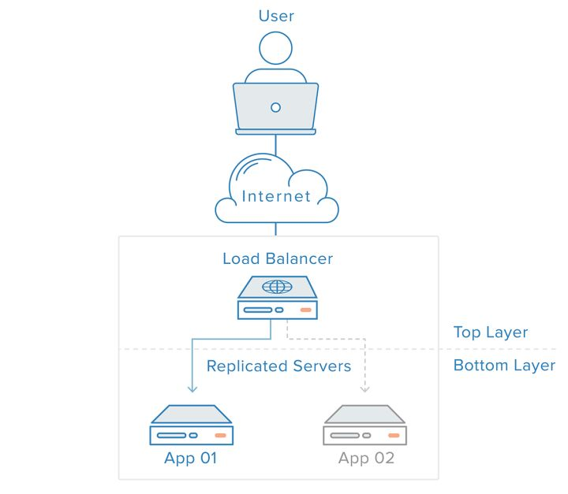
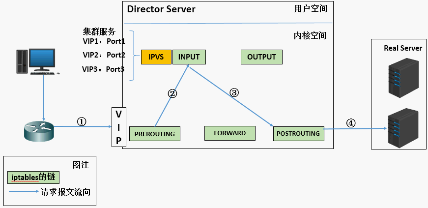

### Golang面试问题汇总

通常我们去面试肯定会有些不错的Golang的面试题目的，所以总结下，让其他Golang开发者也可以查看到，同时也用来检测自己的能力和提醒自己的不足之处,欢迎大家补充和提交新的面试题目.

Golang面试问题汇总:

1. Golang中除了加Mutex锁以外还有哪些方式安全读写共享变量？

  Golang中Goroutine 可以通过 Channel 进行安全读写共享变量。

2. 无缓冲 Chan 的发送和接收是否同步?

```go
ch := make(chan int)    无缓冲的channel由于没有缓冲发送和接收需要同步.
ch := make(chan int, 2) 有缓冲channel不要求发送和接收操作同步. 
```
* channel无缓冲时，发送阻塞直到数据被接收，接收阻塞直到读到数据。
* channel有缓冲时，当缓冲满时发送阻塞，当缓冲空时接收阻塞。

3. go语言的并发机制以及它所使用的CSP并发模型．

CSP模型是上个世纪七十年代提出的,不同于传统的多线程通过共享内存来通信，CSP讲究的是“以通信的方式来共享内存”。用于描述两个独立的并发实体通过共享的通讯 channel(管道)进行通信的并发模型。 CSP中channel是第一类对象，它不关注发送消息的实体，而关注与发送消息时使用的channel。

Golang中channel 是被单独创建并且可以在进程之间传递，它的通信模式类似于 boss-worker 模式的，一个实体通过将消息发送到channel 中，然后又监听这个 channel 的实体处理，两个实体之间是匿名的，这个就实现实体中间的解耦，其中 channel 是同步的一个消息被发送到 channel 中，最终是一定要被另外的实体消费掉的，在实现原理上其实类似一个阻塞的消息队列。

Goroutine 是Golang实际并发执行的实体，它底层是使用协程(coroutine)实现并发，coroutine是一种运行在用户态的用户线程，类似于 greenthread，go底层选择使用coroutine的出发点是因为，它具有以下特点：

* 用户空间 避免了内核态和用户态的切换导致的成本。
* 可以由语言和框架层进行调度。
* 更小的栈空间允许创建大量的实例。

Golang中的Goroutine的特性:

Golang内部有三个对象： P对象(processor) 代表上下文（或者可以认为是cpu），M(work thread)代表工作线程，G对象（goroutine）.

正常情况下一个cpu对象启一个工作线程对象，线程去检查并执行goroutine对象。碰到goroutine对象阻塞的时候，会启动一个新的工作线程，以充分利用cpu资源。
所有有时候线程对象会比处理器对象多很多.

我们用如下图分别表示P、M、G:

<p align="center">

</p>

G（Goroutine） ：我们所说的协程，为用户级的轻量级线程，每个Goroutine对象中的sched保存着其上下文信息.

M（Machine） ：对内核级线程的封装，数量对应真实的CPU数（真正干活的对象）.

P（Processor） ：即为G和M的调度对象，用来调度G和M之间的关联关系，其数量可通过GOMAXPROCS()来设置，默认为核心数.

在单核情况下，所有Goroutine运行在同一个线程（M0）中，每一个线程维护一个上下文（P），任何时刻，一个上下文中只有一个Goroutine，其他Goroutine在runqueue中等待。

一个Goroutine运行完自己的时间片后，让出上下文，自己回到runqueue中（如下图所示）。

当正在运行的G0阻塞的时候（可以需要IO），会再创建一个线程（M1），P转到新的线程中去运行。

<p align="center">

</p>

当M0返回时，它会尝试从其他线程中“偷”一个上下文过来，如果没有偷到，会把Goroutine放到Global runqueue中去，然后把自己放入线程缓存中。
上下文会定时检查Global runqueue。

Golang是为并发而生的语言，Go语言是为数不多的在语言层面实现并发的语言；也正是Go语言的并发特性，吸引了全球无数的开发者。

Golang的CSP并发模型，是通过Goroutine和Channel来实现的。

Goroutine 是Go语言中并发的执行单位。有点抽象，其实就是和传统概念上的”线程“类似，可以理解为”线程“。
Channel是Go语言中各个并发结构体(Goroutine)之前的通信机制。通常Channel，是各个Goroutine之间通信的”管道“，有点类似于Linux中的管道。

通信机制channel也很方便，传数据用channel <- data，取数据用<-channel。

在通信过程中，传数据channel <- data和取数据<-channel必然会成对出现，因为这边传，那边取，两个goroutine之间才会实现通信。

而且不管传还是取，必阻塞，直到另外的goroutine传或者取为止。

4. Golang 中常用的并发模型？

Golang 中常用的并发模型有三种:

* 通过channel通知实现并发控制

无缓冲的通道指的是通道的大小为0，也就是说，这种类型的通道在接收前没有能力保存任何值，它要求发送 goroutine 和接收 goroutine 同时准备好，才可以完成发送和接收操作。

从上面无缓冲的通道定义来看，发送 goroutine 和接收 gouroutine 必须是同步的，同时准备后，如果没有同时准备好的话，先执行的操作就会阻塞等待，直到另一个相对应的操作准备好为止。这种无缓冲的通道我们也称之为同步通道。

```go
func main() {
    ch := make(chan struct{})
    go func() {
        fmt.Println("start working")
        time.Sleep(time.Second * 1)
        ch <- struct{}{}
    }()

    <-ch

    fmt.Println("finished")
}
```
当主 goroutine 运行到 <-ch 接受 channel 的值的时候，如果该  channel 中没有数据，就会一直阻塞等待，直到有值。 这样就可以简单实现并发控制

* 通过sync包中的WaitGroup实现并发控制

在 sync 包中，提供了 WaitGroup ，它会等待它收集的所有 goroutine 任务全部完成。在WaitGroup里主要有三个方法:

* Add, 可以添加或减少 goroutine的数量.
* Done, 相当于Add(-1).
* Wait, 执行后会堵塞主线程，直到WaitGroup 里的值减至0.

在主 goroutine 中 Add(delta int) 索要等待goroutine 的数量。
在每一个 goroutine 完成后 Done() 表示这一个goroutine 已经完成，当所有的 goroutine 都完成后，在主 goroutine 中 WaitGroup 返回返回。

```go
func main(){
    var wg sync.WaitGroup
    var urls = []string{
        "http://www.golang.org/",
        "http://www.google.com/",
    }
    for _, url := range urls {
        wg.Add(1)
        go func(url string) {
            defer wg.Done()
            http.Get(url)
        }(url)
    }
    wg.Wait()
}
```

在Golang官网中对于WaitGroup介绍是`A WaitGroup must not be copied after first use`,在 WaitGroup 第一次使用后，不能被拷贝

应用示例:
```go
func main(){
 wg := sync.WaitGroup{}
    for i := 0; i < 5; i++ {
        wg.Add(1)
        go func(wg sync.WaitGroup, i int) {
            fmt.Printf("i:%d", i)
            wg.Done()
        }(wg, i)
    }
    wg.Wait()
    fmt.Println("exit")
}

```
运行:
```go
i:1i:3i:2i:0i:4fatal error: all goroutines are asleep - deadlock!

goroutine 1 [semacquire]:
sync.runtime_Semacquire(0xc000094018)
        /home/keke/soft/go/src/runtime/sema.go:56 +0x39
sync.(*WaitGroup).Wait(0xc000094010)
        /home/keke/soft/go/src/sync/waitgroup.go:130 +0x64
main.main()
        /home/keke/go/Test/wait.go:17 +0xab
exit status 2
```
它提示所有的 goroutine 都已经睡眠了，出现了死锁。这是因为 wg 给拷贝传递到了  goroutine 中，导致只有 Add 操作，其实 Done操作是在 wg 的副本执行的。

因此 Wait 就死锁了。

这个第一个修改方式:将匿名函数中 wg 的传入类型改为 *sync.WaitGrou,这样就能引用到正确的WaitGroup了。
这个第二个修改方式:将匿名函数中的 wg 的传入参数去掉，因为Go支持闭包类型，在匿名函数中可以直接使用外面的 wg 变量

* 在Go 1.7 以后引进的强大的Context上下文，实现并发控制

通常,在一些简单场景下使用 channel 和 WaitGroup 已经足够了，但是当面临一些复杂多变的网络并发场景下 channel 和 WaitGroup 显得有些力不从心了。
比如一个网络请求 Request，每个 Request 都需要开启一个 goroutine 做一些事情，这些 goroutine 又可能会开启其他的 goroutine，比如数据库和RPC服务。
所以我们需要一种可以跟踪 goroutine 的方案，才可以达到控制他们的目的，这就是Go语言为我们提供的 Context，称之为上下文非常贴切，它就是goroutine 的上下文。
它是包括一个程序的运行环境、现场和快照等。每个程序要运行时，都需要知道当前程序的运行状态，通常Go 将这些封装在一个 Context 里，再将它传给要执行的 goroutine 。

context 包主要是用来处理多个 goroutine 之间共享数据，及多个 goroutine 的管理。

context 包的核心是 struct Context，接口声明如下：
```go
// A Context carries a deadline, cancelation signal, and request-scoped values
// across API boundaries. Its methods are safe for simultaneous use by multiple
// goroutines.
type Context interface {
    // Done returns a channel that is closed when this `Context` is canceled
    // or times out.
    Done() <-chan struct{}

    // Err indicates why this Context was canceled, after the Done channel
    // is closed.
    Err() error

    // Deadline returns the time when this Context will be canceled, if any.
    Deadline() (deadline time.Time, ok bool)

    // Value returns the value associated with key or nil if none.
    Value(key interface{}) interface{}
}
```

Done() 返回一个只能接受数据的channel类型，当该context关闭或者超时时间到了的时候，该channel就会有一个取消信号

Err() 在Done() 之后，返回context 取消的原因。

Deadline() 设置该context cancel的时间点

Value() 方法允许 Context 对象携带request作用域的数据，该数据必须是线程安全的。

Context 对象是线程安全的，你可以把一个 Context 对象传递给任意个数的 gorotuine，对它执行 取消 操作时，所有 goroutine 都会接收到取消信号。

一个 Context 不能拥有 Cancel 方法，同时我们也只能 Done channel 接收数据。
其中的原因是一致的：接收取消信号的函数和发送信号的函数通常不是一个。
典型的场景是：父操作为子操作操作启动 goroutine，子操作也就不能取消父操作。

5. JSON 标准库对 nil slice 和 空 slice 的处理是一致的吗？　

首先JSON 标准库对 nil slice 和 空 slice 的处理是不一致.

通常错误的用法，会报数组越界的错误，因为只是声明了slice，却没有给实例化的对象。
```go
var slice []int
slice[1] = 0
```
此时slice的值是nil，这种情况可以用于需要返回slice的函数，当函数出现异常的时候，保证函数依然会有nil的返回值。

empty slice 是指slice不为nil，但是slice没有值，slice的底层的空间是空的，此时的定义如下：
```go
slice := make([]int,0）
slice := []int{}
```
当我们查询或者处理一个空的列表的时候，这非常有用，它会告诉我们返回的是一个列表，但是列表内没有任何值。

总之，nil slice 和 empty slice是不同的东西,需要我们加以区分的.

6. 协程，线程，进程的区别。

* 进程

进程是具有一定独立功能的程序关于某个数据集合上的一次运行活动,进程是系统进行资源分配和调度的一个独立单位。每个进程都有自己的独立内存空间，不同进程通过进程间通信来通信。由于进程比较重量，占据独立的内存，所以上下文进程间的切换开销（栈、寄存器、虚拟内存、文件句柄等）比较大，但相对比较稳定安全。

* 线程

线程是进程的一个实体,是CPU调度和分派的基本单位,它是比进程更小的能独立运行的基本单位.线程自己基本上不拥有系统资源,只拥有一点在运行中必不可少的资源(如程序计数器,一组寄存器和栈),但是它可与同属一个进程的其他的线程共享进程所拥有的全部资源。线程间通信主要通过共享内存，上下文切换很快，资源开销较少，但相比进程不够稳定容易丢失数据。

* 协程

协程是一种用户态的轻量级线程，协程的调度完全由用户控制。协程拥有自己的寄存器上下文和栈。协程调度切换时，将寄存器上下文和栈保存到其他地方，在切回来的时候，恢复先前保存的寄存器上下文和栈，直接操作栈则基本没有内核切换的开销，可以不加锁的访问全局变量，所以上下文的切换非常快。

7. 互斥锁，读写锁，死锁问题是怎么解决。

* 互斥锁

互斥锁就是互斥变量mutex，用来锁住临界区的. 

条件锁就是条件变量，当进程的某些资源要求不满足时就进入休眠，也就是锁住了。当资源被分配到了，条件锁打开，进程继续运行；读写锁，也类似，用于缓冲区等临界资源能互斥访问的。

* 读写锁

通常有些公共数据修改的机会很少，但其读的机会很多。并且在读的过程中会伴随着查找，给这种代码加锁会降低我们的程序效率。读写锁可以解决这个问题。
<p align="center">

</p>

注意：写独占，读共享，写锁优先级高

* 死锁

一般情况下，如果同一个线程先后两次调用lock，在第二次调用时，由于锁已经被占用，该线程会挂起等待别的线程释放锁，然而锁正是被自己占用着的，该线程又被挂起而没有机会释放锁，因此就永远处于挂起等待状态了，这叫做死锁（Deadlock）。
另外一种情况是：若线程A获得了锁1，线程B获得了锁2，这时线程A调用lock试图获得锁2，结果是需要挂起等待线程B释放锁2，而这时线程B也调用lock试图获得锁1，结果是需要挂起等待线程A释放锁1，于是线程A和B都永远处于挂起状态了。

死锁产生的四个必要条件:
1. 互斥条件：一个资源每次只能被一个进程使用
2. 请求与保持条件：一个进程因请求资源而阻塞时，对已获得的资源保持不放。
3. 不剥夺条件:进程已获得的资源，在末使用完之前，不能强行剥夺。
4. 循环等待条件:若干进程之间形成一种头尾相接的循环等待资源关系。
这四个条件是死锁的必要条件，只要系统发生死锁，这些条件必然成立，而只要上述条件之一不满足，就不会发生死锁。

a. 预防死锁

可以把资源一次性分配：（破坏请求和保持条件）

然后剥夺资源：即当某进程新的资源未满足时，释放已占有的资源（破坏不可剥夺条件）

资源有序分配法：系统给每类资源赋予一个编号，每一个进程按编号递增的顺序请求资源，释放则相反（破坏环路等待条件）

b. 避免死锁

预防死锁的几种策略，会严重地损害系统性能。因此在避免死锁时，要施加较弱的限制，从而获得 较满意的系统性能。由于在避免死锁的策略中，允许进程动态地申请资源。因而，系统在进行资源分配之前预先计算资源分配的安全性。若此次分配不会导致系统进入不安全状态，则将资源分配给进程；否则，进程等待。其中最具有代表性的避免死锁算法是银行家算法。

c. 检测死锁

首先为每个进程和每个资源指定一个唯一的号码,然后建立资源分配表和进程等待表.

d. 解除死锁

当发现有进程死锁后，便应立即把它从死锁状态中解脱出来，常采用的方法有.

e. 剥夺资源

从其它进程剥夺足够数量的资源给死锁进程，以解除死锁状态.

f. 撤消进程

可以直接撤消死锁进程或撤消代价最小的进程，直至有足够的资源可用，死锁状态.消除为止.所谓代价是指优先级、运行代价、进程的重要性和价值等。

8. Golang的内存模型，为什么小对象多了会造成gc压力。

通常小对象过多会导致GC三色法消耗过多的GPU。优化思路是，减少对象分配.

9. Data Race问题怎么解决？能不能不加锁解决这个问题？

同步访问共享数据是处理数据竞争的一种有效的方法.golang在1.1之后引入了竞争检测机制，可以使用 go run -race 或者 go build -race来进行静态检测。 
其在内部的实现是,开启多个协程执行同一个命令， 并且记录下每个变量的状态.

竞争检测器基于C/C++的ThreadSanitizer 运行时库，该库在Google内部代码基地和Chromium找到许多错误。这个技术在2012年九月集成到Go中，从那时开始，它已经在标准库中检测到42个竞争条件。现在，它已经是我们持续构建过程的一部分，当竞争条件出现时，它会继续捕捉到这些错误。

竞争检测器已经完全集成到Go工具链中，仅仅添加-race标志到命令行就使用了检测器。
```go
$ go test -race mypkg    // 测试包
$ go run -race mysrc.go  // 编译和运行程序
$ go build -race mycmd   // 构建程序
$ go install -race mypkg // 安装程序
```
要想解决数据竞争的问题可以使用互斥锁sync.Mutex,解决数据竞争(Data race),也可以使用管道解决,使用管道的效率要比互斥锁高.

10. 什么是channel，为什么它可以做到线程安全？

Channel是Go中的一个核心类型，可以把它看成一个管道，通过它并发核心单元就可以发送或者接收数据进行通讯(communication),Channel也可以理解是一个先进先出的队列，通过管道进行通信。

Golang的Channel,发送一个数据到Channel 和 从Channel接收一个数据 都是 原子性的。而且Go的设计思想就是:不要通过共享内存来通信，而是通过通信来共享内存，前者就是传统的加锁，后者就是Channel。也就是说，设计Channel的主要目的就是在多任务间传递数据的，这当然是安全的。

11. Epoll原理.

开发高性能网络程序时，windows开发者们言必称Iocp，linux开发者们则言必称Epoll。大家都明白Epoll是一种IO多路复用技术，可以非常高效的处理数以百万计的Socket句柄，比起以前的Select和Poll效率提高了很多。

先简单了解下如何使用C库封装的3个epoll系统调用。
```c
int epoll_create(int size);  
int epoll_ctl(int epfd, int op, int fd, struct epoll_event *event);  
int epoll_wait(int epfd, struct epoll_event *events,int maxevents, int timeout);  
```
使用起来很清晰，首先要调用`epoll_create`建立一个epoll对象。参数size是内核保证能够正确处理的最大句柄数，多于这个最大数时内核可不保证效果。
epoll_ctl可以操作上面建立的epoll，例如，将刚建立的`socket`加入到epoll中让其监控，或者把 epoll正在监控的某个socket句柄移出epoll，不再监控它等等。

`epoll_wait`在调用时，在给定的timeout时间内，当在监控的所有句柄中有事件发生时，就返回用户态的进程。

从调用方式就可以看到epoll相比select/poll的优越之处是,因为后者每次调用时都要传递你所要监控的所有socket给select/poll系统调用，这意味着需要将用户态的socket列表copy到内核态，如果以万计的句柄会导致每次都要copy几十几百KB的内存到内核态，非常低效。而我们调用`epoll_wait`时就相当于以往调用select/poll，但是这时却不用传递socket句柄给内核，因为内核已经在epoll_ctl中拿到了要监控的句柄列表。

所以，实际上在你调用`epoll_create`后，内核就已经在内核态开始准备帮你存储要监控的句柄了，每次调用`epoll_ctl`只是在往内核的数据结构里塞入新的socket句柄。

在内核里，一切皆文件。所以，epoll向内核注册了一个文件系统，用于存储上述的被监控socket。当你调用epoll_create时，就会在这个虚拟的epoll文件系统里创建一个file结点。当然这个file不是普通文件，它只服务于epoll。

epoll在被内核初始化时（操作系统启动），同时会开辟出epoll自己的内核高速cache区，用于安置每一个我们想监控的socket，这些socket会以红黑树的形式保存在内核cache里，以支持快速的查找、插入、删除。这个内核高速cache区，就是建立连续的物理内存页，然后在之上建立slab层，通常来讲，就是物理上分配好你想要的size的内存对象，每次使用时都是使用空闲的已分配好的对象。

```c
static int __init eventpoll_init(void)  {  
    ... ...  
  
    /* Allocates slab cache used to allocate "struct epitem" items */  
    epi_cache = kmem_cache_create("eventpoll_epi", sizeof(struct epitem),  
            0, SLAB_HWCACHE_ALIGN|EPI_SLAB_DEBUG|SLAB_PANIC,  
            NULL, NULL);  
  
    /* Allocates slab cache used to allocate "struct eppoll_entry" */  
    pwq_cache = kmem_cache_create("eventpoll_pwq",  
            sizeof(struct eppoll_entry), 0,  
            EPI_SLAB_DEBUG|SLAB_PANIC, NULL, NULL);  
 ... ...  
 }
```
epoll的高效就在于，当我们调用`epoll_ctl`往里塞入百万个句柄时，`epoll_wait`仍然可以飞快的返回，并有效的将发生事件的句柄给我们用户。这是由于我们在调用`epoll_create`时，内核除了帮我们在epoll文件系统里建了个file结点，在内核cache里建了个红黑树用于存储以后epoll_ctl传来的socket外，还会再建立一个list链表，用于存储准备就绪的事件，当epoll_wait调用时，仅仅观察这个list链表里有没有数据即可。有数据就返回，没有数据就sleep，等到timeout时间到后即使链表没数据也返回。所以，epoll_wait非常高效。

而且，通常情况下即使我们要监控百万计的句柄，大多一次也只返回很少量的准备就绪句柄而已，所以，epoll_wait仅需要从内核态copy少量的句柄到用户态而已，因此就会非常的高效！

然而,这个准备就绪list链表是怎么维护的呢？当我们执行epoll_ctl时，除了把socket放到epoll文件系统里file对象对应的红黑树上之外，还会给内核中断处理程序注册一个回调函数，告诉内核，如果这个句柄的中断到了，就把它放到准备就绪list链表里。所以，当一个socket上有数据到了，内核在把网卡上的数据copy到内核中后就来把socket插入到准备就绪链表里了。

如此，一个红黑树，一张准备就绪句柄链表，少量的内核cache，就帮我们解决了大并发下的socket处理问题。执行`epoll_create`时，创建了红黑树和就绪链表，执行epoll_ctl时，如果增加socket句柄，则检查在红黑树中是否存在，存在立即返回，不存在则添加到树干上，然后向内核注册回调函数，用于当中断事件来临时向准备就绪链表中插入数据。执行epoll_wait时立刻返回准备就绪链表里的数据即可。

最后看看epoll独有的两种模式LT和ET。无论是LT和ET模式，都适用于以上所说的流程。区别是，LT模式下，只要一个句柄上的事件一次没有处理完，会在以后调用epoll_wait时每次返回这个句柄，而ET模式仅在第一次返回。

当一个socket句柄上有事件时，内核会把该句柄插入上面所说的准备就绪list链表，这时我们调用`epoll_wait`，会把准备就绪的socket拷贝到用户态内存，然后清空准备就绪list链表，最后，`epoll_wait`需要做的事情，就是检查这些socket，如果不是ET模式（就是LT模式的句柄了），并且这些socket上确实有未处理的事件时，又把该句柄放回到刚刚清空的准备就绪链表了。所以，非ET的句柄，只要它上面还有事件，epoll_wait每次都会返回。而ET模式的句柄，除非有新中断到，即使socket上的事件没有处理完，也是不会每次从epoll_wait返回的。

因此epoll比select的提高实际上是一个用空间换时间思想的具体应用.对比阻塞IO的处理模型, 可以看到采用了多路复用IO之后, 程序可以自由的进行自己除了IO操作之外的工作, 只有到IO状态发生变化的时候由多路复用IO进行通知, 然后再采取相应的操作, 而不用一直阻塞等待IO状态发生变化,提高效率.

12. Golang GC 时会发生什么?

首先我们先来了解下垃圾回收.什么是垃圾回收？

内存管理是程序员开发应用的一大难题。传统的系统级编程语言（主要指C/C++）中，程序开发者必须对内存小心的进行管理操作，控制内存的申请及释放。因为稍有不慎，就可能产生内存泄露问题，这种问题不易发现并且难以定位，一直成为困扰程序开发者的噩梦。如何解决这个头疼的问题呢？

过去一般采用两种办法：

* 内存泄露检测工具。这种工具的原理一般是静态代码扫描，通过扫描程序检测可能出现内存泄露的代码段。然而检测工具难免有疏漏和不足，只能起到辅助作用。

* 智能指针。这是 c++ 中引入的自动内存管理方法，通过拥有自动内存管理功能的指针对象来引用对象，是程序员不用太关注内存的释放，而达到内存自动释放的目的。这种方法是采用最广泛的做法，但是对程序开发者有一定的学习成本（并非语言层面的原生支持），而且一旦有忘记使用的场景依然无法避免内存泄露。

为了解决这个问题，后来开发出来的几乎所有新语言（java，python，php等等）都引入了语言层面的自动内存管理 – 也就是语言的使用者只用关注内存的申请而不必关心内存的释放，内存释放由虚拟机（virtual machine）或运行时（runtime）来自动进行管理。而这种对不再使用的内存资源进行自动回收的行为就被称为垃圾回收。

常用的垃圾回收的方法:

* 引用计数（reference counting）

这是最简单的一种垃圾回收算法，和之前提到的智能指针异曲同工。对每个对象维护一个引用计数，当引用该对象的对象被销毁或更新时被引用对象的引用计数自动减一，当被引用对象被创建或被赋值给其他对象时引用计数自动加一。当引用计数为0时则立即回收对象。

这种方法的优点是实现简单，并且内存的回收很及时。这种算法在内存比较紧张和实时性比较高的系统中使用的比较广泛，如ios cocoa框架，php，python等。

但是简单引用计数算法也有明显的缺点：

1. 频繁更新引用计数降低了性能。

一种简单的解决方法就是编译器将相邻的引用计数更新操作合并到一次更新；还有一种方法是针对频繁发生的临时变量引用不进行计数，而是在引用达到0时通过扫描堆栈确认是否还有临时对象引用而决定是否释放。等等还有很多其他方法，具体可以参考这里。

2. 循环引用。

当对象间发生循环引用时引用链中的对象都无法得到释放。最明显的解决办法是避免产生循环引用，如cocoa引入了strong指针和weak指针两种指针类型。或者系统检测循环引用并主动打破循环链。当然这也增加了垃圾回收的复杂度。

* 标记-清除（mark and sweep）

标记-清除（mark and sweep）分为两步，标记从根变量开始迭代得遍历所有被引用的对象，对能够通过应用遍历访问到的对象都进行标记为“被引用”；标记完成后进行清除操作，对没有标记过的内存进行回收（回收同时可能伴有碎片整理操作）。这种方法解决了引用计数的不足，但是也有比较明显的问题：每次启动垃圾回收都会暂停当前所有的正常代码执行，回收是系统响应能力大大降低！当然后续也出现了很多mark&sweep算法的变种（如三色标记法）优化了这个问题。

* 分代搜集（generation）

java的jvm 就使用的分代回收的思路。在面向对象编程语言中，绝大多数对象的生命周期都非常短。分代收集的基本思想是，将堆划分为两个或多个称为代（generation）的空间。新创建的对象存放在称为新生代（young generation）中（一般来说，新生代的大小会比 老年代小很多），随着垃圾回收的重复执行，生命周期较长的对象会被提升（promotion）到老年代中（这里用到了一个分类的思路，这个是也是科学思考的一个基本思路）。

因此，新生代垃圾回收和老年代垃圾回收两种不同的垃圾回收方式应运而生，分别用于对各自空间中的对象执行垃圾回收。新生代垃圾回收的速度非常快，比老年代快几个数量级，即使新生代垃圾回收的频率更高，执行效率也仍然比老年代垃圾回收强，这是因为大多数对象的生命周期都很短，根本无需提升到老年代。

Golang GC 时会发生什么?

Golang 1.5后，采取的是“非分代的、非移动的、并发的、三色的”标记清除垃圾回收算法。

golang 中的 gc 基本上是标记清除的过程：

<p align="center">

</p>

gc的过程一共分为四个阶段： 
1. 栈扫描（开始时STW） 
2. 第一次标记（并发） 
3. 第二次标记（STW） 
4. 清除（并发）

整个进程空间里申请每个对象占据的内存可以视为一个图，初始状态下每个内存对象都是白色标记。 
1. 先STW，做一些准备工作，比如 enable write barrier。然后取消STW，将扫描任务作为多个并发的goroutine立即入队给调度器，进而被CPU处理 
2. 第一轮先扫描root对象，包括全局指针和 goroutine 栈上的指针，标记为灰色放入队列 
3. 第二轮将第一步队列中的对象引用的对象置为灰色加入队列，一个对象引用的所有对象都置灰并加入队列后，这个对象才能置为黑色并从队列之中取出。循环往复，最后队列为空时，整个图剩下的白色内存空间即不可到达的对象，即没有被引用的对象； 
4. 第三轮再次STW，将第二轮过程中新增对象申请的内存进行标记（灰色），这里使用了write barrier（写屏障）去记录

Golang gc 优化的核心就是尽量使得 STW(Stop The World) 的时间越来越短。

详细的Golang的GC介绍可以参看[Golang垃圾回收](https://github.com/KeKe-Li/For-learning-Go-Tutorial/blob/master/src/spec/02.0.md).

13. Golang 中 Goroutine 如何调度?

goroutine是Golang语言中最经典的设计，也是其魅力所在，goroutine的本质是协程，是实现并行计算的核心。
goroutine使用方式非常的简单，只需使用go关键字即可启动一个协程，并且它是处于异步方式运行，你不需要等它运行完成以后在执行以后的代码。
```go
go func()//通过go关键字启动一个协程来运行函数
```
协程:

协程拥有自己的寄存器上下文和栈。协程调度切换时，将寄存器上下文和栈保存到其他地方，在切回来的时候，恢复先前保存的寄存器上下文和栈。
因此，协程能保留上一次调用时的状态（即所有局部状态的一个特定组合），每次过程重入时，就相当于进入上一次调用的状态，换种说法：进入上一次离开时所处逻辑流的位置。
线程和进程的操作是由程序触发系统接口，最后的执行者是系统；协程的操作执行者则是用户自身程序，goroutine也是协程。

groutine能拥有强大的并发实现是通过GPM调度模型实现.

<p align="center">

</p>

Go的调度器内部有四个重要的结构：M，P，S，Sched，如上图所示（Sched未给出）.

* M:M代表内核级线程，一个M就是一个线程，goroutine就是跑在M之上的；M是一个很大的结构，里面维护小对象内存cache（mcache）、当前执行的goroutine、随机数发生器等等非常多的信息
* G:代表一个goroutine，它有自己的栈，instruction pointer和其他信息（正在等待的channel等等），用于调度。
* P:P全称是Processor，处理器，它的主要用途就是用来执行goroutine的，所以它也维护了一个goroutine队列，里面存储了所有需要它来执行的goroutine
* Sched：代表调度器，它维护有存储M和G的队列以及调度器的一些状态信息等。
 
调度实现:

<p align="center">

</p>

从上图中可以看到，有2个物理线程M，每一个M都拥有一个处理器P，每一个也都有一个正在运行的goroutine。P的数量可以通过GOMAXPROCS()来设置，它其实也就代表了真正的并发度，即有多少个goroutine可以同时运行。

图中灰色的那些goroutine并没有运行，而是出于ready的就绪态，正在等待被调度。P维护着这个队列（称之为runqueue），Go语言里，启动一个goroutine很容易：go function 就行，所以每有一个go语句被执行，runqueue队列就在其末尾加入一个goroutine，在下一个调度点，就从runqueue中取出（如何决定取哪个goroutine？）一个goroutine执行。

当一个OS线程M0陷入阻塞时，P转而在运行M1，图中的M1可能是正被创建，或者从线程缓存中取出。

<p align="center">

</p>

当MO返回时，它必须尝试取得一个P来运行goroutine，一般情况下，它会从其他的OS线程那里拿一个P过来，
如果没有拿到的话，它就把goroutine放在一个global runqueue里，然后自己睡眠（放入线程缓存里）。所有的P也会周期性的检查global runqueue并运行其中的goroutine，否则global runqueue上的goroutine永远无法执行。
 
另一种情况是P所分配的任务G很快就执行完了（分配不均），这就导致了这个处理器P很忙，但是其他的P还有任务，此时如果global runqueue没有任务G了，那么P不得不从其他的P里拿一些G来执行。

<p align="center">

</p>

通常来说，如果P从其他的P那里要拿任务的话，一般就拿run queue的一半，这就确保了每个OS线程都能充分的使用。

14. 并发编程概念是什么？

并行是指两个或者多个事件在同一时刻发生；并发是指两个或多个事件在同一时间间隔发生。

并行是在不同实体上的多个事件，并发是在同一实体上的多个事件。在一台处理器上“同时”处理多个任务，在多台处理器上同时处理多个任务。如hadoop分布式集群

并发偏重于多个任务交替执行，而多个任务之间有可能还是串行的。而并行是真正意义上的“同时执行”。

并发编程是指在一台处理器上“同时”处理多个任务。并发是在同一实体上的多个事件。多个事件在同一时间间隔发生。并发编程的目标是充分的利用处理器的每一个核，以达到最高的处理性能。

15. 负载均衡原理是什么?

负载均衡Load Balance）是高可用网络基础架构的关键组件，通常用于将工作负载分布到多个服务器来提高网站、应用、数据库或其他服务的性能和可靠性。负载均衡，其核心就是网络流量分发，分很多维度。

负载均衡（Load Balance）通常是分摊到多个操作单元上进行执行，例如Web服务器、FTP服务器、企业关键应用服务器和其它关键任务服务器等，从而共同完成工作任务。

负载均衡是建立在现有网络结构之上，它提供了一种廉价有效透明的方法扩展网络设备和服务器的带宽、增加吞吐量、加强网络数据处理能力、提高网络的灵活性和可用性。

通过一个例子详细介绍:

* 没有负载均衡 web 架构

<p align="center">

</p>

在这里用户是直连到 web 服务器，如果这个服务器宕机了，那么用户自然也就没办法访问了。
另外，如果同时有很多用户试图访问服务器，超过了其能处理的极限，就会出现加载速度缓慢或根本无法连接的情况。

而通过在后端引入一个负载均衡器和至少一个额外的 web 服务器，可以缓解这个故障。
通常情况下，所有的后端服务器会保证提供相同的内容，以便用户无论哪个服务器响应，都能收到一致的内容。

* 有负载均衡 web 架构

<p align="center">

</p>

用户访问负载均衡器，再由负载均衡器将请求转发给后端服务器。在这种情况下，单点故障现在转移到负载均衡器上了。
这里又可以通过引入第二个负载均衡器来缓解。

那么负载均衡器的工作方式是什么样的呢,负载均衡器又可以处理什么样的请求？

负载均衡器的管理员能主要为下面四种主要类型的请求设置转发规则：

* HTTP  (七层)
* HTTPS (七层)
* TCP (四层)
* UDP (四层)

负载均衡器如何选择要转发的后端服务器？

负载均衡器一般根据两个因素来决定要将请求转发到哪个服务器。首先，确保所选择的服务器能够对请求做出响应，然后根据预先配置的规则从健康服务器池（healthy pool）中进行选择。

因为，负载均衡器应当只选择能正常做出响应的后端服务器，因此就需要有一种判断后端服务器是否健康的方法。为了监视后台服务器的运行状况，运行状态检查服务会定期尝试使用转发规则定义的协议和端口去连接后端服务器。
如果，服务器无法通过健康检查，就会从池中剔除，保证流量不会被转发到该服务器，直到其再次通过健康检查为止。


负载均衡算法

负载均衡算法决定了后端的哪些健康服务器会被选中。 其中常用的算法包括：

* Round Robin（轮询）：为第一个请求选择列表中的第一个服务器，然后按顺序向下移动列表直到结尾，然后循环。
* Least Connections（最小连接）：优先选择连接数最少的服务器，在普遍会话较长的情况下推荐使用。
* Source：根据请求源的 IP 的散列（hash）来选择要转发的服务器。这种方式可以一定程度上保证特定用户能连接到相同的服务器。

如果你的应用需要处理状态而要求用户能连接到和之前相同的服务器。可以通过 Source 算法基于客户端的 IP 信息创建关联，或者使用粘性会话（sticky sessions）。

除此之外，想要解决负载均衡器的单点故障问题，可以将第二个负载均衡器连接到第一个上，从而形成一个集群。

16. LVS相关了解.

LVS是 Linux Virtual Server 的简称，也就是Linux虚拟服务器。这是一个由章文嵩博士发起的一个开源项目，它的官方网站是[LinuxVirtualServer](http://www.linuxvirtualserver.org)现在 LVS 已经是 Linux 内核标准的一部分。使用 LVS 可以达到的技术目标是：通过 LVS 达到的负载均衡技术和 Linux 操作系统实现一个高性能高可用的 Linux 服务器集群，它具有良好的可靠性、可扩展性和可操作性。
从而以低廉的成本实现最优的性能。LVS 是一个实现负载均衡集群的开源软件项目，LVS架构从逻辑上可分为调度层、Server集群层和共享存储。

LVS的基本工作原理:

<p align="center">

</p>

1. 当用户向负载均衡调度器（Director Server）发起请求，调度器将请求发往至内核空间
2. PREROUTING链首先会接收到用户请求，判断目标IP确定是本机IP，将数据包发往INPUT链
3. IPVS是工作在INPUT链上的，当用户请求到达INPUT时，IPVS会将用户请求和自己已定义好的集群服务进行比对，如果用户请求的就是定义的集群服务，那么此时IPVS会强行修改数据包里的目标IP地址及端口，并将新的数据包发往POSTROUTING链
4. POSTROUTING链接收数据包后发现目标IP地址刚好是自己的后端服务器，那么此时通过选路，将数据包最终发送给后端的服务器

LVS的组成:

LVS 由2部分程序组成，包括 `ipvs` 和 `ipvsadm`。

1. ipvs(ip virtual server)：一段代码工作在内核空间，叫ipvs，是真正生效实现调度的代码。
2. ipvsadm：另外一段是工作在用户空间，叫ipvsadm，负责为ipvs内核框架编写规则，定义谁是集群服务，而谁是后端真实的服务器(Real Server)

详细的LVS的介绍可以参考[LVS详解](https://www.cnblogs.com/liqing1009/p/8763045.html).

17. 微服务架构是什么样子的?

通常传统的项目体积庞大，需求、设计、开发、测试、部署流程固定。新功能需要在原项目上做修改。

但是微服务可以看做是对大项目的拆分，是在快速迭代更新上线的需求下产生的。新的功能模块会发布成新的服务组件，与其他已发布的服务组件一同协作。
服务内部有多个生产者和消费者，通常以http rest的方式调用，服务总体以一个（或几个）服务的形式呈现给客户使用。

微服务架构是一种思想对微服务架构我们没有一个明确的定义，但简单来说微服务架构是：

采用一组服务的方式来构建一个应用，服务独立部署在不同的进程中，不同服务通过一些轻量级交互机制来通信，例如 RPC、HTTP 等，服务可独立扩展伸缩，每个服务定义了明确的边界，不同的服务甚至可以采用不同的编程语言来实现，由独立的团队来维护。
        
Golang的微服务框架[kit](https://gokit.io/)中有详细的微服务的例子,可以参考学习.

微服务架构设计包括：

1. 服务熔断降级限流机制 熔断降级的概念(Rate Limiter 限流器,Circuit breaker 断路器).
2. 框架调用方式解耦方式 Kit 或 Istio 或 Micro 服务发现(consul  zookeeper kubeneters etcd ) RPC调用框架.
3. 链路监控,zipkin和prometheus.
4. 多级缓存.
5. 网关 (kong gateway).
6. Docker部署管理 Kubenetters.
7. 自动集成部署 CI/CD 实践.
8. 自动扩容机制规则.
9. 压测 优化. 
10. Trasport 数据传输(序列化和反序列化).
11. Logging 日志.
12. Metrics 指针对每个请求信息的仪表盘化.

微服务架构介绍详细的可以参考:

* [Microservice Architectures](http://www.pst.ifi.lmu.de/Lehre/wise-14-15/mse/microservice-architectures.pdf)

18. 分布式锁实现原理，用过吗？

在分析分布式锁的三种实现方式之前，先了解一下分布式锁应该具备哪些条件：

1. 在分布式系统环境下，一个方法在同一时间只能被一个机器的一个线程执行； 
2. 高可用的获取锁与释放锁； 
3. 高性能的获取锁与释放锁； 
4. 具备可重入特性； 
5. 具备锁失效机制，防止死锁； 
6. 具备非阻塞锁特性，即没有获取到锁将直接返回获取锁失败。

分布式的CAP理论告诉我们“任何一个分布式系统都无法同时满足一致性（Consistency）、可用性（Availability）和分区容错性（Partition tolerance），最多只能同时满足两项。”所以，很多系统在设计之初就要对这三者做出取舍。在互联网领域的绝大多数的场景中，都需要牺牲强一致性来换取系统的高可用性，系统往往只需要保证“最终一致性”，只要这个最终时间是在用户可以接受的范围内即可。

通常分布式锁以单独的服务方式实现，目前比较常用的分布式锁实现有三种：
* 基于数据库实现分布式锁。
* 基于缓存（redis，memcached，tair）实现分布式锁。
* 基于Zookeeper实现分布式锁。

尽管有这三种方案，但是不同的业务也要根据自己的情况进行选型，他们之间没有最好只有更适合！

* 基于数据库的实现方式

基于数据库的实现方式的核心思想是：在数据库中创建一个表，表中包含方法名等字段，并在方法名字段上创建唯一索引，想要执行某个方法，就使用这个方法名向表中插入数据，成功插入则获取锁，执行完成后删除对应的行数据释放锁。

创建一个表：

```sql
DROP TABLE IF EXISTS `method_lock`;
CREATE TABLE `method_lock` (
  `id` int(11) unsigned NOT NULL AUTO_INCREMENT COMMENT '主键',
  `method_name` varchar(64) NOT NULL COMMENT '锁定的方法名',
  `desc` varchar(255) NOT NULL COMMENT '备注信息',
  `update_time` timestamp NOT NULL DEFAULT CURRENT_TIMESTAMP ON UPDATE CURRENT_TIMESTAMP,
  PRIMARY KEY (`id`),
  UNIQUE KEY `uidx_method_name` (`method_name`) USING BTREE
) ENGINE=InnoDB AUTO_INCREMENT=3 DEFAULT CHARSET=utf8 COMMENT='锁定中的方法';
```
想要执行某个方法，就使用这个方法名向表中插入数据：

```sql
INSERT INTO method_lock (method_name, desc) VALUES ('methodName', '测试的methodName');
```
因为我们对method_name做了唯一性约束，这里如果有多个请求同时提交到数据库的话，数据库会保证只有一个操作可以成功，那么我们就可以认为操作成功的那个线程获得了该方法的锁，可以执行方法体内容。

成功插入则获取锁，执行完成后删除对应的行数据释放锁：
```sql
delete from method_lock where method_name ='methodName';
```
注意：这里只是使用基于数据库的一种方法，使用数据库实现分布式锁还有很多其他的用法可以实现！

使用基于数据库的这种实现方式很简单，但是对于分布式锁应该具备的条件来说，它有一些问题需要解决及优化：

1、因为是基于数据库实现的，数据库的可用性和性能将直接影响分布式锁的可用性及性能，所以，数据库需要双机部署、数据同步、主备切换；

2、不具备可重入的特性，因为同一个线程在释放锁之前，行数据一直存在，无法再次成功插入数据，所以，需要在表中新增一列，用于记录当前获取到锁的机器和线程信息，在再次获取锁的时候，先查询表中机器和线程信息是否和当前机器和线程相同，若相同则直接获取锁；

3、没有锁失效机制，因为有可能出现成功插入数据后，服务器宕机了，对应的数据没有被删除，当服务恢复后一直获取不到锁，所以，需要在表中新增一列，用于记录失效时间，并且需要有定时任务清除这些失效的数据；

4、不具备阻塞锁特性，获取不到锁直接返回失败，所以需要优化获取逻辑，循环多次去获取。

5、在实施的过程中会遇到各种不同的问题，为了解决这些问题，实现方式将会越来越复杂；依赖数据库需要一定的资源开销，性能问题需要考虑。

* 基于Redis的实现方式

选用Redis实现分布式锁原因：
1. Redis有很高的性能； 
2. Redis命令对此支持较好，实现起来比较方便

主要实现方式:
1. SET lock currentTime+expireTime EX 600 NX，使用set设置lock值，并设置过期时间为600秒，如果成功，则获取锁；
2. 获取锁后，如果该节点掉线，则到过期时间ock值自动失效；
3. 释放锁时，使用del删除lock键值；

使用redis单机来做分布式锁服务，可能会出现单点问题，导致服务可用性差，因此在服务稳定性要求高的场合，官方建议使用redis集群（例如5台，成功请求锁超过3台就认为获取锁），来实现redis分布式锁。详见RedLock。

优点:性能高，redis可持久化，也能保证数据不易丢失,redis集群方式提高稳定性。

缺点:使用redis主从切换时可能丢失部分数据。

* 基于ZooKeeper的实现方式

ZooKeeper是一个为分布式应用提供一致性服务的开源组件，它内部是一个分层的文件系统目录树结构，规定同一个目录下只能有一个唯一文件名。基于ZooKeeper实现分布式锁的步骤如下：

1. 创建一个目录mylock； 
2. 线程A想获取锁就在mylock目录下创建临时顺序节点； 
3. 获取mylock目录下所有的子节点，然后获取比自己小的兄弟节点，如果不存在，则说明当前线程顺序号最小，获得锁； 
4. 线程B获取所有节点，判断自己不是最小节点，设置监听比自己次小的节点； 
5. 线程A处理完，删除自己的节点，线程B监听到变更事件，判断自己是不是最小的节点，如果是则获得锁。

这里推荐一个Apache的开源库Curator，它是一个ZooKeeper客户端，Curator提供的InterProcessMutex是分布式锁的实现，acquire方法用于获取锁，release方法用于释放锁。

优点：具备高可用、可重入、阻塞锁特性，可解决失效死锁问题。

缺点：因为需要频繁的创建和删除节点，性能上不如Redis方式。

上面的三种实现方式，没有在所有场合都是完美的，所以，应根据不同的应用场景选择最适合的实现方式。

在分布式环境中，对资源进行上锁有时候是很重要的，比如抢购某一资源，这时候使用分布式锁就可以很好地控制资源。

19. Etcd怎么实现分布式锁?

首先思考下Etcd是什么？可能很多人第一反应可能是一个键值存储仓库，却没有重视官方定义的后半句，用于配置共享和服务发现。
```markdown
A highly-available key value store for shared configuration and service discovery.
```
实际上，etcd 作为一个受到 ZooKeeper 与 doozer 启发而催生的项目，除了拥有与之类似的功能外，更专注于以下四点。

* 简单：基于 HTTP+JSON 的 API 让你用 curl 就可以轻松使用。
* 安全：可选 SSL 客户认证机制。
* 快速：每个实例每秒支持一千次写操作。
* 可信：使用 Raft 算法充分实现了分布式。

但是这里我们主要讲述Etcd如何实现分布式锁?

因为 Etcd 使用 Raft 算法保持了数据的强一致性，某次操作存储到集群中的值必然是全局一致的，所以很容易实现分布式锁。锁服务有两种使用方式，一是保持独占，二是控制时序。

* 保持独占即所有获取锁的用户最终只有一个可以得到。etcd 为此提供了一套实现分布式锁原子操作 CAS（CompareAndSwap）的 API。通过设置prevExist值，可以保证在多个节点同时去创建某个目录时，只有一个成功。而创建成功的用户就可以认为是获得了锁。

* 控制时序，即所有想要获得锁的用户都会被安排执行，但是获得锁的顺序也是全局唯一的，同时决定了执行顺序。etcd 为此也提供了一套 API（自动创建有序键），对一个目录建值时指定为POST动作，这样 etcd 会自动在目录下生成一个当前最大的值为键，存储这个新的值（客户端编号）。同时还可以使用 API 按顺序列出所有当前目录下的键值。此时这些键的值就是客户端的时序，而这些键中存储的值可以是代表客户端的编号。


在这里Ectd实现分布式锁基本实现原理为：
1. 在ectd系统里创建一个key
2. 如果创建失败，key存在，则监听该key的变化事件，直到该key被删除，回到1
3. 如果创建成功，则认为我获得了锁

应用示例:
```go
package etcdsync

import (
	"fmt"
	"io"
	"os"
	"sync"
	"time"

	"github.com/coreos/etcd/client"
	"github.com/coreos/etcd/Godeps/_workspace/src/golang.org/x/net/context"
)

const (
	defaultTTL = 60
	defaultTry = 3
	deleteAction = "delete"
	expireAction = "expire"
)

// A Mutex is a mutual exclusion lock which is distributed across a cluster.
type Mutex struct {
	key    string
	id     string // The identity of the caller
	client client.Client
	kapi   client.KeysAPI
	ctx    context.Context
	ttl    time.Duration
	mutex  *sync.Mutex
	logger io.Writer
}

// New creates a Mutex with the given key which must be the same
// across the cluster nodes.
// machines are the ectd cluster addresses
func New(key string, ttl int, machines []string) *Mutex {
	cfg := client.Config{
		Endpoints:               machines,
		Transport:               client.DefaultTransport,
		HeaderTimeoutPerRequest: time.Second,
	}

	c, err := client.New(cfg)
	if err != nil {
		return nil
	}

	hostname, err := os.Hostname()
	if err != nil {
		return nil
	}

	if len(key) == 0 || len(machines) == 0 {
		return nil
	}

	if key[0] != '/' {
		key = "/" + key
	}

	if ttl < 1 {
		ttl = defaultTTL
	}

	return &Mutex{
		key:    key,
		id:     fmt.Sprintf("%v-%v-%v", hostname, os.Getpid(), time.Now().Format("20060102-15:04:05.999999999")),
		client: c,
		kapi:   client.NewKeysAPI(c),
		ctx: context.TODO(),
		ttl: time.Second * time.Duration(ttl),
		mutex:  new(sync.Mutex),
	}
}

// Lock locks m.
// If the lock is already in use, the calling goroutine
// blocks until the mutex is available.
func (m *Mutex) Lock() (err error) {
	m.mutex.Lock()
	for try := 1; try <= defaultTry; try++ {
		if m.lock() == nil {
			return nil
		}
		
		m.debug("Lock node %v ERROR %v", m.key, err)
		if try < defaultTry {
			m.debug("Try to lock node %v again", m.key, err)
		}
	}
	return err
}

func (m *Mutex) lock() (err error) {
	m.debug("Trying to create a node : key=%v", m.key)
	setOptions := &client.SetOptions{
		PrevExist:client.PrevNoExist,
		TTL:      m.ttl,
	}
	resp, err := m.kapi.Set(m.ctx, m.key, m.id, setOptions)
	if err == nil {
		m.debug("Create node %v OK [%q]", m.key, resp)
		return nil
	}
	m.debug("Create node %v failed [%v]", m.key, err)
	e, ok := err.(client.Error)
	if !ok {
		return err
	}

	if e.Code != client.ErrorCodeNodeExist {
		return err
	}

	// Get the already node's value.
	resp, err = m.kapi.Get(m.ctx, m.key, nil)
	if err != nil {
		return err
	}
	m.debug("Get node %v OK", m.key)
	watcherOptions := &client.WatcherOptions{
		AfterIndex : resp.Index,
		Recursive:false,
	}
	watcher := m.kapi.Watcher(m.key, watcherOptions)
	for {
		m.debug("Watching %v ...", m.key)
		resp, err = watcher.Next(m.ctx)
		if err != nil {
			return err
		}

		m.debug("Received an event : %q", resp)
		if resp.Action == deleteAction || resp.Action == expireAction {
			return nil
		}
	}

}

// Unlock unlocks m.
// It is a run-time error if m is not locked on entry to Unlock.
//
// A locked Mutex is not associated with a particular goroutine.
// It is allowed for one goroutine to lock a Mutex and then
// arrange for another goroutine to unlock it.
func (m *Mutex) Unlock() (err error) {
	defer m.mutex.Unlock()
	for i := 1; i <= defaultTry; i++ {
		var resp *client.Response
		resp, err = m.kapi.Delete(m.ctx, m.key, nil)
		if err == nil {
			m.debug("Delete %v OK", m.key)
			return nil
		}
		m.debug("Delete %v falied: %q", m.key, resp)
		e, ok := err.(client.Error)
		if ok && e.Code == client.ErrorCodeKeyNotFound {
			return nil
		}
	}
	return err
}

func (m *Mutex) debug(format string, v ...interface{}) {
	if m.logger != nil {
		m.logger.Write([]byte(m.id))
		m.logger.Write([]byte(" "))
		m.logger.Write([]byte(fmt.Sprintf(format, v...)))
		m.logger.Write([]byte("\n"))
	}
}

func (m *Mutex) SetDebugLogger(w io.Writer) {
	m.logger = w
}

```
其实类似的实现有很多，但目前都已经过时，使用的都是被官方标记为deprecated的项目。且大部分接口都不如上述代码简单。 使用上，跟Golang官方sync包的Mutex接口非常类似，先New()，然后调用Lock()，使用完后调用Unlock()，就三个接口，就是这么简单。示例代码如下：
```go
package main

import (
	"github.com/zieckey/etcdsync"
	"log"
)

func main() {
	//etcdsync.SetDebug(true)
	log.SetFlags(log.Ldate|log.Ltime|log.Lshortfile)
	m := etcdsync.New("/etcdsync", "123", []string{"http://127.0.0.1:2379"})
	if m == nil {
		log.Printf("etcdsync.NewMutex failed")
	}
	err := m.Lock()
	if err != nil {
		log.Printf("etcdsync.Lock failed")
	} else {
		log.Printf("etcdsync.Lock OK")
	}

	log.Printf("Get the lock. Do something here.")

	err = m.Unlock()
	if err != nil {
		log.Printf("etcdsync.Unlock failed")
	} else {
		log.Printf("etcdsync.Unlock OK")
	}
}

```

20. Redis的数据结构有哪些，以及实现场景?

Redis的数据结构有五种:

* string 字符串

String 数据结构是简单的 key-value 类型，value 不仅可以是 String，也可以是数字（当数字类型用 Long 可以表示的时候encoding 就是整型，其他都存储在 sdshdr 当做字符串）。使用 Strings 类型，可以完全实现目前 Memcached 的功能，并且效率更高。还可以享受 Redis 的定时持久化（可以选择 RDB 模式或者 AOF 模式），操作日志及 Replication 等功能。

除了提供与 Memcached 一样的 get、set、incr、decr 等操作外，Redis 还提供了下面一些操作：

1. LEN niushuai：O(1)获取字符串长度.
2. APPEND niushuai redis：往字符串 append 内容，而且采用智能分配内存（每次2倍）.
3. 设置和获取字符串的某一段内容.
4. 设置及获取字符串的某一位（bit）.
5. 批量设置一系列字符串的内容.
6. 原子计数器.
7. GETSET 命令的妙用，请于清空旧值的同时设置一个新值，配合原子计数器使用.

* Hash 字典

在 Memcached 中，我们经常将一些结构化的信息打包成 hashmap，在客户端序列化后存储为一个字符串的值（一般是 JSON 格式），比如用户的昵称、年龄、性别、积分等。这时候在需要修改其中某一项时，通常需要将字符串（JSON）取出来，然后进行反序列化，修改某一项的值，再序列化成字符串（JSON）存储回去。简单修改一个属性就干这么多事情，消耗必定是很大的，也不适用于一些可能并发操作的场合（比如两个并发的操作都需要修改积分）。而 Redis 的 Hash 结构可以使你像在数据库中 Update 一个属性一样只修改某一项属性值。

Hash可以用来存储、读取、修改用户属性。

* List 列表

List 说白了就是链表（redis 使用双端链表实现的 List），相信学过数据结构知识的人都应该能理解其结构。使用 List 结构，我们可以轻松地实现最新消息排行等功能（比如新浪微博的 TimeLine ）。List 的另一个应用就是消息队列，可以利用 List 的 *PUSH 操作，将任务存在 List 中，然后工作线程再用 POP 操作将任务取出进行执行。

Redis 还提供了操作 List 中某一段元素的 API，你可以直接查询，删除 List 中某一段的元素。

List 列表应用:

1. 微博 TimeLine.
2. 消息队列.

* Set 集合

Set 就是一个集合，集合的概念就是一堆不重复值的组合。利用 Redis 提供的 Set 数据结构，可以存储一些集合性的数据。比如在微博应用中，可以将一个用户所有的关注人存在一个集合中，将其所有粉丝存在一个集合。因为 Redis 非常人性化的为集合提供了求交集、并集、差集等操作，那么就可以非常方便的实现如共同关注、共同喜好、二度好友等功能，对上面的所有集合操作，你还可以使用不同的命令选择将结果返回给客户端还是存集到一个新的集合中。

Set 集合应用:

1. 共同好友、二度好友
2. 利用唯一性，可以统计访问网站的所有独立 IP.
3. 好友推荐的时候，根据 tag 求交集，大于某个 threshold 就可以推荐.

* Sorted Set有序集合

和Sets相比，Sorted Sets是将 Set 中的元素增加了一个权重参数 score，使得集合中的元素能够按 score 进行有序排列，比如一个存储全班同学成绩的 Sorted Sets，其集合 value 可以是同学的学号，而 score 就可以是其考试得分，这样在数据插入集合的时候，就已经进行了天然的排序。另外还可以用 Sorted Sets 来做带权重的队列，比如普通消息的 score 为1，重要消息的 score 为2，然后工作线程可以选择按 score 的倒序来获取工作任务。让重要的任务优先执行。

Sorted Set有序集合应用:

1.带有权重的元素，比如一个游戏的用户得分排行榜.
2.比较复杂的数据结构，一般用到的场景不算太多.

Redis 其他功能使用场景:

* 订阅-发布系统

Pub/Sub 从字面上理解就是发布（Publish）与订阅（Subscribe），在 Redis 中，你可以设定对某一个 key 值进行消息发布及消息订阅，当一个 key 值上进行了消息发布后，所有订阅它的客户端都会收到相应的消息。这一功能最明显的用法就是用作实时消息系统，比如普通的即时聊天，群聊等功能。

* 事务——Transactions

谁说 NoSQL 都不支持事务，虽然 Redis 的 Transactions 提供的并不是严格的 ACID 的事务（比如一串用 EXEC 提交执行的命令，在执行中服务器宕机，那么会有一部分命令执行了，剩下的没执行），但是这个 Transactions 还是提供了基本的命令打包执行的功能（在服务器不出问题的情况下，可以保证一连串的命令是顺序在一起执行的，中间有会有其它客户端命令插进来执行）。Redis 还提供了一个 Watch 功能，你可以对一个 key 进行 Watch，然后再执行 Transactions，在这过程中，如果这个 Watched 的值进行了修改，那么这个 Transactions 会发现并拒绝执行。

21. Mysql高可用方案有哪些?

Mysql高可用方案包括:

1. 主从复制方案

这是MySQL自身提供的一种高可用解决方案，数据同步方法采用的是MySQL replication技术。MySQL replication就是从服务器到主服务器拉取二进制日志文件，然后再将日志文件解析成相应的SQL在从服务器上重新执行一遍主服务器的操作，通过这种方式保证数据的一致性。为了达到更高的可用性，在实际的应用环境中，一般都是采用MySQL replication技术配合高可用集群软件keepalived来实现自动failover，这种方式可以实现95.000%的SLA。

2. MMM/MHA高可用方案

MMM提供了MySQL主主复制配置的监控、故障转移和管理的一套可伸缩的脚本套件。在MMM高可用方案中，典型的应用是双主多从架构，通过MySQL replication技术可以实现两个服务器互为主从，且在任何时候只有一个节点可以被写入，避免了多点写入的数据冲突。同时，当可写的主节点故障时，MMM套件可以立刻监控到，然后将服务自动切换到另一个主节点，继续提供服务，从而实现MySQL的高可用。

3. Heartbeat/SAN高可用方案

在这个方案中，处理failover的方式是高可用集群软件Heartbeat，它监控和管理各个节点间连接的网络，并监控集群服务，当节点出现故障或者服务不可用时，自动在其他节点启动集群服务。在数据共享方面，通过SAN（Storage Area Network）存储来共享数据，这种方案可以实现99.990%的SLA。

4. Heartbeat/DRBD高可用方案

这个方案处理failover的方式上依旧采用Heartbeat，不同的是，在数据共享方面，采用了基于块级别的数据同步软件DRBD来实现。DRBD是一个用软件实现的、无共享的、服务器之间镜像块设备内容的存储复制解决方案。和SAN网络不同，它并不共享存储，而是通过服务器之间的网络复制数据。

5. NDB CLUSTER高可用方案

国内用NDB集群的公司非常少，貌似有些银行有用。NDB集群不需要依赖第三方组件，全部都使用官方组件，能保证数据的一致性，某个数据节点挂掉，其他数据节点依然可以提供服务，管理节点需要做冗余以防挂掉。缺点是：管理和配置都很复杂，而且某些SQL语句例如join语句需要避免。

22. Go语言的栈空间管理是怎么样的?

Go语言的运行环境（runtime）会在goroutine需要的时候动态地分配栈空间，而不是给每个goroutine分配固定大小的内存空间。这样就避免了需要程序员来决定栈的大小。

分块式的栈是最初Go语言组织栈的方式。当创建一个goroutine的时候，它会分配一个8KB的内存空间来给goroutine的栈使用。我们可能会考虑当这8KB的栈空间被用完的时候该怎么办? 

为了处理这种情况，每个Go函数的开头都有一小段检测代码。这段代码会检查我们是否已经用完了分配的栈空间。如果是的话，它会调用`morestack`函数。`morestack`函数分配一块新的内存作为栈空间，并且在这块栈空间的底部填入各种信息（包括之前的那块栈地址）。在分配了这块新的栈空间之后，它会重试刚才造成栈空间不足的函数。这个过程叫做栈分裂（stack split）。

在新分配的栈底部，还插入了一个叫做`lessstack`的函数指针。这个函数还没有被调用。这样设置是为了从刚才造成栈空间不足的那个函数返回时做准备的。当我们从那个函数返回时，它会跳转到`lessstack`。`lessstack`函数会查看在栈底部存放的数据结构里的信息，然后调整栈指针（stack pointer）。这样就完成了从新的栈块到老的栈块的跳转。接下来，新分配的这个块栈空间就可以被释放掉了。

`分块式的栈`让我们能够按照需求来扩展和收缩栈的大小。 Go开发者不需要花精力去估计goroutine会用到多大的栈。创建一个新的goroutine的开销也不大。当 Go开发者不知道栈会扩展到多少大时，它也能很好的处理这种情况。

这一直是之前Go语言管理栈的的方法。但这个方法有一个问题。缩减栈空间是一个开销相对较大的操作。如果在一个循环里有栈分裂，那么它的开销就变得不可忽略了。一个函数会扩展，然后分裂栈。当它返回的时候又会释放之前分配的内存块。如果这些都发生在一个循环里的话，代价是相当大的。
这就是所谓的热分裂问题（hot split problem）。它是Go语言开发者选择新的栈管理方法的主要原因。新的方法叫做`栈复制法（stack copying）`。

栈复制法一开始和分块式的栈很像。当goroutine运行并用完栈空间的时候，与之前的方法一样，栈溢出检查会被触发。但是，不像之前的方法那样分配一个新的内存块并链接到老的栈内存块，新的方法会分配一个两倍大的内存块并把老的内存块内容复制到新的内存块里。这样做意味着当栈缩减回之前大小时，我们不需要做任何事情。栈的缩减没有任何代价。而且，当栈再次扩展时，运行环境也不需要再做任何事。它可以重用之前分配的空间。

栈的复制听起来很容易，但实际操作并非那么简单。存储在栈上的变量的地址可能已经被使用到。也就是说程序使用到了一些指向栈的指针。当移动栈的时候，所有指向栈里内容的指针都会变得无效。然而，指向栈内容的指针自身也必定是保存在栈上的。这是为了保证内存安全的必要条件。否则一个程序就有可能访问一段已经无效的栈空间了。

因为垃圾回收的需要，我们必须知道栈的哪些部分是被用作指针了。当我们移动栈的时候，我们可以更新栈里的指针让它们指向新的地址。所有相关的指针都会被更新。我们使用了垃圾回收的信息来复制栈，但并不是任何使用栈的函数都有这些信息。因为很大一部分运行环境是用C语言写的，很多被调用的运行环境里的函数并没有指针的信息，所以也就不能够被复制了。当遇到这种情况时，我们只能退回到分块式的栈并支付相应的开销。

这也是为什么现在运行环境的开发者正在用Go语言重写运行环境的大部分代码。无法用Go语言重写的部分（比如调度器的核心代码和垃圾回收器）会在特殊的栈上运行。这个特殊栈的大小由运行环境的开发者设置。

这些改变除了使栈复制成为可能，它也允许我们在将来实现并行垃圾回收。

另外一种不同的栈处理方式就是在虚拟内存中分配大内存段。由于物理内存只是在真正使用时才会被分配，因此看起来好似你可以分配一个大内存段并让操 作系统处理它。下面是这种方法的一些问题

首先，32位系统只能支持4G字节虚拟内存，并且应用只能用到其中的3G空间。由于同时运行百万goroutines的情况并不少见，因此你很可 能用光虚拟内存，即便我们假设每个goroutine的stack只有8K。

第二，然而我们可以在64位系统中分配大内存，它依赖于过量内存使用。所谓过量使用是指当你分配的内存大小超出物理内存大小时，依赖操作系统保证 在需要时能够分配出物理内存。然而，允许过量使用可能会导致一些风险。由于一些进程分配了超出机器物理内存大小的内存，如果这些进程使用更多内存 时，操作系统将不得不为它们补充分配内存。这会导致操作系统将一些内存段放入磁盘缓存，这常常会增加不可预测的处理延迟。正是考虑到这个原因，一 些新系统关闭了对过量使用的支持。

23. Goroutine和Channel的作用分别是什么?

进程是内存资源管理和cpu调度的执行单元。为了有效利用多核处理器的优势，将进程进一步细分，允许一个进程里存在多个线程，这多个线程还是共享同一片内存空间，但cpu调度的最小单元变成了线程。

那协程又是什么呢，以及与线程的差异性??

协程，可以看作是轻量级的线程。但与线程不同的是，线程的切换是由操作系统控制的，而协程的切换则是由用户控制的。

最早支持协程的程序语言应该是lisp方言scheme里的continuation（续延），续延允许scheme保存任意函数调用的现场，保存起来并重新执行。Lua,C#,python等语言也有自己的协程实现。

Go中的goroutinue就是协程,可以实现并行，多个协程可以在多个处理器同时跑。而协程同一时刻只能在一个处理器上跑（可以把宿主语言想象成单线程的就好了）。
然而,多个goroutine之间的通信是通过channel，而协程的通信是通过yield和resume()操作。

goroutine非常简单，只需要在函数的调用前面加关键字go即可，例如:
```go
go elegance()
```
我们也可以启动5个goroutines分别打印索引。
```go
func main() {
	for i:=1;i<5;i++ {
		go func(i int) {
			fmt.Println(i)
		}(i)
	}
	// 停歇5s，保证打印全部结束
	time.Sleep(5*time.Second)
}
```
在分析goroutine执行的随机性和并发性，启动了5个goroutine，再加上main函数的主goroutine，总共有6个goroutines。由于goroutine类似于”守护线程“，异步执行的,如果主goroutine不等待片刻，可能程序就没有输出打印了。

在Golang中channel则是goroutinues之间进行通信的渠道。

可以把channel形象比喻为工厂里的传送带,一头的生产者goroutine往传输带放东西,另一头的消费者goroutinue则从输送带取东西。channel实际上是一个有类型的消息队列,遵循先进先出的特点。

1. channel的操作符号

ch <- data 表示data被发送给channel ch；

data <- ch 表示从channel ch取一个值，然后赋给data。

2. 阻塞式channel

channel默认是没有缓冲区的，也就是说，通信是阻塞的。send操作必须等到有消费者accept才算完成。

应用示例:
```go
func main() {
	ch1 := make(chan int)
	go pump(ch1) // pump hangs
	fmt.Println(<-ch1) // prints only 1
}

func pump(ch chan int) {
	for i:= 1; ; i++ {
		ch <- i
	}
}
```

在函数pump()里的channel在接受到第一个元素后就被阻塞了，直到主goroutinue取走了数据。最终channel阻塞在接受第二个元素，程序只打印 1。

没有缓冲(buffer)的channel只能容纳一个元素，而带有缓冲(buffer)channel则可以非阻塞容纳N个元素。发送数据到缓冲(buffer) channel不会被阻塞，除非channel已满；同样的，从缓冲(buffer) channel取数据也不会被阻塞，除非channel空了。

24. 怎么查看Goroutine的数量?
。
GOMAXPROCS中控制的是未被阻塞的所有Goroutine,可以被Multiplex到多少个线程上运行,通过GOMAXPROCS可以查看Goroutine的数量。

25. 说下Go中的锁有哪些?三种锁，读写锁，互斥锁，还有map的安全的锁?

Go中的三种锁包括:互斥锁,读写锁,sync.Map的安全的锁.

* 互斥锁

Go并发程序对共享资源进行访问控制的主要手段，由标准库代码包中sync中的Mutex结构体表示。

```go
//Mutex 是互斥锁， 零值是解锁的互斥锁， 首次使用后不得复制互斥锁。
type Mutex struct {
   state int32
   sema  uint32
}
```
sync.Mutex包中的类型只有两个公开的指针方法Lock和Unlock。
```go
//Locker表示可以锁定和解锁的对象。
type Locker interface {
   Lock()
   Unlock()
}

//锁定当前的互斥量
//如果锁已被使用，则调用goroutine
//阻塞直到互斥锁可用。
func (m *Mutex) Lock() 

//对当前互斥量进行解锁
//如果在进入解锁时未锁定m，则为运行时错误。
//锁定的互斥锁与特定的goroutine无关。
//允许一个goroutine锁定Mutex然后安排另一个goroutine来解锁它。
func (m *Mutex) Unlock()
```
声明一个互斥锁：
```go
var mutex sync.Mutex
```
不像C或Java的锁类工具，我们可能会犯一个错误：忘记及时解开已被锁住的锁，从而导致流程异常。但Go由于存在defer，所以此类问题出现的概率极低。关于defer解锁的方式如下：
```go
var mutex sync.Mutex
func Write()  {
   mutex.Lock()
   defer mutex.Unlock()
}
```
如果对一个已经上锁的对象再次上锁，那么就会导致该锁定操作被阻塞，直到该互斥锁回到被解锁状态.
```go
fpackage main

import (
	"fmt"
	"sync"
	"time"
)

func main() {

	var mutex sync.Mutex
	fmt.Println("begin lock")
	mutex.Lock()
	fmt.Println("get locked")
	for i := 1; i <= 3; i++ {
		go func(i int) {
			fmt.Println("begin lock ", i)
			mutex.Lock()
			fmt.Println("get locked ", i)
		}(i)
	}

	time.Sleep(time.Second)
	fmt.Println("Unlock the lock")
	mutex.Unlock()
	fmt.Println("get unlocked")
	time.Sleep(time.Second)
}
```

我们在for循环之前开始加锁，然后在每一次循环中创建一个协程，并对其加锁，但是由于之前已经加锁了，所以这个for循环中的加锁会陷入阻塞直到main中的锁被解锁， time.Sleep(time.Second) 是为了能让系统有足够的时间运行for循环，输出结果如下：
```go
> go run mutex.go 
begin lock
get locked
begin lock  3
begin lock  1
begin lock  2
Unlock the lock
get unlocked
get locked  3
```
这里可以看到解锁后，三个协程会重新抢夺互斥锁权，最终协程3获胜。

互斥锁锁定操作的逆操作并不会导致协程阻塞，但是有可能导致引发一个无法恢复的运行时的panic，比如对一个未锁定的互斥锁进行解锁时就会发生panic。避免这种情况的最有效方式就是使用defer。

我们知道如果遇到panic，可以使用recover方法进行恢复，但是如果对重复解锁互斥锁引发的panic却是无用的（Go 1.8及以后）。
```go
package main

import (
	"fmt"
	"sync"
)

func main() {
	defer func() {
		fmt.Println("Try to recover the panic")
		if p := recover(); p != nil {
			fmt.Println("recover the panic : ", p)
		}
	}()
	var mutex sync.Mutex
	fmt.Println("begin lock")
	mutex.Lock()
	fmt.Println("get locked")
	fmt.Println("unlock lock")
	mutex.Unlock()
	fmt.Println("lock is unlocked")
	fmt.Println("unlock lock again")
	mutex.Unlock()
}
```
运行:
```go
> go run mutex.go 
begin lock
get locked
unlock lock
lock is unlocked
unlock lock again
fatal error: sync: unlock of unlocked mutex

goroutine 1 [running]:
runtime.throw(0x4bc1a8, 0x1e)
        /home/keke/soft/go/src/runtime/panic.go:617 +0x72 fp=0xc000084ea8 sp=0xc000084e78 pc=0x427ba2
sync.throw(0x4bc1a8, 0x1e)
        /home/keke/soft/go/src/runtime/panic.go:603 +0x35 fp=0xc000084ec8 sp=0xc000084ea8 pc=0x427b25
sync.(*Mutex).Unlock(0xc00001a0c8)
        /home/keke/soft/go/src/sync/mutex.go:184 +0xc1 fp=0xc000084ef0 sp=0xc000084ec8 pc=0x45f821
main.main()
        /home/keke/go/Test/mutex.go:25 +0x25f fp=0xc000084f98 sp=0xc000084ef0 pc=0x486c1f
runtime.main()
        /home/keke/soft/go/src/runtime/proc.go:200 +0x20c fp=0xc000084fe0 sp=0xc000084f98 pc=0x4294ec
runtime.goexit()
        /home/keke/soft/go/src/runtime/asm_amd64.s:1337 +0x1 fp=0xc000084fe8 sp=0xc000084fe0 pc=0x450ad1
exit status 2
```
这里试图对重复解锁引发的panic进行recover，但是我们发现操作失败，虽然互斥锁可以被多个协程共享，但还是建议将对同一个互斥锁的加锁解锁操作放在同一个层次的代码中。

* 读写锁

读写锁是针对读写操作的互斥锁，可以分别针对读操作与写操作进行锁定和解锁操作 。

读写锁的访问控制规则如下：

① 多个写操作之间是互斥的
② 写操作与读操作之间也是互斥的
③ 多个读操作之间不是互斥的

在这样的控制规则下，读写锁可以大大降低性能损耗。

在Go的标准库代码包中sync中的RWMutex结构体表示为:
```go
// RWMutex是一个读/写互斥锁，可以由任意数量的读操作或单个写操作持有。
// RWMutex的零值是未锁定的互斥锁。
//首次使用后，不得复制RWMutex。
//如果goroutine持有RWMutex进行读取而另一个goroutine可能会调用Lock，那么在释放初始读锁之前，goroutine不应该期望能够获取读锁定。 
//特别是，这种禁止递归读锁定。 这是为了确保锁最终变得可用; 阻止的锁定会阻止新读操作获取锁定。
type RWMutex struct {
   w           Mutex  //如果有待处理的写操作就持有
   writerSem   uint32 // 写操作等待读操作完成的信号量
   readerSem   uint32 //读操作等待写操作完成的信号量
   readerCount int32  // 待处理的读操作数量
   readerWait  int32  // number of departing readers
}
```
sync中的RWMutex有以下几种方法：
```go
//对读操作的锁定
func (rw *RWMutex) RLock()
//对读操作的解锁
func (rw *RWMutex) RUnlock()
//对写操作的锁定
func (rw *RWMutex) Lock()
//对写操作的解锁
func (rw *RWMutex) Unlock()

//返回一个实现了sync.Locker接口类型的值，实际上是回调rw.RLock and rw.RUnlock.
func (rw *RWMutex) RLocker() Locker
```
Unlock方法会试图唤醒所有想进行读锁定而被阻塞的协程，而 RUnlock方法只会在已无任何读锁定的情况下，试图唤醒一个因欲进行写锁定而被阻塞的协程。若对一个未被写锁定的读写锁进行写解锁，就会引发一个不可恢复的panic，同理对一个未被读锁定的读写锁进行读写锁也会如此。

由于读写锁控制下的多个读操作之间不是互斥的，因此对于读解锁更容易被忽视。对于同一个读写锁，添加多少个读锁定，就必要有等量的读解锁，这样才能其他协程有机会进行操作。

```go
package main

import (
	"fmt"
	"sync"
	"time"
)

func main() {
	var rwm sync.RWMutex
	for i := 0; i < 5; i++ {
		go func(i int) {
			fmt.Println("try to lock read ", i)
			rwm.RLock()
			fmt.Println("get locked ", i)
			time.Sleep(time.Second * 2)
			fmt.Println("try to unlock for reading ", i)
			rwm.RUnlock()
			fmt.Println("unlocked for reading ", i)
		}(i)
	}
	time.Sleep(time.Millisecond * 1000)
	fmt.Println("try to lock for writing")
	rwm.Lock()
	fmt.Println("locked for writing")
}
```
运行:
```go
> go run rwmutex.go 
try to lock read  0
get locked  0
try to lock read  4
get locked  4
try to lock read  3
get locked  3
try to lock read  1
get locked  1
try to lock read  2
get locked  2
try to lock for writing
try to unlock for reading  0
unlocked for reading  0
try to unlock for reading  2
unlocked for reading  2
try to unlock for reading  1
unlocked for reading  1
try to unlock for reading  3
unlocked for reading  3
try to unlock for reading  4
unlocked for reading  4
locked for writing
```
这里可以看到创建了五个协程用于对读写锁的读锁定与读解锁操作。在 rwm.Lock()种会对main中协程进行写锁定，但是for循环中的读解锁尚未完成，因此会造成mian中的协程阻塞。当for循环中的读解锁操作都完成后就会试图唤醒main中阻塞的协程，main中的写锁定才会完成。

* sync.Map安全锁

golang中的sync.Map是并发安全的，其实也就是sync包中golang自定义的一个名叫Map的结构体。

应用示例:
```go
package main
import (
    "sync"
    "fmt"
)

func main() {
    //开箱即用
    var sm sync.Map
    //store 方法,添加元素
    sm.Store(1,"a")
    //Load 方法，获得value
    if v,ok:=sm.Load(1);ok{
        fmt.Println(v)
    }
    //LoadOrStore方法，获取或者保存
    //参数是一对key：value，如果该key存在且没有被标记删除则返回原先的value（不更新）和true；不存在则store，返回该value 和false
    if vv,ok:=sm.LoadOrStore(1,"c");ok{
        fmt.Println(vv)
    }
    if vv,ok:=sm.LoadOrStore(2,"c");!ok{
        fmt.Println(vv)
    }
    //遍历该map，参数是个函数，该函数参的两个参数是遍历获得的key和value，返回一个bool值，当返回false时，遍历立刻结束。
    sm.Range(func(k,v interface{})bool{
        fmt.Print(k)
        fmt.Print(":")
        fmt.Print(v)
        fmt.Println()
        return true
    })
}
```
运行 :
```go
a
a
c
1:a
2:c
```
sync.Map的数据结构:
```go
 type Map struct {
    // 该锁用来保护dirty
    mu Mutex
    // 存读的数据，因为是atomic.value类型，只读类型，所以它的读是并发安全的
    read atomic.Value // readOnly
    //包含最新的写入的数据，并且在写的时候，会把read 中未被删除的数据拷贝到该dirty中，因为是普通的map存在并发安全问题，需要用到上面的mu字段。
    dirty map[interface{}]*entry
    // 从read读数据的时候，会将该字段+1，当等于len（dirty）的时候，会将dirty拷贝到read中（从而提升读的性能）。
    misses int
}
```

read的数据结构是：
```go
type readOnly struct {
    m  map[interface{}]*entry
    // 如果Map.dirty的数据和m 中的数据不一样是为true
    amended bool 
}
```

entry的数据结构：
```go
type entry struct {
    //可见value是个指针类型，虽然read和dirty存在冗余情况（amended=false），但是由于是指针类型，存储的空间应该不是问题
    p unsafe.Pointer // *interface{}
}
```
Delete 方法:
```go
func (m *Map) Delete(key interface{}) {
    read, _ := m.read.Load().(readOnly)
    e, ok := read.m[key]
    //如果read中没有，并且dirty中有新元素，那么就去dirty中去找
    if !ok && read.amended {
        m.mu.Lock()
        //这是双检查（上面的if判断和锁不是一个原子性操作）
        read, _ = m.read.Load().(readOnly)
        e, ok = read.m[key]
        if !ok && read.amended {
            //直接删除
            delete(m.dirty, key)
        }
        m.mu.Unlock()
    }
    if ok {
    //如果read中存在该key，则将该value 赋值nil（采用标记的方式删除！）
        e.delete()
    }
}

func (e *entry) delete() (hadValue bool) {
    for {
        p := atomic.LoadPointer(&e.p)
        if p == nil || p == expunged {
            return false
        }
        if atomic.CompareAndSwapPointer(&e.p, p, nil) {
            return true
        }
    }
}
```

Store 方法:
```go
func (m *Map) Store(key, value interface{}) {
    // 如果m.read存在这个key，并且没有被标记删除，则尝试更新。
    read, _ := m.read.Load().(readOnly)
    if e, ok := read.m[key]; ok && e.tryStore(&value) {
        return
    }
    // 如果read不存在或者已经被标记删除
    m.mu.Lock()
    read, _ = m.read.Load().(readOnly)
    if e, ok := read.m[key]; ok {
    //如果entry被标记expunge，则表明dirty没有key，可添加入dirty，并更新entry
        if e.unexpungeLocked() { 
            //加入dirty中
            m.dirty[key] = e
        }
        //更新value值
        e.storeLocked(&value) 
        //dirty 存在该key，更新
    } else if e, ok := m.dirty[key]; ok { 
        e.storeLocked(&value)
        //read 和dirty都没有，新添加一条
    } else {
     //dirty中没有新的数据，往dirty中增加第一个新键
        if !read.amended { 
            //将read中未删除的数据加入到dirty中
            m.dirtyLocked() 
            m.read.Store(readOnly{m: read.m, amended: true})
        }
        m.dirty[key] = newEntry(value) 
    }
    m.mu.Unlock()
}

//将read中未删除的数据加入到dirty中
func (m *Map) dirtyLocked() {
    if m.dirty != nil {
        return
    }
    read, _ := m.read.Load().(readOnly)
    m.dirty = make(map[interface{}]*entry, len(read.m))
    //read如果较大的话，可能影响性能
    for k, e := range read.m {
    //通过此次操作，dirty中的元素都是未被删除的，可见expunge的元素不在dirty中
        if !e.tryExpungeLocked() {
            m.dirty[k] = e
        }
    }
}

//判断entry是否被标记删除，并且将标记为nil的entry更新标记为expunge
func (e *entry) tryExpungeLocked() (isExpunged bool) {
    p := atomic.LoadPointer(&e.p)
    for p == nil {
        // 将已经删除标记为nil的数据标记为expunged
        if atomic.CompareAndSwapPointer(&e.p, nil, expunged) {
            return true
        }
        p = atomic.LoadPointer(&e.p)
    }
    return p == expunged
}

//对entry 尝试更新
func (e *entry) tryStore(i *interface{}) bool {
    p := atomic.LoadPointer(&e.p)
    if p == expunged {
        return false
    }
    for {
        if atomic.CompareAndSwapPointer(&e.p, p, unsafe.Pointer(i)) {
            return true
        }
        p = atomic.LoadPointer(&e.p)
        if p == expunged {
            return false
        }
    }
}

//read里 将标记为expunge的更新为nil
func (e *entry) unexpungeLocked() (wasExpunged bool) {
    return atomic.CompareAndSwapPointer(&e.p, expunged, nil)
}

//更新entry
func (e *entry) storeLocked(i *interface{}) {
    atomic.StorePointer(&e.p, unsafe.Pointer(i))
}
```
因此，每次操作先检查read，因为read 并发安全，性能好些；read不满足，则加锁检查dirty，一旦是新的键值，dirty会被read更新。

Load方法:

Load方法是一个加载方法，查找key。
```go
func (m *Map) Load(key interface{}) (value interface{}, ok bool) {
    //因read只读，线程安全，先查看是否满足条件
    read, _ := m.read.Load().(readOnly)
    e, ok := read.m[key]
    //如果read没有，并且dirty有新数据，那从dirty中查找，由于dirty是普通map，线程不安全，这个时候用到互斥锁了
    if !ok && read.amended {
        m.mu.Lock()
        // 双重检查
        read, _ = m.read.Load().(readOnly)
        e, ok = read.m[key]
        // 如果read中还是不存在，并且dirty中有新数据
        if !ok && read.amended {
            e, ok = m.dirty[key]
            // mssLocked（）函数是性能是sync.Map 性能得以保证的重要函数，目的讲有锁的dirty数据，替换到只读线程安全的read里
            m.missLocked()
        }
        m.mu.Unlock()
    }
    if !ok {
        return nil, false
    }
    return e.load()
}

//dirty 提升至read 关键函数，当misses 经过多次因为load之后，大小等于len（dirty）时候，讲dirty替换到read里，以此达到性能提升。
func (m *Map) missLocked() {
    m.misses++
    if m.misses < len(m.dirty) {
        return
    }
    //原子操作，耗时很小
    m.read.Store(readOnly{m: m.dirty})
    m.dirty = nil
    m.misses = 0
}
```

sync.Map是通过冗余的两个数据结构(read、dirty),实现性能的提升。为了提升性能，load、delete、store等操作尽量使用只读的read；为了提高read的key击中概率，采用动态调整，将dirty数据提升为read；对于数据的删除，采用延迟标记删除法，只有在提升dirty的时候才删除。

26. 读写锁或者互斥锁读的时候能写吗?

Go中读写锁包括读锁和写锁，多个读线程可以同时访问共享数据；写线程必须等待所有读线程都释放锁以后，才能取得锁；同样的，读线程必须等待写线程释放锁后，才能取得锁，也就是说读写锁要确保的是如下互斥关系，可以同时读，但是读-写，写-写都是互斥的。

27. 怎么限制Goroutine的数量.

在Golang中，Goroutine虽然很好，但是数量太多了，往往会带来很多麻烦，比如耗尽系统资源导致程序崩溃，或者CPU使用率过高导致系统忙不过来。所以我们可以限制下Goroutine的数量,这样就需要在每一次执行go之前判断goroutine的数量，如果数量超了，就要阻塞go的执行。第一时间想到的就是使用通道。每次执行的go之前向通道写入值，直到通道满的时候就阻塞了，
```go
package main

import "fmt"

var ch chan  int

func elegance(){
	<-ch
	fmt.Println("the ch value receive",ch)
}

func main(){
	ch = make(chan int,5)
	for i:=0;i<10;i++{
		ch <-1
		fmt.Println("the ch value send",ch)
		go elegance()
		fmt.Println("the result i",i)
	}

}

```
运行:
```go
> go run goroutine.go 
the ch value send 0xc00009c000
the result i 0
the ch value send 0xc00009c000
the result i 1
the ch value send 0xc00009c000
the result i 2
the ch value send 0xc00009c000
the result i 3
the ch value send 0xc00009c000
the result i 4
the ch value send 0xc00009c000
the result i 5
the ch value send 0xc00009c000
the ch value receive 0xc00009c000
the result i 6
the ch value receive 0xc00009c000
the ch value send 0xc00009c000
the result i 7
the ch value send 0xc00009c000
the result i 8
the ch value send 0xc00009c000
the result i 9
the ch value send 0xc00009c000
the ch value receive 0xc00009c000
the ch value receive 0xc00009c000
the ch value receive 0xc00009c000
the result i 10
the ch value send 0xc00009c000
the result i 11
the ch value send 0xc00009c000
the result i 12
the ch value send 0xc00009c000
the result i 13
the ch value send 0xc00009c000
the ch value receive 0xc00009c000
the ch value receive 0xc00009c000
the ch value receive 0xc00009c000
the ch value receive 0xc00009c000
the result i 14
the ch value receive 0xc00009c000
keke@keke:~/go/Test$ go run goroutine.go 
the ch value send 0xc00007e000
the result i 0
the ch value send 0xc00007e000
the result i 1
the ch value send 0xc00007e000
the result i 2
the ch value send 0xc00007e000
the result i 3
the ch value send 0xc00007e000
the ch value receive 0xc00007e000
the result i 4
the ch value send 0xc00007e000
the ch value receive 0xc00007e000
the result i 5
the ch value send 0xc00007e000
the ch value receive 0xc00007e000
the result i 6
the ch value send 0xc00007e000
the result i 7
the ch value send 0xc00007e000
the ch value receive 0xc00007e000
the ch value receive 0xc00007e000
the ch value receive 0xc00007e000
the result i 8
the ch value send 0xc00007e000
the result i 9
```
这样每次同时运行的goroutine就被限制为5个了。但是新的问题于是就出现了，因为并不是所有的goroutine都执行完了，在main函数退出之后，还有一些goroutine没有执行完就被强制结束了。这个时候我们就需要用到sync.WaitGroup。使用WaitGroup等待所有的goroutine退出。
```go
package main

import (
	"fmt"
	"runtime"
	"sync"
	"time"
)
// Pool Goroutine Pool
type Pool struct {
	queue chan int
	wg *sync.WaitGroup
}
// New 新建一个协程池
func NewPool(size int) *Pool{
	if size <=0{
		size = 1
	}
	return &Pool{
		queue:make(chan int,size),
		wg:&sync.WaitGroup{},
	}
}
// Add 新增一个执行
func (p *Pool)Add(delta int){
	// delta为正数就添加
	for i :=0;i<delta;i++{
		p.queue <-1
	}
	// delta为负数就减少
	for i:=0;i>delta;i--{
		<-p.queue
	}
	p.wg.Add(delta)
}
// Done 执行完成减一
func (p *Pool) Done(){
	<-p.queue
	p.wg.Done()
}
// Wait 等待Goroutine执行完毕
func (p *Pool) Wait(){
	p.wg.Wait()
}

func main(){
	// 这里限制5个并发
	pool := NewPool(5)
	fmt.Println("the NumGoroutine begin is:",runtime.NumGoroutine())
	for i:=0;i<20;i++{
		pool.Add(1)
		go func(i int) {
			time.Sleep(time.Second)
			fmt.Println("the NumGoroutine continue is:",runtime.NumGoroutine())
			pool.Done()
		}(i)
	}
	pool.Wait()
	fmt.Println("the NumGoroutine done is:",runtime.NumGoroutine())
}
```
运行:
```go
the NumGoroutine begin is: 1
the NumGoroutine continue is: 6
the NumGoroutine continue is: 7
the NumGoroutine continue is: 6
the NumGoroutine continue is: 6
the NumGoroutine continue is: 6
the NumGoroutine continue is: 6
the NumGoroutine continue is: 6
the NumGoroutine continue is: 6
the NumGoroutine continue is: 6
the NumGoroutine continue is: 6
the NumGoroutine continue is: 6
the NumGoroutine continue is: 6
the NumGoroutine continue is: 6
the NumGoroutine continue is: 6
the NumGoroutine continue is: 6
the NumGoroutine continue is: 6
the NumGoroutine continue is: 6
the NumGoroutine continue is: 6
the NumGoroutine continue is: 3
the NumGoroutine continue is: 2
the NumGoroutine done is: 1
```
其中，Go的GOMAXPROCS默认值已经设置为CPU的核数， 这里允许我们的Go程序充分使用机器的每一个CPU,最大程度的提高我们程序的并发性能。runtime.NumGoroutine函数在被调用后，会返回系统中的处于特定状态的Goroutine的数量。这里的特指是指Grunnable\Gruning\Gsyscall\Gwaition。处于这些状态的Groutine即被看做是活跃的或者说正在被调度。

这里需要注意下：垃圾回收所在Groutine的状态也处于这个范围内的话，也会被纳入该计数器。

28. Channel是同步的还是异步的

29. 说一下异步和非阻塞的区别?

30. Log包线程安全吗？

31. Goroutine和线程的区别?

32. 滑动窗口的概念以及应用?

33. 怎么做弹性扩缩容，原理是什么?

34. 让你设计一个web框架，你要怎么设计，说一下步骤.

35. 说一下中间件原理.

36. 怎么设计orm，让你写,你会怎么写?

37. 用过原生的http包吗？

38. 一个非常大的数组，让其中两个数想加等于1000怎么算.

39. 各个系统出问题怎么监控报警.

40.  常用测试工具，压测工具，方法?

```go
goconvey,vegeta
```
41. 复杂的单元测试怎么测试，比如有外部接口mysql接口的情况

42. redis集群，哨兵，持久化，事务

43. mysql和redis区别

44. 高可用软件是什么

45. 怎么搞一个并发服务程序

46. 讲解一下你做过的项目，然后找问题问实现细节

47. mysql事务说下.

48. 怎么做一个自动化配置平台系统

49. grpc遵循什么协议

50. grpc内部原理是什么

51. http2的特点是什么，与http1.1的对比

    | HTTP1.1                    | HTTP2       | QUIC                        |
    | -------------------------- | ----------- | --------------------------- |
    | 持久连接                       | 二进制分帧       | 基于UDP的多路传输（单连接下）            |
    | 请求管道化                      | 多路复用（或连接共享） | 极低的等待时延（相比于TCP的三次握手）        |
    | 增加缓存处理（新的字段如cache-control） | 头部压缩        | QUIC为 传输层 协议 ，成为更多应用层的高性能选择 |
    | 增加Host字段、支持断点传输等（把文件分成几部分） | 服务器推送       |                             |

52. Go的调度原理.

* [Go调度器: M, P 和 G](https://colobu.com/2017/05/04/go-scheduler/)

* [Go语言实战笔记（十二）| Go goroutine](http://www.flysnow.org/2017/04/11/go-in-action-go-goroutine.html)

* [Golang调度器源码分析](http://ga0.github.io/golang/2015/09/20/golang-runtime-scheduler.html)

* [Goroutine调度过程](https://github.com/KeKe-Li/For-learning-Go-Tutorial/blob/master/src/chapter10/01.0.md)

53. go struct能不能比较

* 相同struct类型的可以比较

* 不同struct类型的不可以比较,编译都不过，类型不匹配

```go
package main
import "fmt"
func main() {
    type A struct {
        a int
    }
    type B struct {
        a int
    }
    a := A{1}
    //b := A{1}
    b := B{1}
    if a == b {
        fmt.Println("a == b")
    }else{
        fmt.Println("a != b")
    }
} 
// output
// command-line-arguments [command-line-arguments.test]
// ./.go:14:7: invalid operation: a == b (mismatched types A and B) 
```

54. go defer（for defer）

* [Go 关键字 defer 的一些坑](https://deepzz.com/post/how-to-use-defer-in-golang.html)

55. select可以用于什么?

Go的select主要是处理多个channel的操作.

* [Go语言并发模型：使用 select](https://segmentfault.com/a/1190000006815341)

56. context包的用途是什么?

godoc: https://golang.org/pkg/context/

* [Go Context的踩坑经历](https://zhuanlan.zhihu.com/p/34417106)

* [Go语言实战笔记（二十）| Go Context](http://www.flysnow.org/2017/05/12/go-in-action-go-context.html)

57. client如何实现长连接?

* [TCP协议的KeepAlive机制与HeartBeat心跳包](http://www.nowamagic.net/academy/detail/23350382#)

* [HTTP Keep-Alive是什么？如何工作？](http://www.nowamagic.net/academy/detail/23350305)

58. 主协程如何等其余协程完再操作?

* [Go并发：利用sync.WaitGroup实现协程同步](https://blog.csdn.net/u011304970/article/details/72722044)

* [Go语言重点笔记-深入了解sync.WaitGroup](http://yoojia.xyz/2018/04/13/golang-waitgroup/)

59. slice，len，cap，共享，扩容.

60. map如何顺序读取?

可以通过sort中的排序包进行对map中的key进行排序

* [golang:使用 sort 来排序](https://www.jianshu.com/p/6e52bad56e06)

```go
package main

import (
    "fmt"
    "sort"
)

func main() {
    var m = map[string]int{
        "hello":         0,
        "morning":       1,
        "my":            2,
        "girl":   		3,
    }
    var keys []string
    for k := range m {
        keys = append(keys, k)
    }
    sort.Strings(keys)
    for _, k := range keys {
        fmt.Println("Key:", k, "Value:", m[k])
    }
}
```

61. 实现set

根据go中map的keys的无序性和唯一性，可以将其作为set

* [golang实现set集合,变相实现切片去重](https://studygolang.com/articles/3291)

62. 实现消息队列（多生产者，多消费者）

根据Goroutine和channel的读写可以实现消息队列，

* [golang channel多生产者和多消费者实例](https://blog.csdn.net/phpduang/article/details/80143626)

63. 大文件排序

* [【算法】对一个20GB大的文件排序](https://blog.csdn.net/michellechouu/article/details/47002393)

64.基本排序，哪些是稳定的

选择排序、快速排序、希尔排序、堆排序不是稳定的排序算法，

冒泡排序、插入排序、归并排序和基数排序是稳定的排序算法

* [稳定排序和不稳定排序](https://www.cnblogs.com/codingmylife/archive/2012/10/21/2732980.html)

65. Http get跟head

get:获取由Request-URI标识的任何信息(以实体的形式)，如果Request-URI引用某个数据处理过程，则应该以它产生的数据作为在响应中的实体，而不是该过程的源代码文本，除非该过程碰巧输出该文本。

head: 除了服务器不能在响应中返回消息体，HEAD方法与GET相同。用来获取暗示实体的元信息，而不需要传输实体本身。常用于测试超文本链接的有效性、可用性和最近的修改。

* [Http介绍](https://github.com/xuelangZF/CS_Offer/blob/master/Network/HTTP.md)

66. Http 401,403

**401 Unauthorized**： 该HTTP状态码表示认证错误，它是为了认证设计的，而不是为了授权设计的。收到401响应，**表示请求没有被认证—压根没有认证或者认证不正确—但是请重新认证和重试。**（一般在响应头部包含一个*WWW-Authenticate*来描述如何认证）。通常由web服务器返回，而不是web应用。从性质上来说是临时的东西。（服务器要求客户端重试）

**403 Forbidden**：该HTTP状态码是关于授权方面的。从性质上来说是永久的东西，和应用的业务逻辑相关联。它比401更具体，更实际。收到403响应表示**服务器完成认证过程，但是客户端请求没有权限去访问要求的资源。**

总的来说，**401 Unauthorized**响应应该用来表示缺失或错误的认证；**403 Forbidden**响应应该在这之后用，当用户被认证后，但用户没有被授权在特定资源上执行操作。

* [HTTP响应码403 Forbidden和401 Unauthorized对比](https://www.jianshu.com/p/6dceeebbde5b)

67.Http keep-alive


68. Http能不能一次连接多次请求，不等后端返回

69. TCP 和 UDP 有什么区别,适用场景

* TCP 是面向连接的，UDP 是面向无连接的；故 TCP 需要建立连接和断开连接，UDP 不需要。

* TCP 是流协议，UDP 是数据包协议；故 TCP 数据没有大小限制，UDP 数据报有大小限制（UDP 协议本身限制、数据链路层的 MTU、缓存区大小）。

* TCP 是可靠协议，UDP 是不可靠协议；故 TCP 会处理数据丢包重发以及乱序等情况，UDP 则不会处理。


`UDP 的特点及使用场景`:

UDP 不提供复杂的控制机制，利用 IP 提供面向无连接的通信服务，随时都可以发送数据，处理简单且高效，经常用于以下场景：

包总量较小的通信（DNS、SNMP）

视频、音频等多媒体通信（即时通信）

广播通信

`TCP 的特点及使用场景`:

相对于 UDP，TCP 实现了数据传输过程中的各种控制，可以进行丢包时的重发控制，还可以对次序乱掉的分包进行顺序控制。

在对可靠性要求较高的情况下，可以使用 TCP，即不考虑 UDP 的时候，都可以选择 TCP。

* [iOS 面试题 TCP UDP 有什么区别？TCP 为什么要三次握手，四次挥手？](https://mp.weixin.qq.com/s/jLkhjM7wOpZuWgJdAXis1A) 

70. time-wait的作用

* [TCP/IP状态图的TIME_WAIT作用](https://www.iteblog.com/archives/169.html)

71. 数据库如何建索引

* [正确合理的建立MySQL数据库索引](https://blog.csdn.net/nanaMasuda/article/details/52358114)

72. 孤儿进程，僵尸进程

* 孤儿进程：一个父进程退出，而它的一个或多个子进程还在运行，那么那些子进程将成为孤儿进程。孤儿进程将被init进程(进程号为1)所收养，并由init进程对它们完成状态收集工作。

* 僵尸进程：一个进程使用fork创建子进程，如果子进程退出，而父进程并没有调用wait或waitpid获取子进程的状态信息，那么子进程的进程描述符仍然保存在系统中。这种进程称之为僵死进程。

73. 死锁条件，如何避免

74. linux命令，查看端口占用，cpu负载，内存占用，如何发送信号给一个进程

75. git文件版本，使用顺序，merge跟rebase

76. 通常一般会用到哪些数据结构?

77. 链表和数组相比, 有什么优缺点?

78. 如何判断两个无环单链表有没有交叉点?

79. 如何判断一个单链表有没有环, 并找出入环点?

80. 描述一下 TCP 四次挥手的过程中

81. TCP 有哪些状态?

82. TCP 的 LISTEN 状态是什么?

83. TCP 的 CLOSE_WAIT 状态是什么?

84. 建立一个 socket 连接要经过哪些步骤?
85. 常见的 HTTP 状态码有哪些?
86. 301和302有什么区别?
87. 504和500有什么区别?
88. HTTPS 和 HTTP 有什么区别?
89. 算法题: 手写一个快速排序

快速排序:

```go
func main() {
	var arr = []int{19,8,16,15,23,34,6,3,1,0,2,9,7}
	quickAscendingSort(arr, 0, len(arr)-1)
	fmt.Println("quickAscendingSort:",arr)

	quickDescendingSort(arr, 0, len(arr)-1)
	fmt.Println("quickDescendingSort:",arr)
}

//升序
func quickAscendingSort(arr []int, start, end int) {
	if (start < end) {
		i, j := start, end
		key := arr[(start + end)/2]
		for i <= j {
			for arr[i] < key {
				i++
			}
			for arr[j] > key {
				j--
			}
			if i <= j {
				arr[i], arr[j] = arr[j], arr[i]
				i++
				j--
			}
		}

		if start < j {
			quickAscendingSort(arr, start, j)
		}
		if end > i {
			quickAscendingSort(arr, i, end)
		}
	}
}

//降序
func quickDescendingSort(arr []int, start, end int) {
	if (start < end) {
		i, j := start, end
		key := arr[(start + end)/2]
		for i <= j {
			for arr[i] > key {
				i++
			}
			for arr[j] < key {
				j--
			}
			if i <= j {
				arr[i], arr[j] = arr[j], arr[i]
				i++
				j--
			}
		}

		if start < j {
			quickDescendingSort(arr, start, j)
		}
		if end > i {
			quickDescendingSort(arr, i, end)
		}
	}
}
```
90. Golang 里的逃逸分析是什么？怎么避免内存逃逸？

91. 配置中心如何保证一致性？

92. Golang 的GC触发时机是什么?

93. Redis 里数据结构的实现熟悉吗?

94. Etcd的Raft一致性算法原理?

95. 微服务概念.

96. SLB原理.

97. 分布式一直性原则.

98. 如何保证服务宕机造成的分布式服务节点处理问题?

99. 服务发现怎么实现的.

#### Golang面试参考

* [Golang面试](http://m.nowcoder.com/discuss/145338?type=2&order=0&pos=6&page=1&headNav=www&from=singlemessage&isappinstalled=0)

* [Golang调度](http://morsmachine.dk/go-scheduler)
