## Golang面试问题汇总

通常我们去面试肯定会有些不错的Golang的面试题目的，所以总结下，让其他Golang开发者也可以查看到，同时也用来检测自己的能力和提醒自己的不足之处,欢迎大家补充和提交新的面试题目.

Golang面试问题汇总, 这里主要分为Golang,Mysql,Redis,网络协议,Linux,以及Algorithm和Structrues.

### Golang基础
 
 |           题号               |            题目                                                                                         |
 |-----------------------------|------------------------------------------------------------------------------------------------------- |
 |           1                 |     [Golang中除了加Mutex锁以外还有哪些方式安全读写共享变量](#Golang中除了加Mutex锁以外还有哪些方式安全读写共享变量)   |
 |           2                 |     [无缓冲Chan的发送和接收是否同步](#无缓冲Chan的发送和接收是否同步)                                            |        
 |           3                 |     [Golang并发机制以及它所使用的CSP并发模型](#Golang并发机制以及它所使用的CSP并发模型)                            |        
 |           4                 |     [Golang中常用的并发模型](#Golang中常用的并发模型)                                                        |        
 |           5                 |     [Go中对nil的Slice和空Slice的处理是一致的吗](#Go中对nil的Slice和空Slice的处理是一致的吗)                      |        
 |           6                 |     [协程和线程和进程的区别](#协程和线程和进程的区别)                                                           |        
 |           7                 |     [Golang的内存模型中为什么小对象多了会造成GC压力](#Golang的内存模型中为什么小对象多了会造成gc压力)                  |        
 |           8                 |     [Go中数据竞争问题怎么解决](#Go中数据竞争问题怎么解决)                                                        |        
 |           9                 |     [什么是channel，为什么它可以做到线程安全](#什么是channel，为什么它可以做到线程安全)                              |        
 |           10                |     [Golang垃圾回收算法](#Golang垃圾回收算法)                                                                |        
 |           11                |     [GC的触发条件](#GC的触发条件)                                                                           |        
 |           12                |     [Go的GPM如何调度](#Go的GPM如何调度)                                                                     |        
 |           13                |     [并发编程概念是什么](#并发编程概念是什么)                                                                  |        
 |           14                |     [Go语言的栈空间管理是怎么样的](#Go语言的栈空间管理是怎么样的)                                                 |        
 |           15                |     [Goroutine和Channel的作用分别是什么](#Goroutine和Channel的作用分别是什么)                                  |        
 |           16                |     [怎么查看Goroutine的数量](#怎么查看Goroutine的数量)                                                       |        
 |           17                |     [Go中的锁有哪些](#Go中的锁有哪些)                                                                        |        
 |           18                |     [怎么限制Goroutine的数量](#怎么限制Goroutine的数量)                                                       |        
 |           19                |     [Channel是同步的还是异步的](#Channel是同步的还是异步的)                                                     |        
 |           20                |     [Goroutine和线程的区别](#Goroutine和线程的区别)                                                           |        
 |           21                |     [Go的Struct能不能比较](#Go的Struct能不能比较)                                                             |        
 |           22                |     [Go的defer原理是什么](#Go的defer原理是什么)                                                               |        
 |           23                |     [Go的select可以用于什么](#Go的select可以用于什么)                                                          |        
 |           24                |     [Go的Context包的用途是什么](#Go的Context包的用途是什么)                                                     |        
 |           25                |     [Go主协程如何等其余协程完再操作](#Go主协程如何等其余协程完再操作)                                                |        
 |           26                |     [Go的Slice如何扩容](#Go的Slice如何扩容)                                                                   |        
 |           27                |     [Go中的map如何实现顺序读取](#Go中的map如何实现顺序读取)                                                       |        
 |           28                |     [Go中CAS是怎么回事](#Go中CAS是怎么回事)                                                                    |        
 |           29                |     [Go中的逃逸分析是什么](#Go中的逃逸分析是什么)                                                                |        
 |           30                |     [Go值接收者和指针接收者的区别](#Go值接收者和指针接收者的区别)                                                   |        
 |           31                |     [Go的对象在内存中是怎样分配的](#Go的对象在内存中是怎样分配的)                                                   |        
 |           32                |     [栈的内存是怎么分配的](#栈的内存是怎么分配的)                                                                 |        
 |           33                |     [堆内存管理怎么分配的](#堆内存管理怎么分配的)                                                                 |        
 |           34                |     [Go中的defer函数使用下面的两种情况下结果是什么](#Go中的defer函数使用下面的两种情况下结果是什么)                      |        
 |           35                |     [在Go函数中为什么会发生内存泄露](#在Go函数中为什么会发生内存泄露)                                                |        
 |           36                |     [Go中new和make的区别](#Go中new和make的区别)                                                               |        
 |           37                |     [G0的作用](#G0的作用)                                                                                   |        
 |           38                |     [Go中的锁如何实现](#Go中的锁如何实现)                                                                      |        
 |           39                |     [Go中的channel的实现](#Go中的channel的实现)                                                              |        
 |           40                |     [Go中的map的实现](#Go中的map的实现)                                                                      |        
 |           41                |     [Go中的http包的实现原理](#Go中的http包的实现原理)                                                           |        
 |           42                |     [Goroutine发生了泄漏如何检测](#Goroutine发生了泄漏如何检测)                                                  |        
 |           43                |     [Go函数返回局部变量的指针是否安全](#Go函数返回局部变量的指针是否安全)                                             |        
 |           44                |     [Go中两个Nil可能不相等吗](#Go中两个Nil可能不相等吗)                                                          |        
 |           45                |     [Goroutine和KernelThread之间是什么关系](#Goroutine和KernelThread之间是什么关系)                             |        
 
 
 ### Mysql基础

|           题号               |            题目                                                                                         |
|-----------------------------|-------------------------------------------------------------------------------------------------------- |
|           1                 |     [Mysql索引用的是什么算法](#Mysql索引用的是什么算法)                                                        |
|           2                 |     [Mysql事务的基本要素](#Mysql事务的基本要素)                                                               |   
|           3                 |     [Mysql的存储引擎](#Mysql的存储引擎)                                                                     |   
|           4                 |     [Mysql事务隔离级别](#Mysql事务隔离级别)                                                                  |   
|           5                 |     [Mysql高可用方案有哪些](#Mysql高可用方案有哪些)                                                            |   
|           6                 |     [Mysql中utf8和utf8mb4区别](#Mysql中utf8和utf8mb4区别)                                                   |   
|           7                 |     [Mysql中乐观锁和悲观锁区别](#Mysql中乐观锁和悲观锁区别)                                                      |   
|           8                 |     [Mysql索引主要是哪些](#Mysql索引主要是哪些)                                                                |   
|           9                 |     [Mysql联合索引最左匹配原则](#Mysql联合索引最左匹配原则)                                                      |   
|           10                |     [聚簇索引和非聚簇索引区别](#聚簇索引和非聚簇索引区别)                                                          |   
|           11                |     [如何查询一个字段是否命中了索引](#如何查询一个字段是否命中了索引)                                                 |   
|           12                |     [Mysql中查询数据什么情况下不会命中索引](#Mysql中查询数据什么情况下不会命中索引)                                    |
|           13                |     [Mysql中的MVCC是什么](#Mysql中的MVCC是什么)                                                               |   
|           14                |     [Mvcc和Redolog和Undolog以及Binlog有什么不同](#Mvcc和Redolog和Undolog以及Binlog有什么不同)                    |   
|           15                |     [Mysql读写分离以及主从同步](#Mysql读写分离以及主从同步)                                                       |   
|           16                |     [InnoDB的关键特性](#InnoDB的关键特性)                                                                     |   
|           17                |     [Mysql如何保证一致性和持久性](#Mysql如何保证一致性和持久性)                                                    |          
|           18                |     [为什么选择B+树作为索引结构](#为什么选择B+树作为索引结构)                                                       |   
|           19                |     [InnoDB的行锁模式](#InnoDB的行锁模式)                                                                      |   
|           20                |     [哈希(hash)比树(tree)更快，索引结构为什么要设计成树型](#哈希(hash)比树(tree)更快，索引结构为什么要设计成树型)         |   
|           21                |     [为什么索引的key长度不能太长](#为什么索引的key长度不能太长)                                                     |   
|           22                |     [Mysql的数据如何恢复到任意时间点](#Mysql的数据如何恢复到任意时间点)                                              |   
|           23                |     [Mysql为什么加了索引可以加快查询](#Mysql为什么加了索引可以加快查询)                                              |   
|           24                |     [Explain命令有什么用](#Explain命令有什么用)                                                                 |   

### Redis基础
|           题号               |            题目                                                                                        |
|-----------------------------|------------------------------------------------------------------------------------------------------- |
|           1                 |     [Redis的数据结构及使用场景](#Redis的数据结构及使用场景)                                                    |
|           2                 |     [Redis持久化的几种方式](#Redis持久化的几种方式)                                                          |
|           3                 |     [Redis的LRU具体实现](#Redis的LRU具体实现)                                                              |
|           4                 |     [单线程的Redis为什么快](#单线程的Redis为什么快)                                                           |
|           5                 |     [Redis的数据过期策略](#Redis的数据过期策略)                                                              |
|           6                 |     [如何解决Redis缓存雪崩问题](#如何解决Redis缓存雪崩问题)                                                    |
|           7                 |     [如何解决Redis缓存穿透问题](#如何解决Redis缓存穿透问题)                                                    |
|           8                 |     [Redis并发竞争key如何解决](#Redis并发竞争key如何解决)                                                     |
|           9                 |     [Redis的主从模式和哨兵模式和集群模式区别](#Redis的主从模式和哨兵模式和集群模式区别)                             |
|           10                |     [Redis事物的了解CheckAndSet操作实现乐观锁](#Redis事物的了解CheckAndSet操作实现乐观锁)                        |
|           11                |     [Redis有序集合zset底层怎么实现的](#Redis有序集合zset底层怎么实现的)                                         |
|           12                |     [跳表的查询过程是怎么样的，查询和插入的时间复杂度](#跳表的查询过程是怎么样的，查询和插入的时间复杂度)                |

### 网络协议基础
|           题号               |            题目                                                                                         |
|-----------------------------|------------------------------------------------------------------------------------------------------- |
|           1                 |     [TCP和UDP有什么区别](#TCP和UDP有什么区别)                                                               |
|           2                 |     [TCP中三次握手和四次挥手](#TCP中三次握手和四次挥手)                                                         |
|           3                 |     [TCP的LISTEN状态是什么](#TCP的LISTEN状态是什么)                                                          |
|           4                 |     [常见的HTTP状态码有哪些](#常见的HTTP状态码有哪些)                                                          |
|           5                 |     [301和302有什么区别](#301和302有什么区别)                                                               |
|           6                 |     [504和500有什么区别](#504和500有什么区别)                                                               |
|           7                 |     [HTTPS和HTTP有什么区别](#HTTPS和HTTP有什么区别)                                                         |
|           8                 |     [Quic有什么优点相比Http2](#Quic有什么优点相比Http2)                                                      |
|           9                 |     [Grpc的优缺点](#Grpc的优缺点)                                                                          |
|           10                |     [Get和Post区别](#Get和Post区别)                                                                       |
|           11                |     [Unicode和ASCII以及Utf8的区别](#Unicode和ASCII以及Utf8的区别)                                            |
|           12                |     [Cookie与Session异同](#Cookie与Session异同)                                                            |
|           13                |     [Client如何实现长连接](#Client如何实现长连接)                                                             |
|           14                |     [Http1和Http2和Grpc之间的区别是什么](#Http1和Http2和Grpc之间的区别是什么)                                   |
|           15                |     [Tcp中的拆包和粘包是怎么回事](#Tcp中的拆包和粘包是怎么回事)                                                  |
|           16                |     [TFO的原理是什么](#TFO的原理是什么)                                                                      |
|           17                |     [TIME_WAIT的作用](#TIME_WAIT的作用)                                                                    |
|           18                |     [网络的性能指标有哪些](#网络的性能指标有哪些)                                                                |

### Linux基础
|           题号               |            题目                                                                                         |
|-----------------------------|------------------------------------------------------------------------------------------------------- |
|           1                 |     [异步和非阻塞的区别](#异步和非阻塞的区别)                                                                 |
|           2                 |     [虚拟内存作用是什么](#虚拟内存作用是什么)                                                                  |
|           3                 |     [Linux查看端口占用和cpu负载](#Linux查看端口占用和cpu负载)                                                  |
|           4                 |     [Linux如何发送信号给一个进程](#Linux如何发送信号给一个进程)                                                  |
|           5                 |     [如何避免死锁](#如何避免死锁)                                                                            |
|           6                 |     [孤儿进程和僵尸进程区别](#孤儿进程和僵尸进程区别)                                                            |
|           7                 |     [滑动窗口的概念以及应用](#滑动窗口的概念以及应用)                                                            |
|           8                 |     [Epoll和Select的区别](#Epoll和Select的区别)                                                             |
|           9                 |     [进程之间为什么要进行通信呢](#进程之间为什么要进行通信呢)                                                      |
|           10                |     [输入PingIP后敲回车,发包前会发生什么](#输入PingIP后敲回车,发包前会发生什么)                                     |
|           11                |     [进程和进程间的通信方式区别和不同](#进程和进程间的通信方式区别和不同)                                             |


### Algorithm和Structrues
|           题号               |            题目                                                                                         |
|-----------------------------|------------------------------------------------------------------------------------------------------- |
|           1                 |     [哪些排序算法是稳定的](#哪些排序算法是稳定的)                                                             |
|           2                 |     [给定一个二叉树,判断其是否是一个有效的二叉搜索树](#给定一个二叉树,判断其是否是一个有效的二叉搜索树)                |
|           3                 |     [排序算法](#排序算法)                                                                                 |
|           4                 |     [如何通过递归反转单链表](#如何通过递归反转单链表)                                                          |
|           5                 |     [链表和数组相比有什么优缺点](#链表和数组相比有什么优缺点)                                                    |
|           6                 |     [通常一般会用到哪些数据结构](#通常一般会用到哪些数据结构)                                                    |


### 其他基础
|           题号               |            题目                                                                                         |
|-----------------------------|------------------------------------------------------------------------------------------------------- |
|           1                 |     [中间件原理](#中间件原理)                                                                              |      
|           2                 |     [Hash冲突有什么解决办法](#Hash冲突有什么解决办法)                                                         |
|           3                 |     [微服务架构是什么样子的](#微服务架构是什么样子的)                                                           |
|           4                 |     [分布式锁实现](#分布式锁实现)                                                                           |
|           5                 |     [负载均衡原理是什么](#负载均衡原理是什么)                                                                 |
|           6                 |     [互斥锁和读写锁和死锁问题是怎么解决](#互斥锁和读写锁和死锁问题是怎么解决)                                       |
|           7                 |     [Etcd中的Raft一致性算法原理](#Etcd中的Raft一致性算法原理)                                                  |
|           8                 |     [Git的merge跟rebase的区别](#Git的merge跟rebase的区别)                                                   |
|           9                 |     [如何对一个20GB的文件进行排序](#如何对一个20GB的文件进行排序)                                                 |
|           10                |     [LVS原理是什么](#LVS原理是什么)                                                                          |
|           11                |     [为什么需要消息队列](#为什么需要消息队列)                                                                   |
|           12                |     [高并发系统的设计与实现](#高并发系统的设计与实现)                                                             |
|           13                |     [Kafka的文件存储机制](#Kafka的文件存储机制)                                                                |
|           14                |     [Kafka如何保证可靠性](#Kafka如何保证可靠性)                                                                |
|           15                |     [Kafka是如何实现高吞吐率的](#Kafka是如何实现高吞吐率的)                                                      |


## Golang基础模块信息

1. #### Golang中除了加Mutex锁以外还有哪些方式安全读写共享变量

Golang中Goroutine 可以通过 Channel 进行安全读写共享变量,还可以通过原子性操作进行.

2. #### 无缓冲Chan的发送和接收是否同步

```go
ch := make(chan int)    无缓冲的channel由于没有缓冲发送和接收需要同步.
ch := make(chan int, 2) 有缓冲channel不要求发送和接收操作同步. 
```
* channel无缓冲时，发送阻塞直到数据被接收，接收阻塞直到读到数据。
* channel有缓冲时，当缓冲满时发送阻塞，当缓冲空时接收阻塞。

3. #### Golang并发机制以及它所使用的CSP并发模型．

在计算机科学中，通信顺序过程（communicating sequential processes，CSP）是一种描述并发系统中交互模式的正式语言，它是并发数学理论家族中的一个成员，被称为过程算法（process algebras），或者说过程计算（process calculate），是基于消息的通道传递的数学理论。

CSP模型是上个世纪七十年代提出的,不同于传统的多线程通过共享内存来通信，CSP讲究的是“以通信的方式来共享内存”。用于描述两个独立的并发实体通过共享的通讯 channel(管道)进行通信的并发模型。 CSP中channel是第一类对象，它不关注发送消息的实体，而关注与发送消息时使用的channel。

Golang中channel 是被单独创建并且可以在进程之间传递，它的通信模式类似于 boss-worker 模式的，一个实体通过将消息发送到channel 中，然后又监听这个 channel 的实体处理，两个实体之间是匿名的，这个就实现实体中间的解耦，其中 channel 是同步的一个消息被发送到 channel 中，最终是一定要被另外的实体消费掉的，在实现原理上其实类似一个阻塞的消息队列。

Goroutine 是Golang实际并发执行的实体，它底层是使用协程(coroutine)实现并发，coroutine是一种运行在用户态的用户线程，类似于 greenthread，go底层选择使用coroutine的出发点是因为，它具有以下特点：

* 用户空间 避免了内核态和用户态的切换导致的成本。
* 可以由语言和框架层进行调度。
* 更小的栈空间允许创建大量的实例。

Golang中的Goroutine的特性:

Golang内部有三个对象： P对象(processor) 代表上下文（或者可以认为是cpu），M(work thread)代表工作线程，G对象（goroutine）.

正常情况下一个cpu对象启一个工作线程对象，线程去检查并执行goroutine对象。碰到goroutine对象阻塞的时候，会启动一个新的工作线程，以充分利用cpu资源。
所有有时候线程对象会比处理器对象多很多.

我们用如下图分别表示P、M、G:

<p align="center">

</p>

G（Goroutine） ：我们所说的协程，为用户级的轻量级线程，每个Goroutine对象中的sched保存着其上下文信息.

M（Machine） ：对Os内核级线程的封装，数量对应真实的CPU数（真正干活的对象）.

P（Processor） ：逻辑处理器,即为G和M的调度对象，用来调度G和M之间的关联关系，其数量可通过GOMAXPROCS()来设置，默认为核心数.

在单核情况下，所有Goroutine运行在同一个线程（M0）中，每一个线程维护一个上下文（P），任何时刻，一个上下文中只有一个Goroutine，其他Goroutine在runqueue中等待。

一个Goroutine运行完自己的时间片后，让出上下文，自己回到runqueue中（如下图所示）。

当正在运行的G0阻塞的时候（可以需要IO），会再创建一个线程（M1），P转到新的线程中去运行。

<p align="center">

</p>

当M0返回时，它会尝试从其他线程中“偷”一个上下文过来，如果没有偷到，会把Goroutine放到Global runqueue中去，然后把自己放入线程缓存中。
上下文会定时检查Global runqueue。

Golang是为并发而生的语言，Go语言是为数不多的在语言层面实现并发的语言；也正是Go语言的并发特性，吸引了全球无数的开发者。

Golang的CSP并发模型，是通过Goroutine和Channel来实现的。

Goroutine 是Go语言中并发的执行单位。有点抽象，其实就是和传统概念上的”线程“类似，可以理解为”线程“。
Channel是Go语言中各个并发结构体(Goroutine)之前的通信机制。通常Channel，是各个Goroutine之间通信的”管道“，有点类似于Linux中的管道。

通信机制channel也很方便，传数据用`channel <- data`，取数据用`<-channel`。

在通信过程中，传数据`channel <- data`和取数据`<-channel`必然会成对出现，因为这边传，那边取，两个goroutine之间才会实现通信。

而且不管是传还是取，肯定阻塞，直到另外的goroutine传或者取为止。

因此GPM的简要概括即为:事件循环,线程池,工作队列.

4. #### Golang中常用的并发模型

Golang 中常用的并发模型有三种:

* 通过channel通知实现并发控制

无缓冲的通道指的是通道的大小为0，也就是说，这种类型的通道在接收前没有能力保存任何值，它要求发送 goroutine 和接收 goroutine 同时准备好，才可以完成发送和接收操作。

从上面无缓冲的通道定义来看，发送 goroutine 和接收 gouroutine 必须是同步的，同时准备后，如果没有同时准备好的话，先执行的操作就会阻塞等待，直到另一个相对应的操作准备好为止。这种无缓冲的通道我们也称之为同步通道。

```go
func main() {
    ch := make(chan struct{})
    go func() {
        fmt.Println("start working")
        time.Sleep(time.Second * 1)
        ch <- struct{}{}
    }()

    <-ch

    fmt.Println("finished")
}
```

当主 goroutine 运行到 `<-ch` 接受 channel 的值的时候，如果该  channel 中没有数据，就会一直阻塞等待，直到有值。 这样就可以简单实现并发控制

* 通过sync包中的WaitGroup实现并发控制

Goroutine是异步执行的，有的时候为了防止在结束main函数的时候结束掉Goroutine，所以需要同步等待，这个时候就需要用 WaitGroup了，在 sync 包中，提供了 WaitGroup ，它会等待它收集的所有 goroutine 任务全部完成。在WaitGroup里主要有三个方法:

* Add, 可以添加或减少 goroutine的数量.
* Done, 相当于Add(-1).
* Wait, 执行后会堵塞主线程，直到WaitGroup 里的值减至0.

在主 goroutine 中 Add(delta int) 索要等待goroutine 的数量。在每一个 goroutine 完成后 Done() 表示这一个goroutine 已经完成，当所有的 goroutine 都完成后，在主 goroutine 中 WaitGroup 返回。

```go
func main(){
    var wg sync.WaitGroup
    var urls = []string{
        "http://www.golang.org/",
        "http://www.google.com/",
    }
    for _, url := range urls {
        wg.Add(1)
        go func(url string) {
            defer wg.Done()
            http.Get(url)
        }(url)
    }
    wg.Wait()
}
```
在Golang官网中对于WaitGroup介绍是`A WaitGroup must not be copied after first use`,在 WaitGroup 第一次使用后，不能被拷贝

应用示例:

```go
func main(){
 wg := sync.WaitGroup{}
    for i := 0; i < 5; i++ {
        wg.Add(1)
        go func(wg sync.WaitGroup, i int) {
            fmt.Printf("i:%d", i)
            wg.Done()
        }(wg, i)
    }
    wg.Wait()
    fmt.Println("exit")
}

```
运行:

```go
i:1i:3i:2i:0i:4fatal error: all goroutines are asleep - deadlock!

goroutine 1 [semacquire]:
sync.runtime_Semacquire(0xc000094018)
        /home/keke/soft/go/src/runtime/sema.go:56 +0x39
sync.(*WaitGroup).Wait(0xc000094010)
        /home/keke/soft/go/src/sync/waitgroup.go:130 +0x64
main.main()
        /home/keke/go/Test/wait.go:17 +0xab
exit status 2
```
它提示所有的 `goroutine` 都已经睡眠了，出现了死锁。这是因为 wg 给拷贝传递到了 goroutine 中，导致只有 Add 操作，其实 Done操作是在 wg 的副本执行的。

因此 Wait 就会死锁。

这个第一个修改方式:将匿名函数中 wg 的传入类型改为 `*sync.WaitGroup`,这样就能引用到正确的`WaitGroup`了。

这个第二个修改方式:将匿名函数中的 wg 的传入参数去掉，因为Go支持闭包类型，在匿名函数中可以直接使用外面的 wg 变量.

* 在Go 1.7 以后引进的强大的Context上下文，实现并发控制.

通常,在一些简单场景下使用 channel 和 WaitGroup 已经足够了，但是当面临一些复杂多变的网络并发场景下 channel 和 WaitGroup 显得有些力不从心了。
比如一个网络请求 Request，每个 Request 都需要开启一个 goroutine 做一些事情，这些 goroutine 又可能会开启其他的 goroutine，比如数据库和RPC服务。

所以我们需要一种可以跟踪 goroutine 的方案，才可以达到控制他们的目的，这就是Go语言为我们提供的 Context，称之为上下文非常贴切，它就是goroutine 的上下文。

它是包括一个程序的运行环境、现场和快照等。每个程序要运行时，都需要知道当前程序的运行状态，通常Go 将这些封装在一个 Context 里，再将它传给要执行的 goroutine 。

context 包主要是用来处理多个 goroutine 之间共享数据，及多个 goroutine 的管理。

context 包的核心是 struct Context，接口声明如下：

```go
// A Context carries a deadline, cancelation signal, and request-scoped values
// across API boundaries. Its methods are safe for simultaneous use by multiple
// goroutines.
type Context interface {
    // Done returns a channel that is closed when this `Context` is canceled
    // or times out.
    // Done() 返回一个只能接受数据的channel类型，当该context关闭或者超时时间到了的时候，该channel就会有一个取消信号
    Done() <-chan struct{}

    // Err indicates why this Context was canceled, after the Done channel
    // is closed.
    // Err() 在Done() 之后，返回context 取消的原因。
    Err() error

    // Deadline returns the time when this Context will be canceled, if any.
    // Deadline() 设置该context cancel的时间点
    Deadline() (deadline time.Time, ok bool)

    // Value returns the value associated with key or nil if none.
    // Value() 方法允许 Context 对象携带request作用域的数据，该数据必须是线程安全的。
    Value(key interface{}) interface{}
}
```

Context 对象是线程安全的，你可以把一个 Context 对象传递给任意个数的 gorotuine，对它执行 取消 操作时，所有 goroutine 都会接收到取消信号。

一个 Context 不能拥有 Cancel 方法，同时我们也只能 Done channel 接收数据。其中的原因是一致的：接收取消信号的函数和发送信号的函数通常不是一个。

典型的场景是：父操作为子操作操作启动 goroutine，子操作也就不能取消父操作。

5. #### Go中对nil的Slice和空Slice的处理是一致的吗

首先Go的JSON 标准库对 `nil slice` 和 空 `slice` 的处理是不一致.

通常错误的用法，会报数组越界的错误，因为只是声明了slice，却没有给实例化的对象。

```go
var slice []int
slice[1] = 0
```
此时slice的值是nil，这种情况可以用于需要返回slice的函数，当函数出现异常的时候，保证函数依然会有nil的返回值。

empty slice 是指slice不为nil，但是slice没有值，slice的底层的空间是空的，此时的定义如下：

```go
slice := make([]int,0）
slice := []int{}
```
当我们查询或者处理一个空的列表的时候，这非常有用，它会告诉我们返回的是一个列表，但是列表内没有任何值。

总之，`nil slice` 和 `empty slice`是不同的东西,需要我们加以区分的.

6. #### 协程和线程和进程的区别

* 进程

进程是具有一定独立功能的程序关于某个数据集合上的一次运行活动,进程是系统进行资源分配和调度的一个独立单位。
每个进程都有自己的独立内存空间，不同进程通过进程间通信来通信。由于进程比较重量，占据独立的内存，所以上下文进程间的切换开销（栈、寄存器、虚拟内存、文件句柄等）比较大，但相对比较稳定安全。

* 线程

线程是进程的一个实体,线程是内核态,而且是CPU调度和分派的基本单位,它是比进程更小的能独立运行的基本单位.线程自己基本上不拥有系统资源,只拥有一点在运行中必不可少的资源(如程序计数器,一组寄存器和栈),但是它可与同属一个进程的其他的线程共享进程所拥有的全部资源。
线程间通信主要通过共享内存，上下文切换很快，资源开销较少，但相比进程不够稳定容易丢失数据。

* 协程

协程是一种用户态的轻量级线程，协程的调度完全由用户控制。协程拥有自己的寄存器上下文和栈。
协程调度切换时，将寄存器上下文和栈保存到其他地方，在切回来的时候，恢复先前保存的寄存器上下文和栈，直接操作栈则基本没有内核切换的开销，可以不加锁的访问全局变量，所以上下文的切换非常快。


7. #### Golang的内存模型中为什么小对象多了会造成GC压力

通常小对象过多会导致GC三色法消耗过多的GPU。优化思路是，减少对象分配.


8. #### Go中数据竞争问题怎么解决

Data Race问题可以使用互斥锁sync.Mutex, 或者也可以通过CAS无锁并发解决.

其中使用同步访问共享数据或者CAS无锁并发是处理数据竞争的一种有效的方法. 
 
golang在1.1之后引入了竞争检测机制，可以使用 `go run -race` 或者 `go build -race`来进行静态检测。 

其在内部的实现是,开启多个协程执行同一个命令， 并且记录下每个变量的状态.

竞争检测器基于C/C++的`ThreadSanitizer`运行时库，该库在Google内部代码基地和Chromium找到许多错误。这个技术在2012年九月集成到Go中，从那时开始，它已经在标准库中检测到42个竞争条件。现在，它已经是我们持续构建过程的一部分，当竞争条件出现时，它会继续捕捉到这些错误。

竞争检测器已经完全集成到Go工具链中，仅仅添加-race标志到命令行就使用了检测器。
```go
$ go test -race mypkg    // 测试包
$ go run -race mysrc.go  // 编译和运行程序
$ go build -race mycmd   // 构建程序
$ go install -race mypkg // 安装程序
```
要想解决数据竞争的问题可以使用互斥锁sync.Mutex,解决数据竞争(Data race),也可以使用管道解决,使用管道的效率要比互斥锁高.

9. #### 什么是channel，为什么它可以做到线程安全

Channel是Go中的一个核心类型，可以把它看成一个管道，通过它并发核心单元就可以发送或者接收数据进行通讯(communication),Channel也可以理解是一个先进先出的队列，通过管道进行通信。

Golang的Channel,发送一个数据到Channel 和 从Channel接收一个数据 都是 原子性的。

Go的设计思想就是, 不要通过共享内存来通信，而是通过通信来共享内存，前者就是传统的加锁，后者就是Channel。

也就是说，设计Channel的主要目的就是在多任务间传递数据的，本身就是安全的。

10. #### Golang垃圾回收算法

首先我们先来了解下垃圾回收.

什么是垃圾回收？

内存管理是程序员开发应用的一大难题。传统的系统级编程语言（主要指C/C++）中，程序开发者必须对内存小心的进行管理操作，控制内存的申请及释放。
因为稍有不慎，就可能产生内存泄露问题，这种问题不易发现并且难以定位，一直成为困扰程序开发者的噩梦。

如何解决这个头疼的问题呢？

过去一般采用两种办法：

* 内存泄露检测工具。这种工具的原理一般是静态代码扫描，通过扫描程序检测可能出现内存泄露的代码段。然而检测工具难免有疏漏和不足，只能起到辅助作用。

* 智能指针。这是 c++ 中引入的自动内存管理方法，通过拥有自动内存管理功能的指针对象来引用对象，是程序员不用太关注内存的释放，而达到内存自动释放的目的。这种方法是采用最广泛的做法，但是对程序开发者有一定的学习成本（并非语言层面的原生支持），而且一旦有忘记使用的场景依然无法避免内存泄露。

为了解决这个问题，后来开发出来的几乎所有新语言（java，python，php等等）都引入了语言层面的自动内存管理 – 也就是语言的使用者只用关注内存的申请而不必关心内存的释放，内存释放由虚拟机（virtual machine）或运行时（runtime）来自动进行管理。而这种对不再使用的内存资源进行自动回收的行为就被称为垃圾回收。

常用的垃圾回收的方法:

* 引用计数（reference counting）

这是最简单的一种垃圾回收算法，和之前提到的智能指针异曲同工。对每个对象维护一个引用计数，当引用该对象的对象被销毁或更新时被引用对象的引用计数自动减一，当被引用对象被创建或被赋值给其他对象时引用计数自动加一。当引用计数为0时则立即回收对象。

这种方法的优点是实现简单，并且内存的回收很及时。这种算法在内存比较紧张和实时性比较高的系统中使用的比较广泛，如ios cocoa框架，php，python等。

但是简单引用计数算法也有明显的缺点：

1. 频繁更新引用计数降低了性能。

一种简单的解决方法就是编译器将相邻的引用计数更新操作合并到一次更新；还有一种方法是针对频繁发生的临时变量引用不进行计数，而是在引用达到0时通过扫描堆栈确认是否还有临时对象引用而决定是否释放。等等还有很多其他方法，具体可以参考这里。

2. 循环引用。

当对象间发生循环引用时引用链中的对象都无法得到释放。最明显的解决办法是避免产生循环引用，如cocoa引入了strong指针和weak指针两种指针类型。或者系统检测循环引用并主动打破循环链。当然这也增加了垃圾回收的复杂度。

* 标记-清除（mark and sweep）

标记-清除（mark and sweep）分为两步，标记从根变量开始迭代得遍历所有被引用的对象，对能够通过应用遍历访问到的对象都进行标记为“被引用”；标记完成后进行清除操作，对没有标记过的内存进行回收（回收同时可能伴有碎片整理操作）。
这种方法解决了引用计数的不足，但是也有比较明显的问题：每次启动垃圾回收都会暂停当前所有的正常代码执行，回收时,系统响应能力大大降低 ！当然后续也出现了很多mark&sweep算法的变种（如三色标记法）优化了这个问题。

* 分代搜集（generation）

java的jvm 就使用的分代回收的思路。在面向对象编程语言中，绝大多数对象的生命周期都非常短。分代收集的基本思想是，将堆划分为两个或多个称为代（generation）的空间。
新创建的对象存放在称为新生代（young generation）中（一般来说，新生代的大小会比 老年代小很多），随着垃圾回收的重复执行，生命周期较长的对象会被提升（promotion）到老年代中（这里用到了一个分类的思路，这个是也是科学思考的一个基本思路）。

因此，新生代垃圾回收和老年代垃圾回收两种不同的垃圾回收方式应运而生，分别用于对各自空间中的对象执行垃圾回收。新生代垃圾回收的速度非常快，比老年代快几个数量级，即使新生代垃圾回收的频率更高，执行效率也仍然比老年代垃圾回收强，这是因为大多数对象的生命周期都很短，根本无需提升到老年代。

Golang GC 时会发生什么?

Golang 1.5后，采取的是“非分代的、非移动的、并发的、三色的”标记清除垃圾回收算法。

golang 中的 gc 基本上是标记清除的过程：

<p align="center">

</p>

golang 的垃圾回收是基于标记清扫算法，这种算法需要进行 STW（stop the world)，这个过程就会导致程序是卡顿的，频繁的 GC 会严重影响程序性能. 

golang 在此基础上进行了改进，通过三色标记清扫法与写屏障来减少 STW 的时间.

gc的过程一共分为四个阶段： 

1. 栈扫描（开始时STW） 所有对象最开始都是白色.
2. 从 root 开始找到所有可达对象，标记为灰色，放入待处理队列。
3. 遍历灰色对象队列，将其引用对象标记为灰色放入待处理队列，自身标记为黑色。
4. 清除（并发） 循环步骤3直到灰色队列为空为止，此时所有引用对象都被标记为黑色，所有不可达的对象依然为白色，白色的就是需要进行回收的对象。
三色标记法相对于普通标记清扫，减少了 STW 时间. 这主要得益于标记过程是 "on-the-fly" 的，在标记过程中是不需要 STW 的，它与程序是并发执行的，这就大大缩短了STW的时间.

Golang gc 优化的核心就是尽量使得 STW(Stop The World) 的时间越来越短。

详细的Golang的GC介绍可以参看[Golang垃圾回收](https://github.com/KeKe-Li/For-learning-Go-Tutorial/blob/master/src/spec/02.0.md).

写屏障:

当标记和程序是并发执行的，这就会造成一个问题. 在标记过程中，有新的引用产生，可能会导致误清扫. 

清扫开始前，标记为黑色的对象引用了一个新申请的对象，它肯定是白色的，而黑色对象不会被再次扫描，那么这个白色对象无法被扫描变成灰色、黑色，它就会最终被清扫，而实际它不应该被清扫. 

这就需要用到屏障技术，golang 采用了写屏障，作用就是为了避免这类误清扫问题. 写屏障即在内存写操作前，维护一个约束，从而确保清扫开始前，黑色的对象不能引用白色对象.

11. #### GC的触发条件

Go中对 GC 的触发时机存在两种形式：

* 主动触发(手动触发)，通过调用`runtime.GC` 来触发`GC`，此调用阻塞式地等待当前`GC`运行完毕.
* 被动触发，分为两种方式：
  a. 使用系统监控，当超过两分钟没有产生任何`GC`时，强制触发 `GC`.
  b. 使用步调（Pacing）算法，其核心思想是控制内存增长的比例,当前内存分配达到一定比例则触发.

12. #### Go的GPM如何调度

Goroutine协程:

协程拥有自己的寄存器上下文和栈。协程调度切换时，将寄存器上下文和栈保存到其他地方，在切回来的时候，恢复先前保存的寄存器上下文和栈。
因此，协程能保留上一次调用时的状态（即所有局部状态的一个特定组合），每次过程重入时，就相当于进入上一次调用的状态，换种说法：进入上一次离开时所处逻辑流的位置。

线程和进程的操作是由程序触发系统接口，最后的执行者是系统；协程的操作执行者则是用户自身程序，goroutine也是协程。

groutine能拥有强大的并发实现是通过GPM调度模型实现.

Go的调度器内部有四个重要的结构：M，P，S，Sched，如上图所示（Sched未给出）.

* M: M代表内核级线程，一个M就是一个线程，goroutine就是跑在M之上的；M是一个很大的结构，里面维护小对象内存cache（mcache）、当前执行的goroutine、随机数发生器等等非常多的信息.
* G: 代表一个goroutine，它有自己的栈，instruction pointer和其他信息（正在等待的channel等等），用于调度.
* P: P全称是Processor，逻辑处理器，它的主要用途就是用来执行goroutine的，所以它也维护了一个goroutine队列，里面存储了所有需要它来执行的goroutine.
* Sched：代表调度器，它维护有存储M和G的队列以及调度器的一些状态信息等.
 
Go中的GPM调度:

新创建的Goroutine会先存放在Global全局队列中，等待Go调度器进行调度，随后Goroutine被分配给其中的一个逻辑处理器P，并放到这个逻辑处理器对应的Local本地运行队列中，最终等待被逻辑处理器P执行即可。
在M与P绑定后，M会不断从P的Local队列中无锁地取出G，并切换到G的堆栈执行，当P的Local队列中没有G时，再从Global队列中获取一个G，当Global队列中也没有待运行的G时，则尝试从其它的P窃取部分G来执行相当于P之间的负载均衡。

<p align="center">

</p>

从上图中可以看到，有2个物理线程M，每一个M都拥有一个处理器P，每一个也都有一个正在运行的goroutine。P的数量可以通过GOMAXPROCS()来设置，它其实也就代表了真正的并发度，即有多少个goroutine可以同时运行。

图中灰色的那些goroutine并没有运行，而是出于ready的就绪态，正在等待被调度。P维护着这个队列（称之为runqueue），Go语言里，启动一个goroutine很容易：go function 就行，所以每有一个go语句被执行，runqueue队列就在其末尾加入一个goroutine，在下一个调度点，就从runqueue中取出（如何决定取哪个goroutine？）一个goroutine执行。

当一个OS线程M0陷入阻塞时，P转而在运行M1，图中的M1可能是正被创建，或者从线程缓存中取出。

<p align="center">

</p>

当MO返回时，它必须尝试取得一个P来运行goroutine，一般情况下，它会从其他的OS线程那里拿一个P过来，
如果没有拿到的话，它就把goroutine放在一个`global runqueue`里，然后自己睡眠（放入线程缓存里）。所有的P也会周期性的检查`global runqueue`并运行其中的goroutine，否则`global runqueue`上的goroutine永远无法执行。
 
另一种情况是P所分配的任务G很快就执行完了（分配不均），这就导致了这个处理器P处于空闲的状态，但是此时其他的P还有任务，此时如果global runqueue没有任务G了，那么这个P就会从其他的P里偷取一些G来执行。

<p align="center">

</p>

通常来说，如果P从其他的P那里要拿任务的话，一般就拿`run queue`的一半，这就确保了每个OS线程都能充分的使用。

<p align="center">
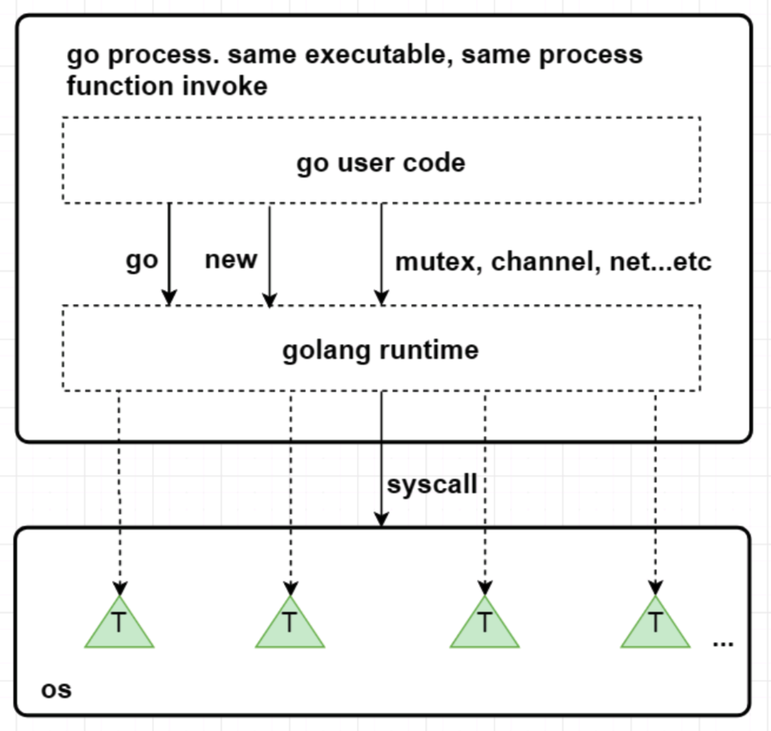
</p>

13. #### 并发编程概念是什么

并行是指两个或者多个事件在同一时刻发生；并发是指两个或多个事件在同一时间间隔发生。

并行是在不同实体上的多个事件，并发是在同一实体上的多个事件。在一台处理器上“同时”处理多个任务，在多台处理器上同时处理多个任务。如hadoop分布式集群

并发偏重于多个任务交替执行，而多个任务之间有可能还是串行的。而并行是真正意义上的“同时执行”。

并发编程是指在一台处理器上“同时”处理多个任务。并发是在同一实体上的多个事件。多个事件在同一时间间隔发生。并发编程的目标是充分的利用处理器的每一个核，以达到最高的处理性能。

14. #### Go语言的栈空间管理是怎么样的

Go语言的运行环境（runtime）会在goroutine需要的时候动态地分配栈空间，而不是给每个goroutine分配固定大小的内存空间。这样就避免了需要程序员来决定栈的大小。

分块式的栈是最初Go语言组织栈的方式。当创建一个goroutine的时候，它会分配一个8KB的内存空间来给goroutine的栈使用。我们可能会考虑当这8KB的栈空间被用完的时候该怎么办? 

为了处理这种情况，每个Go函数的开头都有一小段检测代码。这段代码会检查我们是否已经用完了分配的栈空间。如果是的话，它会调用`morestack`函数。`morestack`函数分配一块新的内存作为栈空间，并且在这块栈空间的底部填入各种信息（包括之前的那块栈地址）。在分配了这块新的栈空间之后，它会重试刚才造成栈空间不足的函数。这个过程叫做栈分裂（stack split）。

在新分配的栈底部，还插入了一个叫做`lessstack`的函数指针。这个函数还没有被调用。这样设置是为了从刚才造成栈空间不足的那个函数返回时做准备的。当我们从那个函数返回时，它会跳转到`lessstack`。`lessstack`函数会查看在栈底部存放的数据结构里的信息，然后调整栈指针（stack pointer）。这样就完成了从新的栈块到老的栈块的跳转。接下来，新分配的这个块栈空间就可以被释放掉了。

`分块式的栈`让我们能够按照需求来扩展和收缩栈的大小。 Go开发者不需要花精力去估计goroutine会用到多大的栈。创建一个新的goroutine的开销也不大。当 Go开发者不知道栈会扩展到多少大时，它也能很好的处理这种情况。

这一直是之前Go语言管理栈的的方法。但这个方法有一个问题。缩减栈空间是一个开销相对较大的操作。如果在一个循环里有栈分裂，那么它的开销就变得不可忽略了。一个函数会扩展，然后分裂栈。当它返回的时候又会释放之前分配的内存块。如果这些都发生在一个循环里的话，代价是相当大的。
这就是所谓的热分裂问题（hot split problem）。它是Go语言开发者选择新的栈管理方法的主要原因。新的方法叫做`栈复制法（stack copying）`。

栈复制法一开始和分块式的栈很像。当goroutine运行并用完栈空间的时候，与之前的方法一样，栈溢出检查会被触发。但是，不像之前的方法那样分配一个新的内存块并链接到老的栈内存块，新的方法会分配一个两倍大的内存块并把老的内存块内容复制到新的内存块里。这样做意味着当栈缩减回之前大小时，我们不需要做任何事情。栈的缩减没有任何代价。而且，当栈再次扩展时，运行环境也不需要再做任何事。它可以重用之前分配的空间。

栈的复制听起来很容易，但实际操作并非那么简单。存储在栈上的变量的地址可能已经被使用到。也就是说程序使用到了一些指向栈的指针。当移动栈的时候，所有指向栈里内容的指针都会变得无效。然而，指向栈内容的指针自身也必定是保存在栈上的。这是为了保证内存安全的必要条件。否则一个程序就有可能访问一段已经无效的栈空间了。

因为垃圾回收的需要，我们必须知道栈的哪些部分是被用作指针了。当我们移动栈的时候，我们可以更新栈里的指针让它们指向新的地址。所有相关的指针都会被更新。我们使用了垃圾回收的信息来复制栈，但并不是任何使用栈的函数都有这些信息。因为很大一部分运行环境是用C语言写的，很多被调用的运行环境里的函数并没有指针的信息，所以也就不能够被复制了。当遇到这种情况时，我们只能退回到分块式的栈并支付相应的开销。

这也是为什么现在运行环境的开发者正在用Go语言重写运行环境的大部分代码。无法用Go语言重写的部分（比如调度器的核心代码和垃圾回收器）会在特殊的栈上运行。这个特殊栈的大小由运行环境的开发者设置。

这些改变除了使栈复制成为可能，它也允许我们在将来实现并行垃圾回收。

另外一种不同的栈处理方式就是在虚拟内存中分配大内存段。由于物理内存只是在真正使用时才会被分配，因此看起来好似你可以分配一个大内存段并让操 作系统处理它。下面是这种方法的一些问题

首先，32位系统只能支持4G字节虚拟内存，并且应用只能用到其中的3G空间。由于同时运行百万goroutines的情况并不少见，因此你很可 能用光虚拟内存，即便我们假设每个goroutine的stack只有8K。

第二，然而我们可以在64位系统中分配大内存，它依赖于过量内存使用。所谓过量使用是指当你分配的内存大小超出物理内存大小时，依赖操作系统保证 在需要时能够分配出物理内存。然而，允许过量使用可能会导致一些风险。由于一些进程分配了超出机器物理内存大小的内存，如果这些进程使用更多内存 时，操作系统将不得不为它们补充分配内存。这会导致操作系统将一些内存段放入磁盘缓存，这常常会增加不可预测的处理延迟。正是考虑到这个原因，一 些新系统关闭了对过量使用的支持。

15. #### Goroutine和Channel的作用分别是什么

进程是内存资源管理和cpu调度的执行单元。为了有效利用多核处理器的优势，将进程进一步细分，允许一个进程里存在多个线程，这多个线程还是共享同一片内存空间，但cpu调度的最小单元变成了线程。

那协程又是什么呢，以及与线程的差异性?

协程，可以看作是轻量级的线程。但与线程不同的是，线程的切换是由操作系统控制的，而协程的切换则是由用户控制的。

最早支持协程的程序语言应该是lisp方言scheme里的continuation（续延），续延允许scheme保存任意函数调用的现场，保存起来并重新执行。Lua,C#,python等语言也有自己的协程实现。

Go中的goroutinue就是协程,可以实现并行，多个协程可以在多个处理器同时跑。而协程同一时刻只能在一个处理器上跑（可以把宿主语言想象成单线程的就好了）。
然而,多个goroutine之间的通信是通过channel，而协程的通信是通过yield和resume()操作。

goroutine非常简单，只需要在函数的调用前面加关键字go即可，例如:

```go
go elegance()
```

我们也可以启动5个goroutines分别打印索引:

```go
func main() {
 for i:=1;i<5;i++ {
    go func(i int) {
        fmt.Println(i)
    }(i)
 }
 // 停歇5s，保证打印全部结束
 time.Sleep(5*time.Second)
}
```
在分析goroutine执行的随机性和并发性，启动了5个goroutine，再加上main函数的主goroutine，总共有6个goroutines。由于goroutine类似于”守护线程“，异步执行的,如果主goroutine不等待片刻，可能程序就没有输出打印了。

在Golang中channel则是goroutinues之间进行通信的渠道。

可以把channel形象比喻为工厂里的传送带,一头的生产者goroutine往传输带放东西,另一头的消费者goroutinue则从输送带取东西。channel实际上是一个有类型的消息队列,遵循先进先出的特点。

1. channel的操作符号

`ch <- data` 表示data被发送给`channel ch`；

`data <- ch` 表示从`channel ch`取一个值，然后赋给data。

2. 阻塞式channel

channel默认是没有缓冲区的，也就是说，通信是阻塞的。send操作必须等到有消费者accept才算完成。

应用示例:
```go
func main() {
 ch1 := make(chan int)
 go pump(ch1) // pump hangs
 fmt.Println(<-ch1) // prints only 1
}

func pump(ch chan int) {
 for i:= 1; ; i++ {
    ch <- i
 }
}
```

在函数`pump()`里的channel在接受到第一个元素后就被阻塞了，直到主goroutinue取走了数据。最终channel阻塞在接受第二个元素，程序只打印 1。

没有缓冲(buffer)的channel只能容纳一个元素，而带有缓冲(buffer)channel则可以非阻塞容纳N个元素。发送数据到缓冲(buffer) channel不会被阻塞，除非channel已满；同样的，从缓冲(buffer) channel取数据也不会被阻塞，除非channel空了。

16. #### 怎么查看Goroutine的数量

在Golang中,`GOMAXPROCS`中控制的是未被阻塞的所有Goroutine,可以被 `Multiplex` 到多少个线程上运行,通过`GOMAXPROCS`可以查看Goroutine的数量。

17. ####  Go中的锁有哪些

Go中的三种锁包括:互斥锁,读写锁,`sync.Map`的安全的锁.
         
* 互斥锁

Go并发程序对共享资源进行访问控制的主要手段，由标准库代码包中sync中的Mutex结构体表示。

```go
// Mutex 是互斥锁， 零值是解锁的互斥锁， 首次使用后不得复制互斥锁。
type Mutex struct {
    state int32
    sema  uint32
}
```         
       
 sync.Mutex包中的类型只有两个公开的指针方法Lock和Unlock。
          
 ```go
 // Locker表示可以锁定和解锁的对象。
 type Locker interface {
    Lock()
    Unlock()
 }
 
 // 锁定当前的互斥量
 // 如果锁已被使用，则调用goroutine
 // 阻塞直到互斥锁可用。
 func (m *Mutex) Lock() 
 
 // 对当前互斥量进行解锁
 // 如果在进入解锁时未锁定m，则为运行时错误。
 // 锁定的互斥锁与特定的goroutine无关。
 // 允许一个goroutine锁定Mutex然后安排另一个goroutine来解锁它。
 func (m *Mutex) Unlock()
 ```
         
声明一个互斥锁：     
 ```go
 var mutex sync.Mutex
 ```
 
 不像C或Java的锁类工具，我们可能会犯一个错误：忘记及时解开已被锁住的锁，从而导致流程异常。但Go由于存在defer，所以此类问题出现的概率极低。关于defer解锁的方式如下：
 ```go
 var mutex sync.Mutex
 func Write()  {
    mutex.Lock()
    defer mutex.Unlock()
 }
 ``` 
         
如果对一个已经上锁的对象再次上锁，那么就会导致该锁定操作被阻塞，直到该互斥锁回到被解锁状态.

```go
fpackage main

import (
  "fmt"
  "sync"
  "time"
)

func main() {
	var mutex sync.Mutex
	fmt.Println("begin lock")
	mutex.Lock()
	fmt.Println("get locked")
	for i := 1; i <= 3; i++ {
		go func(i int) {
			fmt.Println("begin lock ", i)
			mutex.Lock()
			fmt.Println("get locked ", i)
		}(i)
	}
	time.Sleep(time.Second)
	fmt.Println("Unlock the lock")
	mutex.Unlock()
	fmt.Println("get unlocked")
	time.Sleep(time.Second)
}
```

我们在for循环之前开始加锁，然后在每一次循环中创建一个协程，并对其加锁，但是由于之前已经加锁了，所以这个for循环中的加锁会陷入阻塞直到main中的锁被解锁， time.Sleep(time.Second) 是为了能让系统有足够的时间运行for循环，输出结果如下：

```go
> go run mutex.go 
begin lock
get locked
begin lock  3
begin lock  1
begin lock  2
Unlock the lock
get unlocked
get locked  3
```

这里可以看到解锁后，三个协程会重新抢夺互斥锁权，最终协程3获胜。

互斥锁锁定操作的逆操作并不会导致协程阻塞，但是有可能导致引发一个无法恢复的运行时的panic，比如对一个未锁定的互斥锁进行解锁时就会发生panic。避免这种情况的最有效方式就是使用defer。

我们知道如果遇到panic，可以使用recover方法进行恢复，但是如果对重复解锁互斥锁引发的panic却是无用的（Go 1.8及以后）。

```go
package main

import (
  "fmt"
  "sync"
)

func main() {
	defer func() {
		fmt.Println("Try to recover the panic")
		if p := recover(); p != nil {
			fmt.Println("recover the panic : ", p)
		}
	}()
	var mutex sync.Mutex
	fmt.Println("begin lock")
	mutex.Lock()
	fmt.Println("get locked")
	fmt.Println("unlock lock")
	mutex.Unlock()
	fmt.Println("lock is unlocked")
	fmt.Println("unlock lock again")
	mutex.Unlock()
}
```

运行:

```go
> go run mutex.go 
begin lock
get locked
unlock lock
lock is unlocked
unlock lock again
fatal error: sync: unlock of unlocked mutex

goroutine 1 [running]:
runtime.throw(0x4bc1a8, 0x1e)
     /home/keke/soft/go/src/runtime/panic.go:617 +0x72 fp=0xc000084ea8 sp=0xc000084e78 pc=0x427ba2
sync.throw(0x4bc1a8, 0x1e)
     /home/keke/soft/go/src/runtime/panic.go:603 +0x35 fp=0xc000084ec8 sp=0xc000084ea8 pc=0x427b25
sync.(*Mutex).Unlock(0xc00001a0c8)
     /home/keke/soft/go/src/sync/mutex.go:184 +0xc1 fp=0xc000084ef0 sp=0xc000084ec8 pc=0x45f821
main.main()
     /home/keke/go/Test/mutex.go:25 +0x25f fp=0xc000084f98 sp=0xc000084ef0 pc=0x486c1f
runtime.main()
     /home/keke/soft/go/src/runtime/proc.go:200 +0x20c fp=0xc000084fe0 sp=0xc000084f98 pc=0x4294ec
runtime.goexit()
     /home/keke/soft/go/src/runtime/asm_amd64.s:1337 +0x1 fp=0xc000084fe8 sp=0xc000084fe0 pc=0x450ad1
exit status 2
```
这里试图对重复解锁引发的panic进行recover，但是我们发现操作失败，虽然互斥锁可以被多个协程共享，但还是建议将对同一个互斥锁的加锁解锁操作放在同一个层次的代码中。

* 读写锁

读写锁是针对读写操作的互斥锁，可以分别针对读操作与写操作进行锁定和解锁操作 。

读写锁的访问控制规则如下：

① 多个写操作之间是互斥的
② 写操作与读操作之间也是互斥的
③ 多个读操作之间不是互斥的

在这样的控制规则下，读写锁可以大大降低性能损耗。

在Go的标准库代码包中sync中的RWMutex结构体表示为:

```go
// RWMutex是一个读/写互斥锁，可以由任意数量的读操作或单个写操作持有。
// RWMutex的零值是未锁定的互斥锁。
// 首次使用后，不得复制RWMutex。
// 如果goroutine持有RWMutex进行读取而另一个goroutine可能会调用Lock，那么在释放初始读锁之前，goroutine不应该期望能够获取读锁定。 
// 特别是，这种禁止递归读锁定。 这是为了确保锁最终变得可用; 阻止的锁定会阻止新读操作获取锁定。
type RWMutex struct {
     w           Mutex  //如果有待处理的写操作就持有
     writerSem   uint32 // 写操作等待读操作完成的信号量
     readerSem   uint32 //读操作等待写操作完成的信号量
     readerCount int32  // 待处理的读操作数量
     readerWait  int32  // number of departing readers
}
```

sync中的RWMutex有以下几种方法：

```go
//对读操作的锁定
func (rw *RWMutex) RLock()

//对读操作的解锁
func (rw *RWMutex) RUnlock()

//对写操作的锁定
func (rw *RWMutex) Lock()

//对写操作的解锁
func (rw *RWMutex) Unlock()

//返回一个实现了sync.Locker接口类型的值，实际上是回调rw.RLock and rw.RUnlock.
func (rw *RWMutex) RLocker() Locker
```

Unlock方法会试图唤醒所有想进行读锁定而被阻塞的协程，而 RUnlock方法只会在已无任何读锁定的情况下，试图唤醒一个因欲进行写锁定而被阻塞的协程。

若对一个未被写锁定的读写锁进行写解锁，就会引发一个不可恢复的panic，同理对一个未被读锁定的读写锁进行读写锁也会如此。

由于读写锁控制下的多个读操作之间不是互斥的，因此对于读解锁更容易被忽视。对于同一个读写锁，添加多少个读锁定，就必要有等量的读解锁，这样才能其他协程有机会进行操作。

因此Go中读写锁，在多个读线程可以同时访问共享数据,写线程必须等待所有读线程都释放锁以后，才能取得锁.

同样的，读线程必须等待写线程释放锁后，才能取得锁，也就是说读写锁要确保的是如下互斥关系，可以同时读，但是读-写，写-写都是互斥的。

```go
package main

import (
   "fmt"
   "sync"
   "time"
)

func main() {

var rwm sync.RWMutex

for i := 0; i < 5; i++ {
    go func(i int) {
        fmt.Println("try to lock read ", i)
        rwm.RLock()
        fmt.Println("get locked ", i)
        time.Sleep(time.Second * 2)
        fmt.Println("try to unlock for reading ", i)
        rwm.RUnlock()
        fmt.Println("unlocked for reading ", i)
    }(i)
}

 time.Sleep(time.Millisecond * 1000)
 fmt.Println("try to lock for writing")

 rwm.Lock()
 fmt.Println("locked for writing")
}
```

运行:

```go
> go run rwmutex.go 
try to lock read  0
get locked  0
try to lock read  4
get locked  4
try to lock read  3
get locked  3
try to lock read  1
get locked  1
try to lock read  2
get locked  2
try to lock for writing
try to unlock for reading  0
unlocked for reading  0
try to unlock for reading  2
unlocked for reading  2
try to unlock for reading  1
unlocked for reading  1
try to unlock for reading  3
unlocked for reading  3
try to unlock for reading  4
unlocked for reading  4
locked for writing
```

这里可以看到创建了五个协程用于对读写锁的读锁定与读解锁操作。在 rwm.Lock()种会对main中协程进行写锁定，但是for循环中的读解锁尚未完成，因此会造成main中的协程阻塞。当for循环中的读解锁操作都完成后就会试图唤醒main中阻塞的协程，main中的写锁定才会完成。

* sync.Map安全锁

golang中的sync.Map是并发安全的，其实也就是sync包中golang自定义的一个名叫Map的结构体。

应用示例:

```go
package main
import (
 "sync"
 "fmt"
)

func main() {
 //开箱即用
 var sm sync.Map

 //store 方法,添加元素
 sm.Store(1,"a")

 //Load 方法，获得value
 if v,ok:=sm.Load(1);ok{
     fmt.Println(v)
 }

 //LoadOrStore方法，获取或者保存
 //参数是一对key：value，如果该key存在且没有被标记删除则返回原先的value（不更新）和true；不存在则store，返回该value 和false
 if vv,ok:=sm.LoadOrStore(1,"c");ok{
     fmt.Println(vv)
 }
 if vv,ok:=sm.LoadOrStore(2,"c");!ok{
     fmt.Println(vv)
 }

 //遍历该map，参数是个函数，该函数参的两个参数是遍历获得的key和value，返回一个bool值，当返回false时，遍历立刻结束。
 sm.Range(func(k,v interface{})bool{
     fmt.Print(k)
     fmt.Print(":")
     fmt.Print(v)
     fmt.Println()
     return true
 })
}
```

运行 :
```go
a
a
c
1:a
2:c
```

sync.Map的数据结构:
```go
type Map struct {
 // 该锁用来保护dirty
 mu Mutex
 // 存读的数据，因为是atomic.value类型，只读类型，所以它的读是并发安全的
 read atomic.Value // readOnly
 //包含最新的写入的数据，并且在写的时候，会把read 中未被删除的数据拷贝到该dirty中，因为是普通的map存在并发安全问题，需要用到上面的mu字段。
 dirty map[interface{}]*entry
 // 从read读数据的时候，会将该字段+1，当等于len（dirty）的时候，会将dirty拷贝到read中（从而提升读的性能）。
 misses int
}
```

read的数据结构是：

```go
type readOnly struct {
  m  map[interface{}]*entry
  // 如果Map.dirty的数据和m 中的数据不一样是为true
  amended bool 
}
```
entry的数据结构：

```go
type entry struct {
 //可见value是个指针类型，虽然read和dirty存在冗余情况（amended=false），但是由于是指针类型，存储的空间应该不是问题
 p unsafe.Pointer // *interface{}
}
```

Delete 方法:

```go
func (m *Map) Delete(key interface{}) {
 read, _ := m.read.Load().(readOnly)
 e, ok := read.m[key]
 //如果read中没有，并且dirty中有新元素，那么就去dirty中去找
 if !ok && read.amended {
     m.mu.Lock()
     //这是双检查（上面的if判断和锁不是一个原子性操作）
     read, _ = m.read.Load().(readOnly)
     e, ok = read.m[key]
     if !ok && read.amended {
         //直接删除
         delete(m.dirty, key)
     }
     m.mu.Unlock()
 }
 if ok {
 //如果read中存在该key，则将该value 赋值nil（采用标记的方式删除！）
     e.delete()
 }
}

func (e *entry) delete() (hadValue bool) {
 for {
     p := atomic.LoadPointer(&e.p)
     if p == nil || p == expunged {
         return false
     }
     if atomic.CompareAndSwapPointer(&e.p, p, nil) {
         return true
     }
 }
}
```

Store 方法:

```go
func (m *Map) Store(key, value interface{}) {
 // 如果m.read存在这个key，并且没有被标记删除，则尝试更新。
 read, _ := m.read.Load().(readOnly)
 if e, ok := read.m[key]; ok && e.tryStore(&value) {
     return
 }
 // 如果read不存在或者已经被标记删除
 m.mu.Lock()
 read, _ = m.read.Load().(readOnly)
 if e, ok := read.m[key]; ok {
 //如果entry被标记expunge，则表明dirty没有key，可添加入dirty，并更新entry
     if e.unexpungeLocked() { 
         //加入dirty中
         m.dirty[key] = e
     }
     //更新value值
     e.storeLocked(&value) 
     //dirty 存在该key，更新
 } else if e, ok := m.dirty[key]; ok { 
     e.storeLocked(&value)
     //read 和dirty都没有，新添加一条
 } else {
  //dirty中没有新的数据，往dirty中增加第一个新键
     if !read.amended { 
         //将read中未删除的数据加入到dirty中
         m.dirtyLocked() 
         m.read.Store(readOnly{m: read.m, amended: true})
     }
     m.dirty[key] = newEntry(value) 
 }
 m.mu.Unlock()
}

//将read中未删除的数据加入到dirty中
func (m *Map) dirtyLocked() {
 if m.dirty != nil {
     return
 }
 read, _ := m.read.Load().(readOnly)
 m.dirty = make(map[interface{}]*entry, len(read.m))
 //read如果较大的话，可能影响性能
 for k, e := range read.m {
 //通过此次操作，dirty中的元素都是未被删除的，可见expunge的元素不在dirty中
     if !e.tryExpungeLocked() {
         m.dirty[k] = e
     }
 }
}

//判断entry是否被标记删除，并且将标记为nil的entry更新标记为expunge
func (e *entry) tryExpungeLocked() (isExpunged bool) {
 p := atomic.LoadPointer(&e.p)
 for p == nil {
     // 将已经删除标记为nil的数据标记为expunged
     if atomic.CompareAndSwapPointer(&e.p, nil, expunged) {
         return true
     }
     p = atomic.LoadPointer(&e.p)
 }
 return p == expunged
}

//对entry 尝试更新
func (e *entry) tryStore(i *interface{}) bool {
 p := atomic.LoadPointer(&e.p)
 if p == expunged {
     return false
 }
 for {
     if atomic.CompareAndSwapPointer(&e.p, p, unsafe.Pointer(i)) {
         return true
     }
     p = atomic.LoadPointer(&e.p)
     if p == expunged {
         return false
     }
 }
}

//read里 将标记为expunge的更新为nil
func (e *entry) unexpungeLocked() (wasExpunged bool) {
 return atomic.CompareAndSwapPointer(&e.p, expunged, nil)
}

//更新entry
func (e *entry) storeLocked(i *interface{}) {
 atomic.StorePointer(&e.p, unsafe.Pointer(i))
}
```
因此，每次操作先检查read，因为read 并发安全，性能好些；read不满足，则加锁检查dirty，一旦是新的键值，dirty会被read更新。

Load方法:

Load方法是一个加载方法，查找key。
```go
func (m *Map) Load(key interface{}) (value interface{}, ok bool) {
 //因read只读，线程安全，先查看是否满足条件
 read, _ := m.read.Load().(readOnly)
 e, ok := read.m[key]
 //如果read没有，并且dirty有新数据，那从dirty中查找，由于dirty是普通map，线程不安全，这个时候用到互斥锁了
 if !ok && read.amended {
     m.mu.Lock()
     // 双重检查
     read, _ = m.read.Load().(readOnly)
     e, ok = read.m[key]
     // 如果read中还是不存在，并且dirty中有新数据
     if !ok && read.amended {
         e, ok = m.dirty[key]
         // mssLocked（）函数是性能是sync.Map 性能得以保证的重要函数，目的讲有锁的dirty数据，替换到只读线程安全的read里
         m.missLocked()
     }
     m.mu.Unlock()
 }
 if !ok {
     return nil, false
 }
 return e.load()
}

//dirty 提升至read 关键函数，当misses 经过多次因为load之后，大小等于len（dirty）时候，讲dirty替换到read里，以此达到性能提升。
func (m *Map) missLocked() {
  misses++
  if m.misses < len(m.dirty) {
      return
  }
  //原子操作，耗时很小
  m.read.Store(readOnly{m: m.dirty})
  m.dirty = nil
  m.misses = 0
}
```
sync.Map是通过冗余的两个数据结构(read、dirty),实现性能的提升。

为了提升性能，load、delete、store等操作尽量使用只读的read；为了提高read的key击中概率，采用动态调整，将dirty数据提升为read；对于数据的删除，采用延迟标记删除法，只有在提升dirty的时候才删除。

18. #### 怎么限制Goroutine的数量

在Golang中，Goroutine虽然很好，但是数量太多了，往往会带来很多麻烦，比如耗尽系统资源导致程序崩溃，或者CPU使用率过高导致系统忙不过来。

所以我们可以限制下Goroutine的数量,这样就需要在每一次执行go之前判断goroutine的数量，如果数量超了，就要阻塞go的执行。

所以通常我们第一时间想到的就是使用通道。每次执行的go之前向通道写入值，直到通道满的时候就阻塞了，

```go
package main

import "fmt"

var ch chan  int

func elegance(){
	<-ch
	fmt.Println("the ch value receive",ch)
}

func main(){
	ch = make(chan int,5)
	for i:=0;i<10;i++{
		ch <-1
		fmt.Println("the ch value send",ch)
		go elegance()
		fmt.Println("the result i",i)
	}

}
```
运行:
```go
> go run goroutine.go 
the ch value send 0xc00009c000
the result i 0
the ch value send 0xc00009c000
the result i 1
the ch value send 0xc00009c000
the result i 2
the ch value send 0xc00009c000
the result i 3
the ch value send 0xc00009c000
the result i 4
the ch value send 0xc00009c000
the result i 5
the ch value send 0xc00009c000
the ch value receive 0xc00009c000
the result i 6
the ch value receive 0xc00009c000
the ch value send 0xc00009c000
the result i 7
the ch value send 0xc00009c000
the result i 8
the ch value send 0xc00009c000
the result i 9
the ch value send 0xc00009c000
the ch value receive 0xc00009c000
the ch value receive 0xc00009c000
the ch value receive 0xc00009c000
the result i 10
the ch value send 0xc00009c000
the result i 11
the ch value send 0xc00009c000
the result i 12
the ch value send 0xc00009c000
the result i 13
the ch value send 0xc00009c000
the ch value receive 0xc00009c000
the ch value receive 0xc00009c000
the ch value receive 0xc00009c000
the ch value receive 0xc00009c000
the result i 14
the ch value receive 0xc00009c000
```
```
> go run goroutine.go 
the ch value send 0xc00007e000
the result i 0
the ch value send 0xc00007e000
the result i 1
the ch value send 0xc00007e000
the result i 2
the ch value send 0xc00007e000
the result i 3
the ch value send 0xc00007e000
the ch value receive 0xc00007e000
the result i 4
the ch value send 0xc00007e000
the ch value receive 0xc00007e000
the result i 5
the ch value send 0xc00007e000
the ch value receive 0xc00007e000
the result i 6
the ch value send 0xc00007e000
the result i 7
the ch value send 0xc00007e000
the ch value receive 0xc00007e000
the ch value receive 0xc00007e000
the ch value receive 0xc00007e000
the result i 8
the ch value send 0xc00007e000
the result i 9
```
这样每次同时运行的goroutine就被限制为5个了。但是新的问题于是就出现了，因为并不是所有的goroutine都执行完了，在main函数退出之后，还有一些goroutine没有执行完就被强制结束了。这个时候我们就需要用到sync.WaitGroup。使用WaitGroup等待所有的goroutine退出。

```go
package main

import (
	"fmt"
	"runtime"
	"sync"
	"time"
)

// Pool Goroutine Pool
type Pool struct {
	queue chan int
	wg *sync.WaitGroup
}

// New 新建一个协程池
func NewPool(size int) *Pool{
	if size <=0{
		size = 1
	}
	return &Pool{
		queue:make(chan int,size),
		wg:&sync.WaitGroup{},
	}
}

// Add 新增一个执行
func (p *Pool)Add(delta int){
	// delta为正数就添加
	for i :=0;i<delta;i++{
		p.queue <-1
	}
	// delta为负数就减少
	for i:=0;i>delta;i--{
		<-p.queue
	}
	p.wg.Add(delta)
}

// Done 执行完成减一
func (p *Pool) Done(){
	<-p.queue
	p.wg.Done()
}

// Wait 等待Goroutine执行完毕
func (p *Pool) Wait(){
	p.wg.Wait()
}

func main(){
	// 这里限制5个并发
	pool := NewPool(5)
	fmt.Println("the NumGoroutine begin is:",runtime.NumGoroutine())
	for i:=0;i<20;i++{
		pool.Add(1)
		go func(i int) {
			time.Sleep(time.Second)
			fmt.Println("the NumGoroutine continue is:",runtime.NumGoroutine())
			pool.Done()
		}(i)
	}
	pool.Wait()
	fmt.Println("the NumGoroutine done is:",runtime.NumGoroutine())
}
```

运行:

```go
the NumGoroutine begin is: 1
the NumGoroutine continue is: 6
the NumGoroutine continue is: 7
the NumGoroutine continue is: 6
the NumGoroutine continue is: 6
the NumGoroutine continue is: 6
the NumGoroutine continue is: 6
the NumGoroutine continue is: 6
the NumGoroutine continue is: 6
the NumGoroutine continue is: 6
the NumGoroutine continue is: 6
the NumGoroutine continue is: 6
the NumGoroutine continue is: 6
the NumGoroutine continue is: 6
the NumGoroutine continue is: 6
the NumGoroutine continue is: 6
the NumGoroutine continue is: 6
the NumGoroutine continue is: 6
the NumGoroutine continue is: 6
the NumGoroutine continue is: 3
the NumGoroutine continue is: 2
the NumGoroutine done is: 1
```

其中，Go的GOMAXPROCS默认值已经设置为CPU的核数， 这里允许我们的Go程序充分使用机器的每一个CPU,最大程度的提高我们程序的并发性能。`runtime.NumGoroutine`函数在被调用后，会返回系统中的处于特定状态的Goroutine的数量。这里的特指是指`Grunnable\Gruning\Gsyscall\Gwaition`。处于这些状态的Groutine即被看做是活跃的或者说正在被调度。

这里需要注意下：垃圾回收所在Groutine的状态也处于这个范围内的话，也会被纳入该计数器。

19. #### Channel是同步的还是异步的

Channel是异步进行的, channel存在3种状态：

* nil，未初始化的状态，只进行了声明，或者手动赋值为nil
* active，正常的channel，可读或者可写
* closed，已关闭，千万不要误认为关闭channel后，channel的值是nil

下面我们对channel的三种操作解析:

1. 零值（nil）通道；
2. 非零值但已关闭的通道；
3. 非零值并且尚未关闭的通道。


|  操作	| 一个零值nil通道	| 一个非零值但已关闭的通道  |  一个非零值且尚未关闭的通道   |
|-------|---------------|----------------------|--------------------------|
|  关闭	|  产生恐慌       |       产生恐慌	       |    成功关闭                |
|发送数据	|  永久阻塞	    |       产生恐慌	       |    阻塞或者成功发送          |
|接收数据 |  永久阻塞   	|       永不阻塞 	       |    阻塞或者成功接收          |

20. #### Goroutine和线程的区别

从调度上看，goroutine的调度开销远远小于线程调度开销。

OS的线程由OS内核调度，每隔几毫秒，一个硬件时钟中断发到CPU，CPU调用一个调度器内核函数。这个函数暂停当前正在运行的线程，把他的寄存器信息保存到内存中，查看线程列表并决定接下来运行哪一个线程，再从内存中恢复线程的注册表信息，最后继续执行选中的线程。这种线程切换需要一个完整的上下文切换：即保存一个线程的状态到内存，再恢复另外一个线程的状态，最后更新调度器的数据结构。某种意义上，这种操作还是很慢的。

Go运行的时候包涵一个自己的调度器，这个调度器使用一个称为一个M:N调度技术，m个goroutine到n个os线程（可以用GOMAXPROCS来控制n的数量），Go的调度器不是由硬件时钟来定期触发的，而是由特定的go语言结构来触发的，他不需要切换到内核语境，所以调度一个goroutine比调度一个线程的成本低很多。

从栈空间上，goroutine的栈空间更加动态灵活。

每个OS的线程都有一个固定大小的栈内存，通常是2MB，栈内存用于保存在其他函数调用期间哪些正在执行或者临时暂停的函数的局部变量。这个固定的栈大小，如果对于goroutine来说，可能是一种巨大的浪费。作为对比goroutine在生命周期开始只有一个很小的栈，典型情况是2KB, 在go程序中，一次创建十万左右的goroutine也不罕见（2KB*100,000=200MB）。而且goroutine的栈不是固定大小，它可以按需增大和缩小，最大限制可以到1GB。

goroutine没有一个特定的标识。

在大部分支持多线程的操作系统和编程语言中，线程有一个独特的标识，通常是一个整数或者指针，这个特性可以让我们构建一个线程的局部存储，本质是一个全局的map，以线程的标识作为键，这样每个线程可以独立使用这个map存储和获取值，不受其他线程干扰。

goroutine中没有可供程序员访问的标识，原因是一种纯函数的理念，不希望滥用线程局部存储导致一个不健康的超距作用，即函数的行为不仅取决于它的参数，还取决于运行它的线程标识。

21. #### Go的Struct能不能比较

* 相同struct类型的可以比较

* 不同struct类型的不可以比较,编译都不过，类型不匹配

```go
package main

import "fmt"

func main() {
    type A struct {
        a int
    }
    type B struct {
        a int
    }
    a := A{1}
    //b := A{1}
    b := B{1}
    if a == b {
        fmt.Println("a == b")
    }else{
        fmt.Println("a != b")
    }
} 

output:

> command-line-arguments [command-line-arguments.test]
> ./.go:14:7: invalid operation: a == b (mismatched types A and B) 
```

22. #### Go的defer原理是什么

什么是defer？如何理解 defer 关键字？Go 中使用 defer 的一些坑。

defer 意为延迟，在 golang 中用于延迟执行一个函数。它可以帮助我们处理容易忽略的问题，如资源释放、连接关闭等。但在实际使用过程中，有一些需要注意的地方.

1. 若函数中有多个 defer，其执行顺序为 先进后出，可以理解为栈。

```go
package main

import "fmt"

func main() {
  for i := 0; i < 5; i++ {
    defer fmt.Println(i)
  }
}

```
运行:

```go
4
3
2
1
0
```
2. return 会做什么呢?

Go 的函数返回值是通过堆栈返回的, return 语句不是原子操作，而是被拆成了两步.

* 给返回值赋值 (rval)
* 调用 defer 表达式
* 返回给调用函数(ret)

```go
package main

import "fmt"

func main() {
    fmt.Println(increase(1))
}

func increase(d int) (ret int) {
  defer func() {
    ret++
  }()

  return d
}
```
运行输出:

```go
2
```

3. 若 defer 表达式有返回值，将会被丢弃。

闭包与匿名函数.

* 匿名函数：没有函数名的函数。
* 闭包：可以使用另外一个函数作用域中的变量的函数。

在实际开发中，defer 的使用经常伴随着闭包与匿名函数的使用。

```go
package main

import "fmt"

func main() {
    for i := 0; i < 5; i++ {
        defer func() {
            fmt.Println(i)
        }()
    }
}

```
运行输出:

```go
5
5
5
5
5
```
之所以这样是因为,defer 表达式中的 i 是对 for 循环中 i 的引用。到最后，i 加到 5，故最后全部打印 5。

如果将 i 作为参数传入 defer 表达式中，在传入最初就会进行求值保存，只是没有执行延迟函数而已。

应用示例:

```go
func f1() (result int) {
    defer func() {
        result++
    }()
    return 0
}
```

```go
func f2() (r int) {
    t := 5
   defer func() {
    t = t + 5
   }()
   return t
}
```

```go
func f3() (r int) {
    defer func(r int) {
        r = r + 5
    }(r)
    return 1
}
```

```go
type Test struct {
    Max int
}

func (t *Test) Println() {
    fmt.Println(t.Max)
}

func deferExec(f func()) {
    f()
}

func call() {
    var t *Test
    defer deferExec(t.Println)

    t = new(Test)
}
```

有没有得出结果？例1的答案不是 0，例2的答案不是 10，例3的答案也不是 6。

defer是在return之前执行的。这个在[官方文档](https://golang.org/ref/spec#defer_statements)中是明确说明了的。要使用defer时不踩坑，最重要的一点就是要明白，`return xxx`这一条语句并不是一条原子指令!

```markdown
函数返回的过程是这样的：先给返回值赋值，然后调用defer表达式，最后才是返回到调用函数中。

defer表达式可能会在设置函数返回值之后，在返回到调用函数之前，修改返回值，使最终的函数返回值与你想象的不一致。

其实使用defer时，用一个简单的转换规则改写一下，就不会迷糊了。改写规则是将return语句拆成两句写，return xxx会被改写成:

返回值 = xxx
调用defer函数
空的return
```

f1: 比较简单，参考结论2，将 0 赋给 result，defer 延迟函数修改 result，最后返回给调用函数。正确答案是 1。

f1可以修改成长这样的:
```go
func f() (result int) {
     result = 0  // return语句不是一条原子调用，return xxx其实是赋值＋ret指令
     func() { // defer被插入到return之前执行，也就是赋返回值和ret指令之间
         result++
     }()
     return
}
```
所以这个返回值是1。


f2: defer 是在 t 赋值给 r 之后执行的，而 defer 延迟函数只改变了 t 的值，r 不变。正确答案 5。

f2可以修改成这样的:
```go
func f() (r int) {
     t := 5
     r = t // 赋值指令
     func() {        // defer被插入到赋值与返回之间执行，这个例子中返回值r没被修改过
         t = t + 5
     }
     return        // 空的return指令
}
```
所以这个的结果是5。

f3: 这里将 r 作为参数传入了 defer 表达式。故 func (r int) 中的 r 非 func f() (r int) 中的 r，只是参数命名相同而已。正确答案 1。

f3可以修改成这样的:
```go
func f() (r int) {
     r = 1  // 给返回值赋值
     func(r int) {        // 这里改的r是传值传进去的r，不会改变要返回的那个r值
          r = r + 5
     }(r)
     return        // 空的return
}

```
所以这个例子的结果是1。

f4: 这里将发生 panic。将方法传给 deferExec，实际上在传的过程中对方法求了值。而此时的 t 任然为 nil。

因此, defer确实是在return之前调用的。但表现形式上却可能不像。根本原因是 `return xxx` 语句并不是一条原子指令，defer被插入到了赋值 与 ret之间，因此可能有机会改变最终的返回值。

defer关键字的实现跟go关键字很类似，不同的是它调用的是`runtime.deferproc`而不是`runtime.newproc`。

在defer出现的地方，插入了指令`call runtime.deferproc`，然后在函数返回之前的地方，插入指令`call runtime.deferreturn`。

普通的函数返回时，汇编代码类似:
```go
add xx SP
return
```
如果其中包含了defer语句，则汇编代码是：

```go 
call runtime.deferreturn，
add xx SP
return
```
goroutine的控制结构中，有一张表记录defer，调用`runtime.deferproc`时会将需要defer的表达式记录在表中，而在调用`runtime.deferreturn`的时候，则会依次从defer表中出栈并执行。

23. #### Go的select可以用于什么

Golang 的 select 机制可以理解为是在语言层面实现了和 select, poll, epoll 相似的功能：监听多个描述符的读/写等事件，一旦某个描述符就绪（一般是读或者写事件发生了），就能够将发生的事件通知给关心的应用程序去处理该事件。 golang 的 select 机制是，监听多个channel，每一个 case 是一个事件，可以是读事件也可以是写事件，随机选择一个执行，可以设置default，它的作用是：当监听的多个事件都阻塞住会执行default的逻辑。

select的源码在 (runtime/select.go)[https://github.com/golang/go/blob/master/src/runtime/select.go] ，看的时候建议是重点关注 pollorder 和 lockorder.

* pollorder保存的是scase的序号，乱序是为了之后执行时的随机性。
* lockorder保存了所有case中channel的地址，这里按照地址大小堆排了一下lockorder对应的这片连续内存。对chan排序是为了去重，保证之后对所有channel上锁时不会重复上锁。

goroutine作为Golang并发的核心，我们不仅要关注它们的创建和管理，当然还要关注如何合理的退出这些协程，不（合理）退出不然可能会造成阻塞、panic、程序行为异常、数据结果不正确等问题。goroutine在退出方面，不像线程和进程，不能通过某种手段强制关闭它们，只能等待goroutine主动退出。

goroutine的优雅退出方法有三种:

1. 使用for-range退出

for-range是使用频率很高的结构，常用它来遍历数据，range能够感知channel的关闭，当channel被发送数据的协程关闭时，range就会结束，接着退出for循环。

它在并发中的使用场景是：当协程只从1个channel读取数据，然后进行处理，处理后协程退出。下面这个示例程序，当in通道被关闭时，协程可自动退出。

```go
go func(in <-chan int) {
    // Using for-range to exit goroutine
    // range has the ability to detect the close/end of a channel
    for x := range in {
        fmt.Printf("Process %d\n", x)
    }
}(in)
```
2. 使用select case ,ok退出

for-select也是使用频率很高的结构，select提供了多路复用的能力，所以for-select可以让函数具有持续多路处理多个channel的能力。但select没有感知channel的关闭，这引出了2个问题：

继续在关闭的通道上读，会读到通道传输数据类型的零值，如果是指针类型，读到nil，继续处理还会产生nil。
继续在关闭的通道上写，将会panic。

问题2可以这样解决，通道只由发送方关闭，接收方不可关闭，即某个写通道只由使用该select的协程关闭，select中就不存在继续在关闭的通道上写数据的问题。

问题1可以使用,ok来检测通道的关闭，使用情况有2种。

第一种：如果某个通道关闭后，需要退出协程，直接return即可。示例代码中，该协程需要从in通道读数据，还需要定时打印已经处理的数量，有2件事要做，所有不能使用for-range，需要使用for-select，当in关闭时，ok=false，我们直接返回。

```go
go func() {
	// in for-select using ok to exit goroutine
	for {
		select {
		case x, ok := <-in:
			if !ok {
				return
			}
			fmt.Printf("Process %d\n", x)
			processedCnt++
		case <-t.C:
			fmt.Printf("Working, processedCnt = %d\n", processedCnt)
		}
	}
}()
```

第二种：如果某个通道关闭了，不再处理该通道，而是继续处理其他case，退出是等待所有的可读通道关闭。我们需要使用select的一个特征：select不会在nil的通道上进行等待。这种情况，把只读通道设置为nil即可解决。

```go
go func() {
	// in for-select using ok to exit goroutine
	for {
		select {
		case x, ok := <-in1:
			if !ok {
				in1 = nil
			}
			// Process
		case y, ok := <-in2:
			if !ok {
				in2 = nil
			}
			// Process
		case <-t.C:
			fmt.Printf("Working, processedCnt = %d\n", processedCnt)
		}

		// If both in channel are closed, goroutine exit
		if in1 == nil && in2 == nil {
			return
		}
	}
}()
```
3. 使用退出通道退出

使用,ok来退出使用for-select协程，解决是当读入数据的通道关闭时，没数据读时程序的正常结束。想想下面这2种场景，,ok还能适用吗？

接收的协程要退出了，如果它直接退出，不告知发送协程，发送协程将阻塞。启动了一个工作协程处理数据，如何通知它退出？

使用一个专门的通道，发送退出的信号，可以解决这类问题。以第2个场景为例，协程入参包含一个停止通道stopCh，当stopCh被关闭，case <-stopCh会执行，直接返回即可。

当我启动了100个worker时，只要main()执行关闭stopCh，每一个worker都会都到信号，进而关闭。如果main()向stopCh发送100个数据，这种就低效了。

```go
func worker(stopCh <-chan struct{}) {
	go func() {
		defer fmt.Println("worker exit")
		// Using stop channel explicit exit
		for {
			select {
			case <-stopCh:
				fmt.Println("Recv stop signal")
				return
			case <-t.C:
				fmt.Println("Working .")
			}
		}
	}()
	return
}
```

通过channel控制子goroutine的方法可以总结为：循环监听一个channel，一般来说是for循环里放一个select监听channel以达到通知子goroutine的效果。再借助Waitgroup，主进程可以等待所有协程优雅退出后再结束自己的运行，这就通过channel实现了优雅控制goroutine并发的开始和结束。

因此在退出协程的时候需要注意:

* 发送协程主动关闭通道，接收协程不关闭通道。使用技巧：把接收方的通道入参声明为只读，如果接收协程关闭只读协程，编译时就会报错。
* 协程处理1个通道，并且是读时，协程优先使用for-range，因为range可以关闭通道的关闭自动退出协程。
* ok可以处理多个读通道关闭，需要关闭当前使用for-select的协程。
* 显式关闭通道stopCh可以处理主动通知协程退出的场景。

24. #### Context包的用途是什么

在 Go http包的Server中，每一个请求在都有一个对应的 goroutine 去处理。请求处理函数通常会启动额外的 goroutine 用来访问后端服务，比如数据库和RPC服务。用来处理一个请求的 goroutine 通常需要访问一些与请求特定的数据，比如终端用户的身份认证信息、验证相关的token、请求的截止时间。 当一个请求被取消或超时时，所有用来处理该请求的 goroutine 都应该迅速退出，然后系统才能释放这些 goroutine 占用的资源。

在Google 内部，我们开发了 Context 包，专门用来简化 对于处理单个请求的多个 goroutine 之间与请求域的数据、取消信号、截止时间等相关操作，这些操作可能涉及多个 API 调用。

context的数据结构是:
```go
// A Context carries a deadline, cancelation signal, and request-scoped values
// across API boundaries. Its methods are safe for simultaneous use by multiple
// goroutines.
type Context interface {
    // Done returns a channel that is closed when this `Context` is canceled
    // or times out.
    Done() <-chan struct{}

    // Err indicates why this Context was canceled, after the Done channel
    // is closed.
    Err() error

    // Deadline returns the time when this Context will be canceled, if any.
    Deadline() (deadline time.Time, ok bool)

    // Value returns the value associated with key or nil if none.
    Value(key interface{}) interface{}
}
```

Context中的方法:

- Done会返回一个channel，当该context被取消的时候，该channel会被关闭，同时对应的使用该context的routine也应该结束并返回。
- Context中的方法是协程安全的，这也就代表了在父routine中创建的context，可以传递给任意数量的routine并让他们同时访问。
- Deadline会返回一个超时时间，routine获得了超时时间后，可以对某些io操作设定超时时间。
- Value可以让routine共享一些数据，当然获得数据是协程安全的。

这里需要注意一点的是在goroutine中使用context包的时候,通常我们需要在goroutine中新创建一个上下文的context,原因是:如果直接传递外部context到协层中,一个请求可能在主函数中已经结束,在goroutine中如果还没有结束的话,会直接导致goroutine中的运行的被取消.

```go
go func() {
   _, ctx, _ := log.FromContextOrNew(context.Background(), nil)
}()
```

context.Background函数的返回值是一个空的context，经常作为树的根结点，它一般由接收请求的第一个routine创建，不能被取消、没有值、也没有过期时间。

Background函数的声明如下：

```go
// Background returns an empty Context. It is never canceled, has no deadline,
// and has no values. Background is typically used in main, init, and tests,
// and as the top-level `Context` for incoming requests.
func Background() Context
```
WithCancel 和 WithTimeout 函数 会返回继承的 Context 对象， 这些对象可以比它们的父 Context 更早地取消。

当请求处理函数返回时，与该请求关联的 Context 会被取消。 当使用多个副本发送请求时，可以使用 WithCancel取消多余的请求。 WithTimeout 在设置对后端服务器请求截止时间时非常有用。 下面是这三个函数的声明：

```go
// WithCancel returns a copy of parent whose Done channel is closed as soon as
// parent.Done is closed or cancel is called.
func WithCancel(parent Context) (ctx Context, cancel CancelFunc)

// A CancelFunc cancels a Context.
type CancelFunc func()

// WithTimeout returns a copy of parent whose Done channel is closed as soon as
// parent.Done is closed, cancel is called, or timeout elapses. The new
// Context's Deadline is the sooner of now+timeout and the parent's deadline, if
// any. If the timer is still running, the cancel function releases its
// resources.
func WithTimeout(parent Context, timeout time.Duration) (Context, CancelFunc)
```
调用CancelFunc对象将撤销对应的Context对象，这样父结点的所在的环境中，获得了撤销子节点context的权利，当触发某些条件时，可以调用CancelFunc对象来终止子结点树的所有routine。在子节点的routine中，需要判断何时退出routine：

```go
select {
    case <-cxt.Done():
        // do some cleaning and return
}
```
根据cxt.Done()判断是否结束。当顶层的Request请求处理结束，或者外部取消了这次请求，就可以cancel掉顶层context，从而使整个请求的routine树得以退出。

WithDeadline和WithTimeout比WithCancel多了一个时间参数，它指示context存活的最长时间。如果超过了过期时间，会自动撤销它的子context。所以context的生命期是由父context的routine和deadline共同决定的。


WithValue 函数能够将请求作用域的数据与 Context 对象建立关系。声明如下：

```go
type valueCtx struct {
    Context
    key, val interface{}
}

func WithValue(parent Context, key, val interface{}) Context {
    if key == nil {
        panic("nil key")
    }
    ......
    return &valueCtx{parent, key, val}
}

func (c *valueCtx) Value(key interface{}) interface{} {
    if c.key == key {
        return c.val
    }
    return c.Context.Value(key)
}
```

WithValue返回parent的一个副本，该副本保存了传入的`key/value`，而调用Context接口的Value(key)方法就可以得到val。注意在同一个context中设置`key/value`，若key相同，值会被覆盖。

Context上下文数据的存储就像一个树，每个结点只存储一个`key/value`对。WithValue()保存一个`key/value`对，它将父context嵌入到新的子context，并在节点中保存了`key/value`数据。Value()查询key对应的value数据，会从当前context中查询，如果查不到，会递归查询父context中的数据。

值得注意的是，context中的上下文数据并不是全局的，它只查询本节点及父节点们的数据，不能查询兄弟节点的数据。

Context 使用原则:

* 不要把Context放在结构体中，要以参数的方式传递。
* 以Context作为参数的函数方法，应该把Context作为第一个参数，放在第一位。
* 给一个函数方法传递Context的时候，不要传递nil，如果不知道传递什么，就使用context.TODO。
* Context的Value相关方法应该传递必须的数据，不要什么数据都使用这个传递。
* Context是线程安全的，可以放心的在多个goroutine中传递。

25. #### Go主协程如何等其余协程完再操作

Go提供了更简单的方法——使用`sync.WaitGroup`。`WaitGroup`，就是用来等待一组操作完成的。`WaitGroup`内部实现了一个计数器，用来记录未完成的操作个数.

它提供了三个方法，`Add()`用来添加计数。`Done()`用来在操作结束时调用，使计数减一。`Wait()`用来等待所有的操作结束，即计数变为0，该函数会在计数不为0时等待，在计数为0时立即返回。

应用示例:
```go
package main

import (
    "fmt"
    "sync"
)

func main() {

    var wg sync.WaitGroup

    wg.Add(2) // 因为有两个动作，所以增加2个计数
    go func() {
        fmt.Println("Goroutine 1")
        wg.Done() // 操作完成，减少一个计数
    }()

    go func() {
        fmt.Println("Goroutine 2")
        wg.Done() // 操作完成，减少一个计数
    }()

    wg.Wait() // 等待，直到计数为0
}
```
运行输出:
```go
Goroutine 2
Goroutine 1
```

26. #### Go的Slice如何扩容

slice是 Go 中的一种基本的数据结构，使用这种结构可以用来管理数据集合。但是slice本身并不是动态数据或者数组指针。slice常见的操作有 reslice、append、copy。

slice自身并不是动态数组或者数组指针。它内部实现的数据结构通过指针引用底层数组，设定相关属性将数据读写操作限定在指定的区域内。slice本身是一个只读对象，其工作机制类似数组指针的一种封装。

slice是对数组一个连续片段的引用，所以切片是一个引用类型（因此更类似于 C/C++ 中的数组类型，或者 Python 中的 list类型）。这个片段可以是整个数组，或者是由起始和终止索引标识的一些项的子集。

这里需要注意的是，终止索引标识的项不包括在切片内。切片提供了一个与指向数组的动态窗口。

slice是可以看做是一个长度可变的数组。

slice数据结构如下:

```go
type slice struct {
	array unsafe.Pointer
	len   int
	cap   int
}
```

slice的结构体由3部分构成，Pointer 是指向一个数组的指针，len 代表当前切片的长度，cap 是当前切片的容量。cap 总是大于等于 len 的。

通常我们在对slice进行append等操作时，可能会造成slice的自动扩容。

其扩容时的大小增长规则是：

* 如果切片的容量小于1024个元素，那么扩容的时候slice的cap就翻番，乘以2；一旦元素个数超过1024个元素，增长因子就变成1.25，即每次增加原来容量的四分之一。

* 如果扩容之后，还没有触及原数组的容量，那么，切片中的指针指向的位置，就还是原数组，如果扩容之后，超过了原数组的容量，那么，Go就会开辟一块新的内存，把原来的值拷贝过来，这种情况丝毫不会影响到原数组。

通过slice源码可以看到,append的实现只是简单的在内存中将旧slice复制给新slice.

```go

newcap := old.cap

if newcap+newcap < cap {
    newcap = cap
} else {
    for {
        if old.len < 1024 {
            newcap += newcap
        } else {
            newcap += newcap / 4
        }
        if newcap >= cap {
            break
        }
    }
}
```
27. #### Go中的map如何实现顺序读取

Go中map如果要实现顺序读取的话,可以先把map中的key,通过sort包排序.

通过sort中的排序包进行对map中的key进行排序.

```go
package main

import (
    "fmt"
    "sort"
)

func main() {
    var m = map[string]int{
        "hello":         0,
        "morning":       1,
        "keke":          2,
        "jame":   		 3,
    }
    var keys []string
    for k := range m {
        keys = append(keys, k)
    }
    sort.Strings(keys)
    for _, k := range keys {
        fmt.Println("Key:", k, "Value:", m[k])
    }
}
```
28. #### Go中CAS是怎么回事

CAS算法（Compare And Swap）,是原子操作的一种, CAS算法是一种有名的无锁算法。无锁编程，即不使用锁的情况下实现多线程之间的变量同步，也就是在没有线程被阻塞的情况下实现变量的同步，所以也叫非阻塞同步（Non-blocking Synchronization）。可用于在多线程编程中实现不被打断的数据交换操作，从而避免多线程同时改写某一数据时由于执行顺序不确定性以及中断的不可预知性产生的数据不一致问题。

该操作通过将内存中的值与指定数据进行比较，当数值一样时将内存中的数据替换为新的值。

Go中的CAS操作是借用了CPU提供的原子性指令来实现。CAS操作修改共享变量时候不需要对共享变量加锁，而是通过类似乐观锁的方式进行检查，本质还是不断的占用CPU 资源换取加锁带来的开销（比如上下文切换开销）。

```go
package main

import (
	"fmt"
	"sync"
	"sync/atomic"
)

var (
	counter int32          //计数器
	wg      sync.WaitGroup //信号量
)

func main() {
	threadNum := 5
	wg.Add(threadNum)
	for i := 0; i < threadNum; i++ {
		go incCounter(i)
	}
	wg.Wait()
}

func incCounter(index int) {
	defer wg.Done()

	spinNum := 0
	for {
		// 原子操作
		old := counter
		ok := atomic.CompareAndSwapInt32(&counter, old, old+1)
		if ok {
			break
		} else {
			spinNum++
		}
	}
	fmt.Printf("thread,%d,spinnum,%d\n", index, spinNum)
}
```

当主函数main首先创建了5个信号量，然后开启五个线程执行incCounter方法,incCounter内部执行, 使用cas操作递增counter的值，`atomic.CompareAndSwapInt32`具有三个参数，第一个是变量的地址，第二个是变量当前值，第三个是要修改变量为多少，该函数如果发现传递的old值等于当前变量的值，则使用第三个变量替换变量的值并返回true，否则返回false。

这里之所以使用无限循环是因为在高并发下每个线程执行CAS并不是每次都成功，失败了的线程需要重写获取变量当前的值，然后重新执行CAS操作。读者可以把线程数改为10000或者更多就会发现输出`thread,5329,spinnum,1` 其中这个1就说明该线程尝试了两个CAS操作，第二次才成功。

因此呢, go中CAS操作可以有效的减少使用锁所带来的开销，但是需要注意在高并发下这是使用cpu资源做交换的。

29. #### Go中的逃逸分析是什么

在Go中逃逸分析是一种确定指针动态范围的方法，可以分析在程序的哪些地方可以访问到指针。它涉及到指针分析和形状分析。

当一个变量(或对象)在子程序中被分配时，一个指向变量的指针可能逃逸到其它执行线程中，或者去调用子程序。如果使用尾递归优化（通常在函数编程语言中是需要的），对象也可能逃逸到被调用的子程序中。 如果一个子程序分配一个对象并返回一个该对象的指针，该对象可能在程序中的任何一个地方被访问到——这样指针就成功“逃逸”了。

如果指针存储在全局变量或者其它数据结构中，它们也可能发生逃逸，这种情况是当前程序中的指针逃逸。 逃逸分析需要确定指针所有可以存储的地方，保证指针的生命周期只在当前进程或线程中。

导致内存逃逸的情况比较多，有些可能还是官方未能够实现精确的分析逃逸情况的 bug，通常来讲就是如果变量的作用域不会扩大并且其行为或者大小能够在编译的时候确定，一般情况下都是分配到栈上，否则就可能发生内存逃逸分配到堆上。

内存逃逸的五种情况:

1. 发送指针的指针或值包含了指针到`channel` 中，由于在编译阶段无法确定其作用域与传递的路径，所以一般都会逃逸到堆上分配。

2. slices 中的值是指针的指针或包含指针字段。一个例子是类似`[]*string` 的类型。这总是导致 slice 的逃逸。即使切片的底层存储数组仍可能位于堆栈上，数据的引用也会转移到堆中。

3. slice 由于 append 操作超出其容量，因此会导致 slice 重新分配。这种情况下，由于在编译时 slice 的初始大小的已知情况下，将会在栈上分配。如果 slice 的底层存储必须基于仅在运行时数据进行扩展，则它将分配在堆上。

4. 调用接口类型的方法。接口类型的方法调用是动态调度,实际使用的具体实现只能在运行时确定。考虑一个接口类型为 io.Reader 的变量 r。对 r.Read(b) 的调用将导致 r 的值和字节片b的后续转义并因此分配到堆上。

5. 尽管能够符合分配到栈的场景，但是其大小不能够在在编译时候确定的情况，也会分配到堆上.

有效的避免上述的五种逃逸的情况,就可以避免内存逃逸.

30. #### Go值接收者和指针接收者的区别

Go中的方法能给用户自定义的类型添加新的行为。它和函数的区别在于方法有一个接收者，给一个函数添加一个接收者，那么它就变成了方法。接收者可以是值接收者，也可以是指针接收者。

在调用方法的时候，值类型既可以调用值接收者的方法，也可以调用指针接收者的方法；指针类型既可以调用指针接收者的方法，也可以调用值接收者的方法。

也就是说，不管方法的接收者是什么类型，该类型的值和指针都可以调用，不必严格符合接收者的类型。

```go
package main

import "fmt"

type Person struct {
    age int
}

func (p Person) Elegance() int {
    return p.age
}

func (p *Person) GetAge() {
    p.age += 1
}

func main() {
    // p1 是值类型
    p := Person{age: 18}

    // 值类型 调用接收者也是值类型的方法
    fmt.Println(p.howOld())

    // 值类型 调用接收者是指针类型的方法
    p.GetAge()
    fmt.Println(p.GetAge())

    // ----------------------

    // p2 是指针类型
    p2 := &Person{age: 100}

    // 指针类型 调用接收者是值类型的方法
    fmt.Println(p2.GetAge())

    // 指针类型 调用接收者也是指针类型的方法
    p2.GetAge()
    fmt.Println(p2.GetAge())
}
```
运行
```go
18
19
100
101
```

| 函数和方法                  |值接收者	              | 指针接收者                    |
| --------------------------| ----------------------| --------------------------- |
|值类型调用者                 | 方法会使用调用者的一个副本，类似于“传值”	   | 使用值的引用来调用方法，上例中，p1.GetAge() 实际上是 (&p1).GetAge()|
| 指针类型调用者              | 指针被解引用为值，上例中，p2.GetAge()实际上是 (*p1).GetAge()|实际上也是“传值”，方法里的操作会影响到调用者，类似于指针传参，拷贝了一份指针 |

如果实现了接收者是值类型的方法，会隐含地也实现了接收者是指针类型的方法。

如果方法的接收者是值类型，无论调用者是对象还是对象指针，修改的都是对象的副本，不影响调用者；如果方法的接收者是指针类型，则调用者修改的是指针指向的对象本身。

通常我们使用指针作为方法的接收者的理由：

* 使用指针方法能够修改接收者指向的值。

* 可以避免在每次调用方法时复制该值，在值的类型为大型结构体时，这样做会更加高效。

因而呢,我们是使用值接收者还是指针接收者，不是由该方法是否修改了调用者（也就是接收者）来决定，而是应该基于该类型的本质。

如果类型具备“原始的本质”，也就是说它的成员都是由 Go 语言里内置的原始类型，如字符串，整型值等，那就定义值接收者类型的方法。像内置的引用类型，如 slice，map，interface，channel，这些类型比较特殊，声明他们的时候，实际上是创建了一个 header， 对于他们也是直接定义值接收者类型的方法。这样，调用函数时，是直接 copy 了这些类型的 header，而 header 本身就是为复制设计的。

如果类型具备非原始的本质，不能被安全地复制，这种类型总是应该被共享，那就定义指针接收者的方法。比如 go 源码里的文件结构体（struct File）就不应该被复制，应该只有一份实体。

接口值的零值是指动态类型和动态值都为 nil。当仅且当这两部分的值都为 nil 的情况下，这个接口值就才会被认为 接口值 == nil。

31. #### Go的对象在内存中是怎样分配的

Go中的内存分类并不像TCMalloc那样分成小、中、大对象，但是它的小对象里又细分了一个Tiny对象，Tiny对象指大小在1Byte到16Byte之间并且不包含指针的对象。

小对象和大对象只用大小划定，无其他区分。

大对象指大小大于32kb.小对象是在mcache中分配的，而大对象是直接从mheap分配的，从小对象的内存分配看起。

Go的内存分配原则:

Go在程序启动的时候，会先向操作系统申请一块内存（注意这时还只是一段虚拟的地址空间，并不会真正地分配内存），切成小块后自己进行管理。

申请到的内存块被分配了三个区域，在X64上分别是512MB，16GB，512GB大小。
<p align="center">

</p>

arena区域就是我们所谓的堆区，Go动态分配的内存都是在这个区域，它把内存分割成8KB大小的页，一些页组合起来称为mspan。

bitmap区域标识arena区域哪些地址保存了对象，并且用4bit标志位表示对象是否包含指针、GC标记信息。bitmap中一个byte大小的内存对应arena区域中4个指针大小（指针大小为 8B ）的内存，所以bitmap区域的大小是`512GB/(4*8B)=16GB`。

<p align="center">
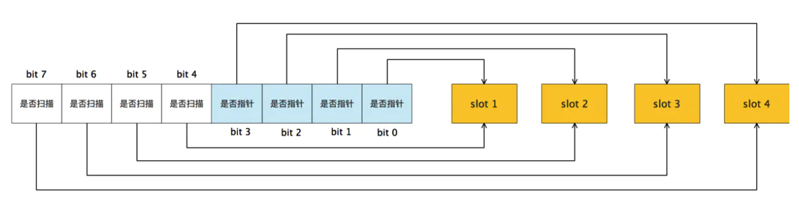
</p>

<p align="center">
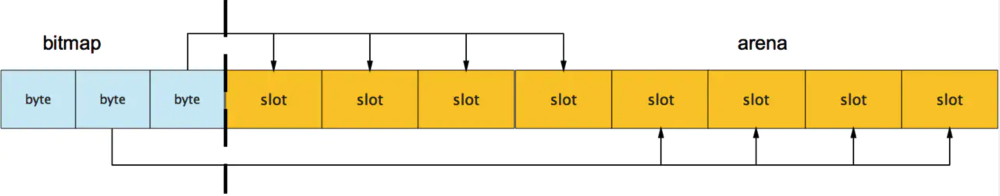
</p>

此外我们还可以看到bitmap的高地址部分指向arena区域的低地址部分，这里bitmap的地址是由高地址向低地址增长的。

spans区域存放mspan（是一些arena分割的页组合起来的内存管理基本单元，后文会再讲）的指针，每个指针对应一页，所以spans区域的大小就是`512GB/8KB*8B=512MB`。

除以8KB是计算arena区域的页数，而最后乘以8是计算spans区域所有指针的大小。创建mspan的时候，按页填充对应的spans区域，在回收object时，根据地址很容易就能找到它所属的mspan。

32. #### 栈的内存是怎么分配的

栈和堆只是虚拟内存上2块不同功能的内存区域：

* 栈在高地址，从高地址向低地址增长。

* 堆在低地址，从低地址向高地址增长。

栈和堆相比优势：

* 栈的内存管理简单，分配比堆上快。

* 栈的内存不需要回收，而堆需要，无论是主动free，还是被动的垃圾回收，这都需要花费额外的CPU。

* 栈上的内存有更好的局部性，堆上内存访问就不那么友好了，CPU访问的2块数据可能在不同的页上，CPU访问数据的时间可能就上去了。

33. #### 堆内存管理怎么分配的

通常在Golang中,当我们谈论内存管理的时候，主要是指堆内存的管理，因为栈的内存管理不需要程序去操心。

<p align="center">
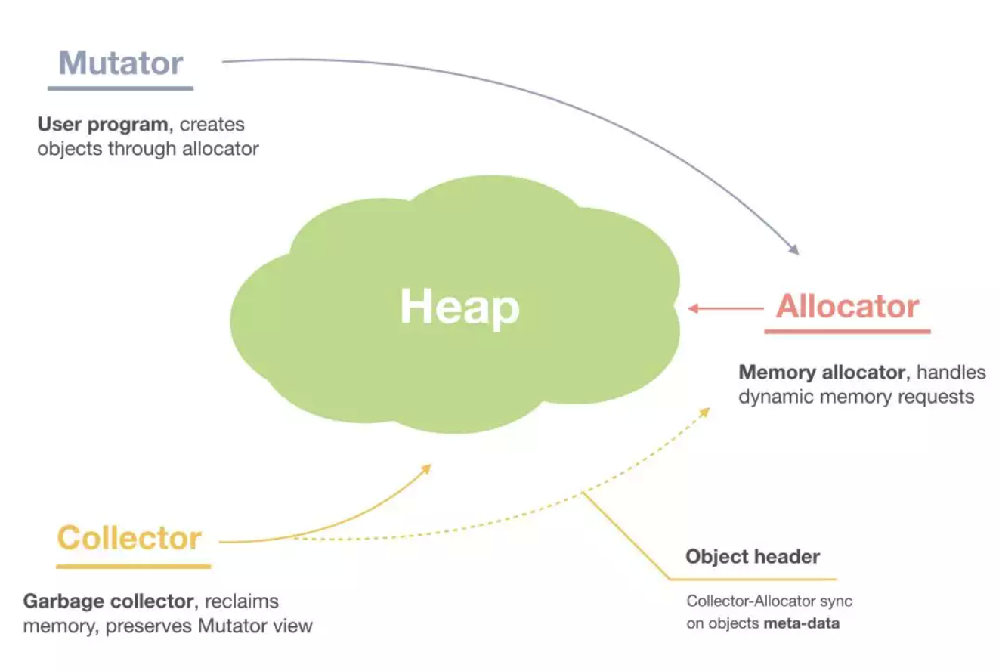
</p>

堆内存管理中主要是三部分, 1.分配内存块，2.回收内存块, 3.组织内存块。

<p align="center">
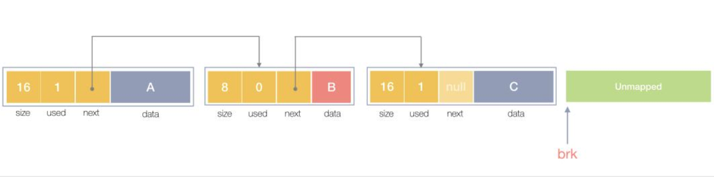
</p>

一个内存块包含了3类信息，如下图所示，元数据、用户数据和对齐字段，内存对齐是为了提高访问效率。下图申请5Byte内存的时候，就需要进行内存对齐。

<p align="center">
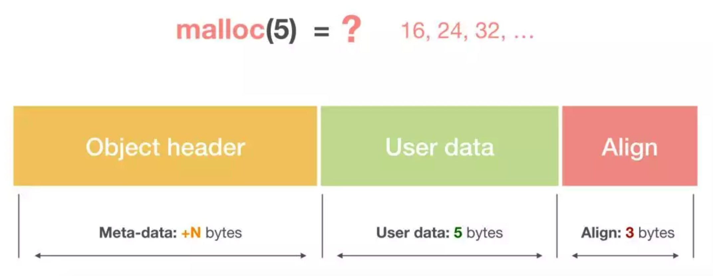
</p>

释放内存实质是把使用的内存块从链表中取出来，然后标记为未使用，当分配内存块的时候，可以从未使用内存块中有先查找大小相近的内存块，如果找不到，再从未分配的内存中分配内存。

上面这个简单的设计中还没考虑内存碎片的问题，因为随着内存不断的申请和释放，内存上会存在大量的碎片，降低内存的使用率。为了解决内存碎片，可以将2个连续的未使用的内存块合并，减少碎片。

想要深入了解可以看下这个文章,《Writing a Memory Allocator》.

34. ####  Go中的defer函数使用下面的两种情况下结果是什么

我们看看下面两种defer函数的返回的是什么:

```go
	a := 1
	defer fmt.Println("the value of a1:",a)
	a++

	defer func() {
		fmt.Println("the value of a2:",a)
	}()

```
运行:
```go
the value of a1: 1
the value of a1: 2
```
第一种情况：
```go
defer fmt.Println("the value of a1:",a)
```
defer延迟函数调用的fmt.Println(a)函数的参数值在defer语句出现时就已经确定了，所以无论后面如何修改a变量都不会影响延迟函数。

第二种情况:
```go
defer func() {
      fmt.Println("the value of a2:",a)
}()
```
defer延迟函数调用的函数参数的值在defer定义时候就确定了，而defer延迟函数内部所使用的值需要在这个函数运行时候才确定。

35. ####  在Go函数中为什么会发生内存泄露

通常内存泄漏，指的是能够预期的能很快被释放的内存由于附着在了长期存活的内存上、或生命期意外地被延长，导致预计能够立即回收的内存而长时间得不到回收。

在 Go 中，由于 goroutine 的存在，因此,内存泄漏除了附着在长期对象上之外，还存在多种不同的形式。

* 预期能被快速释放的内存因被根对象引用而没有得到迅速释放.

当有一个全局对象时，可能不经意间将某个变量附着在其上，且忽略的将其进行释放，则该内存永远不会得到释放。

* goroutine 泄漏

Goroutine 作为一种逻辑上理解的轻量级线程，需要维护执行用户代码的上下文信息。在运行过程中也需要消耗一定的内存来保存这类信息，而这些内存在目前版本的 Go 中是不会被释放的。

因此，如果一个程序持续不断地产生新的 goroutine、且不结束已经创建的 goroutine 并复用这部分内存，就会造成内存泄漏的现象.

例如:

```go
func main() {
	for i := 0; i < 10000; i++ {
		go func() {
			select {}
		}()
	}
}
```

36. #### Go中new和make的区别

在Go中,的值类型和引用类型:
```markdown
值类型：int，float，bool，string，struct和array.
变量直接存储值，分配栈区的内存空间，这些变量所占据的空间在函数被调用完后会自动释放。
     
引用类型：slice，map，chan和值类型对应的指针.
变量存储的是一个地址（或者理解为指针），指针指向内存中真正存储数据的首地址。内存通常在堆上分配，通过GC回收。
```     
这里需要注意的是: 对于引用类型的变量，我们不仅要声明变量，更重要的是，我们得手动为它分配空间.

因此new该方法的参数要求传入一个类型，而不是一个值，它会申请一个该类型大小的内存空间，并会初始化为对应的零值，返回指向该内存空间的一个指针。     
```go
// The new built-in function allocates memory. The first argument is a type,
// not a value, and the value returned is a pointer to a newly
// allocated zero value of that type.
func new(Type) *Type
```

而make也是用于内存分配，但是和new不同，只用来引用对象slice、map和channel的内存创建，它返回的类型就是类型本身，而不是它们的指针类型。
```go 
// The make built-in function allocates and initializes an object of type
// slice, map, or chan (only). Like new, the first argument is a type, not a
// value. Unlike new, make's return type is the same as the type of its
// argument, not a pointer to it. The specification of the result depends on
// the type:
//	Slice: The size specifies the length. The capacity of the slice is
//	equal to its length. A second integer argument may be provided to
//	specify a different capacity; it must be no smaller than the
//	length. For example, make([]int, 0, 10) allocates an underlying array
//	of size 10 and returns a slice of length 0 and capacity 10 that is
//	backed by this underlying array.
//	Map: An empty map is allocated with enough space to hold the
//	specified number of elements. The size may be omitted, in which case
//	a small starting size is allocated.
//	Channel: The channel's buffer is initialized with the specified
//	buffer capacity. If zero, or the size is omitted, the channel is
//	unbuffered.
func make(t Type, size ...IntegerType) Type
```

37. #### G0的作用

在Go中 g0作为一个特殊的goroutine，为 scheduler 执行调度循环提供了场地（栈）。对于一个线程来说，g0 总是它第一个创建的 goroutine。

之后，它会不断地寻找其他普通的 goroutine 来执行，直到进程退出。

当需要执行一些任务，且不想扩栈时，就可以用到 g0 了，因为 g0 的栈比较大。

g0 其他的一些“职责”有：创建 `goroutine`、`deferproc` 函数里新建 `_defer`、垃圾回收相关的工作（例如 stw、扫描 goroutine 的执行栈、一些标识清扫的工作、栈增长）等等。

38. #### Go中的锁如何实现

锁是一种同步机制，用于在多任务环境中限制资源的访问，以满足互斥需求。

go源码sync包中经常用于同步操作的方式:
* 原子操作
* 互斥锁
* 读写锁
* waitgroup

我们着重来分析下互斥锁和读写锁.

互斥锁:

下面是互斥锁的数据结构:
```go 
// A Mutex is a mutual exclusion lock.
// The zero value for a Mutex is an unlocked mutex.
//
// A Mutex must not be copied after first use.
type Mutex struct {
	state int32   // 互斥锁上锁状态枚举值如下所示
	sema  uint32  // 信号量，向处于Gwaitting的G发送信号
}
const (
	mutexLocked = 1 << iota // 值为1，表示在state中由低向高第1位，意义：锁是否可用,0可用，1不可用,锁定中
	mutexWoken   // 值为2，表示在state中由低向高第2位，意义：mutex是否被唤醒
	mutexStarving // 当前的互斥锁进入饥饿状态；
	mutexWaiterShift = iota  //值为2，表示state中统计阻塞在此mutex上goroutine的数目需要位移的偏移量
	starvationThresholdNs = 1e6 
```
state和sema两个加起来只占 8 字节空间的结构体表示了 Go 语言中的互斥锁。

互斥锁的状态比较复杂，如下图所示，最低三位分别表示 mutexLocked、mutexWoken 和 mutexStarving，剩下的位置用来表示当前有多少个 Goroutine 等待互斥锁的释放.
<p align="center">

</p>

在默认情况下，互斥锁的所有状态位都是 0，int32 中的不同位分别表示了不同的状态：

* mutexLocked 表示互斥锁的锁定状态；
* mutexWoken 表示从正常模式被从唤醒；
* mutexStarving 当前的互斥锁进入饥饿状态；
* waitersCount 当前互斥锁上等待的 Goroutine 个数；

sync.Mutex 有两种模式,正常模式和饥饿模式。

在正常模式下，锁的等待者会按照先进先出的顺序获取锁。

但是刚被唤起的 `Goroutine` 与新创建的 `Goroutine` 竞争时，大概率会获取不到锁，为了减少这种情况的出现，一旦 Goroutine 超过 1ms 没有获取到锁，它就会将当前互斥锁切换饥饿模式，防止部分 Goroutine 被饿死。

饥饿模式是在 Go 语言 1.9 版本引入的优化的，引入的目的是保证互斥锁的公平性（Fairness）。

在饥饿模式中，互斥锁会直接交给等待队列最前面的 Goroutine。新的 Goroutine 在该状态下不能获取锁、也不会进入自旋状态，它们只会在队列的末尾等待。

如果一个 Goroutine 获得了互斥锁并且它在队列的末尾或者它等待的时间少于 1ms，那么当前的互斥锁就会被切换回正常模式。

相比于饥饿模式，正常模式下的互斥锁能够提供更好地性能，饥饿模式的能避免 Goroutine 由于陷入等待无法获取锁而造成的高尾延时。

互斥锁的加锁是靠 sync.Mutex.Lock 方法完成的, 当锁的状态是 0 时，将 `mutexLocked` 位置成 1：
```go
// Lock locks m.
// If the lock is already in use, the calling goroutine
// blocks until the mutex is available.
func (m *Mutex) Lock() {
	// Fast path: grab unlocked mutex.
	if atomic.CompareAndSwapInt32(&m.state, 0, mutexLocked) {
		if race.Enabled {
			race.Acquire(unsafe.Pointer(m))
		}
		return
	}
	// Slow path (outlined so that the fast path can be inlined)
	m.lockSlow()
}
```
如果互斥锁的状态不是 0 时就会调用 `sync.Mutex.lockSlow` 尝试通过自旋（Spinnig）等方式等待锁的释放，

这个方法是一个非常大 for 循环,它获取锁的过程：

1. 判断当前 Goroutine 能否进入自旋；
2. 通过自旋等待互斥锁的释放；
3. 计算互斥锁的最新状态；
4. 更新互斥锁的状态并获取锁；

那么互斥锁是如何判断当前 Goroutine 能否进入自旋等互斥锁的释放,是通过它的lockSlow方法, 由于自旋是一种多线程同步机制，所以呢当前的进程在进入自旋的过程中会一直保持对 CPU 的占用，持续检查某个条件是否为真。
通常在多核的 CPU 上，自旋可以避免 Goroutine 的切换，使用得当会对性能带来很大的增益，但是往往使用的不得当就会拖慢整个程序.

所以 Goroutine 进入自旋的条件非常苛刻：

* 互斥锁只有在普通模式才能进入自旋；
* `runtime.sync_runtime_canSpin` 需要返回 true：
  a. 需要运行在多 CPU 的机器上；
  b. 当前的Goroutine 为了获取该锁进入自旋的次数小于四次；
  c. 当前机器上至少存在一个正在运行的处理器 P 并且处理的运行队列为空；

一旦当前 Goroutine 能够进入自旋就会调用`runtime.sync_runtime_doSpin` 和 `runtime.procyield` 并执行 30 次的 PAUSE 指令，该指令只会占用 CPU 并消耗 CPU 时间.

处理了自旋相关的特殊逻辑之后，互斥锁会根据上下文计算当前互斥锁最新的状态。

通过几个不同的条件分别会更新 state 字段中存储的不同信息,`mutexLocked`、`mutexStarving`、`mutexWoken` 和 `mutexWaiterShift`：

```go
	new := old
	if old&mutexStarving == 0 {
		new |= mutexLocked
	}
	if old&(mutexLocked|mutexStarving) != 0 {
		new += 1 << mutexWaiterShift
	}
	if starving && old&mutexLocked != 0 {
		new |= mutexStarving
	}
	if awoke {
		new &^= mutexWoken
	}
```
计算了新的互斥锁状态之后，就会使用 CAS 函数 sync/atomic.CompareAndSwapInt32 更新该状态：

```go 
if atomic.CompareAndSwapInt32(&m.state, old, new) {
			if old&(mutexLocked|mutexStarving) == 0 {
				break // 通过 CAS 函数获取了锁
			}
			...
			runtime_SemacquireMutex(&m.sema, queueLifo, 1)
			starving = starving || runtime_nanotime()-waitStartTime > starvationThresholdNs
			old = m.state
			if old&mutexStarving != 0 {
				delta := int32(mutexLocked - 1<<mutexWaiterShift)
				if !starving || old>>mutexWaiterShift == 1 {
					delta -= mutexStarving
				}
				atomic.AddInt32(&m.state, delta)
				break
			}
			awoke = true
			iter = 0
		} else {
			old = m.state
		}
	}
}
```

如果我们没有通过 CAS 获得锁，会调用 `runtime.sync_runtime_SemacquireMutex` 使用信号量保证资源不会被两个 Goroutine 获取。

`runtime.sync_runtime_SemacquireMutex` 会在方法中不断调用尝试获取锁并休眠当前 Goroutine 等待信号量的释放，一旦当前 Goroutine 可以获取信号量，它就会立刻返回，`sync.Mutex.Lock` 方法的剩余代码也会继续执行。

在正常模式下，这段代码会设置唤醒和饥饿标记、重置迭代次数并重新执行获取锁的循环.
在饥饿模式下，当前 Goroutine 会获得互斥锁，如果等待队列中只存在当前 Goroutine，互斥锁还会从饥饿模式中退出.

互斥锁的解锁过程 `sync.Mutex.Unlock` 与加锁过程相比就很简单，该过程会先使用 `sync/atomic.AddInt32` 函数快速解锁，这时会发生下面的两种情况：

* 如果该函数返回的新状态等于 0，当前 Goroutine 就成功解锁了互斥锁；
* 如果该函数返回的新状态不等于 0，这段代码会调用 `sync.Mutex.unlockSlow` 方法开始慢速解锁：

```go 
func (m *Mutex) Unlock() {
	if race.Enabled {
		_ = m.state
		race.Release(unsafe.Pointer(m))
	}

	// Fast path: drop lock bit.
	new := atomic.AddInt32(&m.state, -mutexLocked)
	if new != 0 {
		// Outlined slow path to allow inlining the fast path.
		// To hide unlockSlow during tracing we skip one extra frame when tracing GoUnblock.
		m.unlockSlow(new)
	}
}
```
`sync.Mutex.unlockSlow` 方法首先会校验锁状态的合法性, 如果当前互斥锁已经被解锁过了就会直接抛出异常 `sync: unlock of unlocked mutex` 中止当前程序。

在正常情况下会根据当前互斥锁的状态，分别处理正常模式和饥饿模式下的互斥锁.
```go 
func (m *Mutex) unlockSlow(new int32) {
	if (new+mutexLocked)&mutexLocked == 0 {
		throw("sync: unlock of unlocked mutex")
	}
	if new&mutexStarving == 0 {
		old := new
		for {
			// If there are no waiters or a goroutine has already
			// been woken or grabbed the lock, no need to wake anyone.
			// In starvation mode ownership is directly handed off from unlocking
			// goroutine to the next waiter. We are not part of this chain,
			// since we did not observe mutexStarving when we unlocked the mutex above.
			// So get off the way.
			if old>>mutexWaiterShift == 0 || old&(mutexLocked|mutexWoken|mutexStarving) != 0 {
				return
			}
			// Grab the right to wake someone.
			new = (old - 1<<mutexWaiterShift) | mutexWoken
			if atomic.CompareAndSwapInt32(&m.state, old, new) {
				runtime_Semrelease(&m.sema, false, 1)
				return
			}
			old = m.state
		}
	} else {
		// Starving mode: handoff mutex ownership to the next waiter, and yield
		// our time slice so that the next waiter can start to run immediately.
		// Note: mutexLocked is not set, the waiter will set it after wakeup.
		// But mutex is still considered locked if mutexStarving is set,
		// so new coming goroutines won't acquire it.
		runtime_Semrelease(&m.sema, true, 1)
	}
}
```
在正常模式下，这段代码会分别处理以下两种情况处理:

* 如果互斥锁不存在等待者或者互斥锁的 `mutexLocked`、`mutexStarving`、`mutexWoken` 状态不都为 0，那么当前方法就可以直接返回，不需要唤醒其他等待者；
* 如果互斥锁存在等待者，会通过 `sync.runtime_Semrelease`唤醒等待者并移交锁的所有权；

在饥饿模式下，上述代码会直接调用 `sync.runtime_Semrelease` 方法将当前锁交给下一个正在尝试获取锁的等待者，等待者被唤醒后会得到锁，在这时互斥锁还不会退出饥饿状态；

互斥锁的加锁过程比较复杂，它涉及自旋、信号量以及调度等概念：

* 如果互斥锁处于初始化状态，就会直接通过置位 mutexLocked 加锁；
* 如果互斥锁处于 mutexLocked 并且在普通模式下工作，就会进入自旋，执行 30 次 PAUSE 指令消耗 CPU 时间等待锁的释放；
* 如果当前 Goroutine 等待锁的时间超过了 1ms，互斥锁就会切换到饥饿模式；
* 互斥锁在正常情况下会通过`runtime.sync_runtime_SemacquireMutex`函数将尝试获取锁的 Goroutine 切换至休眠状态，等待锁的持有者唤醒当前 Goroutine；
* 如果当前 Goroutine 是互斥锁上的最后一个等待的协程或者等待的时间小于 1ms，当前 Goroutine 会将互斥锁切换回正常模式；

互斥锁的解锁过程与之相比就比较简单，其代码行数不多、逻辑清晰，也比较容易理解：

* 当互斥锁已经被解锁时，那么调用 `sync.Mutex.Unlock` 会直接抛出异常；
* 当互斥锁处于饥饿模式时，会直接将锁的所有权交给队列中的下一个等待者，等待者会负责设置 `mutexLocked` 标志位；
* 当互斥锁处于普通模式时，如果没有 Goroutine 等待锁的释放或者已经有被唤醒的 Goroutine 获得了锁，就会直接返回；在其他情况下会通过`sync.runtime_Semrelease` 唤醒对应的 Goroutine.

读写锁:

读写互斥锁`sync.RWMutex` 是细粒度的互斥锁，它不限制资源的并发读，但是读写、写写操作无法并行执行。

sync.RWMutex 中总共包含5 个字段：
```go 
type RWMutex struct {
	w           Mutex  // 复用互斥锁提供的能力
	writerSem   uint32 // 写等待读
	readerSem   uint32 // 读等待写
	readerCount int32  // 存储了当前正在执行的读操作的数量
	readerWait  int32  // 当写操作被阻塞时等待的读操作个数
}
```

我们从写锁开始分析:

当我们想要获取写锁时，需要调用 `sync.RWMutex.Lock` 方法:
```go
func (rw *RWMutex) Lock() {
	if race.Enabled {
		_ = rw.w.state
		race.Disable()
	}
	// First, resolve competition with other writers.
	rw.w.Lock()
	// Announce to readers there is a pending writer.
	r := atomic.AddInt32(&rw.readerCount, -rwmutexMaxReaders) + rwmutexMaxReaders
	// Wait for active readers.
	if r != 0 && atomic.AddInt32(&rw.readerWait, r) != 0 {
		runtime_SemacquireMutex(&rw.writerSem, false, 0)
	}
	if race.Enabled {
		race.Enable()
		race.Acquire(unsafe.Pointer(&rw.readerSem))
		race.Acquire(unsafe.Pointer(&rw.writerSem))
	}
}
```
*  这里调用结构体持有的 `sync.Mutex` 的 `sync.Mutex.Lock` 方法阻塞后续的写操作；

因为互斥锁已经被获取，其他 Goroutine 在获取写锁时就会进入自旋或者休眠；

* 调用 `sync/atomic.AddInt32` 方法阻塞后续的读操作：

如果仍然有其他 Goroutine 持有互斥锁的读锁`（r != 0）`，该 Goroutine 会调用 `runtime.sync_runtime_SemacquireMutex` 进入休眠状态等待所有读锁所有者执行结束后释放 `writerSem` 信号量将当前协程唤醒。

写锁的释放会调用 `sync.RWMutex.Unlock` 方法：
```go 
func (rw *RWMutex) Unlock() {
	if race.Enabled {
		_ = rw.w.state
		race.Release(unsafe.Pointer(&rw.readerSem))
		race.Disable()
	}

	// Announce to readers there is no active writer.
	r := atomic.AddInt32(&rw.readerCount, rwmutexMaxReaders)
	if r >= rwmutexMaxReaders {
		race.Enable()
		throw("sync: Unlock of unlocked RWMutex")
	}
	// Unblock blocked readers, if any.
	for i := 0; i < int(r); i++ {
		runtime_Semrelease(&rw.readerSem, false, 0)
	}
	// Allow other writers to proceed.
	rw.w.Unlock()
	if race.Enabled {
		race.Enable()
	}
}

```
解锁与加锁的过程正好相反,写锁的释放分为以下几个步骤:

1. 调用 `sync/atomic.AddInt32` 函数将 `readerCount` 变回正数，释放读锁；
2. 通过 for 循环触发所有由于获取读锁而陷入等待的 Goroutine：
3. 调用 `sync.Mutex.Unlock` 方法释放写锁；

获取写锁时会先阻塞写锁的获取，后阻塞读锁的获取，这种策略能够保证读操作不会被连续的写操作饿死。

接着是读锁:

读锁的加锁方法 `sync.RWMutex.RLock` 就比较简单了，该方法会通过 `sync/atomic.AddInt32` 将 `readerCount` 加一：
```go 
func (rw *RWMutex) RLock() {
	if race.Enabled {
		_ = rw.w.state
		race.Disable()
	}
	if atomic.AddInt32(&rw.readerCount, 1) < 0 {
		// A writer is pending, wait for it.
		runtime_SemacquireMutex(&rw.readerSem, false, 0)
	}
	if race.Enabled {
		race.Enable()
		race.Acquire(unsafe.Pointer(&rw.readerSem))
	}
}
```
如果`RLock`该方法返回负数,其他 Goroutine 获得了写锁，当前 Goroutine 就会调用`runtime.sync_runtime_SemacquireMutex` 陷入休眠等待锁的释放；
如果`RLock`该方法的结果为非负数,没有 Goroutine 获得写锁，当前方法就会成功返回.

当 Goroutine 想要释放读锁时，会调用如下所示的`RUnlock`方法：
```go
func (rw *RWMutex) RUnlock() {
	if race.Enabled {
		_ = rw.w.state
		race.ReleaseMerge(unsafe.Pointer(&rw.writerSem))
		race.Disable()
	}
	if r := atomic.AddInt32(&rw.readerCount, -1); r < 0 {
		// Outlined slow-path to allow the fast-path to be inlined
		rw.rUnlockSlow(r)
	}
	if race.Enabled {
		race.Enable()
	}
}
```
该方法会先减少正在读资源的`readerCount` 整数，根据 `sync/atomic.AddInt32` 的返回值不同会分别进行处理：

* 如果返回值大于等于零,表示读锁直接解锁成功.
* 如果返回值小于零 ,表示有一个正在执行的写操作，在这时会调用`rUnlockSlow`方法.

```go
func (rw *RWMutex) rUnlockSlow(r int32) {
	if r+1 == 0 || r+1 == -rwmutexMaxReaders {
		race.Enable()
		throw("sync: RUnlock of unlocked RWMutex")
	}
	// A writer is pending.
	if atomic.AddInt32(&rw.readerWait, -1) == 0 {
		// The last reader unblocks the writer.
		runtime_Semrelease(&rw.writerSem, false, 1)
	}
}
```
`rUnlockSlow`该方法会减少获取锁的写操作等待的读操作数`readerWait`并在所有读操作都被释放之后触发写操作的信号量,`writerSem`，该信号量被触发时，调度器就会唤醒尝试获取写锁的 Goroutine。

其实读写互斥锁(sync.RWMutex),虽然提供的功能非常复杂,不过因为它是在互斥锁( sync.Mutex)的基础上,所以整体的实现上会简单很多。

因此呢: 

* 调用 `sync.RWMutex.Lock` 尝试获取写锁时；

每次 `sync.RWMutex.RUnlock` 都会将 `readerCount` 其减一，当它归零时该 Goroutine 就会获得写锁, 将 `readerCount` 减少 `rwmutexMaxReaders` 个数以阻塞后续的读操作.

* 调用 `sync.RWMutex.Unlock` 释放写锁时，会先通知所有的读操作，然后才会释放持有的互斥锁；

读写互斥锁在互斥锁之上提供了额外的更细粒度的控制，能够在读操作远远多于写操作时提升性能。

39. #### Go中的channel的实现

在Go中最常见的就是通信顺序进程（Communicating sequential processes，CSP）的并发模型,通过共享通信,来实现共享内存,这里就提到了channel.

Goroutine 和 Channel 分别对应 CSP 中的实体和传递信息的媒介，Go 语言中的 Goroutine 会通过 Channel 传递数据。

<p align="center">

</p>

Goroutine通过使用channel传递数据，一个会向 Channel 中发送数据，另一个会从 Channel 中接收数据，它们两者能够独立运行并不存在直接关联，但是能通过 Channel 间接完成通信。

Channel 收发操作均遵循了先入先出（FIFO）的设计，具体规则如下：

* 先从 Channel 读取数据的 Goroutine 会先接收到数据；
* 先向 Channel 发送数据的 Goroutine 会得到先发送数据的权利；

Channel 通常会有以下三种类型：

* 同步 Channel — 不需要缓冲区，发送方会直接将数据交给（Handoff）接收方；
* 异步 Channel — 基于环形缓存的传统生产者消费者模型；
* `chan struct{}` 类型的异步 `Channel` 的 `struct{}` 类型不占用内存空间，不需要实现缓冲区和直接发送（Handoff）的语义；

Channel 在运行时使用 `runtime.hchan` 结构体表示:
```go
type hchan struct {
	qcount   uint           // 当前队列里还剩余元素个数
	dataqsiz uint           // 环形队列长度，即缓冲区的大小，即make(chan T,N) 中的N
	buf      unsafe.Pointer // 环形队列指针
	elemsize uint16         // 每个元素的大小
	closed   uint32         // 标识当前通道是否处于关闭状态，创建通道后，该字段设置0，即打开通道；通道调用close将其设置为1，通道关闭
	elemtype *_type         // 元素类型，用于数据传递过程中的赋值
	sendx    uint           // 环形缓冲区的状态字段，它只是缓冲区的当前索引-支持数组，它可以从中发送数据
	recvx    uint          // 环形缓冲区的状态字段，它只是缓冲区当前索引-支持数组，它可以从中接受数据
	recvq    waitq         // 等待读消息的goroutine队列
	sendq    waitq         // 等待写消息的goroutine队列

	// lock protects all fields in hchan, as well as several
	// fields in sudogs blocked on this channel.
	//
	// Do not change another G's status while holding this lock
	// (in particular, do not ready a G), as this can deadlock
	// with stack shrinking.
	lock mutex           // 互斥锁，为每个读写操作锁定通道，因为发送和接受必须是互斥操作
}

type waitq struct {
	first *sudog
	last  *sudog
}
```
其中hchan结构体中有五个字段是构建底层的循环队列: 
```go 
* qcount — Channel 中的元素个数；
* dataqsiz — Channel 中的循环队列的长度；
* buf — Channel 的缓冲区数据指针；
* sendx — Channel 的发送操作处理到的位置；
* recvx — Channel 的接收操作处理到的位置；
```
通常, `elemsize` 和 `elemtype` 分别表示当前 Channel 能够收发的元素类型和大小.

`sendq` 和 `recvq` 存储了当前 Channel 由于缓冲区空间不足而阻塞的 Goroutine 列表，这些等待队列使用双向链表`runtime.waitq`表示，链表中所有的元素都是`runtime.sudog`结构.

`waitq` 表示一个在等待列表中的 Goroutine，该结构体中存储了阻塞的相关信息以及两个分别指向前后`runtime.sudog`的指针。

channel 在Go中是通过make关键字创建,编译器会将make(chan int,10).

创建管道:

`runtime.makechan` 和 `runtime.makechan64` 会根据传入的参数类型和缓冲区大小创建一个新的 Channel 结构，其中后者用于处理缓冲区大小大于 2 的 32 次方的情况.

这里我们来详细看下`makechan` 函数:
```go 
func makechan(t *chantype, size int) *hchan {
	elem := t.elem

	// compiler checks this but be safe.
	if elem.size >= 1<<16 {
		throw("makechan: invalid channel element type")
	}
	if hchanSize%maxAlign != 0 || elem.align > maxAlign {
		throw("makechan: bad alignment")
	}

	mem, overflow := math.MulUintptr(elem.size, uintptr(size))
	if overflow || mem > maxAlloc-hchanSize || size < 0 {
		panic(plainError("makechan: size out of range"))
	}

	// Hchan does not contain pointers interesting for GC when elements stored in buf do not contain pointers.
	// buf points into the same allocation, elemtype is persistent.
	// SudoG's are referenced from their owning thread so they can't be collected.
	// TODO(dvyukov,rlh): Rethink when collector can move allocated objects.
	var c *hchan
	switch {
	case mem == 0:
		// Queue or element size is zero.
		c = (*hchan)(mallocgc(hchanSize, nil, true))
		// Race detector uses this location for synchronization.
		c.buf = c.raceaddr()
	case elem.ptrdata == 0:
		// Elements do not contain pointers.
		// Allocate hchan and buf in one call.
		c = (*hchan)(mallocgc(hchanSize+mem, nil, true))
		c.buf = add(unsafe.Pointer(c), hchanSize)
	default:
		// Elements contain pointers.
		c = new(hchan)
		c.buf = mallocgc(mem, elem, true)
	}

	c.elemsize = uint16(elem.size)
	c.elemtype = elem
	c.dataqsiz = uint(size)
	lockInit(&c.lock, lockRankHchan)

	if debugChan {
		print("makechan: chan=", c, "; elemsize=", elem.size, "; dataqsiz=", size, "\n")
	}
	return c
}
```
Channel 中根据收发元素的类型和缓冲区的大小初始化 `runtime.hchan` 结构体和缓冲区：

<p align="center">

</p>

arena区域就是我们所谓的堆区，Go动态分配的内存都是在这个区域，它把内存分割成8KB大小的页，一些页组合起来称为mspan。

bitmap区域标识arena区域哪些地址保存了对象，并且用4bit标志位表示对象是否包含指针、GC标记信息。bitmap中一个byte大小的内存对应arena区域中4个指针大小（指针大小为 8B ）的内存，所以bitmap区域的大小是512GB/(4*8B)=16GB。

<p align="center">

</p>

<p align="center">

</p>

此外我们还可以看到bitmap的高地址部分指向arena区域的低地址部分，这里bitmap的地址是由高地址向低地址增长的。

spans区域存放mspan（是一些arena分割的页组合起来的内存管理基本单元，后文会再讲）的指针，每个指针对应一页，所以spans区域的大小就是512GB/8KB*8B=512MB。

除以8KB是计算arena区域的页数，而最后乘以8是计算spans区域所有指针的大小。创建mspan的时候，按页填充对应的spans区域，在回收object时，根据地址很容易就能找到它所属的mspan。

32. #### 栈的内存是怎么分配的

栈和堆只是虚拟内存上2块不同功能的内存区域：

* 栈在高地址，从高地址向低地址增长。

* 堆在低地址，从低地址向高地址增长。

栈和堆相比优势：

* 栈的内存管理简单，分配比堆上快。

* 栈的内存不需要回收，而堆需要，无论是主动free，还是被动的垃圾回收，这都需要花费额外的CPU。

* 栈上的内存有更好的局部性，堆上内存访问就不那么友好了，CPU访问的2块数据可能在不同的页上，CPU访问数据的时间可能就上去了。

33. #### 堆内存管理怎么分配的

通常在Golang中,当我们谈论内存管理的时候，主要是指堆内存的管理，因为栈的内存管理不需要程序去操心。

<p align="center">

</p>

堆内存管理中主要是三部分, 1.分配内存块，2.回收内存块, 3.组织内存块。

<p align="center">

</p>

一个内存块包含了3类信息，如下图所示，元数据、用户数据和对齐字段，内存对齐是为了提高访问效率。下图申请5Byte内存的时候，就需要进行内存对齐。

<p align="center">

</p>

释放内存实质是把使用的内存块从链表中取出来，然后标记为未使用，当分配内存块的时候，可以从未使用内存块中有先查找大小相近的内存块，如果找不到，再从未分配的内存中分配内存。

上面这个简单的设计中还没考虑内存碎片的问题，因为随着内存不断的申请和释放，内存上会存在大量的碎片，降低内存的使用率。为了解决内存碎片，可以将2个连续的未使用的内存块合并，减少碎片。

想要深入了解可以看下这个文章,《Writing a Memory Allocator》.

34. ####  Go中的defer函数使用下面的两种情况下结果是什么

我们看看下面两种defer函数的返回的是什么:

```go
	a := 1
	defer fmt.Println("the value of a1:",a)
	a++

	defer func() {
		fmt.Println("the value of a2:",a)
	}()

```
运行:
```go
the value of a1: 1
the value of a1: 2
```
第一种情况：
```go
defer fmt.Println("the value of a1:",a)
```
defer延迟函数调用的fmt.Println(a)函数的参数值在defer语句出现时就已经确定了，所以无论后面如何修改a变量都不会影响延迟函数。

第二种情况:
```go
defer func() {
		fmt.Println("the value of a2:",a)
	}()
```
defer延迟函数调用的函数参数的值在defer定义时候就确定了，而defer延迟函数内部所使用的值需要在这个函数运行时候才确定。

35. ####  在Go函数中为什么会发生内存泄露

通常内存泄漏，指的是能够预期的能很快被释放的内存由于附着在了长期存活的内存上、或生命期意外地被延长，导致预计能够立即回收的内存而长时间得不到回收。


在 Go 中，由于 goroutine 的存在，因此,内存泄漏除了附着在长期对象上之外，还存在多种不同的形式。

* 预期能被快速释放的内存因被根对象引用而没有得到迅速释放.

当有一个全局对象时，可能不经意间将某个变量附着在其上，且忽略的将其进行释放，则该内存永远不会得到释放。

* goroutine 泄漏

Goroutine 作为一种逻辑上理解的轻量级线程，需要维护执行用户代码的上下文信息。在运行过程中也需要消耗一定的内存来保存这类信息，而这些内存在目前版本的 Go 中是不会被释放的。

因此，如果一个程序持续不断地产生新的 goroutine、且不结束已经创建的 goroutine 并复用这部分内存，就会造成内存泄漏的现象.

例如:

```go
func main() {
	for i := 0; i < 10000; i++ {
		go func() {
			select {}
		}()
	}
}
```

36. #### Go中new和make的区别

在Go中,的值类型和引用类型:

```markdown
值类型：int，float，bool，string，struct和array.
变量直接存储值，分配栈区的内存空间，这些变量所占据的空间在函数被调用完后会自动释放。
     
引用类型：slice，map，chan和值类型对应的指针.
变量存储的是一个地址（或者理解为指针），指针指向内存中真正存储数据的首地址。内存通常在堆上分配，通过GC回收。
```     
这里需要注意的是: 对于引用类型的变量，我们不仅要声明变量，更重要的是，我们得手动为它分配空间.

因此new该方法的参数要求传入一个类型，而不是一个值，它会申请一个该类型大小的内存空间，并会初始化为对应的零值，返回指向该内存空间的一个指针。     
```go
// The new built-in function allocates memory. The first argument is a type,
// not a value, and the value returned is a pointer to a newly
// allocated zero value of that type.
func new(Type) *Type
```

而make也是用于内存分配，但是和new不同，只用来引用对象slice、map和channel的内存创建，它返回的类型就是类型本身，而不是它们的指针类型。
```go 
// The make built-in function allocates and initializes an object of type
// slice, map, or chan (only). Like new, the first argument is a type, not a
// value. Unlike new, make's return type is the same as the type of its
// argument, not a pointer to it. The specification of the result depends on
// the type:
//	Slice: The size specifies the length. The capacity of the slice is
//	equal to its length. A second integer argument may be provided to
//	specify a different capacity; it must be no smaller than the
//	length. For example, make([]int, 0, 10) allocates an underlying array
//	of size 10 and returns a slice of length 0 and capacity 10 that is
//	backed by this underlying array.
//	Map: An empty map is allocated with enough space to hold the
//	specified number of elements. The size may be omitted, in which case
//	a small starting size is allocated.
//	Channel: The channel's buffer is initialized with the specified
//	buffer capacity. If zero, or the size is omitted, the channel is
//	unbuffered.
func make(t Type, size ...IntegerType) Type
```

* 如果当前 Channel 中不存在缓冲区，那么就只会为 `hchan` 分配一段内存空间.
* 如果当前 Channel 中存储的类型不是指针类型，就会为当前的 Channel 和底层的数组分配一块连续的内存空间.
* 在默认情况下会单独为 `hchan` 和缓冲区分配内存.

发送数据:

当我们想要向 Channel 发送数据时，就需要使用 ch <- i 语句.

`runtime.chansend1` 调用了 `runtime.chansend` 并传入 Channel 和需要发送的数据。

`runtime.chansend` 是向 Channel 中发送数据时最终会调用的函数，这个函数负责了发送数据的全部逻辑，如果我们在调用时将 block 参数设置成 true，那么就表示当前发送操作是一个阻塞操作：

```go
func chansend(c *hchan, ep unsafe.Pointer, block bool, callerpc uintptr) bool {
    ...
    if !block && c.closed == 0 && full(c) {
        return false
    }

    var t0 int64
    if blockprofilerate > 0 {
        t0 = cputicks()
    }

    lock(&c.lock)

    if c.closed != 0 {
        unlock(&c.lock)
        panic(plainError("send on closed channel"))
    }

    if sg := c.recvq.dequeue(); sg != nil {
        // Found a waiting receiver. We pass the value we want to send
        // directly to the receiver, bypassing the channel buffer (if any).
        send(c, sg, ep, func() { unlock(&c.lock) }, 3)
        return true
    }
    ...
}
```

在发送数据的逻辑执行之前会先为当前 Channel 加锁，防止发生竞争条件。如果 Channel 已经关闭，那么向该 Channel 发送数据时就会报"send on closed channel" 错误并中止程序。

因为 `runtime.chansend` 函数的实现比较复杂，所以我们这里将该函数的执行过程分成以下的三个部分：

* 当存在等待的接收者时，通过 runtime.send 直接将数据发送给阻塞的接收者.
* 当缓冲区存在空余空间时，将发送的数据写入 Channel 的缓冲区.
* 当不存在缓冲区或者缓冲区已满时，等待其他 Goroutine 从 Channel 接收数据.

因此:

当我们使用 `ch <- i` 表达式向 Channel 发送数据时遇到的几种情况：

* 如果当前 Channel 的 `recvq` 上存在已经被阻塞的 Goroutine，那么会直接将数据发送给当前的 Goroutine 并将其设置成下一个运行的 Goroutine；
* 如果 Channel 存在缓冲区并且其中还有空闲的容量，我们就会直接将数据直接存储到当前缓冲区 sendx 所在的位置上；
* 如果不满足上面的两种情况，就会创建一个 `runtime.sudog` 结构并将其加入 Channel 的 `sendq` 队列中，当前 Goroutine 也会陷入阻塞等待其他的协程从 Channel 接收数据；


发送数据的过程中可能包含几个会触发 Goroutine 调度的时机：

1. 发送数据时发现 Channel 上存在等待接收数据的 Goroutine，立刻设置处理器的 `runnext` 属性，但是并不会立刻触发调度.
2. 发送数据时并没有找到接收方并且缓冲区已经满了，这时就会将自己加入 Channel 的 `sendq` 队列并调用 `runtime.goparkunlock` 触发 Goroutine 的调度让出处理器的使用权.

接收数据:

接着我们看看接受数据,Go中可以使用两种不同的方式去接收 Channel 中的数据：
```go
* i <- ch
* i, ok <- ch
```
虽然不同的接收方式会被转换成 `runtime.chanrecv1` 和 `runtime.chanrecv2` 两种不同函数的调用，但是这两个函数最终还是会调用 `runtime.chanrecv`。

当我们从一个空 Channel 接收数据时会直接调用 `runtime.gopark` 直接让出处理器的使用权。

```go
func chanrecv(c *hchan, ep unsafe.Pointer, block bool) (selected, received bool) {
    ...
    if c == nil {
		if !block {
			return
		}
		gopark(nil, nil, waitReasonChanReceiveNilChan, traceEvGoStop, 2)
		throw("unreachable")
	}

    lock(&c.lock)

	if c.closed != 0 && c.qcount == 0 {
		if raceenabled {
			raceacquire(c.raceaddr())
		}
		unlock(&c.lock)
		if ep != nil {
			typedmemclr(c.elemtype, ep)
		}
		return true, false
	}
    ...
}
```
如果当前 Channel 已经被关闭并且缓冲区中不存在任何的数据，那么就会清除 `ep` 指针中的数据并立刻返回。

除了上述两种特殊情况，使用 `runtime.chanrecv` 从 Channel 接收数据时还包含以下三种不同情况：

* 当存在等待的发送者时，通过 `runtime.recv` 直接从阻塞的发送者或者缓冲区中获取数据.
* 当缓冲区存在数据时，从 Channel 的缓冲区中接收数据.
* 当缓冲区中不存在数据时，等待其他 Goroutine 向 Channel 发送数据.

因此接受数据的时候,Channel 中接收数据时可能会发生的五种情况：

1. 如果 Channel 为空，那么就会直接调用 `runtime.gopark` 挂起当前 Goroutine；
2. 如果 Channel 已经关闭并且缓冲区没有任何数据，`runtime.chanrecv` 函数会直接返回；
3. 如果 Channel 的 sendq 队列中存在挂起的 Goroutine，就会将 `recvx` 索引所在的数据拷贝到接收变量所在的内存空间上并将 `sendq` 队列中 Goroutine 的数据拷贝到缓冲区；
4. 如果 Channel 的缓冲区中包含数据就会直接读取 recvx 索引对应的数据；
5. 在默认情况下会挂起当前的 Goroutine，将 `runtime.sudog` 结构加入 `recvq` 队列并陷入休眠等待调度器的唤醒；

从 Channel 接收数据时，会触发 Goroutine 调度的两个时机：

* 当 Channel 为空时；
* 当缓冲区中不存在数据并且也不存在数据的发送者时；

最后就是关闭管道:

编译器会将用于关闭管道的 close 关键字调用 `runtime.closechan` 的函数关闭。

当 Channel 是一个空指针或者已经被关闭时，Go 语言运行时都会直接 panic 并抛出异常,处理完了这些异常的情况之后就可以开始执行关闭 Channel 的逻辑.

40. #### Go中的map的实现

Go中Map是一个KV对集合。底层使用`hash table`，用链表来解决冲突 ，出现冲突时，不是每一个Key都申请一个结构通过链表串起来，而是以bmap为最小粒度挂载，一个bmap可以放8个kv。

在哈希函数的选择上，会在程序启动时，检测 cpu 是否支持 `aes`，如果支持，则使用`aes hash`，否则使用`memhash`。

```markdown
hash函数,有加密型和非加密型。加密型的一般用于加密数据、数字摘要等，典型代表就是md5、sha1、sha256、aes256 这种,非加密型的一般就是查找。

在map的应用场景中，用的是查找。

选择hash函数主要考察的是两点：性能、碰撞概率。
```

每个map的底层结构是hmap，是有若干个结构为bmap的bucket组成的数组。每个bucket底层都采用链表结构。

```go 
type hmap struct {
	count     int    // 元素个数
	flags     uint8  // 用来标记状态
	B         uint8  // 扩容常量相关字段B是buckets数组的长度的对数 2^B
	noverflow uint16 // noverflow是溢出桶的数量，当B<16时，为精确值,当B>=16时，为估计值                   	
	hash0     uint32 // 是哈希的种子，它能为哈希函数的结果引入随机性，这个值在创建哈希表时确定，并在调用哈希函数时作为参数传入

	buckets    unsafe.Pointer // 桶的地址 
	oldbuckets unsafe.Pointer // 旧桶的地址，用于扩容 
	nevacuate  uintptr        // 搬迁进度，扩容需要将旧数据搬迁至新数据，这里是利用指针来比较判断有没有迁移 

	extra *mapextra // 用于扩容的指针
}

type mapextra struct {
	overflow    *[]*bmap
	oldoverflow *[]*bmap
	// nextOverflow holds a pointer to a free overflow bucket.
	nextOverflow *bmap
}

// A bucket for a Go map.
type bmap struct {
    tophash [bucketCnt]uint8  // tophash用于记录8个key哈希值的高8位，这样在寻找对应key的时候可以更快，不必每次都对key做全等判断
}

//实际上编辑期间会动态生成一个新的结构体
type bmap struct {
    topbits  [8]uint8
    keys     [8]keytype
    values   [8]valuetype
    pad      uintptr
    overflow uintptr
}
```
bmap 就是我们常说的“桶”，桶里面会最多装 8 个 key，这些 key之所以会落入同一个桶，是因为它们经过哈希计算后，哈希结果是“一类”的，关于key的定位我们在map的查询和赋值中详细说明。

在桶内，又会根据key计算出来的hash值的高8位来决定 key到底落入桶内的哪个位置（一个桶内最多有8个位置)。

当map的key和value都不是指针，并且 size都小于128字节的情况下，会把bmap标记为不含指针，这样可以避免gc时扫描整个hmap。

但是，我们看bmap其实有一个overflow的字段，是指针类型的，破坏了 bmap 不含指针的设想，这时会把overflow移动到 hmap的extra 字段来。

这样随着哈希表存储的数据逐渐增多，我们会扩容哈希表或者使用额外的桶存储溢出的数据，不会让单个桶中的数据超过 8 个，不过溢出桶只是临时的解决方案，创建过多的溢出桶最终也会导致哈希的扩容。

哈希表作为一种数据结构，我们肯定要分析它的常见操作，首先就是读写操作的原理。哈希表的访问一般都是通过下标或者遍历进行的：

```go
_ = hash[key]

for k, v := range hash {
    // k, v
}
```

这两种方式虽然都能读取哈希表的数据，但是使用的函数和底层原理完全不同。

第一个需要知道哈希的键并且一次只能获取单个键对应的值，而第二个可以遍历哈希中的全部键值对，访问数据时也不需要预先知道哈希的键。

在编译的类型检查期间，`hash[key]` 以及类似的操作都会被转换成哈希的 `OINDEXMAP` 操作，中间代码生成阶段会在 `cmd/compile/internal/gc.walkexpr` 函数中将这些 `OINDEXMAP` 操作转换成如下的代码：

```go
v := hash[key] // => v     := *mapaccess1(maptype, hash, &key)
v, ok := hash[key] // => v, ok := mapaccess2(maptype, hash, &key)
```

这里根据赋值语句左侧接受参数的个数会决定使用的运行时方法：
    
当接受一个参数时，会使用 `runtime.mapaccess1`，该函数仅会返回一个指向目标值的指针；
当接受两个参数时，会使用 `runtime.mapaccess2`，除了返回目标值之外，它还会返回一个用于表示当前键对应的值是否存在的 bool 值：

`mapaccess1` 会先通过哈希表设置的哈希函数、种子获取当前键对应的哈希，再通过 `runtime.bucketMask` 和 `runtime.add` 拿到该键值对所在的桶序号和哈希高位的 8 位数字。

<p align="center">
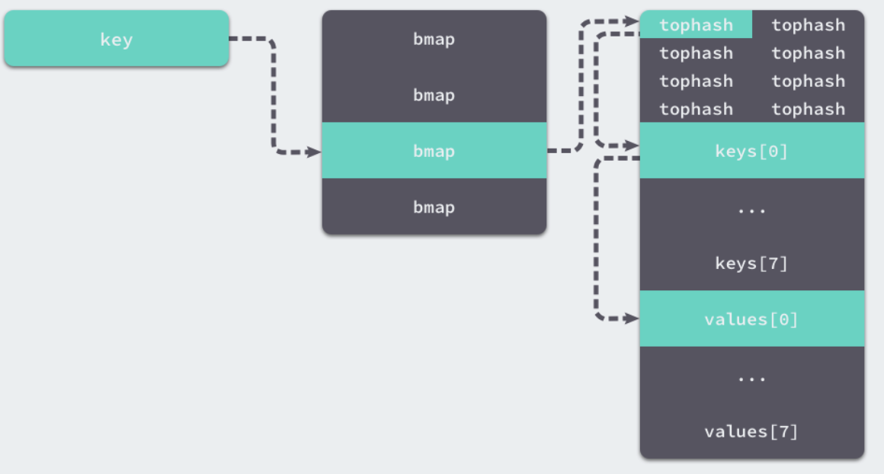
</p>

如果在bucket中没有找到，此时如果overflow不为空，那么就沿着overflow继续查找，如果还是没有找到，那就从别的key槽位查找，直到遍历所有bucket。
```go 
func mapaccess1(t *maptype, h *hmap, key unsafe.Pointer) unsafe.Pointer {
    if raceenabled && h != nil {
        callerpc := getcallerpc()
        pc := funcPC(mapaccess1)
        racereadpc(unsafe.Pointer(h), callerpc, pc)
        raceReadObjectPC(t.key, key, callerpc, pc)
    }
    if msanenabled && h != nil {
        msanread(key, t.key.size)
    }
    //如果h说明都没有，返回零值
    if h == nil || h.count == 0 {
        if t.hashMightPanic() { //如果哈希函数出错
            t.key.alg.hash(key, 0) // see issue 23734
        }
        return unsafe.Pointer(&zeroVal[0])
    }
    //写和读冲突
    if h.flags&hashWriting != 0 {
        throw("concurrent map read and map write")
    }
    //不同类型的key需要不同的hash算法需要在编译期间确定
    alg := t.key.alg
    //利用hash0引入随机性，计算哈希值
    hash := alg.hash(key, uintptr(h.hash0))
    //比如B=5那m就是31二进制是全1，
    //求bucket num时，将hash与m相与，
    //达到bucket num由hash的低8位决定的效果，
    //bucketMask函数掩蔽了移位量，省略了溢出检查。
    m := bucketMask(h.B)
    //b即bucket的地址
    b := (*bmap)(add(h.buckets, (hash&m)*uintptr(t.bucketsize)))
    // oldbuckets 不为 nil，说明发生了扩容
    if c := h.oldbuckets; c != nil {
        if !h.sameSizeGrow() {
            //新的bucket是旧的bucket两倍
            m >>= 1
        }
        //求出key在旧的bucket中的位置
        oldb := (*bmap)(add(c, (hash&m)*uintptr(t.bucketsize)))
        //如果旧的bucket还没有搬迁到新的bucket中，那就在老的bucket中寻找
        if !evacuated(oldb) {
            b = oldb
        }
    }
    //计算tophash高8位
    top := tophash(hash)
bucketloop:
    //遍历所有overflow里面的bucket
    for ; b != nil; b = b.overflow(t) {
        //遍历8个bucket
        for i := uintptr(0); i < bucketCnt; i++ {
            //tophash不匹配，继续
            if b.tophash[i] != top {
                if b.tophash[i] == emptyRest {
                    break bucketloop
                }
                continue
            }
            //tophash匹配，定位到key的位置
            k := add(unsafe.Pointer(b), dataOffset+i*uintptr(t.keysize))
            //若key为指针
            if t.indirectkey() {
                //解引用
                k = *((*unsafe.Pointer)(k))
            }
            //key相等
            if alg.equal(key, k) {
                //定位value的位置
                e := add(unsafe.Pointer(b), dataOffset+bucketCnt*uintptr(t.keysize)+i*uintptr(t.elemsize))
                if t.indirectelem() {
                    //value解引用
                    e = *((*unsafe.Pointer)(e))
                }
                return e
            }
        }
    }
    //没有找到，返回0值
    return unsafe.Pointer(&zeroVal[0])
}

```
在 bucketloop 循环中，哈希会依次遍历正常桶和溢出桶中的数据，它先会比较哈希的高 8 位和桶中存储的 tophash，后比较传入的和桶中的值以加速数据的读写。用于选择桶序号的是哈希的最低几位，而用于加速访问的是哈希的高 8 位，这种设计能够减少同一个桶中有大量相等 tophash 的概率影响性能。

因此bucket里key的起始地址就是`unsafe.Pointer(b)+dataOffset`；第i个key的地址就要此基础上加i个key大小；value的地址是在key之后，所以第i个value，要加上所有的key的偏移。

另一个同样用于访问哈希表中数据的 `runtime.mapaccess2` 只是在 `runtime.mapaccess1` 的基础上多返回了一个标识键值对是否存在的 bool 值：

```go 
func mapaccess2(t *maptype, h *hmap, key unsafe.Pointer) (unsafe.Pointer, bool) {
	...
bucketloop:
	for ; b != nil; b = b.overflow(t) {
		for i := uintptr(0); i < bucketCnt; i++ {
			if b.tophash[i] != top {
				if b.tophash[i] == emptyRest {
					break bucketloop
				}
				continue
			}
			k := add(unsafe.Pointer(b), dataOffset+i*uintptr(t.keysize))
			if t.indirectkey() {
				k = *((*unsafe.Pointer)(k))
			}
			if t.key.equal(key, k) {
				e := add(unsafe.Pointer(b), dataOffset+bucketCnt*uintptr(t.keysize)+i*uintptr(t.elemsize))
				if t.indirectelem() {
					e = *((*unsafe.Pointer)(e))
				}
				return e, true
			}
		}
	}
	return unsafe.Pointer(&zeroVal[0]), false
}
```

使用 `v, ok := hash[k]`的形式访问哈希表中元素时，我们能够通过这个布尔值更准确地知道当 `v == nil` 时，v 到底是哈希中存储的元素还是表示该键对应的元素不存在，所以在访问哈希时，我们更推荐使用这种方式判断元素是否存在。

写入:

当形如 `hash[k]` 的表达式出现在赋值符号左侧时，该表达式也会在编译期间转换成 `mapassign` 函数的调用，该函数与 `mapaccess1` 比较相似:

```go
func mapassign(t *maptype, h *hmap, key unsafe.Pointer) unsafe.Pointer {
    ...
   	hash := t.hasher(key, uintptr(h.hash0))
   
   	// Set hashWriting after calling t.hasher, since t.hasher may panic,
   	// in which case we have not actually done a write.
   	h.flags ^= hashWriting
   
   	if h.buckets == nil {
   		h.buckets = newobject(t.bucket) // newarray(t.bucket, 1)
   	}
   
   again:
   	bucket := hash & bucketMask(h.B)
   	if h.growing() {
   		growWork(t, h, bucket)
   	}
   	b := (*bmap)(unsafe.Pointer(uintptr(h.buckets) + bucket*uintptr(t.bucketsize)))
   	top := tophash(hash)
    ...
}
```

我们可以通过遍历比较桶中存储的`tophash` 和键的哈希，如果找到了相同结果就会返回目标位置的地址。

如果当前桶已经满了，哈希会调用 `newoverflow` 创建新桶或者使用 `hmap` 预先在 `noverflow` 中创建好的桶来保存数据，新创建的桶不仅会被追加到已有桶的末尾，还会增加哈希表的 `noverflow` 计数器。

如果当前键值对在哈希中不存在，哈希会为新键值对规划存储的内存地址，通过`typedmemmove` 将键移动到对应的内存空间中并返回键对应值的地址 val。

如果当前键值对在哈希中存在，那么就会直接返回目标区域的内存地址，哈希并不会在`mapassign` 这个运行时函数中将值拷贝到桶中，该函数只会返回内存地址，真正的赋值操作是在编译期间插入的.


扩容:

随着哈希表中元素的逐渐增加，哈希的性能会逐渐恶化，所以我们需要更多的桶和更大的内存保证哈希的读写性能,这个时候我们就需要用到扩容了.

```go 
func mapassign(t *maptype, h *hmap, key unsafe.Pointer) unsafe.Pointer {
    ...
  	// Did not find mapping for key. Allocate new cell & add entry.
  
  	// If we hit the max load factor or we have too many overflow buckets,
  	// and we're not already in the middle of growing, start growing.
  	if !h.growing() && (overLoadFactor(h.count+1, h.B) || tooManyOverflowBuckets(h.noverflow, h.B)) {
  		hashGrow(t, h)
  		goto again // Growing the table invalidates everything, so try again
  	}
   ...
}

// 装载因子超过 6.5
func overLoadFactor(count int64, B uint8) bool {
	return count >= bucketCnt && float32(count) >= loadFactor*float32((uint64(1)<<B))
}

// overflow buckets
func tooManyOverflowBuckets(noverflow uint16, B uint8) bool {
	if B < 16 {
		return noverflow >= uint16(1)<<B
	}
	return noverflow >= 1<<15
}
```
`mapassign` 函数会在以下两种情况发生时触发哈希的扩容：

* 装载因子已经超过 6.5；
* 哈希使用了太多溢出桶；

不过因为 Go 语言哈希的扩容不是一个原子的过程，所以`mapassign` 还需要判断当前哈希是否已经处于扩容状态，避免二次扩容造成混乱。

根据触发的条件不同扩容的方式分成两种，如果这次扩容是溢出的桶太多导致的，那么这次扩容就是等量扩容`sameSizeGrow`，`sameSizeGrow` 是一种特殊情况下发生的扩容，当我们持续向哈希中插入数据并将它们全部删除时，如果哈希表中的数据量没有超过阈值，就会不断积累溢出桶造成缓慢的内存泄漏。

`runtime: limit the number of map overflow buckets` 引入了 `sameSizeGrow` 通过复用已有的哈希扩容机制解决该问题，一旦哈希中出现了过多的溢出桶，它会创建新桶保存数据，垃圾回收会清理老的溢出桶并释放内存\。

扩容的入口是 `hashGrow`：

```go 
func hashGrow(t *maptype, h *hmap) {
	// If we've hit the load factor, get bigger.
	// Otherwise, there are too many overflow buckets,
	// so keep the same number of buckets and "grow" laterally.
    // B+1 相当于是原来 2 倍的空间
	bigger := uint8(1)
	if !overLoadFactor(h.count+1, h.B) {
       // 进行等量的内存扩容，所以 B 不变
		bigger = 0
		h.flags |= sameSizeGrow
	}
    // 将老 buckets 挂到 buckets 上
	oldbuckets := h.buckets
    // 申请新的 buckets 空间
	newbuckets, nextOverflow := makeBucketArray(t, h.B+bigger, nil)

	flags := h.flags &^ (iterator | oldIterator)
	if h.flags&iterator != 0 {
		flags |= oldIterator
	}
	// commit the grow (atomic wrt gc)
    // 提交 grow 的动作
	h.B += bigger
	h.flags = flags
	h.oldbuckets = oldbuckets
	h.buckets = newbuckets
    // 搬迁进度为 0
	h.nevacuate = 0
    // overflow buckets 数为 0
	h.noverflow = 0

	if h.extra != nil && h.extra.overflow != nil {
		// Promote current overflow buckets to the old generation.
		if h.extra.oldoverflow != nil {
			throw("oldoverflow is not nil")
		}
		h.extra.oldoverflow = h.extra.overflow
		h.extra.overflow = nil
	}
	if nextOverflow != nil {
		if h.extra == nil {
			h.extra = new(mapextra)
		}
		h.extra.nextOverflow = nextOverflow
	}

	// the actual copying of the hash table data is done incrementally
	// by growWork() and evacuate().
}
```
哈希在扩容的过程中会通过 `makeBucketArray` 创建一组新桶和预创建的溢出桶，随后将原有的桶数组设置到 `oldbuckets` 上并将新的空桶设置到 buckets 上，溢出桶也使用了相同的逻辑更新.
这里会申请到了新的 buckets 空间，把相关的标志位都进行了处理,例如标志 nevacuate 被置为 0， 表示当前搬迁进度为 0。

<p align="center">
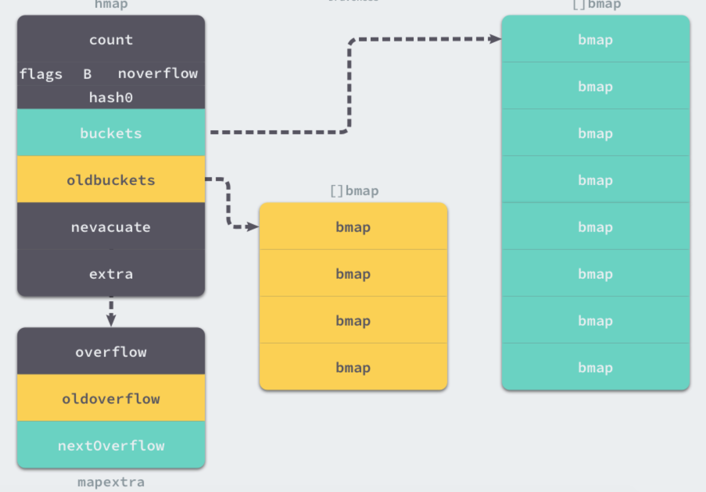
</p>

在`hashGrow` 中还看不出来等量扩容和翻倍扩容的太多区别，等量扩容创建的新桶数量只是和旧桶一样，该函数中只是创建了新的桶，并没有对数据进行拷贝和转移。

哈希表的数据迁移的过程在是 `evacuate` 中完成的，它会对传入桶中的元素进行再分配。

```go
func evacuate(t *maptype, h *hmap, oldbucket uintptr) {
    // 这里会定位老的 bucket 地址 
	b := (*bmap)(add(h.oldbuckets, oldbucket*uintptr(t.bucketsize)))
    // 结果是 2^B
	newbit := h.noldbuckets()
    // 如果吧没有搬迁过
	if !evacuated(b) {
		// TODO: reuse overflow buckets instead of using new ones, if there
		// is no iterator using the old buckets.  (If !oldIterator.)

		// xy contains the x and y (low and high) evacuation destinations.
		var xy [2]evacDst
		x := &xy[0]
		x.b = (*bmap)(add(h.buckets, oldbucket*uintptr(t.bucketsize)))
		x.k = add(unsafe.Pointer(x.b), dataOffset)
		x.e = add(x.k, bucketCnt*uintptr(t.keysize))
        
        // 如果不是等size 扩容,前后bucket序号有变,使用y 进行搬迁
		if !h.sameSizeGrow() {
			// Only calculate y pointers if we're growing bigger.
			// Otherwise GC can see bad pointers.
			y := &xy[1]
			y.b = (*bmap)(add(h.buckets, (oldbucket+newbit)*uintptr(t.bucketsize)))
			y.k = add(unsafe.Pointer(y.b), dataOffset)
			y.e = add(y.k, bucketCnt*uintptr(t.keysize))
		}
        // 遍历所有老的bucket地址
		for ; b != nil; b = b.overflow(t) {
			k := add(unsafe.Pointer(b), dataOffset)
			e := add(k, bucketCnt*uintptr(t.keysize))
			for i := 0; i < bucketCnt; i, k, e = i+1, add(k, uintptr(t.keysize)), add(e, uintptr(t.elemsize)) {
				top := b.tophash[i]
				if isEmpty(top) {
					b.tophash[i] = evacuatedEmpty
					continue
				}
				if top < minTopHash {
					throw("bad map state")
				}
				k2 := k
				if t.indirectkey() {
					k2 = *((*unsafe.Pointer)(k2))
				}
				var useY uint8
				if !h.sameSizeGrow() {
					// Compute hash to make our evacuation decision (whether we need
					// to send this key/elem to bucket x or bucket y).
					hash := t.hasher(k2, uintptr(h.hash0))
					if h.flags&iterator != 0 && !t.reflexivekey() && !t.key.equal(k2, k2) {
						// If key != key (NaNs), then the hash could be (and probably
						// will be) entirely different from the old hash. Moreover,
						// it isn't reproducible. Reproducibility is required in the
						// presence of iterators, as our evacuation decision must
						// match whatever decision the iterator made.
						// Fortunately, we have the freedom to send these keys either
						// way. Also, tophash is meaningless for these kinds of keys.
						// We let the low bit of tophash drive the evacuation decision.
						// We recompute a new random tophash for the next level so
						// these keys will get evenly distributed across all buckets
						// after multiple grows.
						useY = top & 1
						top = tophash(hash)
					} else {
						if hash&newbit != 0 {
							useY = 1
						}
					}
				}

				if evacuatedX+1 != evacuatedY || evacuatedX^1 != evacuatedY {
					throw("bad evacuatedN")
				}

				b.tophash[i] = evacuatedX + useY // evacuatedX + 1 == evacuatedY
				dst := &xy[useY]                 // evacuation destination

				if dst.i == bucketCnt {
					dst.b = h.newoverflow(t, dst.b)
					dst.i = 0
					dst.k = add(unsafe.Pointer(dst.b), dataOffset)
					dst.e = add(dst.k, bucketCnt*uintptr(t.keysize))
				}
				dst.b.tophash[dst.i&(bucketCnt-1)] = top // mask dst.i as an optimization, to avoid a bounds check
				if t.indirectkey() {
					*(*unsafe.Pointer)(dst.k) = k2 // copy pointer
				} else {
					typedmemmove(t.key, dst.k, k) // copy elem
				}
				if t.indirectelem() {
					*(*unsafe.Pointer)(dst.e) = *(*unsafe.Pointer)(e)
				} else {
					typedmemmove(t.elem, dst.e, e)
				}
				dst.i++
				// These updates might push these pointers past the end of the
				// key or elem arrays.  That's ok, as we have the overflow pointer
				// at the end of the bucket to protect against pointing past the
				// end of the bucket.
				dst.k = add(dst.k, uintptr(t.keysize))
				dst.e = add(dst.e, uintptr(t.elemsize))
			}
		}
		// Unlink the overflow buckets & clear key/elem to help GC.
		if h.flags&oldIterator == 0 && t.bucket.ptrdata != 0 {
			b := add(h.oldbuckets, oldbucket*uintptr(t.bucketsize))
			// Preserve b.tophash because the evacuation
			// state is maintained there.
			ptr := add(b, dataOffset)
			n := uintptr(t.bucketsize) - dataOffset
			memclrHasPointers(ptr, n)
		}
	}

	if oldbucket == h.nevacuate {
		advanceEvacuationMark(h, t, newbit)
	}
}
```
`evacuate` 会将一个旧桶中的数据分流到两个新桶，所以它会创建两个用于保存分配上下文的 `evacDst` 结构体，这两个结构体分别指向了一个新桶：

<p align="center">
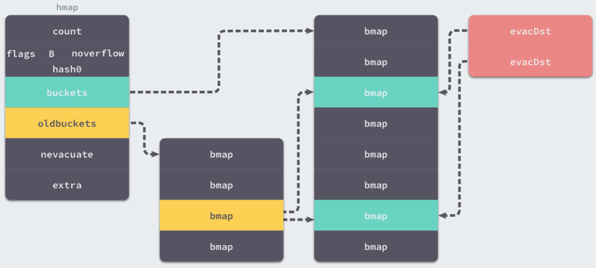
</p>

哈希表扩容目的:

如果这是等量扩容，那么旧桶与新桶之间是一对一的关系，所以两个`evacDst`只会初始化一个。而当哈希表的容量翻倍时，每个旧桶的元素会都分流到新创建的两个桶中.

只使用哈希函数是不能定位到具体某一个桶的，哈希函数只会返回很长的哈希,我们还需一些方法将哈希映射到具体的桶上。


那么如何定位key呢?

key 经过哈希计算后得到哈希值，共64个 bit 位（64位机，32位机就不讨论了，现在主流都是64位机），计算它到底要落在哪个桶时，只会用到最后 B 个 bit 位。

如果 B = 5，那么桶的数量，也就是 buckets 数组的长度是 `2^5 = 32`。

例如，现在有一个 key 经过哈希函数计算后，得到的哈希结果是：
```markdown
 10010111 | 000011110110110010001111001010100010010110010101010 │ 01010
```
用最后的 5 个bit 位，也就是`01010`，值为 10,那么这个就是10号桶。

再用哈希值的高 8 位，找到此 key 在bucket中的位置，这是在寻找已有的 key。最开始桶内还没有 key，新加入的 key 会找到第一个空位，放入。

buckets 编号就是桶编号，当两个不同的key落在同一个桶中，也就是发生了哈希冲突。

通常哈希冲突的解决手段是用链表法,在 bucket 中，从前往后找到第一个空位。这样，在查找某个 key 时，先找到对应的桶，再去遍历 bucket 中的 key。


因此哈希表扩容的设计和原理，哈希在存储元素过多时会触发扩容操作，每次都会将桶的数量翻倍，扩容过程不是原子的，而是通过`growWork` 增量触发的，在扩容期间访问哈希表时会使用旧桶，向哈希表写入数据时会触发旧桶元素的分流。

除了这种正常的扩容之外，为了解决大量写入、删除造成的内存泄漏问题，哈希引入了`sameSizeGrow` 这一机制，在出现较多溢出桶时会整理哈希的内存减少空间的占用。

删除: 

如果想要删除哈希中的元素，就需要使用 Go 语言中的 delete 关键字，这个关键字的唯一作用就是将某一个键对应的元素从哈希表中删除，无论是该键对应的值是否存在，这个内建的函数都不会返回任何的结果。

因此呢Go采用拉链法来解决哈希碰撞的问题实现了哈希表，它的访问、写入和删除等操作都在编译期间转换成了运行时的函数或者方法。

哈希在每一个桶中存储键对应哈希的前 8 位，当对哈希进行操作时，这些 `tophash` 就成为可以帮助哈希快速遍历桶中元素的缓存。

哈希表的每个桶都只能存储 8 个键值对，一旦当前哈希的某个桶超出 8 个，新的键值对就会存储到哈希的溢出桶中。

随着键值对数量的增加，溢出桶的数量和哈希的装载因子也会逐渐升高，超过一定范围就会触发扩容，扩容会将桶的数量翻倍，元素再分配的过程也是在调用写操作时增量进行的，不会造成性能的瞬时巨大损耗。

41. #### Go中的http包的实现原理

Golang中http包中处理 HTTP 请求主要跟两个东西相关：ServeMux 和 Handler。

ServeMux 本质上是一个 HTTP 请求路由器（或者叫多路复用器，Multiplexor）。它把收到的请求与一组预先定义的 URL 路径列表做对比，然后在匹配到路径的时候调用关联的处理器（Handler）。

处理器（Handler）负责输出HTTP响应的头和正文。任何满足了http.Handler接口的对象都可作为一个处理器。通俗的说，对象只要有个如下签名的ServeHTTP方法即可：
```go 
ServeHTTP(http.ResponseWriter, *http.Request)
```
Go 语言的 HTTP 包自带了几个函数用作常用处理器，比如`FileServer`，`NotFoundHandler` 和 `RedirectHandler`。

应用示例:
```go 
package main

import (
	"log"
	"net/http"
)

func main() {
	mux := http.NewServeMux()

	rh := http.RedirectHandler("http://www.baidu.com", 307)
	mux.Handle("/foo", rh)

	log.Println("Listening...")
	http.ListenAndServe(":3000", mux)
}
```

在这个应用示例中,首先在 main 函数中我们只用了 `http.NewServeMux` 函数来创建一个空的 `ServeMux`。 然后我们使用 `http.RedirectHandler` 函数创建了一个新的处理器，这个处理器会对收到的所有请求，都执行307重定向操作到 `http://www.baidu.com`。
 
接下来我们使用 `ServeMux.Handle` 函数将处理器注册到新创建的 `ServeMux`，所以它在 URL 路径`/foo` 上收到所有的请求都交给这个处理器。 最后我们创建了一个新的服务器，并通过 `http.ListenAndServe` 函数监听所有进入的请求，通过传递刚才创建的 `ServeMux`来为请求去匹配对应处理器。 
 
在浏览器中访问 `http://localhost:3000/foo`，你应该能发现请求已经成功的重定向了。
 
此刻你应该能注意到一些有意思的事情：`ListenAndServer` 的函数签名是` ListenAndServe(addr string, handler Handler)` ，但是第二个参数我们传递的是个`ServeMux`。

通过这个例子我们就可以知道,`net/http`包在编写golang web应用中有很重要的作用，它主要提供了基于HTTP协议进行工作的client实现和server实现，可用于编写HTTP服务端和客户端。


42. #### Goroutine发生了泄漏如何检测

通常内存泄漏，指的是能够预期的能很快被释放的内存由于附着在了长期存活的内存上、或生命期意外地被延长，导致预计能够立即回收的内存而长时间得不到回收。

在 Go 中，由于Goroutine的存在，因此,内存泄漏除了附着在长期对象上之外，还存在多种不同的形式。

* 预期能被快速释放的内存因被根对象引用而没有得到迅速释放.

当有一个全局对象时，可能不经意间将某个变量附着在其上，且忽略的将其进行释放，则该内存永远不会得到释放。

* Goroutine 泄漏

Goroutine 作为一种逻辑上理解的轻量级线程，需要维护执行用户代码的上下文信息。在运行过程中也需要消耗一定的内存来保存这类信息，而这些内存在目前版本的 Go 中是不会被释放的。

因此，如果一个程序持续不断地产生新的 goroutine、且不结束已经创建的 goroutine 并复用这部分内存，就会造成内存泄漏的现象.

可以通过Go自带的工具pprof或者使用Gops去检测诊断当前在系统上运行的Go进程的占用的资源.

例如:

```go 
func main() {
	for i := 0; i < 10000; i++ {
		go func() {
			select {}
		}()
	}
}
```

43. #### Go函数返回局部变量的指针是否安全

在 Go 中是安全的，Go 编译器将会对每个局部变量进行逃逸分析。如果发现局部变量的作用域超出该函数，则不会将内存分配在栈上，而是分配在堆上

44. #### Go中两个Nil可能不相等吗

Go中两个Nil可能不相等。

接口(interface) 是对非接口值(例如指针，struct等)的封装，内部实现包含 2 个字段，类型 T 和 值 V。一个接口等于 nil，当且仅当 T 和 V 处于 unset 状态（T=nil，V is unset）。

两个接口值比较时，会先比较 T，再比较 V。
接口值与非接口值比较时，会先将非接口值尝试转换为接口值，再比较。
```go
func main() {
	var p *int = nil
	var i interface{} = p
	fmt.Println(i == p) // true
	fmt.Println(p == nil) // true
	fmt.Println(i == nil) // false
}
```
这个例子中，将一个nil非接口值p赋值给接口i，此时,i的内部字段为(T=*int, V=nil)，i与p作比较时，将 p 转换为接口后再比较，因此 `i == p`，p 与 nil 比较，直接比较值，所以 `p == nil`。

但是当 i 与nil比较时，会将nil转换为接口(T=nil, V=nil),与i(T=*int, V=nil)不相等，因此 `i != nil`。因此 V 为 nil ，但 T 不为 nil 的接口不等于 nil。

45. #### Goroutine和KernelThread之间是什么关系

首先我们先看下进程和线程还有协程之间的区别:

* 进程

计算机的操作系统模式是一种多任务系统，操作系统接管了所有的硬件资源，并且本身运行在一个受硬件保护的级别。所有的应用程序都以进程(process)的方式运行在比操作系统权限更低的级别，每个进程都有自己独立的地址空间，使得进程之间的地址空间相互隔离。CPU由操作系统一进行分配，每个进程根据进程的优先级的高低都有机会得到CPU,但是如果允许时间超出了一定的时间，操作系统会暂停该进程，将CPU资源分配给其他等待的进程。这种CPU的分配方式即所谓的抢占式，操作系统可以强制剥夺CPU资源并且分配给它认为目前最需要的进程。如果操作系统分配给每个进程的时间都很短，即CPU在多个进程间快速地切换，从而造成了很多进程都在同时运行的假象。

* 线程

线程有时被称为轻量级进程（Lightweight Process）,是程序执行流的最小单元，一个标准的线程由线程ID,当前指令指针（PC）、寄存器集合和堆栈组成，通常意义上，一个进程🈶一个到多个线程组成，各个线程之间共享程序的内存空间（包括代码段、数据段、堆等）及一些进程级的资源（如打开文件和信号）。

* 协程

协程（coroutine）是Go语言中的轻量级线程实现，由Go运行时（runtime）管理。

进程、线程、协程的关系和区别：

* 进程拥有自己独立的堆和栈，既不共享堆，亦不共享栈，进程由操作系统调度。

* 线程拥有自己独立的栈和共享的堆，共享堆，不共享栈，线程亦由操作系统调度(标准线程是的)。

* 协程和线程一样共享堆，不共享栈，协程由程序开发者在协程的代码里显示调度。

为什么协程比线程轻量？

a. go协程调用跟切换比线程效率高

线程并发执行流程: 线程是内核对外提供的服务，应用程序可以通过系统调用让内核启动线程，由内核来负责线程调度和切换。线程在等待IO操作时线程变为unrunnable状态会触发上下文切换。现代操作系统一般都采用抢占式调度，上下文切换一般发生在时钟中断和系统调用返回前，调度器计算当前线程的时间片，如果需要切换就从运行队列中选出一个目标线程，保存当前线程的环境，并且恢复目标线程的运行环境，最典型的就是切换ESP指向目标线程内核堆栈，将EIP指向目标线程上次被调度出时的指令地址。

go协程并发执行流程：不依赖操作系统和其提供的线程，golang自己实现的CSP并发模型实现：M, P, G .go协程也叫用户态线程，协程之间的切换发生在用户态。在用户态没有时钟中断，系统调用等机制,因此效率高

b. go协程占用内存少

执行go协程只需要极少的栈内存（大概是4～5KB），默认情况下，线程栈的大小为1MB。goroutine就是一段代码，一个函数入口，以及在堆上为其分配的一个堆栈。所以它非常廉价，我们可以很轻松的创建上万个goroutine，但它们并不是被操作系统所调度执行。

因此协程和线程一样共享堆，不共享栈，协程由用户态下面的轻量级线程。

### Mysql基础知识

1. #### Mysql索引用的是什么算法

Mysql 索引选用的是B+树,平衡二叉树的高度太高,查找可能需要较多的磁盘IO。B树索引占用内存较高(非叶子节点存储数据)。
                 
B+树, 主要是查询效率高，O(logN)，可以充分利用磁盘预读的特性，多叉树，深度小，叶子结点有序且存储数据.
                 
2. #### Mysql事务的基本要素

* 原子性：事务是一个原子操作单元，其对数据的修改，要么全都执行，要么全都不执行。
* 一致性：事务开始前和结束后，数据库的完整性约束没有被破坏。
* 隔离性：同一时间，只允许一个事务请求同一数据，不同的事务之间彼此没有任何干扰。
* 持久性：事务完成后，事务对数据库的所有更新将被保存到数据库，不能回滚。

3. #### Mysql的存储引擎

* InnoDB存储引擎

InnoDB存储引擎支持事务，其设计目标主要面向在线事务处理（OLTP）的应用。

其特点是行锁设计，支持外键，并支持非锁定锁，即默认读取操作不会产生锁。从Mysql5.5.8版本开始，InnoDB存储引擎是默认的存储引擎。

* MyISAM存储引擎

MyISAM存储引擎不支持事务、表锁设计，支持全文索引，主要面向一些OLAP数据库应用。

InnoDB的数据文件本身就是主索引文件，而MyISAM的主索引和数据是分开的。

*  NDB存储引擎

NDB存储引擎是一个集群存储引擎，其结构是share nothing的集群架构，能提供更高的可用性。

NDB的特点是数据全部放在内存中（从MySQL 5.1版本开始，可以将非索引数据放在磁盘上），因此主键查找的速度极快，并且通过添加NDB数据存储节点可以线性地提高数据库性能，是高可用、高性能的集群系统。
NDB存储引擎的连接操作是在MySQL数据库层完成的，而不是在存储引擎层完成的。这意味着，复杂的连接操作需要巨大的网络开销，因此查询速度很慢。如果解决了这个问题，NDB存储引擎的市场应该是非常巨大的。

* Memory存储引擎

Memory存储引擎（之前称HEAP存储引擎）将表中的数据存放在内存中，如果数据库重启或发生崩溃，表中的数据都将消失。
它非常适合用于存储临时数据的临时表，以及数据仓库中的纬度表。Memory存储引擎默认使用哈希索引，而不是我们熟悉的B+树索引。
虽然Memory存储引擎速度非常快，但在使用上还是有一定的限制。比如，只支持表锁，并发性能较差，并且不支持TEXT和BLOB列类型。最重要的是，存储变长字段时是按照定常字段的方式进行的，因此会浪费内存。

* Archive存储引擎

Archive存储引擎只支持INSERT和SELECT操作，从MySQL 5.1开始支持索引。
Archive存储引擎使用zlib算法将数据行（row）进行压缩后存储，压缩比一般可达1∶10。正如其名字所示，Archive存储引擎非常适合存储归档数据，如日志信息。
Archive存储引擎使用行锁来实现高并发的插入操作，但是其本身并不是事务安全的存储引擎，其设计目标主要是提供高速的插入和压缩功能。

* Maria存储引擎

Maria存储引擎是新开发的引擎，设计目标主要是用来取代原有的MyISAM存储引擎，从而成为MySQL的默认存储引擎。它可以看做是MyISAM的后续版本。
Maria存储引擎的特点是：支持缓存数据和索引文件，应用了行锁设计，提供了MVCC功能，支持事务和非事务安全的选项，以及更好的BLOB字符类型的处理性能。

4. #### Mysql事务隔离级别

Mysql有四种事务隔离级别,默认的是可重复读.

|  事务隔离级别 | 脏读 | 不可重复读 | 幻读 |
|-------------|-----|-----------|------|
| 读未提交	|   是	|   是	     |   是 |
| 读已提交	|   否	|   是	     |   是 |
| 可重复读	|   否	|   否	     |   是 |
| 串行	 |   否	|   否	     |   否  |


* 读未提交(Read uncommitted)

一个事务可以读取另一个未提交事务的数据，最低级别，任何情况都无法保证。

(1)所有事务都可以看到其他未提交事务的执行结果
(2)本隔离级别很少用于实际应用，因为它的性能也不比其他级别好多少
(3)该级别引发的问题是——脏读(Dirty Read)：读取到了未提交的数据

* 读已提交(Read committed)

一个事务要等另一个事务提交后才能读取数据，可避免脏读的发生。

(1)这是大多数数据库系统的默认隔离级别（但不是MySQL默认的）
(2)它满足了隔离的简单定义：一个事务只能看见已经提交事务所做的改变
(3)这种隔离级别出现的问题是——不可重复读(Nonrepeatable Read),不可重复读意味着我们在同一个事务中执行完全相同的select语句时可能看到不一样的结果。

导致这种情况的原因可能有：

(1)有一个交叉的事务有新的commit，导致了数据的改变;
(2)一个数据库被多个实例操作时,同一事务的其他实例在该实例处理其间可能会有新的commit. 

* 可重复读(Repeatable read)

就是在开始读取数据（事务开启）时，不再允许修改操作，可避免脏读、不可重复读的发生。

(1)这是MySQL的默认事务隔离级别
(2)它确保同一事务的多个实例在并发读取数据时，会看到同样的数据行
(3)此级别可能出现的问题——幻读(Phantom Read)：当用户读取某一范围的数据行时，另一个事务又在该范围内插入了新行，当用户再读取该范围的数据行时，会发现有新的“幻影” 行
(4)InnoDB和Falcon存储引擎通过多版本并发控制(MVCC，Multiversion Concurrency Control)机制解决了该问题.InnoDB采用MVCC来支持高并发，实现了四个标准隔离级别。默认基本是可重复读，并且提供间隙锁（next-key locks）策略防止幻读出现。

* 串行(Serializable)

串行(Serializable)，是最高的事务隔离级别，在该级别下，事务串行化顺序执行，可以避免脏读、不可重复读与幻读。
但是这种事务隔离级别效率低下，比较耗数据库性能，一般不使用。Mysql的默认隔离级别是Repeatable read。

(1)这是最高的隔离级别.
(2)它通过强制事务排序，使之不可能相互冲突，从而解决幻读问题。简言之,它是在每个读的数据行上加上共享锁。
(3)在这个级别，可能导致大量的超时现象和锁竞争.

5. #### Mysql高可用方案有哪些

Mysql高可用方案包括:

* 主从复制方案

这是MySQL自身提供的一种高可用解决方案，数据同步方法采用的是`MySQL replication`技术。`MySQL replication`就是从服务器到主服务器拉取二进制日志文件，然后再将日志文件解析成相应的SQL在从服务器上重新执行一遍主服务器的操作，通过这种方式保证数据的一致性。
为了达到更高的可用性，在实际的应用环境中，一般都是采用`MySQL replication`技术配合高可用集群软件`keepalived`来实现自动`failover`，这种方式可以实现95.000%的SLA。

* MMM/MHA高可用方案

MMM提供了MySQL主主复制配置的监控、故障转移和管理的一套可伸缩的脚本套件。在MMM高可用方案中，典型的应用是双主多从架构，通过MySQL replication技术可以实现两个服务器互为主从，且在任何时候只有一个节点可以被写入，避免了多点写入的数据冲突。
同时，当可写的主节点故障时，MMM套件可以立刻监控到，然后将服务自动切换到另一个主节点，继续提供服务，从而实现MySQL的高可用。

* Heartbeat/SAN高可用方案

在这个方案中，处理failover的方式是高可用集群软件Heartbeat，它监控和管理各个节点间连接的网络，并监控集群服务，当节点出现故障或者服务不可用时，自动在其他节点启动集群服务。
在数据共享方面，通过SAN（Storage Area Network）存储来共享数据，这种方案可以实现99.990%的SLA。

* Heartbeat/DRBD高可用方案

这个方案处理failover的方式上依旧采用Heartbeat，不同的是，在数据共享方面，采用了基于块级别的数据同步软件DRBD来实现。
DRBD是一个用软件实现的、无共享的、服务器之间镜像块设备内容的存储复制解决方案。和SAN网络不同，它并不共享存储，而是通过服务器之间的网络复制数据。

* NDB CLUSTER高可用方案

国内用NDB集群的公司非常少，貌似有些银行有用。NDB集群不需要依赖第三方组件，全部都使用官方组件，能保证数据的一致性，某个数据节点挂掉，其他数据节点依然可以提供服务，管理节点需要做冗余以防挂掉。
缺点是：管理和配置都很复杂，而且某些SQL语句例如join语句需要避免。

6. #### Mysql中utf8和utf8mb4区别

MySQL在5.5.3之后增加了这个`utf8mb4`的编码，mb4就是`most bytes 4`的意思，专门用来兼容四字节的`unicode`。好在`utf8mb4`是`utf8`的超集，除了将编码改为`utf8mb4`外不需要做其他转换。当然，为了节省空间，一般情况下使用utf8也就可以了。

Mysql支持的 `utf8` 编码最大字符长度为 3 字节，如果遇到 4 字节的宽字符就会插入异常了。三个字节的 UTF-8 最大能编码的 `Unicode` 字符是 `0xffff`，也就是 `Unicode` 中的基本多文种平面(BMP)。任何不在基本多文本平面的 Unicode字符，都无法使用 Mysql 的 `utf8` 字符集存储。

包括 Emoji 表情(Emoji 是一种特殊的 Unicode 编码，常见于 ios 和 android 手机上)，和很多不常用的汉字，以及任何新增的 Unicode 字符等等。

Mysql 中保存 4 字节长度的 UTF-8 字符，需要使用`utf8mb4` 字符集，但只有5.5.3版本以后的才支持(查看版本： select version();)。因此呢，为了获取更好的兼容性，应该总是使用 `utf8mb4` 而非 utf8. 

对于 CHAR 类型数据，`utf8mb4` 会多消耗一些空间，根据 Mysql 官方建议，使用 VARCHAR 替代 CHAR。


7. #### Mysql中乐观锁和悲观锁区别

* 悲观锁(Pessimistic Lock)
 
悲观锁顾名思义，就是很悲观，每次去拿数据的时候都认为别人会修改，所以每次在拿数据的时候都会上锁，这样别人想拿这个数据就会block直到它拿到锁。

传统的关系型数据库里边就用到了很多这种锁机制，比如行锁，表锁等，读锁，写锁等，都是在做操作之前先上锁。

* 乐观锁(Optimistic Lock), 

乐观锁顾名思义，就是很乐观，每次去拿数据的时候都认为别人不会修改，所以不会上锁，但是在更新的时候会判断一下在此期间别人有没有去更新这个数据，可以使用版本号等机制。

乐观锁适用于多读的应用类型，这样可以提高吞吐量，像数据库如果提供类似于`write_condition`机制的其实都是提供的乐观锁。

乐观锁的特点先进行业务操作，不到万不得已不去拿锁。即“乐观”的认为拿锁多半是会成功的，因此在进行完业务操作需要实际更新数据的最后一步再去拿一下锁就好。

乐观锁在数据库上的实现完全是逻辑的，不需要数据库提供特殊的支持。一般的做法是在需要锁的数据上增加一个版本号，或者时间戳，然后按照如下方式实现：

```go 
1. SELECT data AS old_data, version AS old_version FROM …;
2. 根据获取的数据进行业务操作，得到new_data和new_version
3. UPDATE SET data = new_data, version = new_version WHERE version = old_version
if (updated row > 0) {
    // 乐观锁获取成功，操作完成
} else {
    // 乐观锁获取失败，回滚并重试
}
```

乐观锁是否在事务中其实都是无所谓的，其底层机制是这样：在数据库内部update同一行的时候是不允许并发的，即数据库每次执行一条update语句时会获取被update行的写锁，直到这一行被成功更新后才释放。

因此在业务操作进行前获取需要锁的数据的当前版本号，然后实际更新数据时再次对比版本号确认与之前获取的相同，并更新版本号，即可确认这之间没有发生并发的修改。如果更新失败即可认为老版本的数据已经被并发修改掉而不存在了，此时认为获取锁失败，需要回滚整个业务操作并可根据需要重试整个过程。

两种锁各有优缺点，不可认为一种好于另一种，像乐观锁适用于写比较少的情况下，即冲突真的很少发生的时候，这样可以省去了锁的开销，加大了系统的整个吞吐量。

但如果经常产生冲突，上层应用会不断的进行retry，这样反倒是降低了性能，所以这种情况下用悲观锁就比较合适。　

8. #### Mysql索引主要是哪些

索引的目的在于提高查询效率.

索引的类型：

* UNIQUE(唯一索引)：不可以出现相同的值，可以有NULL值
* INDEX(普通索引)：允许出现相同的索引内容
* PROMARY KEY(主键索引)：不允许出现相同的值
* fulltext index(全文索引)：可以针对值中的某个单词，但效率确实不敢恭维
* 组合索引：实质上是将多个字段建到一个索引里，列值的组合必须唯一

索引虽然好处很多，但过多的使用索引可能带来相反的问题，索引也是有缺点的：

* 虽然索引大大提高了查询速度，同时却会降低更新表的速度，如对表进行INSERT,UPDATE和DELETE。因为更新表时，mysql不仅要保存数据，还要保存一下索引文件.

* 建立索引会占用磁盘空间的索引文件。一般情况这个问题不太严重，但如果你在要给大表上建了多种组合索引，索引文件会膨胀很宽, 索引只是提高效率的一个方式，如果mysql有大数据量的表，就要花时间研究建立最优的索引，或优化查询语句。


使用索引时，有一些技巧：

* 索引不会包含有NULL的列

只要列中包含有NULL值，都将不会被包含在索引中，复合索引中只要有一列含有NULL值，那么这一列对于此符合索引就是无效的。

* 使用短索引

对串列进行索引，如果可以就应该指定一个前缀长度。例如，如果有一个char（255）的列，如果在前10个或20个字符内，多数值是唯一的，那么就不要对整个列进行索引。短索引不仅可以提高查询速度而且可以节省磁盘空间和I/O操作。

* 索引列排序

mysql查询只使用一个索引，因此如果where子句中已经使用了索引的话，那么order by中的列是不会使用索引的。因此数据库默认排序可以符合要求的情况下不要使用排序操作，尽量不要包含多个列的排序，如果需要最好给这些列建复合索引。

* like语句操作
一般情况下不鼓励使用like操作，如果非使用不可，注意正确的使用方式。`like ‘%aaa%’`不会使用索引，而`like ‘aaa%’`可以使用索引。

* 不要在列上进行运算
* 不使用`NOT IN` 、`<>`、`！=`操作，但`<`,`<=`，`=`，`>`,`>=`,BETWEEN,IN是可以用到索引的
* 索引要建立在经常进行select操作的字段上。
这是因为，如果这些列很少用到，那么有无索引并不能明显改变查询速度。相反，由于增加了索引，反而降低了系统的维护速度和增大了空间需求。

* 索引要建立在值比较唯一的字段上。
* 对于那些定义为text、image和bit数据类型的列不应该增加索引。因为这些列的数据量要么相当大，要么取值很少。
* 在where和join中出现的列需要建立索引。

* where的查询条件里有不等号(where column != …),mysql将无法使用索引。

* 如果where字句的查询条件里使用了函数(如：where DAY(column)=…),mysql将无法使用索引。

* 在join操作中(需要从多个数据表提取数据时)，mysql只有在主键和外键的数据类型相同时才能使用索引，否则及时建立了索引也不会使用。

组合索引的作用:

1. 减少开销。

建一个组合索引(col1,col2,col3)，实际相当于建了(col1),(col1,col2),(col1,col2,col3)三个索引。每多一个索引，都会增加写操作的开销和磁盘空间的开销。
对于大量数据的表，使用组合索引会大大的减少开销。

2. 覆盖索引。

通常指一个查询语句的执行只用从索引中就能够取得，不必从数据表中读取。也可以称之为实现了索引覆盖。

对组合索引(col1,col2,col3)，如果有如下的`sql: select col1,col2,col3 from test where col1=1 and col2=2`。

那么MySQL可以直接通过遍历索引取得数据，而无需回表，这减少了很多的随机io操作。减少io操作，特别的随机io其实是dba主要的优化策略。

所以，在真正的实际应用中，覆盖索引是主要的提升性能的优化手段之一。

3. 效率高。

索引列越多，通过索引筛选出的数据越快。


9. #### Mysql联合索引最左匹配原则

最左前缀匹配原则：

1. 在MySQL建立联合索引时会遵守最左前缀匹配原则，即最左优先.

在检索数据时从联合索引的最左边开始匹配，Mysql会一直向右匹配直到遇到范围查询（`>、<、between、like`）就停止匹配了.

就比如 `a=3 and b=4 and c>5 and d=6 `如果建立(abcd)顺序的索引,d就用不到索引了，如果建立(abdc)的索引则都可以用到索引，其中abd的顺序可以任意调整，因为查询优化器会重新编排（即使是c>5 and b=4 and d=6 and a=3也会全部用到 abdc索引 ）.

2. `=`和`in`可以乱序，比如`a=1 and b=2 and c=3` 建立(abc)索引可以任意顺序，mysql查询优化器会优化顺序.

这里需要注意下, 比如abc索引 那么只要查询条件有a即可用到abc索引（如abc ab ac a）,没有a就用不到。

最左前缀匹配成因：Mysql是创建复合索引的规则是根据索引最左边的字段进行排序，在第一个字段排序的基础上再进行第二个字段排序，类似于`order by col1，col2…` 所以第一个字段是绝对有序的 第二个字段就是无序的了，所以Mysql 强调最左前缀匹配.

10. #### 聚簇索引和非聚簇索引区别

聚簇索引与非聚簇索引的区别是：叶子节点是否存放一整行记录.

InnoDB 主键使用的是聚簇索引，MyISAM 不管是主键索引，还是二级索引使用的都是非聚簇索引。

<p align="center">
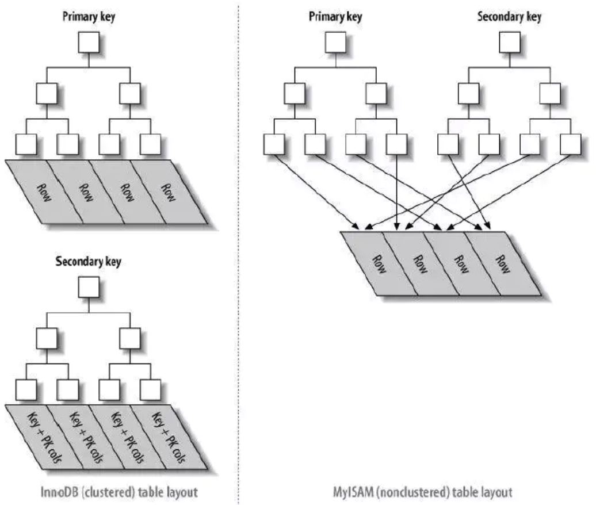
</p>

1. 对于聚簇索引表来说（左图），表数据是和主键一起存储的，主键索引的叶结点存储行数据(包含了主键值)，二级索引的叶结点存储行的主键值。
使用的是B+树作为索引的存储结构，非叶子节点都是索引关键字，但非叶子节点中的关键字中不存储对应记录的具体内容或内容地址。叶子节点上的数据是主键与具体记录(数据内容)。

2. 对于非聚簇索引表来说（右图），表数据和索引是分成两部分存储的，主键索引和二级索引存储上没有任何区别。使用的是B+树作为索引的存储结构，所有的节点都是索引，叶子节点存储的是索引+索引对应的记录的数据。

因此, 聚簇索引的叶子节点就是数据节点，而非聚簇索引的叶子节点仍然是索引节点，只不过有指向对应数据块的指针

11. #### 如何查询一个字段是否命中了索引

通过explain sql可看下SQL是否走了索引，很快对比出来 .

当一个sql中字段为int类型时，例如搜索条件`where num="111"`与`where num=111`都可以使用该字段的索引. 当一个中字段为varchar类型时，例如搜索条件`where num="111"`可以使用索引，`where num=111`不可以使用索引.

12. #### Mysql中查询数据什么情况下不会命中索引

通常不命中索引有接种情况:

* 索引规范不合理,sql解析器不命中索引.
* 表中索引是以表中数据量字段最多的建立的索引,sql解析器不命中索引.(实际就是索引没用,最后全局查找了)
* bool的字段做索引,sql选择器不命中索引.
* 模糊查询 %like
* 索引列参与计算,使用了函数
* 非最左前缀顺序
* where对null判断
* where不等于
* or操作有至少一个字段没有索引
* 需要回表的查询结果集过大（超过配置的范围）

13. #### Mysql中的MVCC是什么

数据库并发控制——锁:Multiversion (version) concurrency control (MCC or MVCC) 多版本并发控制 ，它是数据库管理系统一种常见的并发控制。

并发控制常用的是锁，当线程要对一个共享资源进行操作的时候，加锁是一种非常简单粗暴的方法(事务开始时给 DQL 加读锁，给 DML 加写锁)，这种锁是一种 悲观 的实现方式，也就是说这会给其他事务造成堵塞，从而影响数据库性能。

其中在数据库中最常见的就是悲观锁和乐观锁:

* 悲观锁

当一个线程需要对共享资源进行操作的时候，首先对共享资源进行加锁，当该线程持有该资源的锁的时候，其他线程对该资源进行操作的时候会被阻塞.

* 乐观锁

当一个线程需要对一个共享资源进行操作的时候，不对它进行加锁，而是在操作完成之后进行判断。
比如乐观锁会通过一个版本号控制，如果操作完成后通过版本号进行判断在该线程操作过程中是否有其他线程已经对该共享资源进行操作了，如果有则通知操作失败，如果没有则操作成功，当然除了版本号还有CAS，如果不了解的可以去学习一下，这里不做过多涉及。

MVCC的两种读形式:

* 快照读

读取的只是当前事务的可见版本，不用加锁。而你只要记住 简单的 `select`操作就是快照读(select * from table where id = xxx)。
* 当前读

读取的是当前版本，比如 特殊的读操作，更新/插入/删除操作.

比如：

```markdown
 select * from table where xxx lock in share mode，
 select * from table where xxx for update，
 update table set....
 insert into table (xxx,xxx) values (xxx,xxx)
 delete from table where id = xxx
```

MVCC的实现原理:

MVCC 使用了“三个隐藏字段”来实现版本并发控制，MySQL在创建建表的时候 innoDB 创建的真正的三个隐藏列吧。

|   RowID   | DB_TRX_ID | DB_ROLL_PTR |	id	| name | password |
|-----------|-----------|-------------|-----|------|----------|
|自动创建的id | 事务id     |	回滚指针	  |  id	| name | password |

* RowID：隐藏的自增ID，当建表没有指定主键，InnoDB会使用该RowID创建一个聚簇索引。

* DB_TRX_ID：最近修改（更新/删除/插入）该记录的事务ID。

* DB_ROLL_PTR：回滚指针，指向这条记录的上一个版本。

其实还有一个删除的flag字段，用来判断该行记录是否已经被删除。

而 MVCC 使用的是其中的 事务字段，回滚指针字段，是否删除字段。

我们来看一下现在的表格(isDelete是我自己取的，按照官方说法是在一行开头的content里面，这里其实位置无所谓，你只要知道有就行了)。

| isDelete	 | DB_TRX_ID | DB_ROLL_PTR | id	 | name | password |
|------------|-----------|-------------|-----|------|----------|
|true/false	 | 事务id     |	回滚指针	   |  id | name | password |

14. #### Mvcc和Redolog和Undolog以及Binlog有什么不同

* Mvcc

MVCC多版本并发控制是MySQL中基于乐观锁理论实现隔离级别的方式，用于读已提交和可重复读取隔离级别的实现。
在MySQL中，会在表中每一条数据后面添加两个字段,最近修改该行数据的事务ID，指向该行（undolog表中）回滚段的指针。
Read View判断行的可见性，创建一个新事务时，copy一份当前系统中的活跃事务列表。意思是，当前不应该被本事务看到的其他事务id列表。

* UndoLog

UndoLog也就是我们常说的回滚日志文件 主要用于事务中执行失败，进行回滚，以及MVCC中对于数据历史版本的查看。
由引擎层的InnoDB引擎实现,是逻辑日志,记录数据修改被修改前的值,比如"把id='B' 修改为id = 'B2' ，那么undo日志就会用来存放id ='B'的记录”。
当一条数据需要更新前,会先把修改前的记录存储在undolog中,如果这个修改出现异常,,则会使用undo日志来实现回滚操作,保证事务的一致性。
当事务提交之后，undo log并不能立马被删除,而是会被放到待清理链表中,待判断没有事物用到该版本的信息时才可以清理相应undolog。它保存了事务发生之前的数据的一个版本，用于回滚，同时可以提供多版本并发控制下的读（MVCC），也即非锁定读。

* Redolog

Redolog是重做日志文件是记录数据修改之后的值，用于持久化到磁盘中。

Redolog包括两部分：

一. 是内存中的日志缓冲(redo log buffer)，该部分日志是易失性的；

二. 是磁盘上的重做日志文件(redo log file)，该部分日志是持久的。

由引擎层的InnoDB引擎实现,是物理日志,记录的是物理数据页修改的信息,比如“某个数据页上内容发生了哪些改动”。当一条数据需要更新时,InnoDB会先将数据更新，然后记录redoLog 在内存中，然后找个时间将redoLog的操作执行到磁盘上的文件上。
不管是否提交成功我都记录，你要是回滚了，那我连回滚的修改也记录。它确保了事务的持久性。

* Binlog

Binlog由Mysql的Server层实现,是逻辑日志,记录的是sql语句的原始逻辑，比如"把id='B' 修改为id = ‘B2’。

Binlog会写入指定大小的物理文件中,是追加写入的,当前文件写满则会创建新的文件写入。

产生:事务提交的时候,一次性将事务中的sql语句,按照一定的格式记录到binlog中。

用于复制和恢复在主从复制中，从库利用主库上的binlog进行重播(执行日志中记录的修改逻辑),实现主从同步。业务数据不一致或者错了，用binlog恢复。

15. #### Mysql读写分离以及主从同步

1. 原理：主库将变更写binlog日志，然后从库连接到主库后，从库有一个IO线程，将主库的binlog日志拷贝到自己本地，写入一个中继日志中，接着从库中有一个sql线程会从中继日志读取binlog，然后执行binlog日志中的内容，也就是在自己本地再执行一遍sql，这样就可以保证自己跟主库的数据一致。

2. 问题：这里有很重要一点，就是从库同步主库数据的过程是串行化的，也就是说主库上并行操作，在从库上会串行化执行，由于从库从主库拷贝日志以及串行化执行sql特点，在高并发情况下，从库数据一定比主库慢一点，是有延时的，所以经常出现，刚写入主库的数据可能读不到了，要过几十毫秒，甚至几百毫秒才能读取到。还有一个问题，如果突然主库宕机了，然后恰巧数据还没有同步到从库，那么有些数据可能在从库上是没有的，有些数据可能就丢失了。所以mysql实际上有两个机制，一个是半同步复制，用来解决主库数据丢失问题，一个是并行复制，用来解决主从同步延时问题。

3. 半同步复制：semi-sync复制，指的就是主库写入binlog日志后，就会将强制此时立即将数据同步到从库，从库将日志写入自己本地的relay log之后，接着会返回一个ack给主库，主库接收到至少一个从库ack之后才会认为写完成。

4. 并发复制：指的是从库开启多个线程，并行读取relay log中不同库的日志，然后并行重放不同库的日志，这样库级别的并行。（将主库分库也可缓解延迟问题）

16. #### InnoDB的关键特性

1. 插入缓冲：对于非聚集索引的插入或更新操作，不是每一次直接插入到索引页中，而是先判断插入的非聚集索引页是否在缓冲池中，若在，则直接插入；若不在，则先放入到一个Insert Buffer对象中。然后再以一定的频率和情况进行Insert Buffer和辅助索引页子节点的merge（合并）操作，这时通常能将多个插入合并到一个操作中（因为在一个索引页中），这就大大提高了对于非聚集索引插入的性能。
2. 两次写：两次写带给InnoDB存储引擎的是数据页的可靠性，有经验的DBA也许会想，如果发生写失效，可以通过重做日志进行恢复。这是一个办法。但是必须清楚地认识到，如果这个页本身已经发生了损坏（物理到page页的物理日志成功页内逻辑日志失败），再对其进行重做是没有意义的。这就是说，在应用（apply）重做日志前，用户需要一个页的副本，当写入失效发生时，先通过页的副本来还原该页，再进行重做。在对缓冲池的脏页进行刷新时，并不直接写磁盘，而是会通过memcpy函数将脏页先复制到内存中的doublewrite buffer，之后通过doublewrite buffer再分两次，每次1MB顺序地写入共享表空间的物理磁盘上，这就是doublewrite。
3. 自适应哈希索引：InnoDB存储引擎会监控对表上各索引页的查询。如果观察到建立哈希索引可以带来速度提升，则建立哈希索引，称之为自适应哈希索引。
4. 异步IO：为了提高磁盘操作性能，当前的数据库系统都采用异步IO（AIO）的方式来处理磁盘操作。AIO的另一个优势是可以进行IO Merge操作，也就是将多个IO合并为1个IO，这样可以提高IOPS的性能。
5. 刷新邻接页：当刷新一个脏页时，InnoDB存储引擎会检测该页所在区（extent）的所有页，如果是脏页，那么一起进行刷新。这样做的好处显而易见，通过AIO可以将多个IO写入操作合并为一个IO操作，故该工作机制在传统机械磁盘下有着显著的优势。

17. #### Mysql如何保证一致性和持久性

Mysql为了保证`ACID`中的一致性和持久性，使用了WAL(`Write-Ahead Logging`,先写日志再写磁盘)。`Redo log`就是一种WAL的应用。

当数据库忽然掉电，再重新启动时，Mysql可以通过`Redo log`还原数据。也就是说，每次事务提交时，不用同步刷新磁盘数据文件，只需要同步刷新`Redo log`就足够了。

18. #### 为什么选择B+树作为索引结构

* Hash索引：Hash索引底层是哈希表，哈希表是一种以key-value存储数据的结构，所以多个数据在存储关系上是完全没有任何顺序关系的，所以，对于区间查询是无法直接通过索引查询的，就需要全表扫描。所以，哈希索引只适用于等值查询的场景。而B+ 树是一种多路平衡查询树，所以他的节点是天然有序的（左子节点小于父节点、父节点小于右子节点），所以对于范围查询的时候不需要做全表扫描

* 二叉查找树：解决了排序的基本问题，但是由于无法保证平衡，可能退化为链表。

* 平衡二叉树：通过旋转解决了平衡的问题，但是旋转操作效率太低。

* 红黑树：通过舍弃严格的平衡和引入红黑节点，解决了AVL旋转效率过低的问题，但是在磁盘等场景下，树仍然太高，IO次数太多。

* B+树：在B树的基础上，将非叶节点改造为不存储数据纯索引节点，进一步降低了树的高度；此外将叶节点使用指针连接成链表，范围查询更加高效。
此外, B+树, 主要是查询效率高，O(logN)，可以充分利用磁盘预读的特性，多叉树，深度小，叶子结点有序且存储数据.

19. #### InnoDB的行锁模式

* 共享锁(S)：用法lock in share mode，又称读锁，允许一个事务去读一行，阻止其他事务获得相同数据集的排他锁。

若事务T对数据对象A加上S锁，则事务T可以读A但不能修改A，其他事务只能再对A加S锁，而不能加X锁，直到T释放A上的S锁。这保证了其他事务可以读A，但在T释放A上的S锁之前不能对A做任何修改。

* 排他锁(X)：用法for update，又称写锁，允许获取排他锁的事务更新数据，阻止其他事务取得相同的数据集共享读锁和排他写锁。
若事务T对数据对象A加上X锁，事务T可以读A也可以修改A，其他事务不能再对A加任何锁，直到T释放A上的锁。在没有索引的情况下，InnoDB只能使用表锁。

20. #### 哈希(hash)比树(tree)更快，索引结构为什么要设计成树型

加速查找速度的数据结构，常见的有两类：

(1)哈希，例如HashMap，查询/插入/修改/删除的平均时间复杂度都是O(1)；
(2)树，例如平衡二叉搜索树，查询/插入/修改/删除的平均时间复杂度都是O(lg(n))；

哈希只能满足等值查询, 不满足范围和大小查询, 其次哈希不可以排序.

Mysql是用等值查询,用树的话,等值查询只需要顺序遍历即可.

但是对于排序查询的sql需求：分组：`group by` ,排序：`order by` ,比较：`<、>`等,哈希型的索引，时间复杂度会退化为O(n)，而树型的“有序”特性，依然能够保持O(log(n)) 的高效率。

21. #### 为什么索引的key长度不能太长

key 太长会导致一个页当中能够存放的 key 的数目变少，间接导致索引树的页数目变多，索引层次增加，从而影响整体查询变更的效率。

22. #### Mysql的数据如何恢复到任意时间点

恢复到任意时间点以定时的做全量备份，以及备份增量的 binlog 日志为前提。恢复到任意时间点首先将全量备份恢复之后，再此基础上回放增加的 binlog 直至指定的时间点。

23. #### Mysql为什么加了索引可以加快查询

在数据十分庞大的时候，索引可以大大加快查询的速度，这是因为使用索引后可以不用扫描全表来定位某行的数据，而是先通过索引表找到该行数据对应的物理地址然后访问相应的数据。

索引的优缺点:

优势：可以快速检索，减少I/O次数，加快检索速度；根据索引分组和排序，可以加快分组和排序；

劣势：索引本身也是表，因此会占用存储空间，一般来说，索引表占用的空间的数据表的1.5倍；索引表的维护和创建需要时间成本，这个成本随着数据量增大而增大；构建索引会降低数据表的修改操作（删除，添加，修改）的效率，因为在修改数据表的同时还需要修改索引表.

24. #### Explain命令有什么用

在开发的过程中,我们有时会用慢查询去记录一些执行时间比较久的Sql语句，找出这些Sql语句并不意味着完事了，这个时候我们就需要用到explain这个命令来查看一个这些Sql语句的执行计划，查看该Sql语句有没有使用上了索引，有没有做全表扫描，这些都可以通过explain命令来查看。
所以我们深入了解Mysql的基于开销的优化器，还可以获得很多可能被优化器考虑到的访问策略的细节，以及当运行SQL语句时哪种策略预计会被优化器采用。

```bash 
> explain select * from server;
+----+-------------+---------+------+---------------+------+---------+------+------+-------+
| id | select_type | table   | type | possible_keys | key  | key_len | ref  | rows | Extra |
+----+-------------+---------+------+---------------+------+---------+------+------+-------+
|  1 | SIMPLE      | server  | ALL  | NULL          | NULL | NULL    | NULL |    1 | NULL  |
+----+-------------+---------+------+---------------+------+---------+------+------+-------+
1 row in set (0.03 sec)
```
expain出来的信息有10列，分别是`id、select_type、table、type、possible_keys、key、key_len、ref、rows、Extra`.

```markdown
id:select选择标识符.
select_type:表示查询的类型.
table:输出结果集的表.
partitions:匹配的分区.
type:表示表的连接类型.
possible_keys:表示查询时，可能使用的索引.
key:表示实际使用的索引.
key_len:索引字段的长度.
ref:列与索引的比较.
rows:扫描出的行数(估算的行数).
filtered:按表条件过滤的行百分比.
Extra:执行情况的描述和说明.
```

* id

id是Sql执行的顺序的标识,Sql从大到小的执行:

1. id相同时，执行顺序由上至下.

2. 如果是子查询，id的序号会递增，id值越大优先级越高，越先被执行.

3. id如果相同，可以认为是一组，从上往下顺序执行；在所有组中，id值越大，优先级越高，越先执行.

* select_type 查询的类型

示查询中每个select子句的类型:

1. SIMPLE(简单SELECT,不使用UNION或子查询等)

2. PRIMARY(查询中若包含任何复杂的子部分,最外层的select被标记为PRIMARY)

3. UNION(UNION中的第二个或后面的SELECT语句)

4. DEPENDENT UNION(UNION中的第二个或后面的SELECT语句，取决于外面的查询)

5. UNION RESULT(UNION的结果)

6. SUBQUERY(子查询中的第一个SELECT)

7. DEPENDENT SUBQUERY(子查询中的第一个SELECT，取决于外面的查询)

8. DERIVED(派生表的SELECT, FROM子句的子查询)

9. UNCACHEABLE SUBQUERY(一个子查询的结果不能被缓存，必须重新评估外链接的第一行)

* table

table显示这一行的数据是关于哪张表的，有时不是真实的表名字,看到的是derivedx.
```bash 
> explain select * from (select * from ( select * from t1 where id=2602) a) b;
+----+-------------+------------+--------+-------------------+---------+---------+------+------+-------+
| id | select_type | table      | type   | possible_keys     | key     | key_len | ref  | rows | Extra |
+----+-------------+------------+--------+-------------------+---------+---------+------+------+-------+
|  1 | PRIMARY     | <derived2> | system | NULL              | NULL    | NULL    | NULL |    1 |       |
|  2 | DERIVED     | <derived3> | system | NULL              | NULL    | NULL    | NULL |    1 |       |
|  3 | DERIVED     | t1         | const  | PRIMARY,idx_t1_id | PRIMARY | 4       |      |    1 |       |
+----+-------------+------------+--------+-------------------+---------+---------+------+------+-------+
```

* type 表的连接类型


type表示Mysql在表中找到所需行的方式，又称“访问类型”。

常用的类型有： ALL, index,  range, ref, eq_ref, const, system, NULL（从左到右，性能从差到好）.

1. ALL：Full Table Scan， Mysql将遍历全表以找到匹配的行.

2. index: Full Index Scan，index与ALL区别为index类型只遍历索引树.

3. range:只检索给定范围的行，使用一个索引来选择行.

4. ref: 表示上述表的连接匹配条件，即哪些列或常量被用于查找索引列上的值.

5. eq_ref: 类似ref，区别就在使用的索引是唯一索引，对于每个索引键值，表中只有一条记录匹配，简单来说，就是多表连接中使用primary key或者 unique key作为关联条件.

6. const、system: 当Mysql对查询某部分进行优化，并转换为一个常量时，使用这些类型访问。如将主键置于where列表中，Mysql就能将该查询转换为一个常量,system是const类型的特例，当查询的表只有一行的情况下，使用system.

7. NULL: Mysql在优化过程中分解语句，执行时甚至不用访问表或索引，例如从一个索引列里选取最小值可以通过单独索引查找完成。

* possible_keys

possible_keys指出Mysql能使用哪个索引在表中找到记录，查询涉及到的字段上若存在索引，则该索引将被列出，但不一定被查询使用.

该列完全独立于`EXPLAIN`输出所示的表的次序。这意味着在`possible_keys`中的某些键实际上不能按生成的表次序使用。
如果该列是NULL，则没有相关的索引。在这种情况下，可以通过检查WHERE子句看是否它引用某些列或适合索引的列来提高你的查询性能。如果是这样，创造一个适当的索引并且再次用EXPLAIN检查查询.

* Key

key列显示MySql实际决定使用的键（索引）.

如果没有选择索引，键是NULL。要想强制Mysql使用或忽视`possible_keys`列中的索引，在查询中使用`FORCE INDEX、USE INDEX`或者`IGNORE INDEX`。

* key_len
  
key_len表示索引中使用的字节数，可通过该列计算查询中使用的索引的长度（key_len显示的值为索引字段的最大可能长度，并非实际使用长度，即key_len是根据表定义计算而得，不是通过表内检索出的）不损失精确性的情况下，长度越短越好 .

* ref
  
ref表示上述表的连接匹配条件，即哪些列或常量被用于查找索引列上的值.

* rows 

rows表示Mysql根据表统计信息及索引选用情况，估算的找到所需的记录所需要读取的行数.

* Extra执行情况的描述和说明

  
该列包含Mysql解决查询的详细信息,有以下几种情况：

1. Using where:列数据是从仅仅使用了索引中的信息而没有读取实际的行动的表返回的，这发生在对表的全部的请求列都是同一个索引的部分的时候，表示mysql服务器将在存储引擎检索行后再进行过滤.

2. Using temporary：表示Mysql需要使用临时表来存储结果集，常见于排序和分组查询.

3. Using filesort：Mysql中无法利用索引完成的排序操作称为“文件排序”

4. Using join buffer：改值强调了在获取连接条件时没有使用索引，并且需要连接缓冲区来存储中间结果。如果出现了这个值，那应该注意，根据查询的具体情况可能需要添加索引来改进能。

5. Impossible where：这个值强调了where语句会导致没有符合条件的行。

6. Select tables optimized away：这个值意味着仅通过使用索引，优化器可能仅从聚合函数结果中返回一行.


### Redis基础知识

1. #### Redis的数据结构及使用场景

* String字符串

字符串类型是 Redis 最基础的数据结构，首先键都是字符串类型，而且 其他几种数据结构都是在字符串类型基础上构建的，我们常使用的 set key value 命令就是字符串。常用在缓存、计数、共享Session、限速等。

* Hash哈希 

在Redis中，哈希类型是指键值本身又是一个键值对结构，哈希可以用来存放用户信息，比如实现购物车。

* List列表（双向链表）

列表（list）类型是用来存储多个有序的字符串。可以做简单的消息队列的功能。

* Set集合

集合（set）类型也是用来保存多个的字符串元素，但和列表类型不一 样的是，集合中不允许有重复元素，并且集合中的元素是无序的，不能通过索引下标获取元素。
利用 Set 的交集、并集、差集等操作，可以计算共同喜好，全部的喜好，自己独有的喜好等功能。

* Sorted Set有序集合（跳表实现）

Sorted Set 多了一个权重参数 Score，集合中的元素能够按 Score 进行排列。可以做排行榜应用，取 TOP N 操作。

2. #### Redis持久化的几种方式

Redis为了保证效率，数据缓存在了内存中，但是会周期性的把更新的数据写入磁盘或者把修改操作写入追加的记录文件中，以保证数据的持久化。

Redis的持久化策略有两种：

1. RDB：快照形式是直接把内存中的数据保存到一个dump的文件中，定时保存，保存策略。

当Redis需要做持久化时，Redis会fork一个子进程，子进程将数据写到磁盘上一个临时RDB文件中。当子进程完成写临时文件后，将原来的RDB替换掉。

2. AOF：把所有的对Redis的服务器进行修改的命令都存到一个文件里，命令的集合。

使用AOF做持久化，每一个写命令都通过write函数追加到`appendonly.aof`中。
aof的默认策略是每秒钟fsync一次，在这种配置下，就算发生故障停机，也最多丢失一秒钟的数据。

缺点是对于相同的数据集来说，AOF的文件体积通常要大于RDB文件的体积。根据所使用的fsync策略，AOF的速度可能会慢于RDB。

Redis默认是快照RDB的持久化方式。对于主从同步来说，主从刚刚连接的时候，进行全量同步（RDB）,全同步结束后，进行增量同步(AOF)。

3. #### Redis的LRU具体实现

传统的LRU是使用栈的形式，每次都将最新使用的移入栈顶，但是用栈的形式会导致执行`select *`的时候大量非热点数据占领头部数据，所以需要改进。
Redis每次按key获取一个值的时候，都会更新value中的lru字段为当前秒级别的时间戳。Redis初始的实现算法很简单，随机从dict中取出五个key,淘汰一个lru字段值最小的。
在3.0的时候，又改进了一版算法，首先第一次随机选取的key都会放入一个pool中(pool的大小为16),pool中的key是按lru大小顺序排列的。
接下来每次随机选取的keylru值必须小于pool中最小的lru才会继续放入，直到将pool放满。放满之后，每次如果有新的key需要放入，需要将pool中lru最大的一个key取出。淘汰的时候，直接从pool中选取一个lru最小的值然后将其淘汰。

4. #### 单线程的Redis为什么快

* 纯内存操作

* 单线程操作，避免了频繁的上下文切换

* 合理高效的数据结构

* 采用了非阻塞I/O多路复用机制

5. #### Redis的数据过期策略

Redis 中数据过期策略采用定期删除和惰性删除策略:

* 定期删除策略

Redis 启用一个定时器定时监视所有的 key，判断key是否过期，过期的话就删除。

这种策略可以保证过期的 key 最终都会被删除，但是也存在严重的缺点：每次都遍历内存中所有的数据，非常消耗 CPU资源，并且当 key 已过期，但是定时器还处于未唤起状态，这段时间内 key 仍然可以用。

* 惰性删除策略

在获取 key 时，先判断 key 是否过期，如果过期则删除。

这种方式存在一个缺点：如果这个 key一直未被使用，那么它一直在内存中，其实它已经过期了，会浪费大量的空间。

这两种策略天然的互补，结合起来之后，定时删除策略就发生了一些改变，不在是每次扫描全部的 key 了，而是随机抽取一部分 key 进行检查，这样就降低了对 CPU 资源的损耗，惰性删除策略互补了为检查到的key，基本上满足了所有要求。

但是有时候就是那么的巧，既没有被定时器抽取到，又没有被使用，这些数据又如何从内存中消失？

这个时候就需要用到了,内存淘汰机制.

内存淘汰机制分为：

* 当内存不足以容纳新写入数据时，新写入操作会报错。（Redis 默认策略）

* 当内存不足以容纳新写入数据时，在键空间中，移除最近最少使用的 Key。（LRU推荐使用）

* 当内存不足以容纳新写入数据时，在键空间中，随机移除某个 Key。

* 当内存不足以容纳新写入数据时，在设置了过期时间的键空间中，移除最近最少使用的 Key。这种情况一般是把 Redis 既当缓存，又做持久化存储的时候才用。

* 当内存不足以容纳新写入数据时，在设置了过期时间的键空间中，随机移除某个 Key。

* 当内存不足以容纳新写入数据时，在设置了过期时间的键空间中，有更早过期时间的 Key 优先移除。

6. #### 如何解决Redis缓存雪崩问题

* 使用 Redis 高可用架构：使用 Redis 集群来保证 Redis 服务不会挂掉

* 缓存时间不一致，给缓存的失效时间，加上一个随机值，避免集体失效

* 限流降级策略：有一定的备案，比如个性推荐服务不可用了，换成热点数据推荐服务

7. #### 如何解决Redis缓存穿透问题

* 在接口层做校验

* 存null值（缓存击穿加锁）

* 布隆过滤器拦截：将所有可能的查询key 先映射到布隆过滤器中，查询时先判断key是否存在布隆过滤器中，存在才继续向下执行，如果不存在，则直接返回。
布隆过滤器将值进行多次哈希bit存储，布隆过滤器说某个元素在，可能会被误判。布隆过滤器说某个元素不在，那么一定不在。

8. #### Redis并发竞争key如何解决

* 可以利用分布式锁和时间戳来解决.

* 利用消息队列解决.

9. #### Redis的主从模式和哨兵模式和集群模式区别

Redis集群方式共有三种：主从模式，哨兵模式，集群(cluster)模式

* 主从模式

主从模式是三种集群方式里最简单的。它主要是基于Redis的主从复制特性架构的。通常我们会设置一个主节点，N个从节点;默认情况下，主节点负责处理使用者的IO操作，而从节点则会对主节点的数据进行备份，并且也会对外提供读操作的处理。

主要的特点如下：

1. 主从模式下，当某一节点损坏时，因为其会将数据备份到其它Redis实例上，这样做在很大程度上可以恢复丢失的数据。

2. 主从模式下，可以保证负载均衡.

3. 主从模式下，主节点和从节点是读写分离的。使用者不仅可以从主节点上读取数据，还可以很方便的从从节点上读取到数据，这在一定程度上缓解了主机的压力。

从节点也是能够支持写入数据的，只不过从从节点写入的数据不会同步到主节点以及其它的从节点下。

从以上，我们不难看出Redis在主从模式下，必须保证主节点不会宕机——一旦主节点宕机，其它节点不会竞争称为主节点，此时，Redis将丧失写的能力。这点在生产环境中，是致命的。

* 哨兵模式

哨兵模式是基于主从模式做的一定变化，它能够为Redis提供了高可用性。

在实际生产中，服务器难免不会遇到一些突发状况：服务器宕机，停电，硬件损坏等。这些情况一旦发生，其后果往往是不可估量的。

而哨兵模式在一定程度上能够帮我们规避掉这些意外导致的灾难性后果。其实，哨兵模式的核心还是主从复制。

只不过相对于主从模式在主节点宕机导致不可写的情况下，多了一个竞选机制——从所有的从节点竞选出新的主节点。竞选机制的实现，是依赖于在系统中启动一个sentinel进程。

sentinel特点：

* 监控：它会监听主服务器和从服务器之间是否在正常工作。

* 通知：它能够通过API告诉系统管理员或者程序，集群中某个实例出了问题。

* 故障转移：它在主节点出了问题的情况下，会在所有的从节点中竞选出一个节点，并将其作为新的主节点。

* 提供主服务器地址：它还能够向使用者提供当前主节点的地址。这在故障转移后，使用者不用做任何修改就可以知道当前主节点地址。

sentinel，也可以集群，部署多个哨兵，sentinel可以通过发布与订阅来自动发现Redis集群上的其它sentinel。sentinel在发现其它sentinel进程后，会将其放入一个列表中，这个列表存储了所有已被发现的sentinel。

集群中的所有sentinel不会并发着去对同一个主节点进行故障转移。故障转移只会从第一个sentinel开始，当第一个故障转移失败后，才会尝试下一个。

当选择一个从节点作为新的主节点后，故障转移即成功了(而不会等到所有的从节点配置了新的主节点后)。这过程中，如果重启了旧的主节点，那么就会出现无主节点的情况，这种情况下，只能重启集群。

当竞选出新的主节点后，被选为新的主节点的从节点的配置信息会被sentinel改写为旧的主节点的配置信息。完成改写后，再将新主节点的配置广播给所有的从节点。

* 集群模式

Redis 集群是一个提供在多个Redis间节点间共享数据的程序集, 其中Redis集群分为主节点和从节点。主节点用于处理槽,而从节点用于复制某个主节点，并在被复制的主节点下线时，代替下线的主节点继续处理命令请求。


Redis集群并不支持处理多个keys的命令,因为这需要在不同的节点间移动数据,从而达不到像Redis那样的性能,在高负载的情况下可能会导致不可预料的错误.

Redis 集群通过分区来提供一定程度的可用性,在实际环境中当某个节点宕机或者不可达的情况下继续处理命令. Redis 集群的优势:

自动分割数据到不同的节点上。

整个集群的部分节点失败或者不可达的情况下能够继续处理命令。

Redis集群的数据分片 Redis 集群没有使用一致性hash, 而是引入了哈希槽的概念.

Redis 集群有16384个哈希槽,每个key通过CRC16校验后对16384取模来决定放置哪个槽.集群的每个节点负责一部分hash槽.

例如,当前集群有3个节点,那么:

* 节点 A 包含 0 到 5500号哈希槽.

* 节点 B 包含5501 到 11000 号哈希槽.

* 节点 C 包含11001 到 16384号哈希槽.

这种结构很容易添加或者删除节点. 比如如果我想新添加个节点D, 我需要从节点 A, B, C中得部分槽到D上.
 
如果我想移除节点A,需要将A中的槽移到B和C节点上,然后将没有任何槽的A节点从集群中移除即可.
  
由于从一个节点将哈希槽移动到另一个节点并不会停止服务,所以无论添加删除或者改变某个节点的哈希槽的数量都不会造成集群不可用的状态.
  
Redis 集群的主从复制模型 为了使在部分节点失败或者大部分节点无法通信的情况下集群仍然可用，所以集群使用了主从复制模型,每个节点都会有N-1个复制品.

10. #### Redis事物的了解CheckAndSet操作实现乐观锁

和众多其它数据库一样，Redis作为NoSQL数据库也同样提供了事务机制。在Redis中，`MULTI`,`EXEC`,`DISCARD`,`WATCH`这四个命令是我们实现事务的基石。 

相信对有关系型数据库开发经验的开发者而言这一概念并不陌生，即便如此，我们还是会简要的列出 Redis中事务的实现特征 ：

1.在事务中的所有命令都将会被串行化的顺序执行，事务执行期间，Redis不会再为其它客户端的请求提供任何服务，从而保证了事物中的所有命令被原子的执行。

2.和关系型数据库中的事务相比，在Redis事务中如果有某一条命令执行失败，其后的命令仍然会被继续执行。

3.我们可以通过MULTI命令开启一个事务，有关系型数据库开发经验的人可以将其理解为"BEGIN TRANSACTION"语句。在该语句之后执行的命令都将被视为事务之内的操作，最后我们可以通过执行`EXEC`,`DISCARD`命令来提交,回滚该事务内的所有操作。

这两个Redis命令可被视为等同于关系型数据库中的COMMIT/ROLLBACK语句。

4.在事务开启之前，如果客户端与服务器之间出现通讯故障并导致网络断开，其后所有待执行的语句都将不会被服务器执行。然而如果网络中断事件是发生在客户端执行EXEC命令之后，那么该事务中的所有命令都会被服务器执行。

5.当使用`Append-Only`模式时，Redis会通过调用系统函数write将该事务内的所有写操作在本次调用中全部写入磁盘。然而如果在写入的过程中出现系统崩溃，如电源故障导致的宕机，那么此时也许只有部分数据被写入到磁盘，而另外一部分数据却已经丢失。

Redis服务器会在重新启动时执行一系列必要的一致性检测，一旦发现类似问题，就会立即退出并给出相应的错误提示。

此时，我们就要充分利用Redis工具包中提供的`redis-check-aof`工具，该工具可以帮助我们定位到数据不一致的错误，并将已经写入的部分数据进行回滚。修复之后我们就可以再次重新启动Redis服务器了。

11. #### Redis有序集合zset底层怎么实现的

Redis中的set数据结构底层用的是跳表实现的.

跳表是一个随机化的数据结构，实质就是一种可以进行二分查找的有序链表。

跳表在原有的有序链表上面增加了多级索引，通过索引来实现快速查找。
 
跳表不仅能提高搜索性能，同时也可以提高插入和删除操作的性能。 

(1)跳表是可以实现二分查找的有序链表； 
(2)每个元素插入时随机生成它的level； 
(3)最低层包含所有的元素； 
(4)如果一个元素出现在level(x)，那么它肯定出现在x以下的level中； 
(5)每个索引节点包含两个指针，一个向下，一个向右； 
(6)跳表查询、插入、删除的时间复杂度为O(log n)，与平衡二叉树接近；

为什么Redis选择使用跳表而不是红黑树来实现有序集合？(O(logN))

首先，我们来分析下Redis的有序集合支持的操作：

* 插入元素
* 删除元素
* 查找元素
* 有序输出所有元素
* 查找区间内所有元素

其中，前4项红黑树都可以完成，且时间复杂度与跳表一致。但是，最后一项，红黑树的效率就没有跳表高了。
在跳表中，要查找区间的元素，我们只要定位到两个区间端点在最低层级的位置，然后按顺序遍历元素就可以了，非常高效。

而红黑树只能定位到端点后，再从首位置开始每次都要查找后继节点，相对来说是比较耗时的。
此外，跳表实现起来很容易且易读，红黑树实现起来相对困难，所以Redis选择使用跳表来实现有序集合。

12. #### 跳表的查询过程是怎么样的，查询和插入的时间复杂度 

先从第一层查找，不满足就下沉到第二层找，因为每一层都是有序的，写入和插入的时间复杂度都是O(logN)

### 网络协议基础

1. #### TCP和UDP有什么区别

TCP与UDP区别总结：

1、TCP面向连接（如打电话要先拨号建立连接）;UDP是无连接的，即发送数据之前不需要建立连接.
2、TCP提供可靠的服务。也就是说，通过TCP连接传送的数据，无差错，不丢失，不重复，且按序到达;UDP尽最大努力交付，即不保证可靠交付.
3、TCP面向字节流，实际上是TCP把数据看成一连串无结构的字节流;UDP是面向报文的.
  UDP没有拥塞控制，因此网络出现拥塞不会使源主机的发送速率降低（对实时应用很有用，如IP电话，实时视频会议等）.
4、每一条TCP连接只能是点到点的;UDP支持一对一，一对多，多对一和多对多的交互通信.
5、TCP首部开销20字节;UDP的首部开销小，只有8个字节.
6、TCP的逻辑通信信道是全双工的可靠信道，UDP则是不可靠信道.

因此UDP不提供复杂的控制机制，利用IP提供面向无连接的通信服务，随时都可以发送数据，处理简单且高效.

经常用于以下场景：

* 包总量较小的通信（DNS、SNMP）

* 视频、音频等多媒体通信（即时通信）

* 广播通信

TCP 使用场景:

相对于 UDP，TCP 实现了数据传输过程中的各种控制，可以进行丢包时的重发控制，还可以对次序乱掉的分包进行顺序控制。

在对可靠性要求较高的情况下，可以使用 TCP，即不考虑 UDP 的时候，都可以选择 TCP。

2. #### TCP中三次握手和四次挥手

* 三次握手

<p align="center">

</p>

假设 A 为客户端，B 为服务器端。

* 首先 B 处于 LISTEN（监听）状态，等待客户的连接请求。
* A 向 B 发送连接请求报文段，`SYN=1`，`ACK=0`，选择一个初始的序号 `seq = x`。
* B 收到连接请求报文段，如果同意建立连接，则向 A 发送连接确认报文段，`SYN=1`，`ACK=1`，确认号为 `x+1`，同时也选择一个初始的序号 `seq = y`。
* A 收到 B 的连接确认报文段后，还要向 B 发出确认，确认号为 `ack = y+1`，序号为 `seq = x+1`。
* A 的 TCP 通知上层应用进程，连接已经建立。
* B 收到 A 的确认后，连接建立。
* B 的 TCP 收到主机 A 的确认后，也通知其上层应用进程：TCP 连接已经建立。

为什么TCP连接需要三次握手，两次不可以吗，为什么?

TCP是一个双向通信协议，通信双方都有能力发送信息，并接收响应。如果只是两次握手， 至多只有连接发起方的起始序列号能被确认， 另一方选择的序列号则得不到确认

* 四次挥手

<p align="center">

</p>

数据传输结束后，通信的双方都可释放连接。现在 A 的应用进程先向其 TCP 发出连接释放报文段，并停止再发送数据，主动关闭 TCP连接。

* A 把连接释放报文段首部的 `FIN = 1`，其序号 `seq = u`，等待 B 的确认。
* B 发出确认，确认号 `ack = u+1`，而这个报文段自己的序号 `seq = v`。（TCP 服务器进程通知高层应用进程）。
* 从 A 到 B 这个方向的连接就释放了，TCP 连接处于半关闭状态。A 不能向 B 发送数据；B 若发送数据，A 仍要接收。
* 当 B 不再需要连接时，发送连接释放请求报文段，FIN=1。
* A 收到后发出确认，进入`TIME-WAIT`状态，等待 `2 MSL（2*2 = 4 mins）`时间后释放连接。
* B 收到 A 的确认后释放连接。

四次挥手的原因:

客户端发送了 FIN 连接释放报文之后，服务器收到了这个报文，就进入了 `CLOSE-WAIT`状态。

这个状态是为了让服务器端发送还未传送完毕的数据，传送完毕之后，服务器会发送 FIN 连接释放报文。

3. #### TCP的LISTEN状态是什么

TCP的LISTEN是服务器处于监听状态:

* CLOSED：初始状态。
* LISTEN：服务器处于监听状态。
* TIME_WAIT：客户端收到服务端的FIN包，并立即发出ACK包做最后的确认，在此之后的2MSL时间称为TIME_WAIT状态。

4. #### 常见的HTTP状态码有哪些

<p align="center">
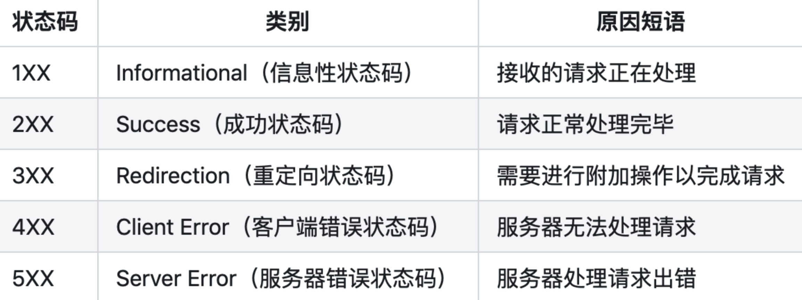
</p>

5. #### 301和302有什么区别

301: Moved Permanently 被请求的资源已永久移动到新位置，并且将来任何对此资源的引用都应该使用本响应返回的若干个URI之一。如果可能，拥有链接编辑功能的客户端应当自动把请求的地址修改为从服务器反馈回来的地址。除非额外指定，否则这个响应也是可缓存的。

302 Found 请求的资源现在临时从不同的URI响应请求。由于这样的重定向是临时的，客户端应当继续向原有地址发送以后的请求。只有在Cache-Control或Expires中进行了指定的情况下，这个响应才是可缓存的。

301是永久重定向，而302是临时重定向。

6. #### 504和500有什么区别

500的错误通常是由于服务器上代码出错或者是抛出了异常.

502即 Bad Gateway网关(这里的网关是指CGI,即通用网关接口)错误,通常是程序空指针错误。

504即Gateway timeout,即超时错误.

7. #### HTTPS和HTTP有什么区别

http协议和https协议的区别：传输信息安全性不同、连接方式不同、端口不同、证书专申请方式不同.

一、传输信息安全性不同

1. http协议：是超文本传输协议，信息是明文传输。如果攻击者截取了Web浏览器和网站服务器之间的传输报文，就可以直接读懂其中的信息。

2. https协议：是具有安全性的ssl加密传输协议，为浏览器和服务器之间的通信加密，确保数据传输的安

二,连接方式不同

1. http协议：http的连接很简单，是无状态的。
2. https协议：是由SSL＋HTTP协议构建的可进行加密传输、身份认证的网络协议。

三、端口不同

1. http协议：使用的端口是80。
2. https协议：使用的端口是443．

四、证书申请方式不同

1. http协议：免费申请。
2. https协议：需要到ca申请证书，一般免费证书很少，需要交费。

8. #### Quic有什么优点相比Http2

* `HTTP1` 有连接无法复用、队头阻塞、协议开销大和安全因素等多个缺陷.
* `HTTP2 `通过多路复用、二进制流、Header 压缩等等技术，极大地提高了性能，但是还是存在着问题的
* `Quic` 基于 UDP 实现，是 HTTP3 中的底层支撑协议，该协议基于 UDP，又取了 TCP 中的精华，实现了即快又可靠的协议.quic中加密认证的报文,(TCP 协议头部没有经过任何加密和认证，所以在传输过程中很容易被中间网络设备篡改，注入和窃听。比如修改序列号、滑动窗口。这些行为有可能是出于性能优化，也有可能是主动攻击。)这样只要对 QUIC 报文任何修改，接收端都能够及时发现，有效地降低了安全风险。

此外quic还有向前纠错的能力,QUIC 协议有一个非常独特的特性，称为向前纠错 (Forward Error Correction，FEC)，每个数据包除了它本身的内容之外，还包括了部分其他数据包的数据，因此少量的丢包可以通过其他包的冗余数据直接组装而无需重传。

向前纠错牺牲了每个数据包可以发送数据的上限，但是减少了因为丢包导致的数据重传，因为数据重传将会消耗更多的时间(包括确认数据包丢失、请求重传、等待新数据包等步骤的时间消耗),

假如说这次我要发送三个包，那么协议会算出这三个包的异或值并单独发出一个校验包，也就是总共发出了四个包。当出现其中的非校验包丢包的情况时，可以通过另外三个包计算出丢失的数据包的内容。
当然这种技术只能使用在丢失一个包的情况下，如果出现丢失多个包就不能使用纠错机制了，只能使用重传的方式了。

Quic 相比现在广泛应用的 http2+tcp+tls 协议有如下优势:

减少了 TCP 三次握手及 TLS 握手时间。改进的拥塞控制。避免队头阻塞的多路复用。连接迁移。前向冗余纠错.

9. #### Grpc的优缺点

gRPC是Google公司基于Protobuf开发的跨语言的开源RPC框架。gRPC基于HTTP/2协议设计，可以基于一个HTTP/2链接提供多个服务，对于移动设备更加友好。

<p align="center">
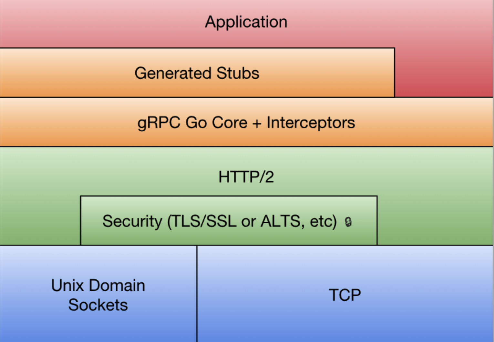
</p>

最底层为TCP或Unix Socket协议，在此之上是HTTP/2协议的实现，然后在HTTP/2协议之上又构建了针对Go语言的gRPC核心库。应用程序通过gRPC插件生产的Stub代码和gRPC核心库通信，也可以直接和gRPC核心库通信。

Grpc优缺点：

优点：

* protobuf二进制消息，性能好/效率高（空间和时间效率都很不错）
* proto文件生成目标代码，简单易用
* 序列化反序列化直接对应程序中的数据类，不需要解析后在进行映射(XML,JSON都是这种方式)
* 支持向前兼容（新加字段采用默认值）和向后兼容（忽略新加字段），简化升级
* 支持多种语言（可以把proto文件看做IDL文件）

缺点：

* GRPC尚未提供连接池，需要自行实现
* 尚未提供“服务发现”、“负载均衡”机制
* 因为基于HTTP2，绝大部多数`HTTP Server、Nginx`都尚不支持，即Nginx不能将GRPC请求作为HTTP请求来负载均衡，而是作为普通的TCP请求。（nginx1.9版本已支持）
* Protobuf二进制可读性差（貌似提供了Text_Fromat功能）默认不具备动态特性（可以通过动态定义生成消息类型或者动态编译支持）


10. #### Get和Post区别

Get和Post的区别和不同:

1. Get是不安全的，因为在传输过程，数据被放在请求的URL中；Post的所有操作对用户来说都是不可见的。
2. Get传送的数据量较小，这主要是因为受URL长度限制；Post传送的数据量较大，一般被默认为不受限制。
3. Get限制Form表单的数据集的值必须为ASCII字符；而Post支持整个ISO10646字符集。
4. Get执行效率却比Post方法好。Get是form提交的默认方法。
5. GET产生一个TCP数据包；POST产生两个TCP数据包。（非必然，客户端可灵活决定）

11. #### Unicode和ASCII以及Utf8的区别

计算机内部，所有信息最终都是一个二进制值。每一个二进制位（bit）有0和1两种状态，因此八个二进制位就可以组合出256种状态，这被称为一个字节（byte）。

也就是说，一个字节一共可以用来表示256种不同的状态，每一个状态对应一个符号，就是256个符号，从00000000到11111111。

上个世纪60年代，美国制定了一套字符编码，对英语字符与二进制位之间的关系，做了统一规定。这被称为 ASCII 码，一直沿用至今。

ASCII 码一共规定了128个字符的编码，比如空格SPACE是32（二进制00100000），大写的字母A是65（二进制01000001）。

这128个符号（包括32个不能打印出来的控制符号），只占用了一个字节的后面7位，最前面的一位统一规定为0。

* Unicode 是字符集
如果有一种编码，将世界上所有的符号都纳入其中。每一个符号都给予一个独一无二的编码，那么乱码问题就会消失。这就是 Unicode，就像它的名字都表示的，这是一种所有符号的编码。
Unicode 当然是一个很大的集合，现在的规模可以容纳100多万个符号。

* UTF-8 是编码规则

Unicode 只是一个符号集，它只规定了符号的二进制代码，却没有规定这个二进制代码应该如何存储。

互联网的普及，强烈要求出现一种统一的编码方式。UTF-8 就是在互联网上使用最广的一种 Unicode 的实现方式。其他实现方式还包括 UTF-16（字符用两个字节或四个字节表示）和 UTF-32（字符用四个字节表示），不过在互联网上基本不用。
这里需要注意下，这里的关系是，UTF-8 是 Unicode 的实现方式之一。

12. #### Cookie与Session异同

Cookie 和 Session 都为了用来保存状态信息，都是保存客户端状态的机制，它们都是为了解决HTTP无状态的问题而所做的努力。

* Cookie机制

简单地说，Cookie 就是浏览器储存在用户电脑上的一小段文本文件。Cookie 是纯文本格式，不包含任何可执行的代码。
一个 Web 页面或服务器告知浏览器按照一定规范来储存这些信息，并在随后的请求中将这些信息发送至服务器，Web 服务器就可以使用这些信息来识别不同的用户。
大多数需要登录的网站在用户验证成功之后都会设置一个 Cookie，只要这个 Cookie 存在并可以，用户就可以自由浏览这个网站的任意页面。

Cookie 会被浏览器自动删除，通常存在以下几种原因：

1. 会话 Cooke (Session Cookie) 在会话结束时（浏览器关闭）会被删除
2. 持久化 Cookie（Persistent Cookie）在到达失效日期时会被删除
3. 如果浏览器中的 Cookie 数量达到限制，那么 Cookie 会被删除以为新建的 Cookie 创建空间。

大多数浏览器支持最大为 4096 字节的 Cookie。由于这限制了 Cookie 的大小，最好用 Cookie 来存储少量数据，或者存储用户 ID 之类的标识符。

用户 ID 随后便可用于标识用户，以及从数据库或其他数据源中读取用户信息。 浏览器还限制站点可以在用户计算机上存储的 Cookie 的数量。

大多数浏览器只允许每个站点存储 20 个 Cookie；如果试图存储更多 Cookie，则最旧的 Cookie 便会被丢弃。

有些浏览器还会对它们将接受的来自所有站点的 Cookie 总数作出绝对限制，通常为 300 个。

使用 Cookie 的缺点：

1. 不良站点用 Cookie 收集用户隐私信息；

2. Cookie窃取：黑客以可以通过窃取用户的cookie来模拟用户的请求行为。（跨站脚本攻击XSS）

3. Session 机制

Session机制是一种服务器端的机制，服务器使用一种类似于散列表的结构（也可能就是使用散列表）来保存信息。当程序需要为某个客户端的请求创建一个session的时候，服务器首先检查这个客户端的请求里是否已包含了一个Session标识（Session id）.

如果已包含一个SessionID 则说明以前已经为此客户端创建过Session，服务器就按照SessionID把这个 Session检索出来使用（如果检索不到，可能会新建一个）。
如果客户端请求不包含SessionID，则为此客户端创建一个Session并且生成一个与此Session相关联的SessionID，SessionID的值应该是一个既不会重复，又不容易被找到规律以仿造的字符串，这个SessionID将被在本次响应中返回给客户端保存。

具体实现方式：

* Cookie方式

服务器给每个Session分配一个唯一的JSESSIONID，并通过Cookie发送给客户端。

当客户端发起新的请求的时候，将在Cookie头中携带这个JSESSIONID，这样服务器能够找到这个客户端对应的Session。

* URL回写

服务器在发送给浏览器页面的所有链接中都携带JSESSIONID的参数，这样客户端点击任何一个链接都会把JSESSIONID带回服务器。如果直接在浏览器输入服务端资源的url来请求该资源，那么Session是匹配不到的。

Web 缓存:

WEB缓存(cache)位于Web服务器和客户端之间，缓存机制会根据请求保存输出内容的副本，例如html页面，图片，文件，当下一个请求来到的时候：如果是相同的URL，缓存直接使用副本响应访问请求，而不是向源服务器再次发送请求。

主要分三种情况:

1. 未找到缓存(黑色线)：当没有找到缓存时，说明本地并没有这些数据，这种情况一般发生在我们首次访问网站，或者以前访问过，但是清除过缓存后。

浏览器就会先访问服务器，然后把服务器上的内容取回来，内容取回来以后，就要根据情况来决定是否要保留到缓存中了。

2. 缓存未过期(蓝色线)：缓存未过期，指的是本地缓存没有过期，不需要访问服务器了，直接就可以拿本地的缓存作为响应在本地使用了。这样节省了不少网络成本，提高了用户体验过。

3. 缓存已过期(红色线)：当满足过期的条件时，会向服务器发送请求，发送的请求一般都会进行一个验证，目的是虽然缓存文档过期了，但是文档内容不一定会有什么改变，所以服务器返回的也许是一个新的文档，这时候的HTTP状态码是200，或者返回的只是一个最新的时间戳和304状态码。

缓存过期后，有两种方法来判定服务端的文件有没有更新。

第一种在上一次服务端告诉客户端约定的有效期的同时，告诉客户端该文件最后修改的时间，当再次试图从服务端下载该文件的时候，check下该文件有没有更新（对比最后修改时间），如果没有，则读取缓存.

第二种方式是在上一次服务端告诉客户端约定有效期的同时，同时告诉客户端该文件的版本号，当服务端文件更新的时候，改变版本号，再次发送请求的时候check一下版本号是否一致就行了，如一致，则可直接读取缓存。

浏览器是依靠请求和响应中的的头信息来控制缓存的，如下：

* Expires与Cache-Control：服务端用来约定和客户端的有效时间的。

Expires规定了缓存失效时间（Date为当前时间），而`Cache-Control`的max-age规定了缓存有效时间（2552s）。

Expires是HTTP1.0的东西，而`Cache-Control`是HTTP1.1的，规定如果`max-age`和Expires同时存在，前者优先级高于后者。

* Last-Modified/If-Modified-Since缓存过期后，check服务端文件是否更新的第一种方式。

* ETag/If-None-Match：缓存过期时check服务端文件是否更新的第二种方式。

实际上ETag并不是文件的版本号，而是一串可以代表该文件唯一的字符串，当客户端发现和服务器约定的直接读取缓存的时间过了，就在请求中发送If-None-Match选项，值即为上次请求后响应头的ETag值.
该值在服务端和服务端代表该文件唯一的字符串对比（如果服务端该文件改变了，该值就会变），如果相同，则相应HTTP304，客户端直接读取缓存，如果不相同，HTTP200，下载正确的数据，更新ETag值。

当然并不是所有请求都能被缓存。无法被浏览器缓存的请求：

1. HTTP信息头中包含`Cache-Control:no-cache，pragma:no-cache（HTTP1.0）`，或`Cache-Control:max-age=0`等告诉浏览器不用缓存的请求
2. 需要根据Cookie，认证信息等决定输入内容的动态请求是不能被缓存的
3. POST请求无法被缓存

浏览器缓存过程还和用户行为有关。譬如先打开一个主页有个jquery的请求（假设访问后会缓存下来）。

接着如果直接在地址栏输入 jquery 地址，然后回车，响应HTTP200（from cache），因为有效期还没过直接读取的缓存；如果`ctrl+r`进行刷新，则会相应HTTP304（Not Modified），虽然还是读取的本地缓存，但是多了一次服务端的请求；而如果是ctrl+shift+r强刷，则会直接从服务器下载新的文件，响应HTTP200。

13. #### Client如何实现长连接

TCP协议的`KeepAlive`机制与`HeartBeat`心跳包

* HeartBeat心跳包

很多应用层协议都有HeartBeat机制，通常是客户端每隔一小段时间向服务器发送一个数据包，通知服务器自己仍然在线，并传输一些可能必要的数据。使用心跳包的典型协议是IM，比如QQ/MSN/飞信等协议。

心跳包之所以叫心跳包是因为：它像心跳一样每隔固定时间发一次，以此来告诉服务器，这个客户端还活着。事实上这是为了保持长连接，至于这个包的内容，是没有什么特别规定的，不过一般都是很小的包，或者只包含包头的一个空包。

在TCP的机制里面，本身是存在有心跳包的机制的，也就是TCP的选项：SO_KEEPALIVE。系统默认是设置的2小时的心跳频率。但是它检查不到机器断电、网线拔出、防火墙这些断线。而且逻辑层处理断线可能也不是那么好处理。一般，如果只是用于保活还是可以的。

心跳包一般来说都是在逻辑层发送空的echo包来实现的。下一个定时器，在一定时间间隔下发送一个空包给客户端，然后客户端反馈一个同样的空包回来，服务器如果在一定时间内收不到客户端发送过来的反馈包，那就只有认定说掉线了。

其实，要判定掉线，只需要send或者recv一下，如果结果为零，则为掉线。但是，在长连接下，有可能很长一段时间都没有数据往来。

理论上说，这个连接是一直保持连接的，但是实际情况中，如果中间节点出现什么故障是难以知道的。更要命的是，有的节点（防火墙）会自动把一定时间之内没有数据交互的连接给断掉。在这个时候，就需要我们的心跳包了，用于维持长连接，保活。

在获知了断线之后，服务器逻辑可能需要做一些事情，比如断线后的数据清理呀，重新连接呀……当然，这个自然是要由逻辑层根据需求去做了。

总的来说，心跳包主要也就是用于长连接的保活和断线处理。一般的应用下，判定时间在30-40秒比较不错。如果实在要求高，那就在6-9秒。

* TCP协议的`KeepAlive`机制

TCP的IP传输层的两个主要协议是UDP和TCP，其中UDP是无连接的、面向packet的，而TCP协议是有连接、面向流的协议。

TCP的`KeepAlive`机制，首先它貌似默认是不打开的，要用`setsockopt`将`SOL_SOCKET.SO_KEEPALIVE`设置为1才是打开，并且可以设置三个参数`tcp_keepalive_time/tcp_keepalive_probes/tcp_keepalive_intvl`，分别表示连接闲置多久开始发`keepalive`的ack包、发几个ack包不回复才当对方死了、两个ack包之间间隔多.

在测试的时候用`Ubuntu Server 10.04`下面默认值是7200秒（2个小时，要不要这么蛋疼啊！）、9次、75秒。

于是连接就了有一个超时时间窗口，如果连接之间没有通信，这个时间窗口会逐渐减小，当它减小到零的时候，TCP协议会向对方发一个带有ACK标志的空数据包（KeepAlive探针），对方在收到ACK包以后，如果连接一切正常，应该回复一个ACK；如果连接出现错误了（例如对方重启了，连接状态丢失），则应当回复一个RST；如果对方没有回复，服务器每隔intvl的时间再发ACK，如果连续probes个包都被无视了，说明连接被断开了。

在http早期，每个http请求都要求打开一个tpc socket连接，并且使用一次之后就断开这个tcp连接。

使用`keep-alive`可以改善这种状态，即在一次TCP连接中可以持续发送多份数据而不会断开连接。通过使用`keep-alive`机制，可以减少tcp连接建立次数，也意味着可以减少`TIME_WAIT`状态连接，以此提高性能和提高httpd服务器的吞吐率(更少的tcp连接意味着更少的系统内核调用,socket的`accept()`和`close()`调用)。

但是，`keep-alive`并不是免费的午餐,长时间的tcp连接容易导致系统资源无效占用。配置不当的`keep-alive`，有时比重复利用连接带来的损失还更大。所以，正确地设置`keep-alive timeout`时间非常重要。

使用`http keep-alvie`，可以减少服务端`TIME_WAIT`数量(因为由服务端httpd守护进程主动关闭连接)。道理很简单，相较而言，启用`keep-alive`，建立的tcp连接更少了，自然要被关闭的tcp连接也相应更少了。

使用启用`keepalive`的不同。另外，`http keepalive`是客户端浏览器与服务端httpd守护进程协作的结果，所以，我们另外安排篇幅介绍不同浏览器的各种情况对`keep-alive`的利用。

<p align="center">
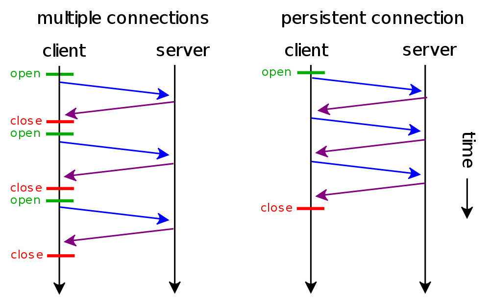
</p>

14. #### Http1和Http2和Grpc之间的区别是什么

在互联网流量传输只使用了几个网络协议。使用 `IPv4` 进行路由，使用 `TCP` 进行连接层面的流量控制，使用 `SSL/TLS` 协议实现传输安全，使用 `DNS` 进行域名解析，使用 `HTTP` 进行应用数据的传输。

但是使用Http进行应用数据的传输,却是在不断的改变,那么Http1和Http2和Grpc之间的区别是什么,我们下面分析下.

通常影响一个 HTTP 网络请求的因素主要有两个：带宽和延迟。

* 带宽

如果说我们还停留在拨号上网的阶段，带宽可能会成为一个比较严重影响请求的问题，但是现在网络基础建设已经使得带宽得到极大的提升，我们不再会担心由带宽而影响网速，那么就只剩下延迟了。

* 延迟
  
浏览器阻塞（HOL blocking）：浏览器会因为一些原因阻塞请求。浏览器对于同一个域名，同时只能有 4 个连接（这个根据浏览器内核不同可能会有所差异），超过浏览器最大连接数限制，后续请求就会被阻塞。

DNS 查询（DNS Lookup）：浏览器需要知道目标服务器的 IP 才能建立连接。将域名解析为 IP 的这个系统就是 DNS。这个通常可以利用DNS缓存结果来达到减少这个时间的目的。

建立连接（Initial connection）：HTTP 是基于 TCP 协议的，浏览器最快也要在第三次握手时才能捎带 HTTP 请求报文，达到真正的建立连接，但是这些连接无法复用会导致每次请求都经历三次握手和慢启动。三次握手在高延迟的场景下影响较明显，慢启动则对文件类大请求影响较大。

然而,HTTP2并不是对HTTP1协议的重写，相对于HTTP1，HTTP2 的侧重点主要在性能。其中请求方法，状态码和语义和HTTP1都是相同的，可以使用与 HTTP1相同的 API（可能有一些小的添加）来表示协议。

HTTP2主要有两个规范组成:

* `Hypertext Transfer Protocol version 2` (超文本传输协议版本 2)
* `HPACK - HTTP2` 的头压缩 （HPACK 是一种头部压缩算法）

HTTP2和HTTP1相比的新特性包括:

* 新的二进制格式（Binary Format）

HTTP1.x的解析是基于文本。基于文本协议的格式解析存在天然缺陷，文本的表现形式有多样性，要做到健壮性考虑的场景必然很多，二进制则不同，只认0和1的组合。基于这种考虑HTTP2.0的协议解析决定采用二进制格式，实现方便且健壮。

* 多路复用（MultiPlexing）

连接共享，即每一个request都是是用作连接共享机制的。一个request对应一个id，这样一个连接上可以有多个request，每个连接的request可以随机的混杂在一起，接收方可以根据request的 id将request再归属到各自不同的服务端请求里面。

* Header压缩

Header压缩，如上文中所言，对前面提到过HTTP1.x的header带有大量信息，而且每次都要重复发送，HTTP2.0使用encoder来减少需要传输的header大小，通讯双方各自cache一份header fields表，既避免了重复header的传输，又减小了需要传输的大小。

* 服务端推送（server push）

服务端推送（server push），同SPDY一样，HTTP2.0也具有server push功能。

Grpc的设计目标是在任何环境下运行，支持可插拔的负载均衡，跟踪，运行状况检查和身份验证。它不仅支持数据中心内部和跨数据中心的服务调用，它也适用于分布式计算的最后一公里，将设备，移动应用程序和浏览器连接到后端服务，同时，它也是高性能的，而 HTTP2 恰好支持这些。

而Grpc是基于http2的.

* HTTP2天然的通用性满足各种设备，场景.
* HTTP2的性能相对来说也是很好的，除非你需要极致的性能.
* HTTP2的安全性非常好，天然支持 SSL.
* HTTP2的鉴权也非常成熟.
* Grpc基于 HTTP2 多语言实现也更容易.

15. #### Tcp中的拆包和粘包是怎么回事

拆包和粘包是在socket编程中经常出现的情况，在socket通讯过程中，如果通讯的一端一次性连续发送多条数据包，tcp协议会将多个数据包打包成一个tcp报文发送出去，这就是所谓的粘包。

而如果通讯的一端发送的数据包超过一次tcp报文所能传输的最大值时，就会将一个数据包拆成多个最大tcp长度的tcp报文分开传输，这就叫做拆包。

MTU:

泛指通讯协议中的最大传输单元。一般用来说明TCP/IP四层协议中数据链路层的最大传输单元，不同类型的网络MTU也会不同，我们普遍使用的以太网的MTU是1500，即最大只能传输1500字节的数据帧。可以通过ifconfig命令查看电脑各个网卡的MTU。

MSS:

指TCP建立连接后双方约定的可传输的最大TCP报文长度，是TCP用来限制应用层可发送的最大字节数。如果底层的MTU是1500byte，则 MSS = 1500- 20(IP Header) -20 (TCP Header) = 1460 byte。

16. #### TFO的原理是什么

TCP快速打开（TCP Fast Open，TFO）是对TCP的一种简化握手手续的拓展，用于提高两端点间连接的打开速度。
简而言之，就是在TCP的三次握手过程中传输实际有用的数据。这个扩展最初在Linux系统实现，Linux服务器，Linux系统上的Chrome浏览器，或运行在Linux上的其他支持的软件。
它通过握手开始时的SYN包中的TFO cookie来验证一个之前连接过的客户端。如果验证成功，它可以在三次握手最终的ACK包收到之前就开始发送数据，这样便跳过了一个绕路的行为，更在传输开始时就降低了延迟。
这个加密的Cookie被存储在客户端，在一开始的连接时被设定好。然后每当客户端连接时，这个Cookie被重复返回。

请求Tcp Fast Open Cookie
* 客户端发送SYN数据包，该数据包包含Fast Open选项，且该选项的Cookie为空，这表明客户端请求Fast Open Cookie；
* 支持TCP Fast Open的服务器生成Cookie，并将其置于SYN-ACK数据包中的Fast Open选项以发回客户端；
* 客户端收到SYN-ACK后，缓存Fast Open选项中的Cookie。

17. #### TIME_WAIT的作用

主动关闭的Socket端会进入TIME_WAIT状态，并且持续2MSL时间长度，MSL就是maximum segment lifetime(最大分节生命期），这是一个IP数据包能在互联网上生存的最长时间，超过这个时间将在网络中消失。MSL在RFC 1122上建议是2分钟，而源自berkeley的TCP实现传统上使用30秒，因而，TIME_WAIT状态一般维持在1-4分钟。

* 可靠地实现TCP全双工连接的终止

在进行关闭连接四路握手协议时，最后的ACK是由主动关闭端发出的，如果这个最终的ACK丢失，服务器将重发最终的FIN，因此客户端必须维护状态信息允 许它重发最终的ACK。

如果不维持这个状态信息，那么客户端将响应RST分节，服务器将此分节解释成一个错误（在java中会抛出connection reset的SocketException)。

因而，要实现TCP全双工连接的正常终止，必须处理终止序列四个分节中任何一个分节的丢失情况，主动关闭 的客户端必须维持状态信息进入TIME_WAIT状态。

* 允许老的重复分节在网络中消逝

TCP分节可能由于路由器异常而“迷途”，在迷途期间，TCP发送端可能因确认超时而重发这个分节，迷途的分节在路由器修复后也会被送到最终目的地，这个 原来的迷途分节就称为lost duplicate。

在关闭一个TCP连接后，马上又重新建立起一个相同的IP地址和端口之间的TCP连接，后一个连接被称为前一个连接的化身 （incarnation)，那么有可能出现这种情况，前一个连接的迷途重复分组在前一个连接终止后出现，从而被误解成从属于新的化身。

为了避免这个情况，TCP不允许处于TIME_WAIT状态的连接启动一个新的化身，因为TIME_WAIT状态持续2MSL，就可以保证当成功建立一个TCP连接的时 候，来自连接先前化身的重复分组已经在网络中消逝。

18. #### 网络的性能指标有哪些

通常是以4个指标来衡量网络的性能，分别是带宽、延时、吞吐率、PPS（Packet Per Second），它们表示的意义如下：

* 带宽，表示链路的最大传输速率，单位是 `b/s` （比特 / 秒），带宽越大，其传输能力就越强。

* 延时，表示请求数据包发送后，收到对端响应，所需要的时间延迟。不同的场景有着不同的含义，比如可以表示建立 `TCP` 连接所需的时间延迟，或一个数据包往返所需的时间延迟。

* 吞吐率，表示单位时间内成功传输的数据量，单位是 `b/s`（比特 / 秒）或者 `B/s`（字节 / 秒），吞吐受带宽限制，带宽越大，吞吐率的上限才可能越高。

* `PPS`，全称是 `Packet Per Second`（包 / 秒），表示以网络包为单位的传输速率，一般用来评估系统对于网络的转发能力。

当然，除了以上这四种基本的指标，还有一些其他常用的性能指标，比如：

* 网络的可用性，表示网络能否正常通信；

* 并发连接数，表示 TCP 连接数量；

* 丢包率，表示所丢失数据包数量占所发送数据组的比率；

* 重传率，表示重传网络包的比例；

### Linux基础

1. #### 异步和非阻塞的区别

异步和非阻塞的区别:

* 异步：调用在发出之后，这个调用就直接返回，不管有无结果；异步是过程。
* 非阻塞：关注的是程序在等待调用结果（消息，返回值）时的状态，指在不能立刻得到结果之前，该调用不会阻塞当前线程。

同步和异步的区别：

* 同步：一个服务的完成需要依赖其他服务时，只有等待被依赖的服务完成后，才算完成，这是一种可靠的服务序列。要么成功都成功，失败都失败，服务的状态可以保持一致。
* 异步：一个服务的完成需要依赖其他服务时，只通知其他依赖服务开始执行，而不需要等待被依赖的服务完成，此时该服务就算完成了。被依赖的服务是否最终完成无法确定，一次它是一个不可靠的服务序列。

消息通知中的同步和异步：

* 同步：当一个同步调用发出后，调用者要一直等待返回消息（或者调用结果）通知后，才能进行后续的执行。
* 异步：当一个异步过程调用发出后，调用者不能立刻得到返回消息（结果）。在调用结束之后，通过消息回调来通知调用者是否调用成功。

阻塞与非阻塞的区别：

* 阻塞：阻塞调用是指调用结果返回之前，当前线程会被挂起，一直处于等待消息通知，不能够执行其他业务,函数只有在得到结果之后才会返回。
* 非阻塞：非阻塞和阻塞的概念相对应，指在不能立刻得到结果之前，该函数不会阻塞当前线程，而会立刻返回。

同步与异步是对应的，它们是线程之间的关系，两个线程之间要么是同步的，要么是异步的。

阻塞与非阻塞是对同一个线程来说的，在某个时刻，线程要么处于阻塞，要么处于非阻塞。

阻塞是使用同步机制的结果，非阻塞则是使用异步机制的结果。

2. #### 虚拟内存作用是什么

我们都知道一个进程是与其他进程共享CPU和内存资源的。正因如此，操作系统需要有一套完善的内存管理机制才能防止进程之间内存泄漏的问题.

为了更加有效地管理内存并减少出错，现代操作系统提供了一种对主存的抽象概念，即是虚拟内存（Virtual Memory）。虚拟内存为每个进程提供了一个一致的、私有的地址空间，它让每个进程产生了一种自己在独享主存的错觉（每个进程拥有一片连续完整的内存空间）。

虚拟内存的重要意义是它定义了一个连续的虚拟地址空间，使得程序的编写难度降低。并且，把内存扩展到硬盘空间只是使用虚拟内存的必然结果，虚拟内存空间会存在硬盘中，并且会被内存缓存（按需），有的操作系统还会在内存不够的情况下，将某一进程的内存全部放入硬盘空间中，并在切换到该进程时再从硬盘读取.

虚拟内存主要提供了如下三个重要的能力：

* 它把主存看作为一个存储在硬盘上的虚拟地址空间的高速缓存，并且只在主存中缓存活动区域（按需缓存）。

* 它为每个进程提供了一个一致的地址空间，从而降低了程序员对内存管理的复杂性。

* 它还保护了每个进程的地址空间不会被其他进程破坏。

3. #### Linux查看端口占用和cpu负载

linux ps命令，查看某进程cpu和内存占用率情况:
```bash
> ps aux
USER               PID  %CPU %MEM      VSZ    RSS   TT  STAT STARTED      TIME COMMAND
admin            72824  17.3  1.4  5518204 118212   ??  R    27 519   54:49.93 /Applications/iTerm.app/Contents/MacOS/iTerm2
_windowserver      179  16.1  0.6  7525352  46552   ??  Rs   21 519  457:09.25 /System/Library/PrivateFrameworks/SkyLight.fra
admin              734  12.2  3.3  6095348 273108   ??  R    21 519  635:17.25 /Users/admin/Desktop/Google Chrome.app/Content
admin            10718   9.0  2.7  5604388 223604   ??  S    22 519  557:56.89 /Users/admin/Desktop/Google Chrome.app/Content
admin              750   6.4  0.6  4633300  52372   ??  S    21 519  147:59.59 /Users/admin/Desktop/Google Chrome.app/Content
admin              749   5.6  1.2  5570904  96832   ??  S    21 519  359:56.37 /Users/admin/Desktop/Google Chrome.app/Content
admin              818   4.5  0.1  6557980   5508   ??  S    21 519  557:27.52 com.docker.hyperkit -A -u -F vms/0/hyperkit.pi
admin            32898   3.5  1.4  4977204 117684   ??  S    10:54上午   0:02.27 /Users/admin/Desktop/Google Chrome.app/Content
admin            30591   2.2  3.7  9505844 310584   ??  S     9:47上午  10:49.28 /Applications/GoLand.app/Contents/MacOS/goland
root              1300   1.9  0.1  4334916   6212   ??  Ss   21 519  123:53.86 /usr/libexec/taskgated
admin            31232   1.2  1.1 10553808  88860   ??  S    10:24上午   3:28.67 /Applications/WebStorm.app/Contents/MacOS/webs
admin            18704   0.7  0.2 19282032  12948   ??  S     3:56下午   4:18.12 /private/var/folders/kp/3yqnp9cj4f3_9539b06q4
```
* linux 下的ps命令
* USER 进程运行用户
* PID 进程编号
* %CPU 进程的cpu占用率
* %MEM 进程的内存占用率
* VSZ 进程所使用的虚存的大小
* RSS 进程
