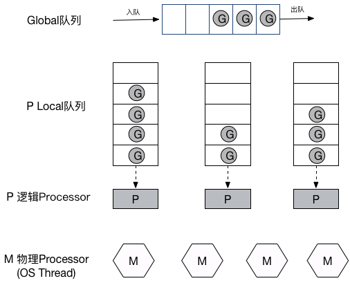
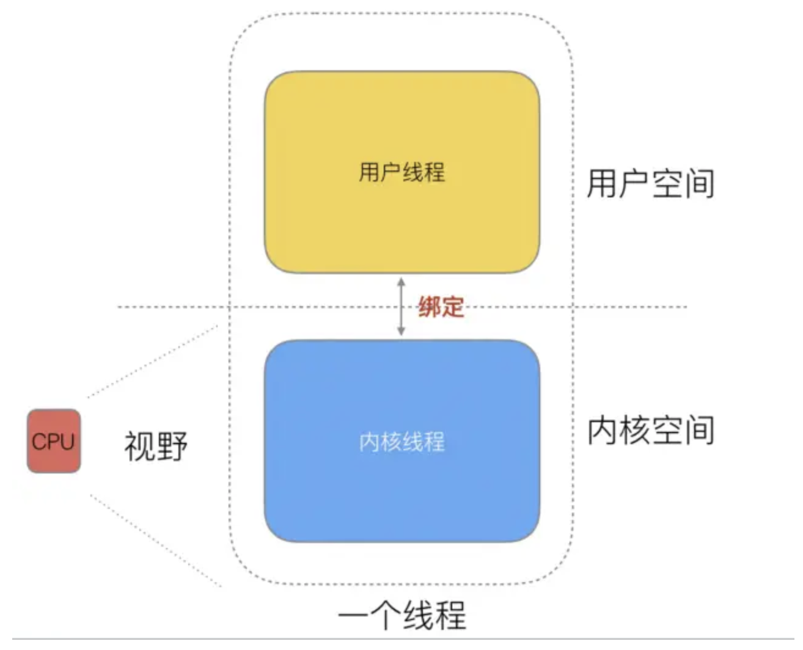
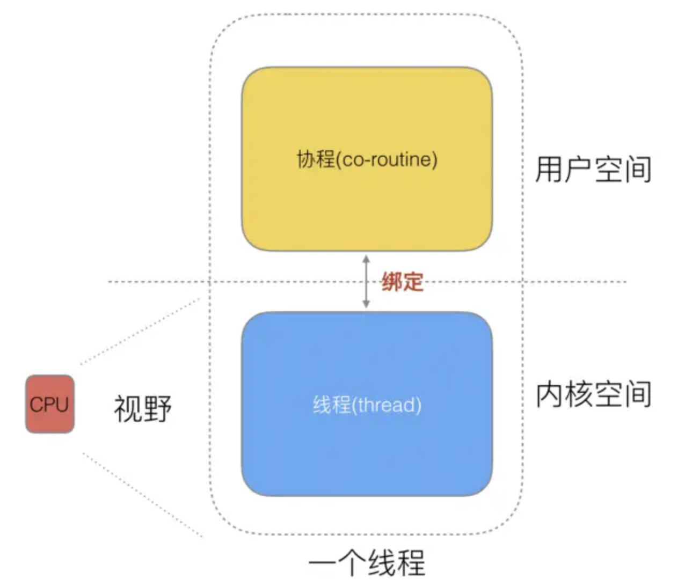
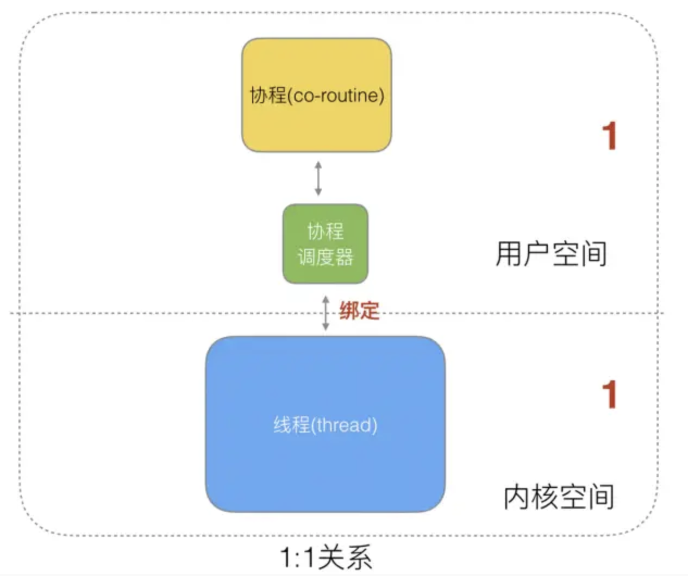

#### Golang runtime的调度

Golang作为一个为并发而产生的语言, 从Golang产生的那一刻就注定它具有高并发的特性，而 Go 语言中的并发（并行）编程是经由 goroutine 实现的，goroutine 是 Golang 最重要的特性之一，具有使用成本低、消耗资源低、能效高等特点，官方宣称原生 goroutine 并发成千上万不成问题，于是它也成为 Gopher 们经常使用的特性。

Goroutine，Go 语言基于并发（并行）编程的核心。那么 Goroutine 是什么？

通常 goroutine 会被当做 coroutine（协程）的 golang 实现，从比较粗浅的层面来看，这种认知也算是合理.

但实际上，goroutine 并非传统意义上的协程，现在主流的线程模型分三种： 内核级线程模型、用户级线程模型和两级线程模型（也称混合型线程模型），传统的协程库属于用户级线程模型.

而 goroutine 和它的Go Scheduler在底层实现上其实是属于两级线程模型，

通常 goroutine 会被当做 coroutine（协程）的 golang 实现，从比较粗浅的层面来看，这种认知也算是合理.

但是，goroutine 并非传统意义上的协程，现在主流的线程模型分三种：

1. 内核级线程模型
2. 用户级线程模型和两级线程模型（也称混合型线程模型）
3. 传统的协程库属于用户级线程模型.

因此，有时候为了方便理解可以简单把 goroutine 类比成协程，但心里一定要有个清晰的认知 — goroutine 并不等同于协程。

#### 线程

计算机在是早期的单进程操作系统，这样就面临2个问题：

1. 单一的执行流程，计算机只能一个任务一个任务处理。

2. 进程阻塞所带来的CPU时间浪费。

随着技术的发展,后面的操作系统就具有了最早的并发能力：多进程并发，当一个进程阻塞的时候，切换到另外等待执行的进程，这样就能尽量把CPU利用起来，CPU就不浪费了.

在多进程/多线程的操作系统中，就是为了解决在单线程系统中的阻塞的问题，因为一个进程阻塞cpu可以立刻切换到其他进程中去执行，而且调度cpu的算法可以保证在运行的进程都可以被分配到cpu的运行时间片。这样从宏观来看，似乎多个进程是在同时被运行。

但新的问题就又出现了，进程拥有太多的资源，进程的创建、切换、销毁，都会占用很长的时间，CPU虽然利用起来了，但如果进程过多，CPU有很大的一部分都被用来进行进程调度了。

<p align="center">

</p>

但是要怎么才能提高CPU的利用率呢？ 对于Linux操作系统来讲，cpu对进程的态度和线程的态度是一样的。

很明显，CPU调度切换的是进程和线程。尽管线程看起来很美好，但实际上多线程开发设计会变得更加复杂，要考虑很多同步竞争等问题，如锁、竞争冲突等。

随着时间发展,工程师们就发现，其实一个线程分为“内核态“线程和”用户态“线程。 即一个“用户态线程”必须要绑定一个“内核态线程”，但是CPU并不知道有“用户态线程”的存在，它只知道它运行的是一个“内核态线程”(系统的PCB进程控制块)。

<p align="center">

</p>

这样，我们分类一下，内核线程依然叫“线程(thread)”，用户线程就叫“协程(co-routine)".

线程的实现模型主要有 3 种：内核级线程模型、用户级线程模型和两级线程模型（也称混合型线程模型），它们之间最大的差异就在于用户线程与内核调度实体（KSE，Kernel Scheduling Entity）之间的对应关系上。而所谓的内核调度实体 KSE 就是指可以被操作系统内核调度器调度的对象实体。

简单来说 KSE 就是内核级线程，是操作系统内核的最小调度单元，也就是我们写代码的时候通俗理解上的线程了。

#### 用户级线程模型

用户线程与内核线程 KSE 是多对一（N : 1）的映射模型，多个用户线程的一般从属于单个进程并且多线程的调度是由用户自己的线程库来完成，线程的创建、销毁以及多线程之间的协调等操作都是由用户自己的线程库来负责而无须借助系统调用来实现。一个进程中所有创建的线程都只和同一个 KSE 在运行时动态绑定，也就是说，操作系统只知道用户进程而对其中的线程是无感知的，内核的所有调度都是基于用户进程。许多语言实现的 协程库 基本上都属于这种方式（比如 python 的 gevent）。

由于线程调度是在用户层面完成的，也就是相较于内核调度不需要让 CPU 在用户态和内核态之间切换，这种实现方式相比内核级线程可以做的很轻量级，对系统资源的消耗会小很多，因此可以创建的线程数量与上下文切换所花费的代价也会小得多。但该模型有个原罪：并不能做到真正意义上的并发，假设在某个用户进程上的某个用户线程因为一个阻塞调用（比如 I/O 阻塞）而被 CPU 给中断（抢占式调度）了，那么该进程内的所有线程都被阻塞（因为单个用户进程内的线程自调度是没有 CPU 时钟中断的，从而没有轮转调度），整个进程被挂起。即便是多 CPU 的机器，也无济于事，因为在用户级线程模型下，一个 CPU 关联运行的是整个用户进程，进程内的子线程绑定到 CPU 执行是由用户进程调度的，内部线程对 CPU 是不可见的，此时可以理解为 CPU 的调度单位是用户进程。

所以很多的协程库会把自己一些阻塞的操作重新封装为完全的非阻塞形式，然后在以前要阻塞的点上，主动让出自己，并通过某种方式通知或唤醒其他待执行的用户线程在该 KSE 上运行，从而避免了内核调度器由于 KSE 阻塞而做上下文切换，这样整个进程也不会被阻塞了。

<p align="center">

</p>

* 特点:

 N个协程绑定1个线程，优点就是协程在用户态线程即完成切换，不会陷入到内核态，这种切换非常的轻量快速。但也有很大的缺点，1个进程的所有协程都绑定在1个线程上.
 
 * 缺点
 
1. 某个程序用不了硬件的多核加速能力.

2. 一旦某协程阻塞，造成线程阻塞，本进程的其他协程都无法执行了，无并发能力.
 
#### 内核级线程模型

用户线程与内核线程 KSE 是一对一（1 : 1）的映射模型，也就是每一个用户线程绑定一个实际的内核线程，而线程的调度则完全交付给操作系统内核去做，应用程序对线程的创建、终止以及同步都基于内核提供的系统调用来完成，大部分编程语言的线程库(比如 Java 的 java.lang.Thread、C++11 的 `std::thread` 等等)都是对操作系统的线程（内核级线程）的一层封装，创建出来的每个线程与一个独立的 KSE 静态绑定，因此其调度完全由操作系统内核调度器去做，也就是说，一个进程里创建出来的多个线程每一个都绑定一个 KSE。这种模型的优势和劣势同样明显：优势是实现简单，直接借助操作系统内核的线程以及调度器，所以 CPU 可以快速切换调度线程，于是多个线程可以同时运行，因此相较于用户级线程模型它真正做到了并行处理；但它的劣势是，由于直接借助了操作系统内核来创建、销毁和以及多个线程之间的上下文切换和调度，因此资源成本大幅上涨，且对性能影响很大。

<p align="center">

</p>

* 特点: 

1个协程绑定1个线程，这种最容易实现。协程的调度都由CPU完成了，不存在N:1缺点。

* 缺点

协程的创建、删除和切换的代价都由CPU完成，有点略显昂贵了。

#### 两级线程模型

两级线程模型是博采众长之后的产物，充分吸收前两种线程模型的优点且尽量规避它们的缺点。在此模型下，用户线程与内核 KSE 是多对多（N : M）的映射模型：首先，区别于用户级线程模型，两级线程模型中的一个进程可以与多个内核线程 KSE 关联，也就是说一个进程内的多个线程可以分别绑定一个自己的 KSE，这点和内核级线程模型相似；其次，又区别于内核级线程模型，它的进程里的线程并不与 KSE 唯一绑定，而是可以多个用户线程映射到同一个 KSE，当某个 KSE 因为其绑定的线程的阻塞操作被内核调度出 CPU 时，其关联的进程中其余用户线程可以重新与其他 KSE 绑定运行。

所以，两级线程模型既不是用户级线程模型那种完全靠自己调度的也不是内核级线程模型完全靠操作系统调度的，而是中间态（自身调度与系统调度协同工作），因为这种模型的高度复杂性，操作系统内核开发者一般不会使用，所以更多时候是作为第三方库的形式出现，而 Go 语言中的 runtime 调度器就是采用的这种实现方案，实现了 Goroutine 与 KSE 之间的动态关联，不过 Go 语言的实现更加高级和优雅；该模型为何被称为两级？即用户调度器实现用户线程到 KSE 的『调度』，内核调度器实现 KSE 到 CPU 上的`调度`。

<p align="center">

</p>

* 特点

G只能运行在M中，一个M必须持有一个P，M与P是1：1的关系。M会从P的本地队列弹出一个可执行状态的G来执行，如果P的本地队列为空，就会向其他的MP组合偷取一个可执行的G来执行, 即M个协程绑定1个线程，是N:1和1:1类型的结合，克服了以上2种模型的缺点，但实现起来最为复杂。
 
协程跟线程是有区别的，线程由CPU调度是抢占式的，协程由用户态调度是协作式的，一个协程让出CPU后，才执行下一个协程。

#### Go的协程Goroutine

Go为了提供更容易使用的并发方法，使用了goroutine和channel。goroutine来自协程的概念，让一组可复用的函数运行在一组线程之上，即使有协程阻塞，该线程的其他协程也可以被runtime调度，转移到其他可运行的线程上。最关键的是，开发人员是看不到这些底层的细节，这就降低了编程的难度，提供了更容易的并发。

Go中，协程被称为goroutine，它非常轻量，一个goroutine只占几KB，并且这几KB就足够goroutine运行完，这就能在有限的内存空间内支持大量goroutine，支持了更多的并发。虽然一个goroutine的栈只占几KB，但实际是可伸缩的，如果需要更多内容，runtime会自动为goroutine分配。

Goroutine特点:

* 占用内存更小(几Kb).

* 调度更灵活(runtime调度).

#### GPM模型

在Go中，线程是运行goroutine的实体，调度器的功能是把可运行的goroutine分配到工作线程上。

<p align="center">

</p>

每一个 OS 线程都有一个固定大小的内存块(一般会是 2MB)来做栈，这个栈会用来存储当前正在被调用或挂起(指在调用其它函数时)的函数的内部变量。这个固定大小的栈同时很大又很小。因为 2MB 的栈对于一个小小的 goroutine 来说是很大的内存浪费，而对于一些复杂的任务（如深度嵌套的递归）来说又显得太小。因此，Go 语言做了它自己的`线程`。

在 Go 语言中，每一个 goroutine 是一个独立的执行单元，相较于每个 OS 线程固定分配 2M 内存的模式，goroutine 的栈采取了动态扩容方式， 初始时仅为 2KB，随着任务执行按需增长，最大可达 1GB（64 位机器最大是 1G，32 位机器最大是 256M），且完全由 golang 自己的调度器 Go Scheduler 来调度。

此外，GC 还会周期性地将不再使用的内存回收，收缩栈空间。 因此，Go 程序可以同时并发成千上万个 goroutine 是得益于它强劲的调度器和高效的内存模型。Go 的创造者大概对 goroutine 的定位就是屠龙刀，因为他们不仅让 goroutine 作为 golang 并发编程的最核心组件（开发者的程序都是基于 goroutine 运行的）而且 golang 中的许多标准库的实现也到处能见到 goroutine 的身影，比如 net/http 这个包，甚至语言本身的组件 runtime 运行时和 GC 垃圾回收器都是运行在 goroutine 上的，作者对 goroutine 的厚望可见一斑。

任何用户线程最终肯定都是要交由 OS 线程来执行的，goroutine（称为 G）也不例外，但是 G 并不直接绑定 OS 线程运行，而是由 Goroutine Scheduler 中的 P - Logical Processor （逻辑处理器）来作为两者的传递者，P 可以看作是一个抽象的资源或者一个上下文，一个 P 绑定一个 OS 线程. 

在 golang 的实现里把 OS 线程抽象成一个数据结构：M，G 实际上是由 M 通过 P 来进行调度运行的，但是在 G 的层面来看，P 提供了 G 运行所需的一切资源和环境，因此在 G 看来 P 就是运行它的 “CPU”，由 G、P、M 这三种由 Go 抽象出来的实现，最终形成了 Go 调度器的基本结构：

* G: 表示 Goroutine，每个 Goroutine 对应一个 G 结构体，G 存储 Goroutine 的运行堆栈、状态以及任务函数，可重用。G 并非执行体，每个 G 需要绑定到 P 才能被调度执行。

* P: Processor，表示逻辑处理器， 对 G 来说，P 相当于 CPU 核，G 只有绑定到 P(在 P 的 local runq 中)才能被调度。对 M 来说，P 提供了相关的执行环境(Context)，如内存分配状态(mcache)，任务队列(G)等，P 的数量决定了系统内最大可并行的 G 的数量（前提：物理 CPU 核数 >= P 的数量），P 的数量由用户设置的 GOMAXPROCS 决定，但是不论 GOMAXPROCS 设置为多大，P 的数量最大为 256。

* M: Machine，OS 线程抽象，负责调度任务, 代表着真正执行计算的资源，在绑定有效的 P 后，进入 schedule 循环；而 schedule 循环的机制大致是从 Global 队列、P 的 Local 队列以及 wait 队列中获取 G，切换到 G 的执行栈上并执行 G 的函数，调用 goexit 做清理工作并回到 M，如此反复。M 并不保留 G 状态，这是 G 可以跨 M 调度的基础，M 的数量是不定的，由 Go Runtime 调整，为了防止创建过多 OS 线程导致系统调度不过来，目前默认最大限制为 10000 个。

在新的版本1.13.6中Go的GPM的模型的源码位于`src/runtime/runtime2.go`. 至于为什么M的的最大数量限制在10000,[在这里可以查看](https://github.com/golang/go/blob/master/src/runtime/proc.go#L540)


关于 P, 其实在 Go 1.0 发布的时候，它的调度器其实 G-M 模型，也就是没有 P 的，调度过程全由 G 和 M 完成，这个模型暴露出一些问题：

单一全局互斥锁(Sched.Lock)和集中状态存储的存在导致所有 goroutine 相关操作，比如：创建、重新调度等都要上锁；

* goroutine 传递问题：M 经常在 M 之间传递可运行的 goroutine，这导致调度延迟增大以及额外的性能损耗；

* 每个 M 做内存缓存，导致内存占用过高，数据局部性较差；

* 由于 syscall 调用而形成的剧烈的 `worker thread` 阻塞和解除阻塞，导致额外的性能损耗。

这些问题实在太严重了，导致 Go1.0 虽然号称原生支持并发，却在并发性能上一直饱受诟病，于是Dmitry Vyukov在[Scalable Go Scheduler Design Doc](https://docs.google.com/document/d/1TTj4T2JO42uD5ID9e89oa0sLKhJYD0Y_kqxDv3I3XMw/edit#heading=h.mmq8lm48qfcw)提出该模型在并发伸缩性方面的问题，并通过加入P(Processors)来改进该问题。

在重新设计和实现了 Go 调度器（在原有的 G-M 模型中引入了 P）并且实现了一个叫做 [work-stealing](https://en.wikipedia.org/wiki/Work_stealing) 的调度算法：

* 每个 P 维护一个 G 的本地队列；

* 当一个 G 被创建出来，或者变为可执行状态时，就把他放到 P 的可执行队列中；

* 当一个 G 在 M 里执行结束后，P 会从队列中把该 G 取出；如果此时 P 的队列为空，即没有其他 G 可以执行， M 就随机选择另外一个 P，从其可执行的 G 队列中取走一半。

该算法避免了在 goroutine 调度时使用全局锁。

#### GPM调度流程

Go 调度器工作时会维护两种用来保存 G 的任务队列：一种是一个 Global 任务队列，一种是每个 P 维护的 Local 任务队列。

当通过go关键字创建一个新的 goroutine 的时候，它会优先被放入 P 的本地队列。为了运行 goroutine，M 需要持有（绑定）一个 P，接着 M 会启动一个 OS 线程，循环从 P 的本地队列里取出一个 goroutine 并执行。

当然上面提到的 `work-stealing`调度算法：当 M 执行完了当前 P 的 Local 队列里的所有 G 后，P 也不会就这么在那干等着啥都不干，它会先尝试从 Global 队列寻找 G 来执行，如果 Global 队列为空，它会随机挑选另外一个 P，从它的队列里中拿走一半的 G 到自己的队列中执行。

```go

// go1.13.6 src/runtime/proc.go

// 省略了GC检查等其它细节，只保留了主要流程
// g:       G结构体定义
// sched:   Global队列
// 获取一个待执行的G
// 尝试从其他P中steal，从全局队列中获取g，轮询网络。
func findrunnable() (gp *g, inheritTime bool) {
   // 获取当前的G对象
	_g_ := getg()

	// The conditions here and in handoffp must agree: if
	// findrunnable would return a G to run, handoffp must start
	// an M.

top:
    // 获取当前P对象
	_p_ := _g_.m.p.ptr()
	if sched.gcwaiting != 0 {
		gcstopm()
		goto top
	}
	if _p_.runSafePointFn != 0 {
		runSafePointFn()
	}
	if fingwait && fingwake {
		if gp := wakefing(); gp != nil {
			ready(gp, 0, true)
		}
	}
	if *cgo_yield != nil {
		asmcgocall(*cgo_yield, nil)
	}

	// 1. 尝试从P的Local队列中取得G 优先_p_.runnext 然后再从Local队列中取
	if gp, inheritTime := runqget(_p_); gp != nil {
		return gp, inheritTime
	}

	// 2. 尝试从Global队列中取得G
	if sched.runqsize != 0 {
		lock(&sched.lock)
		// globrunqget从Global队列中获取G 并转移一批G到_p_的Local队列
		gp := globrunqget(_p_, 0)
		unlock(&sched.lock)
		if gp != nil {
			return gp, false
		}
	}

	// Poll network.
	// This netpoll is only an optimization before we resort to stealing.
	// We can safely skip it if there are no waiters or a thread is blocked
	// in netpoll already. If there is any kind of logical race with that
	// blocked thread (e.g. it has already returned from netpoll, but does
	// not set lastpoll yet), this thread will do blocking netpoll below
	// anyway.
	
	// 3. 检查netpoll任务
	if netpollinited() && atomic.Load(&netpollWaiters) > 0 && atomic.Load64(&sched.lastpoll) != 0 {
		if list := netpoll(false); !list.empty() { // non-blocking
			gp := list.pop()
			// netpoll返回的是G链表，将其它G放回Global队列
			injectglist(&list)
			casgstatus(gp, _Gwaiting, _Grunnable)
			if trace.enabled {
				traceGoUnpark(gp, 0)
			}
			return gp, false
		}
	}

	 // 4. 尝试从其它P窃取任务
	procs := uint32(gomaxprocs)
	if atomic.Load(&sched.npidle) == procs-1 {
		// Either GOMAXPROCS=1 or everybody, except for us, is idle already.
		// New work can appear from returning syscall/cgocall, network or timers.
		// Neither of that submits to local run queues, so no point in stealing.
		goto stop
	}
	// If number of spinning M's >= number of busy P's, block.
	// This is necessary to prevent excessive CPU consumption
	// when GOMAXPROCS>>1 but the program parallelism is low.
	if !_g_.m.spinning && 2*atomic.Load(&sched.nmspinning) >= procs-atomic.Load(&sched.npidle) {
		goto stop
	}
	if !_g_.m.spinning {
		_g_.m.spinning = true
		atomic.Xadd(&sched.nmspinning, 1)
	}
	for i := 0; i < 4; i++ {
	     // 随机P的遍历顺序
		for enum := stealOrder.start(fastrand()); !enum.done(); enum.next() {
			if sched.gcwaiting != 0 {
				goto top
			}
			stealRunNextG := i > 2 // first look for ready queues with more than 1 g
			// runqsteal执行实际的steal工作，从目标P的Local队列转移一般的G过来
            // stealRunNextG指是否steal目标P的p.runnext G
			if gp := runqsteal(_p_, allp[enum.position()], stealRunNextG); gp != nil {
				return gp, false
			}
		}
	}

stop:

	// 我们没事做如果我们处于GC标记阶段，可以安全地扫描和三色法标记对象为黑色并进行工作，请运行空闲时间标记，而不是放弃P
	// 当没有G可被执行时，M会与P解绑，然后进入休眠(idle)状态。
    
	if gcBlackenEnabled != 0 && _p_.gcBgMarkWorker != 0 && gcMarkWorkAvailable(_p_) {
		_p_.gcMarkWorkerMode = gcMarkWorkerIdleMode
		gp := _p_.gcBgMarkWorker.ptr()
		casgstatus(gp, _Gwaiting, _Grunnable)
		if trace.enabled {
			traceGoUnpark(gp, 0)
		}
		return gp, false
	}

	// wasm only:
	// If a callback returned and no other goroutine is awake,
	// then pause execution until a callback was triggered.
	if beforeIdle() {
		// At least one goroutine got woken.
		goto top
	}

	// Before we drop our P, make a snapshot of the allp slice,
	// which can change underfoot once we no longer block
	// safe-points. We don't need to snapshot the contents because
	// everything up to cap(allp) is immutable.
	allpSnapshot := allp

	// return P and block
	lock(&sched.lock)
	if sched.gcwaiting != 0 || _p_.runSafePointFn != 0 {
		unlock(&sched.lock)
		goto top
	}
	if sched.runqsize != 0 {
		gp := globrunqget(_p_, 0)
		unlock(&sched.lock)
		return gp, false
	}
	if releasep() != _p_ {
		throw("findrunnable: wrong p")
	}
	pidleput(_p_)
	unlock(&sched.lock)

	// Delicate dance: thread transitions from spinning to non-spinning state,
	// potentially concurrently with submission of new goroutines. We must
	// drop nmspinning first and then check all per-P queues again (with
	// #StoreLoad memory barrier in between). If we do it the other way around,
	// another thread can submit a goroutine after we've checked all run queues
	// but before we drop nmspinning; as the result nobody will unpark a thread
	// to run the goroutine.
	// If we discover new work below, we need to restore m.spinning as a signal
	// for resetspinning to unpark a new worker thread (because there can be more
	// than one starving goroutine). However, if after discovering new work
	// we also observe no idle Ps, it is OK to just park the current thread:
	// the system is fully loaded so no spinning threads are required.
	// Also see "Worker thread parking/unparking" comment at the top of the file.
	wasSpinning := _g_.m.spinning
	if _g_.m.spinning {
		_g_.m.spinning = false
		if int32(atomic.Xadd(&sched.nmspinning, -1)) < 0 {
			throw("findrunnable: negative nmspinning")
		}
	}

	// check all runqueues once again
	for _, _p_ := range allpSnapshot {
		if !runqempty(_p_) {
			lock(&sched.lock)
			_p_ = pidleget()
			unlock(&sched.lock)
			if _p_ != nil {
				acquirep(_p_)
				if wasSpinning {
					_g_.m.spinning = true
					atomic.Xadd(&sched.nmspinning, 1)
				}
				goto top
			}
			break
		}
	}

	// Check for idle-priority GC work again.
	if gcBlackenEnabled != 0 && gcMarkWorkAvailable(nil) {
		lock(&sched.lock)
		_p_ = pidleget()
		if _p_ != nil && _p_.gcBgMarkWorker == 0 {
			pidleput(_p_)
			_p_ = nil
		}
		unlock(&sched.lock)
		if _p_ != nil {
			acquirep(_p_)
			if wasSpinning {
				_g_.m.spinning = true
				atomic.Xadd(&sched.nmspinning, 1)
			}
			// Go back to idle GC check.
			goto stop
		}
	}

	// poll network
	if netpollinited() && atomic.Load(&netpollWaiters) > 0 && atomic.Xchg64(&sched.lastpoll, 0) != 0 {
		if _g_.m.p != 0 {
			throw("findrunnable: netpoll with p")
		}
		if _g_.m.spinning {
			throw("findrunnable: netpoll with spinning")
		}
		list := netpoll(true) // block until new work is available
		atomic.Store64(&sched.lastpoll, uint64(nanotime()))
		if !list.empty() {
			lock(&sched.lock)
			_p_ = pidleget()
			unlock(&sched.lock)
			if _p_ != nil {
				acquirep(_p_)
				gp := list.pop()
				injectglist(&list)
				casgstatus(gp, _Gwaiting, _Grunnable)
				if trace.enabled {
					traceGoUnpark(gp, 0)
				}
				return gp, false
			}
			injectglist(&list)
		}
	}
	stopm()
	goto top
}
```
#### GPM模型调度

如果一切正常，调度器会以上述的那种方式顺畅地运行，但总是有特殊的情况存在, 下面分析 goroutine 在两种例外情况下的行为。

Go runtime 会在下面的 goroutine 被阻塞的情况下运行另外一个 goroutine：


然而在通常情况下, Go runtime 会在下面的 goroutine 被阻塞的情况下运行另外一个 goroutine：
 
* blocking syscall (for example opening a file)
* network input
* channel operations
* primitives in the sync package

这里其实可以看做两个情况,即`用户态阻塞/唤醒` 和 `系统调用阻塞`.

* 用户态阻塞/唤醒

当 goroutine 因为 channel 操作或者 network I/O 而阻塞时（实际上 golang 已经用 netpoller 实现了 goroutine 网络 I/O 阻塞不会导致 M 被阻塞，仅阻塞 G），对应的 G 会被放置到某个 wait 队列(如 channel 的 waitq)，该 G 的状态由_Gruning变为_Gwaitting，而 M 会跳过该 G 尝试获取并执行下一个 G.如果此时没有 runnable 的 G 供 M 运行，那么 M 将解绑 P，并进入 sleep 状态.

当阻塞的 G 被另一端的 G2 唤醒时（比如 channel 的可读/写通知），G 被标记为 runnable，尝试加入 G2 所在 P 的 runnext，然后再是 P 的 Local 队列和 Global 队列。

* syscall 系统调用阻塞

当 G 被阻塞在某个系统调用上时，此时 G 会阻塞在_Gsyscall状态，M 也处于 block on syscall 状态，此时的 M 可被抢占调度：执行该 G 的 M 会与 P 解绑，而 P 则尝试与其它 idle 的 M 绑定，继续执行其它 G。如果没有其它 idle 的 M，但 P 的 Local 队列中仍然有 G 需要执行，则创建一个新的 M.

当系统调用完成后，G 会重新尝试获取一个 idle 的 P 进入它的 Local 队列恢复执行，如果没有 idle 的 P，G 会被标记为 runnable 加入到 Global 队列。

系统调用能被调度的关键有两点:

`runtime/syscall` 包中，将系统调用分为 `SysCall` 和 `RawSysCall`，`SysCall` 和 `RawSysCall`的区别是 `SysCall` 会在系统调用前后分别调用`entersyscall`和`exitsyscall`(位于`src/runtime/proc.go`)，做一些现场保存和恢复操作，这样才能使P安全地与M解绑，并在其它M上继续执行其它G。

某些系统调用本身可以确定会长时间阻塞(比如锁)，会调用 `entersyscallblock` 在发起系统调用前直接让P和M解绑。

这里的关键点是`sysmon`，它负责检查所有系统调用的执行时间，判断是否需要解绑。

sysmon是一个由runtime启动的M，也叫监控线程，它无需P也可以运行，它每20us~10ms唤醒一次，主要执行:

1. 释放闲置超过5分钟的span物理内存；
2. 如果超过2分钟没有垃圾回收，强制执行；
3. 将长时间未处理的netpoll结果添加到任务队列；
4. 向长时间运行的G任务发出抢占调度；
5. 收回因syscall长时间阻塞的P；

`sysmon` 它通过retake实现对syscall和长时间运行的G进行调度:

```go 
// src/runtime/proc.go:sysmon

type sysmontick struct {
	schedtick   uint32
	schedwhen   int64
	syscalltick uint32
	syscallwhen int64
}

// forcePreemptNS is the time slice given to a G before it is
// preempted.
const forcePreemptNS = 10 * 1000 * 1000 // 10ms

func retake(now int64) uint32 {
	n := 0
	// Prevent allp slice changes. This lock will be completely
	// uncontended unless we're already stopping the world.
	lock(&allpLock)
	// We can't use a range loop over allp because we may
	// temporarily drop the allpLock. Hence, we need to re-fetch
	// allp each time around the loop.
	for i := 0; i < len(allp); i++ {
		_p_ := allp[i]
		if _p_ == nil {
			// This can happen if procresize has grown
			// allp but not yet created new Ps.
			continue
		}
		pd := &_p_.sysmontick
		s := _p_.status
		sysretake := false
		if s == _Prunning || s == _Psyscall {
			// Preempt G if it's running for too long.
			t := int64(_p_.schedtick)
			if int64(pd.schedtick) != t {
				pd.schedtick = uint32(t)
				pd.schedwhen = now
			} else if pd.schedwhen+forcePreemptNS <= now {
			   // 如果当前G执行时间超过10ms，则抢占(preemptone)
			   // 执行抢占

				preemptone(_p_)
				// In case of syscall, preemptone() doesn't
				// work, because there is no M wired to P.
				sysretake = true
			}
		}
		if s == _Psyscall {
			// Retake P from syscall if it's there for more than 1 sysmon tick (at least 20us).
			t := int64(_p_.syscalltick)
			if !sysretake && int64(pd.syscalltick) != t {
				pd.syscalltick = uint32(t)
				pd.syscallwhen = now
				continue
			}
            // 如果当前P Local队列没有其它G，当前有其它P处于Idle状态，并且syscall执行事件不超过10ms，则不用解绑当前P(handoffp)
			if runqempty(_p_) && atomic.Load(&sched.nmspinning)+atomic.Load(&sched.npidle) > 0 && pd.syscallwhen+10*1000*1000 > now {
				continue
			}
			// Drop allpLock so we can take sched.lock.
			unlock(&allpLock)
			// Need to decrement number of idle locked M's
			// (pretending that one more is running) before the CAS.
			// Otherwise the M from which we retake can exit the syscall,
			// increment nmidle and report deadlock.
			
			incidlelocked(-1)
			if atomic.Cas(&_p_.status, s, _Pidle) {
				if trace.enabled {
					traceGoSysBlock(_p_)
					traceProcStop(_p_)
				}
				n++
				_p_.syscalltick++
				handoffp(_p_)
			}
			incidlelocked(1)
			lock(&allpLock)
		}
	}
	unlock(&allpLock)
	return uint32(n)
}

```

#### 抢占式调度

当某个goroutine执行超过10ms，`sysmon`会向其发起抢占调度请求，由于Go调度不像OS调度那样有时间片的概念，因此实际抢占机制要弱很多: Go中的抢占实际上是为G设置抢占标记(g.stackguard0)，当G调用某函数时(更确切说，在通过newstack分配函数栈时)，被编译器安插的指令会检查这个标记，并且将当前G以runtime.Goched的方式暂停，并加入到全局队列。

源代码如下:

```go 
// Called from runtime·morestack when more stack is needed.
// Allocate larger stack and relocate to new stack.
// Stack growth is multiplicative, for constant amortized cost.
//
// g->atomicstatus will be Grunning or Gscanrunning upon entry.
// If the GC is trying to stop this g then it will set preemptscan to true.
//
// ctxt is the value of the context register on morestack. newstack
// will write it to g.sched.ctxt.

func newstack() {
	thisg := getg()
	// TODO: double check all gp. shouldn't be getg().
	if thisg.m.morebuf.g.ptr().stackguard0 == stackFork {
		throw("stack growth after fork")
	}
	if thisg.m.morebuf.g.ptr() != thisg.m.curg {
		print("runtime: newstack called from g=", hex(thisg.m.morebuf.g), "\n"+"\tm=", thisg.m, " m->curg=", thisg.m.curg, " m->g0=", thisg.m.g0, " m->gsignal=", thisg.m.gsignal, "\n")
		morebuf := thisg.m.morebuf
		traceback(morebuf.pc, morebuf.sp, morebuf.lr, morebuf.g.ptr())
		throw("runtime: wrong goroutine in newstack")
	}

	gp := thisg.m.curg

	if thisg.m.curg.throwsplit {
		// Update syscallsp, syscallpc in case traceback uses them.
		morebuf := thisg.m.morebuf
		gp.syscallsp = morebuf.sp
		gp.syscallpc = morebuf.pc
		pcname, pcoff := "(unknown)", uintptr(0)
		f := findfunc(gp.sched.pc)
		if f.valid() {
			pcname = funcname(f)
			pcoff = gp.sched.pc - f.entry
		}
		print("runtime: newstack at ", pcname, "+", hex(pcoff),
			" sp=", hex(gp.sched.sp), " stack=[", hex(gp.stack.lo), ", ", hex(gp.stack.hi), "]\n",
			"\tmorebuf={pc:", hex(morebuf.pc), " sp:", hex(morebuf.sp), " lr:", hex(morebuf.lr), "}\n",
			"\tsched={pc:", hex(gp.sched.pc), " sp:", hex(gp.sched.sp), " lr:", hex(gp.sched.lr), " ctxt:", gp.sched.ctxt, "}\n")

		thisg.m.traceback = 2 // Include runtime frames
		traceback(morebuf.pc, morebuf.sp, morebuf.lr, gp)
		throw("runtime: stack split at bad time")
	}

	morebuf := thisg.m.morebuf
	thisg.m.morebuf.pc = 0
	thisg.m.morebuf.lr = 0
	thisg.m.morebuf.sp = 0
	thisg.m.morebuf.g = 0

	// NOTE: stackguard0 may change underfoot, if another thread
	// is about to try to preempt gp. Read it just once and use that same
	// value now and below.
	preempt := atomic.Loaduintptr(&gp.stackguard0) == stackPreempt

	// Be conservative about where we preempt.
	// We are interested in preempting user Go code, not runtime code.
	// If we're holding locks, mallocing, or preemption is disabled, don't
	// preempt.
	// This check is very early in newstack so that even the status change
	// from Grunning to Gwaiting and back doesn't happen in this case.
	// That status change by itself can be viewed as a small preemption,
	// because the GC might change Gwaiting to Gscanwaiting, and then
	// this goroutine has to wait for the GC to finish before continuing.
	// If the GC is in some way dependent on this goroutine (for example,
	// it needs a lock held by the goroutine), that small preemption turns
	// into a real deadlock.
	if preempt {
		if thisg.m.locks != 0 || thisg.m.mallocing != 0 || thisg.m.preemptoff != "" || thisg.m.p.ptr().status != _Prunning {
			// Let the goroutine keep running for now.
			// gp->preempt is set, so it will be preempted next time.
			gp.stackguard0 = gp.stack.lo + _StackGuard
			gogo(&gp.sched) // never return
		}
	}

	if gp.stack.lo == 0 {
		throw("missing stack in newstack")
	}
	sp := gp.sched.sp
	if sys.ArchFamily == sys.AMD64 || sys.ArchFamily == sys.I386 || sys.ArchFamily == sys.WASM {
		// The call to morestack cost a word.
		sp -= sys.PtrSize
	}
	if stackDebug >= 1 || sp < gp.stack.lo {
		print("runtime: newstack sp=", hex(sp), " stack=[", hex(gp.stack.lo), ", ", hex(gp.stack.hi), "]\n",
			"\tmorebuf={pc:", hex(morebuf.pc), " sp:", hex(morebuf.sp), " lr:", hex(morebuf.lr), "}\n",
			"\tsched={pc:", hex(gp.sched.pc), " sp:", hex(gp.sched.sp), " lr:", hex(gp.sched.lr), " ctxt:", gp.sched.ctxt, "}\n")
	}
	if sp < gp.stack.lo {
		print("runtime: gp=", gp, ", goid=", gp.goid, ", gp->status=", hex(readgstatus(gp)), "\n ")
		print("runtime: split stack overflow: ", hex(sp), " < ", hex(gp.stack.lo), "\n")
		throw("runtime: split stack overflow")
	}

	if preempt {
		if gp == thisg.m.g0 {
			throw("runtime: preempt g0")
		}
		if thisg.m.p == 0 && thisg.m.locks == 0 {
			throw("runtime: g is running but p is not")
		}
		// Synchronize with scang.
		casgstatus(gp, _Grunning, _Gwaiting)
		if gp.preemptscan {
			for !castogscanstatus(gp, _Gwaiting, _Gscanwaiting) {
				// Likely to be racing with the GC as
				// it sees a _Gwaiting and does the
				// stack scan. If so, gcworkdone will
				// be set and gcphasework will simply
				// return.
			}
			if !gp.gcscandone {
				// gcw is safe because we're on the
				// system stack.
				gcw := &gp.m.p.ptr().gcw
				scanstack(gp, gcw)
				gp.gcscandone = true
			}
			gp.preemptscan = false
			gp.preempt = false
			casfrom_Gscanstatus(gp, _Gscanwaiting, _Gwaiting)
			// This clears gcscanvalid.
			casgstatus(gp, _Gwaiting, _Grunning)
			gp.stackguard0 = gp.stack.lo + _StackGuard
			gogo(&gp.sched) // never return
		}

		// Act like goroutine called runtime.Gosched.
		casgstatus(gp, _Gwaiting, _Grunning)
		gopreempt_m(gp) // never return
	}

	// Allocate a bigger segment and move the stack.
	// 扩容至现在的2倍
	oldsize := gp.stack.hi - gp.stack.lo
	newsize := oldsize * 2
	if newsize > maxstacksize {
		print("runtime: goroutine stack exceeds ", maxstacksize, "-byte limit\n")
		throw("stack overflow")
	}

	// The goroutine must be executing in order to call newstack,
	// so it must be Grunning (or Gscanrunning).
	casgstatus(gp, _Grunning, _Gcopystack)

	// The concurrent GC will not scan the stack while we are doing the copy since
	// the gp is in a Gcopystack status.
	// 拷贝栈数据后切换到新栈
	copystack(gp, newsize, true)
	if stackDebug >= 1 {
		print("stack grow done\n")
	}
	
	// 恢复执行
	casgstatus(gp, _Gcopystack, _Grunning)
	gogo(&gp.sched)
}

// Copies gp's stack to a new stack of a different size.
// Caller must have changed gp status to Gcopystack.
//
// If sync is true, this is a self-triggered stack growth and, in
// particular, no other G may be writing to gp's stack (e.g., via a
// channel operation). If sync is false, copystack protects against
// concurrent channel operations.
func copystack(gp *g, newsize uintptr, sync bool) {
	if gp.syscallsp != 0 {
		throw("stack growth not allowed in system call")
	}
	old := gp.stack
	if old.lo == 0 {
		throw("nil stackbase")
	}
	used := old.hi - gp.sched.sp

	// allocate new stack
	// 从缓存或堆分配新栈
	new := stackalloc(uint32(newsize))
	if stackPoisonCopy != 0 {
		fillstack(new, 0xfd)
	}
	if stackDebug >= 1 {
		print("copystack gp=", gp, " [", hex(old.lo), " ", hex(old.hi-used), " ", hex(old.hi), "]", " -> [", hex(new.lo), " ", hex(new.hi-used), " ", hex(new.hi), "]/", newsize, "\n")
	}

	// Compute adjustment.
	var adjinfo adjustinfo
	adjinfo.old = old
	adjinfo.delta = new.hi - old.hi

	// Adjust sudogs, synchronizing with channel ops if necessary.
	ncopy := used
	if sync {
		adjustsudogs(gp, &adjinfo)
	} else {
		// sudogs can point in to the stack. During concurrent
		// shrinking, these areas may be written to. Find the
		// highest such pointer so we can handle everything
		// there and below carefully. (This shouldn't be far
		// from the bottom of the stack, so there's little
		// cost in handling everything below it carefully.)
		adjinfo.sghi = findsghi(gp, old)

		// Synchronize with channel ops and copy the part of
		// the stack they may interact with.
		ncopy -= syncadjustsudogs(gp, used, &adjinfo)
	}

	// Copy the stack (or the rest of it) to the new location
	// 拷贝栈到新的位置
	memmove(unsafe.Pointer(new.hi-ncopy), unsafe.Pointer(old.hi-ncopy), ncopy)

	// Adjust remaining structures that have pointers into stacks.
	// We have to do most of these before we traceback the new
	// stack because gentraceback uses them.
	adjustctxt(gp, &adjinfo)
	adjustdefers(gp, &adjinfo)
	adjustpanics(gp, &adjinfo)
	if adjinfo.sghi != 0 {
		adjinfo.sghi += adjinfo.delta
	}

	// Swap out old stack for new one
	// 切换到新栈
	gp.stack = new
	gp.stackguard0 = new.lo + _StackGuard // NOTE: might clobber a preempt request
	gp.sched.sp = new.hi - used
	gp.stktopsp += adjinfo.delta

	// Adjust pointers in the new stack.
	gentraceback(^uintptr(0), ^uintptr(0), 0, gp, 0, nil, 0x7fffffff, adjustframe, noescape(unsafe.Pointer(&adjinfo)), 0)

	// free old stack
	// 释放旧栈
	if stackPoisonCopy != 0 {
		fillstack(old, 0xfc)
	}
	stackfree(old)
}

```

go在1.3之前栈扩容采用的是分段栈（Segemented Stack），在栈空间不够的时候新申请一个栈空间用于被调用函数的执行， 执行后销毁新申请的栈空间并回到老的栈空间继续执行，当函数出现频繁调用（递归）时可能会引发hot split。

为了避免hot split, 1.3之后采用的是连续栈（Contiguous Stack），栈空间不足的时候申请一个2倍于当前大小的新栈，并把所有数据拷贝到新栈， 接下来的所有调用执行都发生在新栈上。


看完了扩容，我们来看看缩容。一些long running的goroutine可能由于某次函数调用中引发了栈的扩容， 被调用函数返回后很大部分空间都未被利用，为了解决这样的问题，需要能够对栈进行收缩，以节约内存提高利用率。

栈收缩不是在函数调用时发生的，是由垃圾回收器在垃圾回收时主动触发的。基本过程是计算当前使用的空间，小于栈空间的1/4的话， 执行栈的收缩，将栈收缩为现在的1/2，否则直接返回。


```go 
// runtime/stack.go
// Maybe shrink the stack being used by gp.
// Called at garbage collection time.
// gp must be stopped, but the world need not be.
func shrinkstack(gp *g) {
	gstatus := readgstatus(gp)
	if gp.stack.lo == 0 {
		throw("missing stack in shrinkstack")
	}
	if gstatus&_Gscan == 0 {
		throw("bad status in shrinkstack")
	}

	if debug.gcshrinkstackoff > 0 {
		return
	}
	f := findfunc(gp.startpc)
	if f.valid() && f.funcID == funcID_gcBgMarkWorker {
		// We're not allowed to shrink the gcBgMarkWorker
		// stack (see gcBgMarkWorker for explanation).
		return
	}

	// 收缩目标是一半大小
	oldsize := gp.stack.hi - gp.stack.lo
	newsize := oldsize / 2
	// Don't shrink the allocation below the minimum-sized stack
	// allocation.
	if newsize < _FixedStack {
		return
	}
	// Compute how much of the stack is currently in use and only
	// shrink the stack if gp is using less than a quarter of its
	// current stack. The currently used stack includes everything
	// down to the SP plus the stack guard space that ensures
	// there's room for nosplit functions.
	// 如果使用空间超过1/4, 则不收缩
	avail := gp.stack.hi - gp.stack.lo
	if used := gp.stack.hi - gp.sched.sp + _StackLimit; used >= avail/4 {
		return
	}

	// We can't copy the stack if we're in a syscall.
	// The syscall might have pointers into the stack.
	if gp.syscallsp != 0 {
		return
	}
	if sys.GoosWindows != 0 && gp.m != nil && gp.m.libcallsp != 0 {
		return
	}

	if stackDebug > 0 {
		print("shrinking stack ", oldsize, "->", newsize, "\n")
	}
	
    // 用较小的栈替换当前的栈
	copystack(gp, newsize, false)
}

```

这里只是对Go的调度器进行一个分析, 当然，Go 的调度中更复杂的抢占式调度、阻塞调度的更多细节，大家可以自行去找相关资料深入理解，这里只讲到 Go 调度器的基本调度过程，所以想了解更多细节的同学可以去看看 Go 调度器 G-P-M 模型的设计者 Dmitry Vyukov 写的该模型的设计文档[《Go Preemptive Scheduler Design》](https://docs.google.com/document/d/1ETuA2IOmnaQ4j81AtTGT40Y4_Jr6_IDASEKg0t0dBR8/edit#!) 以及直接去看源码，G-P-M 模型的定义放在 `src/runtime/runtime2.go` 里面，而调度过程则放在了 `src/runtime/proc.go` 里。

在Go的最新1.14源码中优化了调度器,后续我们继续分析.

#### 资料参考

* [Go调度模型](https://wudaijun.com/2018/01/go-scheduler/)
* [The Go scheduler](https://morsmachine.dk/go-scheduler)
* [work-stealing](https://en.wikipedia.org/wiki/Work_stealing)

