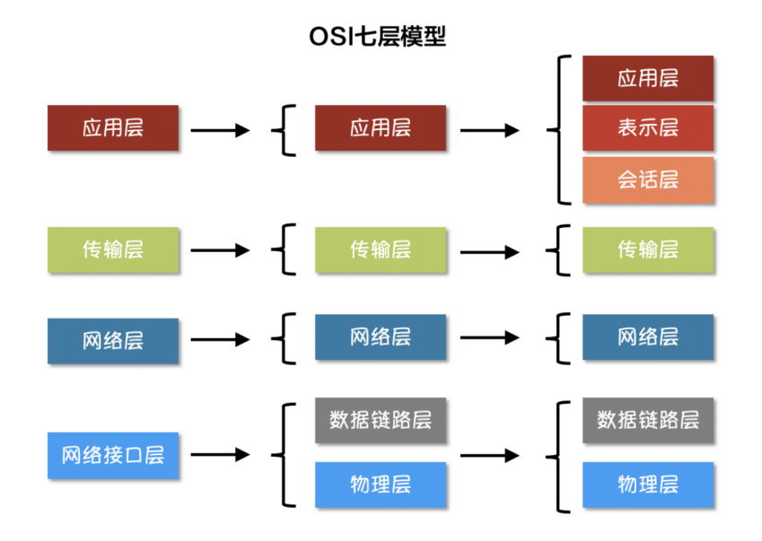
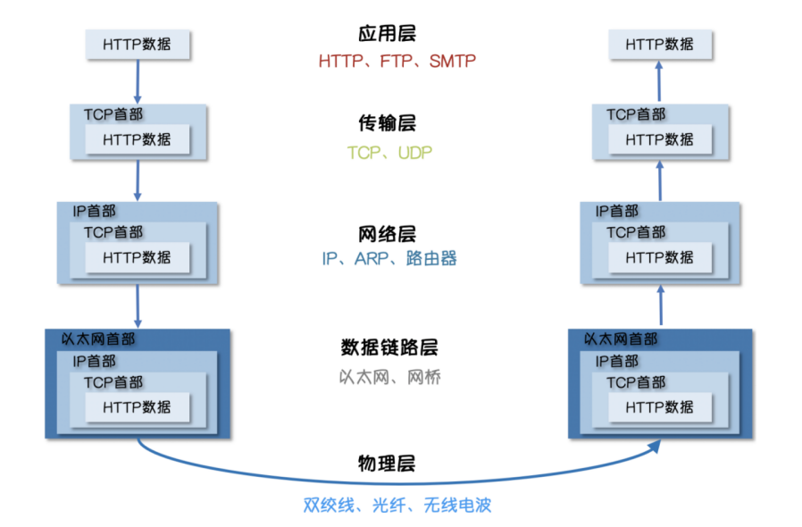
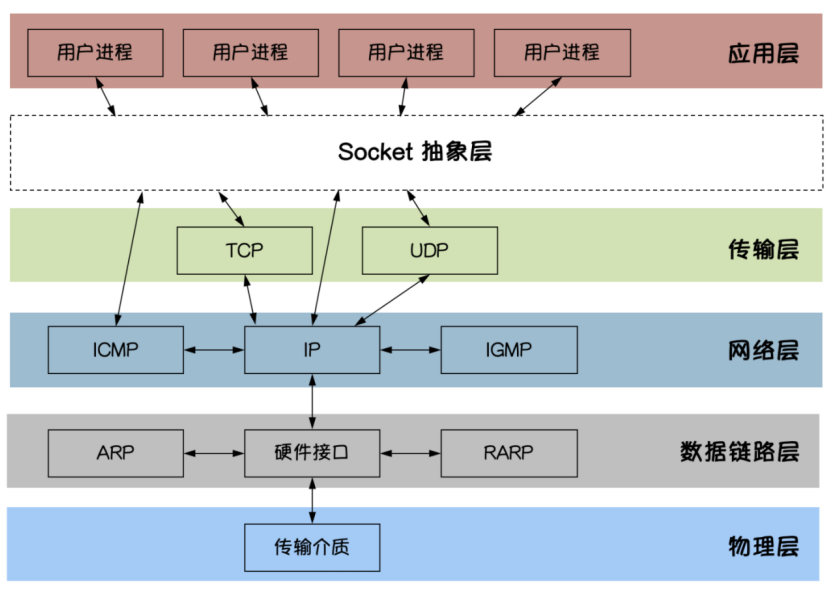
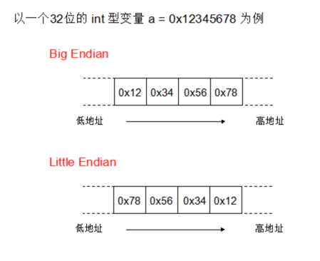

#### Golang中的TCP开发

在了解Golang的TCP开发之前我们先来了解下网际协议是什么?

#### 网际协议

网际协议（Internet Protocol，缩写：IP），又称互联网协议，是用于分组交换数据网络的协议。

IP是在`TCP/IP`协议族中网络层的主要协议，任务仅仅是根据源主机和目的主机的地址来传送数据。为此目的，IP定义了寻址方法和数据报的封装结构。

第一个架构的主要版本为IPv4，目前仍然是广泛使用的互联网协议，尽管世界各地正在积极部署IPv6。

* IP封装

数据在IP互联网中传送时会封装为数据包。

网际协议的独特之处在于：在报文交换网络中主机在传输数据之前，无须与先前未曾通信过的目的主机预先创建好特定的"通路"。
互联网协议提供了"不可靠的"数据包传输机制（也称"尽力而为"或"尽最大努力交付"）；也就是说，它不保证数据能准确的传输。
数据包在到达的时候可能已经损坏，顺序错乱（与其它一起传送的报文相比），产生冗余包，或者全部丢失。 如果应用需要保证可靠性，一般需要采取其他的方法，例如利用IP的上层协议控制。

* IP提供的服务

由于封装带来的抽象机制，IP能够在各种各样的网络上工作，例如以太网、异步传输模式、FDDI、Wi-Fi、令牌环等等。
每个链路层的实现可能有自己的方法（也有可能是完全没有它自己的方法），把IP地址解析成相应的数据链路地址。IPv4使用地址解析协议（ARP），而IPv6采用邻居发现协议（NDP）。


* 可靠性

互联网协议的设计原则，假定网络基础设施本身就是不可靠的单一网络元素或传输介质，并且它使用的是动态的节点和连接。不存在中央监测和性能衡量机制来跟踪和维护网络的状态。为了减少网络的复杂性，大部分网络只能故意地分布在每个数据传输的终端节点。传输路径中的路由器只是简单地将资料包发送到下一个匹配目的地址的路由前缀的本地网关。

由于这种设计的结果，互联网协议只提供尽力传送，其服务也不受信任。在网络专业语言中是无连接的协议，相对于所谓的面向连接的模式。

在缺乏可靠性的条件下允许下列任何故障发生：

* 数据损坏
* 丢失数据包
* 重复到来
* 数据包传递乱序；意思是，报文A即使在报文B之前发送，B也可能在A之前先抵达。

互联网协议提供的唯一帮助是，IPv4规定透过在路由器节点计算校验和来确保IP数据报头是正确的。这个带来的副作用是当场丢弃报头错误的资料包。在这种情况下不需要发送通知给任一终端节点，但是互联网控制消息协议（ICMP）中存在做到这一点的机制。

但是，IPv6为了快速传输已经放弃了计算校验和的使用。

对这些可靠性问题的更正是上层协议的责任。例如，上层协议为了确保按顺序传送可能要缓存数据，直到数据可以传递给应用程序。

除了可靠性问题，互联网及其组成部分的动态性和多样性不能确保任何路径是有能力地或合适地完成所要求的数据传输，即使路径是有效并且可靠的。技术限制有在给定的链路上允许的数据包的大小。
应用程序必须确保它使用适当的传输特性。这种责任还在于一些在应用层协议和IP之间的上层协议。

存在审查的本地连接尺寸最大传输单位（MTU），以及整个预计到目标路径时使用IPv6。IPv4的网络层有自动分片成更小的单位进行传输原始数据报的能力。在这种情况下，IP确实能够为乱序的分片进行顺序排序。

* IP寻址和路由

网际协议最为复杂的方面可能就是寻址和路由。寻址就是如何将IP地址分配给各个终端节点，以及如何划分和组合子网。所有网络端点都需要路由，尤其是网际之间的路由器。路由器通常用内部网关协议（Interior Gateway Protocols，IGPs）和外部网关协议（External Gateway Protocols，EGPs）决定怎样发送IP数据包。

#### OSI五层模型

<p align="center">

</p>

在互联网中，按照不同的模型划分会有不用的分层，越往上的层越靠近用户，越往下的层越靠近硬件。

接下来我们一层一层的自底向上介绍一下每一层。

* 物理层 

通常电脑要与外界互联网通信，需要先把电脑连接网络，因此可以用双绞线、光纤、无线电波等方式。

这就叫做"实物理层"，它就是把电脑连接起来的物理手段。它主要规定了网络的一些电气特性，作用是负责传送0和1的电信号。

物理层解决如何在连接各种计算机的传输媒体上传输数据比特流，而不是指具体的传输媒体。

物理层的主要任务描述为：确定与传输媒体的接口的一些特性。

* 数据链路层

单纯的0和1没有任何意义，因此呢，使用者会为其赋予一些特定的含义，规定解读电信号的方式。

早期的时候，每家公司都有自己的电信号分组方式。随着不断发展，"以太网"（Ethernet）的协议，占据了主导地位，然后成为了标准。

以太网规定，一组电信号构成一个数据包，叫做"帧"（Frame）。每一帧分成两个部分：标头（Head）和数据（Data）。

其中"标头"包含数据包的一些说明项，比如发送者、接受者、数据类型等等；"数据"则是数据包的具体内容。"标头"的长度，固定为18字节。"数据"的长度，最短为46字节，最长为1500字节。因此，整个"帧"最短为64字节，最长为1518字节。如果数据很长，就必须分割成多个帧进行发送。

但是，发送者和接受者是如何标识呢？以太网规定，连入网络的所有设备都必须具有"网卡"接口。数据包必须是从一块网卡，传送到另一块网卡。网卡的地址，就是数据包的发送地址和接收地址，这叫做MAC地址。

每块网卡出厂的时候，都有一个全世界独一无二的MAC地址，长度是48个二进制位，通常用12个十六进制数表示。前6个十六进制数是厂商编号，后6个是该厂商的网卡流水号。有了MAC地址，就可以定位网卡和数据包的路径了。

我们会通过ARP协议来获取接受方的MAC地址，有了MAC地址之后，如何把数据准确的发送给接收方呢？ 

其实这里以太网采用了一种很"原始"的方式，它不是把数据包准确送到接收方，而是向本网络内所有计算机都发送，让每台计算机读取这个包的"标头"，找到接收方的MAC地址，然后与自身的MAC地址相比较，如果两者相同，就接受这个包，做进一步处理，否则就丢弃这个包。这种发送方式就叫做"广播"（broadcasting）。

* 网络层

按照以太网协议的规则我们可以依靠MAC地址来向外发送数据。理论上依靠MAC地址，你电脑的网卡就可以找到身在世界另一个角落的某台电脑的网卡了，但是这种做法有一个很大缺陷就是以太网采用广播方式发送数据包，所有需要成员人手一"包"，不仅效率低，而且发送的数据只能局限在发送者所在的子网络。

也就是意味着,如果两台计算机不在同一个子网络，广播是传不过去的。这种设计是合理且必要的，因为如果互联网上每一台计算机都会收到互联网上收发的所有数据包，那是不现实的。

因此，必须找到一种方法区分哪些MAC地址属于同一个子网络，哪些不是。如果是同一个子网络，就采用广播方式发送，否则就采用"路由"方式发送。这就导致了"网络层"的诞生。

它的作用是引进一套新的地址，使得我们能够区分不同的计算机是否属于同一个子网络。这套地址就叫做"网络地址"，简称"网址"。

"网络层"出现以后，每台计算机有了两种地址，一种是MAC地址，另一种是网络地址。两种地址之间没有任何联系，MAC地址是绑定在网卡上的，网络地址则是网络管理员分配的。

网络地址帮助我们确定计算机所在的子网络，MAC地址则将数据包送到该子网络中的目标网卡。因此，从逻辑上可以推断，必定是先处理网络地址，然后再处理MAC地址。

规定网络地址的协议，叫做IP协议。它所定义的地址，就被称为IP地址。目前，广泛采用的是IP协议第四版，简称`IPv4`。

IPv4这个版本规定，网络地址由32个二进制位组成，我们通常习惯用分成四段的十进制数表示IP地址，从`0.0.0.0`一直到`255.255.255.255`。

根据IP协议发送的数据，就叫做IP数据包。IP数据包也分为"标头"和"数据"两个部分："标头"部分主要包括版本、长度、IP地址等信息，"数据"部分则是IP数据包的具体内容。

IP数据包的"标头"部分的长度为20到60字节，整个数据包的总长度最大为65535字节。

* 传输层

有了MAC地址和IP地址，我们已经可以在互联网上任意两台主机上建立通信。但问题是同一台主机上会有许多程序都需要用网络收发数据，比如邮箱和浏览器这两个程序都需要连接互联网并收发数据，我们如何区分某个数据包到底是归哪个程序的呢？

这时候,我们还需要一个参数，表示这个数据包到底供哪个程序（进程）使用。这个参数就叫做"端口"（port），它其实是每一个使用网卡的程序的编号。每个数据包都发到主机的特定端口，所以不同的程序就能取到自己所需要的数据。

"端口"是0到65535之间的一个整数，正好16个二进制位。0到1023的端口被系统占用，用户只能选用大于1023的端口。有了IP和端口我们就能实现唯一确定互联网上一个程序，进而实现网络间的程序通信。

我们必须在数据包中加入端口信息，这就需要新的协议。最简单的实现叫做UDP协议，它的格式几乎就是在数据前面，加上端口号。

UDP数据包，也是由"标头"和"数据"两部分组成："标头"部分主要定义了发出端口和接收端口，"数据"部分就是具体的内容。UDP数据包非常简单，"标头"部分一共只有8个字节，总长度不超过65,535字节，正好放进一个IP数据包。

UDP协议的优点是比较简单，容易实现，但是缺点是可靠性较差，一旦数据包发出，无法知道对方是否收到。为了解决这个问题，提高网络可靠性，TCP协议就诞生了。

TCP协议能够确保数据不会遗失。它的缺点是过程复杂、实现困难、消耗较多的资源。TCP数据包没有长度限制，理论上可以无限长，但是为了保证网络的效率，通常TCP数据包的长度不会超过IP数据包的长度，以确保单个TCP数据包不必再分割。


* 应用层

应用程序收到"传输层"的数据，接下来就要对数据进行解包。由于互联网是开放架构，数据来源各种各样，必须事先规定好通信的数据格式，否则接收方根本无法获得真正发送的数据内容。

"应用层"的作用就是规定应用程序使用的数据格式，例如我们TCP协议之上常见的Email、HTTP、FTP等协议，这些协议就组成了互联网协议的应用层。

发送方的HTTP数据经过互联网的传输过程中会依次添加各层协议的标头信息，接收方收到数据包之后再依次根据协议解包得到数据。

<p align="center">

</p>

因此应用层主要是提供用户接口，特指能够发起网络流量的程序，比如客户端程序：QQ，MSN，浏览器等。服务器程序：web服务器，邮件服务器，流媒体服务器等等。数据单位为报文。


#### socket编程

我们通常会听到socker编程，但是socket编程具体指什么，可能不是所有人都很清楚，下面我们了解下什么是socket编程。

Socket是`BSD UNIX`的进程通信机制，通常也称作"套接字"，用于描述IP地址和端口，是一个通信链的句柄。Socket可以理解为`TCP/IP`网络的API，它定义了许多函数或例程，开发人员可以用它们来开发TCP/IP网络上的应用程序。

电脑上运行的应用程序通常通过"套接字"向网络发出请求或者应答网络请求。

Socket是应用层与TCP/IP协议族通信的中间软件抽象层。在设计模式中，Socket其实就是一个门面模式，它把复杂的TCP/IP协议族隐藏在Socket后面，对用户来说只需要调用Socket规定的相关函数，让Socket去组织符合指定的协议数据然后进行通信。

<p align="center">

</p>

原始的TCP socket开发中，偏向于底层，基本利用系统调用和操作系统交互。

通常会包括:

* 同步
* 异步
* 阻塞
* 非阻塞

在实际业务使用中，从高性能的角度考虑，经典的使用方式为：Reactor模式的IO多路复用。

整个实现模型还是比较复杂，涉及到几个关键、复杂的模块：

* 多线程；
* 工作线程池；
* 任务队列；
* 复用IO；

定时器模型；

因此，出现了许多高性能IO多路复用框架：`libevent/libev/libuv`等。目的是降低开发者的开发复杂度。

Go设计的目标之一就是面向大规模后端服务程序，网络通信又是至关重要的一部分。go中暴露给语言使用者的tcp socket api是建立在OS原生tcp socket接口之上，其中配合了go runtime的调度需要，所以和OS原生接口存在差别。

相对于传统的IO多路复用框架，go语言直接将"复杂性"隐藏在Runtime中。

#### TCP协议

TCP/IP(Transmission Control Protocol/Internet Protocol) 即传输控制协议/网间协议，是一种面向连接（连接导向）的、可靠的、基于字节流的传输层（Transport layer）通信协议，因为是面向连接的协议，数据像水流一样传输，会存在黏包问题。

#### 二进制协议

基于文本类型的协议（比如 JSON）和二进制协议都是字节通信，他们不同点在于他们使用哪种类型的字节和如何组织这些字节。

文本协议只适用于 ASCII 或 Unicode 编码可打印的字符通信。例如 "26" 使用 "2" 和 "6" 的 utf 编码的字符串表示，这种方式方便我们读，但对于计算机效率较低。

在二进制协议中，同样数字 "26" 可使用一个字节 0x1A 十六进制表示，减少了一半的存储空间且原始的字节格式能够被计算机直接识别而不需解析。当一个数字足够大的时候，性能优势就会明显体现。

#### 计算机字节序和网络字节序

字节序，也就是字节的顺序，指的是多字节的数据类型(int, float 等)在内存中的存放顺序。

在几乎所有的机器上，多字节对象都被存储为连续的字节序列。例如：如果C/C++中的一个int型变量 a 的起始地址是`&a = 0x100`，那么 a 的四个字节将被存储在存储器的`0x100`, `0x101`, `0x102`, `0x103`位置。

根据整数 a 在连续的 4 byte 内存中的存储顺序，字节序被分为大端序（Big Endian） 与 小端序（Little Endian）两类。 然后就牵涉出两大CPU派系：

* Motorola 6800，PowerPC 970，SPARC（除V9外）等处理器采用 `Big Endian`方式存储数据；

* x86系列，VAX，PDP-11等处理器采用`Little Endian`方式存储数据。

<p align="center">

</p>

* `Big Endian` 大端是指低地址端存放高位字节。
* `Little Endian` 小端是指低地址端存放低位字节。

在计算机内部，小端序被广泛应用于现代性`CPU`内部存储数据；而在文件存储和网络传输一般采用 `Big Endian`大端。当两台采用不同字节序的主机通信时，在发送数据之前都必须经过字节序的转换成为网络字节序后再进行传输.

使用小端序时不移动字节就能改变 number 占内存的大小而不需内存地址起始位。比如我想把四字节的 int32 类型的整型转变为八字节的 int64 整型，只需在小端序末端加零即可。

```bash
55 33 22 11
55 33 22 11 00 00 00 00
```

上述扩展或缩小整型变量操作在编译器层面非常有用，但在网络协议层则不是这样了。

在网络协议层操作二进制数字时约定使用大端序，大端序是网络字节传输采用的方式。因为大端序最高有效字节排在首位（低地址端存放高位字节），能够按照字典排序，所以我们能够比较二进制编码后数字的每个字节。

```go
fmt.Println(bytes.Equal([]byte("Golang Best"), []byte("Golang Best")))  // true
```

固定长度编码 `Fixed-length encoding`

Go 中有多种类型的整型， int8, int16, int32 和 int64 ，分别使用 1, 2, 4, 8 个字节表示，我们称之为固定长度类型 (fixed-length types)。

处理字节流和内存中的字节切片方式不一样，编码 (Encoding) 和解码 (decoding) 二进制数据过程也不一样。

可变长度编码理想情况下值小的数字占用的空间比值大的数字少，有多种实现方案，Go Binary 实现方式和 `protocol buffer encoding` 一致，具体原理如下：

每个字节的首位存放一个标识位，用以表明是否还有跟多字节要读取及剩下的七位是否真正存储数据。标识位分别为 0 和 1

* 1 表示还要继续读取该字节后面的字节.
* 0 表示停止读取该字节后面的字节.

一旦所有读取完所有的字节，每个字节串联的结果就是最后的值。举例说明：数字 53 用二进制表示为 110101 ，需要六位存储，除了标识位还剩余七位，所以在标识位后补 0 凑够七位，最终结果为 00110101。标识位 0 表明所在字节后面没有字节可读了，标识位后面的 0110101 保存了值。

再来一个大点的数字举例，1732 二进制使用`11011000100`表示，实际上只需使用 11 位的空间存储，除了标识位每个字节只能保存 7 位，所以数字 1732 需要两个字节存储。第一个字节使用 1 表示所在字节后面还有字节，第二个字节使用 0 表示所在字节后面没有字节，最终结果为：10001101 01000100

二进制协议 (Binary protocol) 高效地在底层处理数据通信，字节序决定字节输出的顺序、通过可变长度编码压缩数据存储空间。

各自的优势:

* `Big Endian` 大端符号位的判定固定为第一个字节，容易判断正负。
* `Little Endian` 小端长度为1，2，4字节的数，排列方式都是一样的，数据类型转换非常方便。


#### TCP黏包

TCP数据在发送和接收时会形成粘包，也就是没有按照预期的大小得到数据，数据包不完整。这个问题的产生并不是因为设计、代码。

封包在发送时，为了提高发送效率，无论是开发者使用的网络库，还是操作系统底层都会对封包进行拼包，将小包凑成大包，在TCP层可以节约包头的大小损耗，I/O层的调用损耗也可以有所降低。

在接收TCP封包时，接收缓冲区的大小与发送过来的TCP传输单元大小不等，这时候会造成两种情况：

* 接收的数据大于等于接收缓冲区大小时，此时需要将数据复制到用户缓忡，接着读取后面的封包。
* 接收的数据小于接收缓冲区大小时，此时需要继续等待后续的 TCP 封包。

那么为什么会出现粘包？

主要原因就是tcp数据传递模式是流模式，在保持长连接的时候可以进行多次的收和发。

"粘包"可发生在发送端也可发生在接收端：

由Nagle算法造成的发送端的粘包：Nagle算法是一种改善网络传输效率的算法。简单来说就是当我们提交一段数据给TCP发送时，TCP并不立刻发送此段数据，而是等待一小段时间看看在等待期间是否还有要发送的数据，若有则会一次把这两段数据发送出去。
接收端接收不及时造成的接收端粘包：TCP会把接收到的数据存在自己的缓冲区中，然后通知应用层取数据。当应用层由于某些原因不能及时的把TCP的数据取出来，就会造成TCP缓冲区中存放了几段数据。

解决办法：

出现"粘包"的关键在于接收方不确定将要传输的数据包的大小，因此我们可以对数据包进行封包和拆包的操作。

封包：封包就是给一段数据加上包头，这样一来数据包就分为包头和包体两部分内容了(过滤非法包时封包会加入"包尾"内容)。包头部分的长度是固定的，并且它存储了包体的长度，根据包头长度固定以及包头中含有包体长度的变量就能正确的拆分出一个完整的数据包。

我们可以自己定义一个协议，比如数据包的前4个字节为包头，里面存储的是发送的数据的长度。


```go
// socker 
package proto

import (
	"bufio"
	"bytes"
	"encoding/binary"
)

// Encode 将消息编码
func Encode(message string) ([]byte, error) {
	// 读取消息的长度，转换成int32类型（占4个字节）
	var length = int32(len(message))
	var pkg = new(bytes.Buffer)
	// 写入消息头
	err := binary.Write(pkg, binary.LittleEndian, length)
	if err != nil {
		return nil, err
	}
	// 写入消息实体
	err = binary.Write(pkg, binary.LittleEndian, []byte(message))
	if err != nil {
		return nil, err
	}
	return pkg.Bytes(), nil
}

// Decode 解码消息
func Decode(reader *bufio.Reader) (string, error) {
	// 读取消息的长度
	lengthByte, _ := reader.Peek(4) // 读取前4个字节的数据
	lengthBuff := bytes.NewBuffer(lengthByte)
	var length int32
	err := binary.Read(lengthBuff, binary.LittleEndian, &length)
	if err != nil {
		return "", err
	}
	// Buffered返回缓冲中现有的可读取的字节数。
	if int32(reader.Buffered()) < length+4 {
		return "", err
	}

	// 读取真正的消息数据
	pack := make([]byte, int(4+length))
	_, err = reader.Read(pack)
	if err != nil {
		return "", err
	}
	return string(pack[4:]), nil
}
```

接下来在服务端和客户端分别使用上面定义的Decode和Encode函数处理数据。

```go
// server端
func process(conn net.Conn) {
	defer conn.Close()
	reader := bufio.NewReader(conn)
	for {
		msg, err := proto.Decode(reader)
		if err == io.EOF {
			return
		}
		if err != nil {
			fmt.Println("decode msg failed, err:", err)
			return
		}
		fmt.Println("收到client发来的数据：", msg)
	}
}

func main() {
	listen, err := net.Listen("tcp", "127.0.0.1:10890")
	if err != nil {
		fmt.Println("listen failed, err:", err)
		return
	}
	defer listen.Close()
	for {
		conn, err := listen.Accept()
		if err != nil {
			fmt.Println("accept failed, err:", err)
			continue
		}
		go process(conn)
	}
}
```

```go
// client 端
func main() {
	conn, err := net.Dial("tcp", "127.0.0.1:30000")
	if err != nil {
		fmt.Println("dial failed, err", err)
		return
	}
	defer conn.Close()
	for i := 0; i < 20; i++ {
		msg := `Hello, Hello. How are you?`
		data, err := proto.Encode(msg)
		if err != nil {
			fmt.Println("encode msg failed, err:", err)
			return
		}
		conn.Write(data)
	}
}
```
