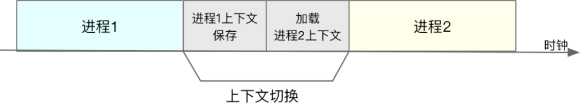

#### CPU上下文切换

由于Linux 是一个多任务操作系统，而且,它支持远大于 CPU 数量的任务同时运行，但是 这些任务实际上并不是真的在同时运行，而是因为系统在很短的时间内，将 CPU 轮流分配给它们，造成多任务同时运行的错觉。 
而在每个任务运行前，CPU 都需要知道任务从哪里加载和从哪里开始运行，通常都会需要系统事先帮它设置好 CPU 寄存器和程序计数器(Program Counter, PC).

在CPU中，寄存器是CPU内置的容量小、但速度极快的内存。然而程序计数器，则是用来存储 CPU 正在执行的指令位置、或者即将执行的下一条指令位置。它们都是 CPU 在运行任何任务前，必须的依赖环境，因此也被叫做 CPU上下文.

CPU 上下文切换 ，就是先把前一个任务的 CPU 上下文（也就是 CPU 寄存器和程序计数器）保存起来，然后加载新任务的上下文到这些寄存器和程序计数器，最后再跳转到程序计数器所指的新位置，运行新任务。 而这些保存下来的上下文，会存储在系统内核中，并在任务重新调度执行时再次加载进来。这样就能保证任务原来的状态不受影响，让任务看起来还是连续运行.

#### 什么是任务

CPU 上下文切换无非就是更新了 CPU 寄存器的值嘛，但这些寄存器，本身就是为了快速运行任务而设计的，为什么会影响系统的 CPU 性能呢？ 

在解析这个问题前，我们需要先了解下操作系统管理的这些“任务”到底是什么呢？

进程和线程正是最常见的任务。但是除此之外，硬件通过触发信号，会导致中断处理程序的调用，也是一种常见的任务。

所以，根据任务的不同，CPU上下文切换可分为几种场景：

* 系统调用上下文切换
* 进程上下文切换
* 线程上下文切换
* 中断上下文切换

#### 系统调用引起的上下文切换

Linux 按照特权等级，把进程的运行空间分为内核空间和用户空间，分别对应着下图中, CPU 特权等级的 Ring 0 和 Ring 3。

* 内核空间（Ring 0）具有最高权限，可以直接访问所有资源.
* 用户空间（Ring 3）只能访问受限资源，不能直接访问内存等硬件设备，必须通过系统调用陷入到内核中，才能访问这些特权资源.

由系统调用完成从用户态到内核态的转变。这个过程也会发生CPU上下文切换。

CPU 寄存器里原来用户态的指令位置，需要先保存起来。接着，为了执行内核态代码,CPU 寄存器需要更新为内核态指令的新位置。最后才是跳转到内核态运行内核任务。

而系统调用结束后，CPU 寄存器需要恢复原来保存的用户态，然后再切换到用户空间，继续运行进程。 所以，一次系统调用的过程，其实是发生了两次 CPU 上下文切换。

不过，需要注意的是，系统调用过程中，并不会涉及到虚拟内存等进程用户态的资源，也不会切换进程。这跟我们通常所说的进程上下文切换是不一样的（系统调用在同一个进程里运行）。 所以系统调用过程通常称为 特权模式切换 ，而不是上下文切换。但实际上，系统调用过程中,CPU 的上下文切换还是无法避免的。

#### 进程上下文切换

进程是由内核来管理和调度的，进程的切换只能发生在内核态。所以，进程的上下文不仅包括了 虚拟内存、栈、全局变量等用户空间的资源 ，还包括了 内核堆栈、寄存器等内核空间的状态. 因此，进程的上下文切换就比系统调用时多了一步: 在保存当前进程的内核状态和 CPU 寄存器之前，需要先把该进程的虚拟内存、栈等保存下来；而加载了下一进程的内核态后，还需要刷新进程的虚拟内存和用户栈。

在每次进程进行上下文切换时，通常都需要几十纳秒到数微妙的 CPU 时间。这个时间还是相当不错的，尤其是在进程上下文切换次数较多的情况下，很容易导致 CPU 将大量时间耗费在寄存器、内核栈以及虚拟内存等资源的保存和恢复上，进而大大缩短了真正运行进程的时间。这也是导致平均负载升高的一个重要因素。

进程上下文切换的时机:

* 进程所分配的时间片耗尽，就会被系统挂起.
* 进程在系统资源（比如内存）不足时，需等待资源满足才能运行.
* 进程调用如sleep等方法主动挂起.
* 当有优先级更高的进程运行时，为了保证高优先级进程的运行，当前进程会被挂起.
* 发生硬件中断时，CPU 上的进程会被中断挂起，转而执行内核中的中断服务程序.

#### 线程上下文切换

线程与进程的一大区别在于,线程是调度的基本单位，而进程则是资源拥有的基本单位。内核的任务调度对象是线程。而进程只是给线程提供了虚拟内存、全局变量等资源。 线程也有自己的私有数据，比如栈和寄存器等，这些在上下文切换时也是需要保存的。

线程上下文切换可以分为两种:

* 前后两个线程属于不同进程。此时，因为资源不共享，所以切换过程就跟进程上下文切换是一样。
* 前后两个线程属于同一个进程。此时，因为虚拟内存是共享的，所以在切换时，虚拟内存这些资源就保持不动，只需要切换线程的私有数据、寄存器等不共享的数据。
* 虽然同为上下文切换，但同进程内的线程切换，要比多进程间的切换消耗更少的资源，这也正是多线程代替多进程的一个优势。

#### 中断上下文切换

为了快速响应硬件的事件， 中断处理会打断进程的正常调度和执行 ，转而调用中断处理程序，响应设备事件。而在打断其他进程时，就需要将进程当前的状态保存下来，这样在中断结束后，进程仍然可以从原来的状态恢复运行。

跟进程上下文不同，中断上下文切换并不涉及到进程的用户态。所以，即便中断过程打断了一个正处在用户态的进程，也不需要保存和恢复这个进程的虚拟内存、全局变量等用户态资源。中断上下文，其实只包括内核态中断服务程序执行所必需的状态,包括 CPU 寄存器、内核堆栈、硬件中断参数等。

对同一个 CPU 来说,中断处理比进程拥有更高的优先级,所以中断上下文切换并不会与进程上下文切换同时发生。同样道理，由于中断会打断正常进程的调度和执行，所以大部分中断处理程序都短小精悍，以便尽可能快的执行结束。

因此，CPU 上下文切换，是保证 Linux 系统正常工作的核心功能之一，一般情况下不需要我们特别关注。 但过多的上下文切换，会把 CPU 时间消耗在寄存器、内核栈以及虚拟内存等数据的保存和恢复上，从而缩短进程真正运行的时间，导致系统的整体性能大幅下降。
