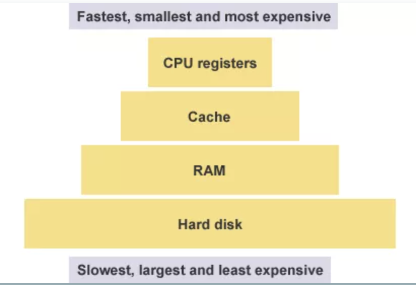
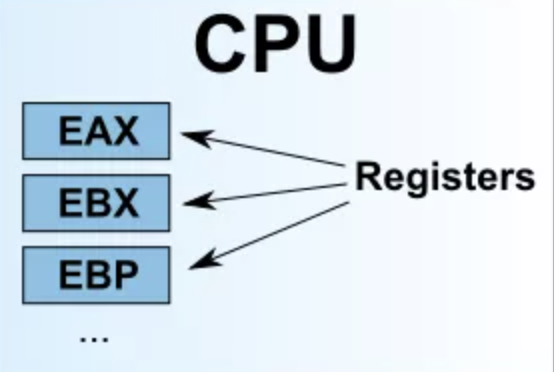
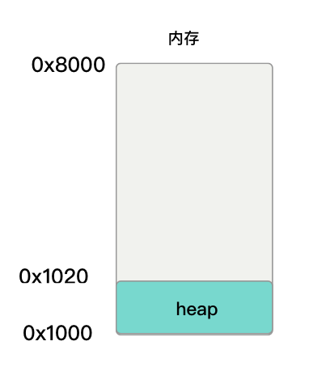
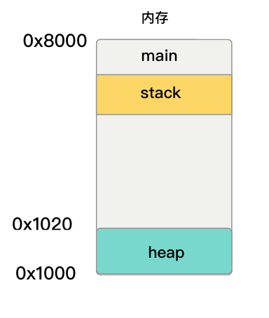

#### 汇编

在计算机中，真正能够被计算机理解的是低级语言，它专门用来控制硬件。汇编语言就是低级语言，直接描述控制 CPU 的运行。

#### 汇编语言是什么

在计算机中,CPU 只负责计算。但是你输入一条指令（instruction），它就运行一次，然后停下来，等待下一条指令。

这些指令都是二进制的，称为操作码（opcode），比如加法指令就是`00000011`。编译器的作用，就是将高级语言写好的程序，翻译成一条条操作码。

对于人来说，二进制程序是不可读的，根本看不出来机器干了什么。为了解决可读性的问题，以及偶尔的编辑需求，就诞生了汇编语言。

汇编语言是二进制指令的文本形式，与指令是一一对应的关系。比如，加法指令00000011写成汇编语言就是 ADD。只要还原成二进制，汇编语言就可以被 CPU 直接执行，所以它是最底层的低级语言。

最开始的时候,编写程序就是手写二进制指令，然后通过各种开关输入计算机，比如要做加法了，就按一下加法开关。随着后来，发明了纸带打孔机，通过在纸带上打孔，将二进制指令自动输入计算机。

然而,为了解决二进制指令的可读性问题，工程师将那些指令写成了八进制。二进制转八进制是轻而易举的，但是八进制的可读性也不行。很自然地，最后还是用文字表达，加法指令写成 ADD。内存地址也不再直接引用，而是用标签表示。

这样的话，就多出一个步骤，要把这些文字指令翻译成二进制，这个步骤就称为 assembling，完成这个步骤的程序就叫做 assembler。它处理的文本，自然就叫做 aseembly code。标准化以后，称为 assembly language，缩写为 asm，中文译为汇编语言。

#### 寄存器

在汇编中需要了解到的是寄存器和和内存模型。

在计算机中,CPU 本身只负责运算，不负责储存数据。数据一般都储存在内存之中，CPU 要用的时候就去内存读写数据。但是，CPU 的运算速度远高于内存的读写速度，为了避免被拖慢，CPU 都自带一级缓存和二级缓存。基本上，CPU 缓存可以看作是读写速度较快的内存。

但是，CPU 缓存还是不够快，另外数据在缓存里面的地址是不固定的，CPU 每次读写都要寻址也会拖慢速度。因此，除了缓存之外，CPU 还自带了寄存器（register），用来储存最常用的数据。也就是说，那些最频繁读写的数据（比如循环变量），都会放在寄存器里面，CPU 优先读写寄存器，再由寄存器跟内存交换数据。

<p align="center">

</p>

寄存器不依靠地址区分数据，而依靠名称。每一个寄存器都有自己的名称，我们告诉 CPU 去具体的哪一个寄存器拿数据，这样的速度是最快的。有人比喻寄存器是 CPU 的零级缓存。


寄存器的种类: 

在早期的时候,x86 CPU 只有8个寄存器，而且每个都有不同的用途。但是现在的寄存器已经有100多个了，而且都变成通用寄存器，不特别指定用途了，但是早期寄存器的名字都被保存了下来。

```markdown
* EAX 的全称是Extended Accumulator X，即累加寄存器。A代表Accumulator.
* EBX 的全称是Extended Base X，即基地址"(base)寄存器, 在内存寻址时存放基地址.
* ECX 的全称是Extended Counting X，即计数寄存器。C代表counting.
* EDX 的全称是Extended Data X，即总是被用来放整数除法产生的余数.
* EDI 的全称是Extended Destination Indexing，即目的索引寄存器。D代表destnation，I代表Indexing.
* ESI 的全称是Extended Source Indexing，即源索引寄存器。S代表Source，I代表Indexing.
* EBP 的全称是Extended (Stack) Base Pointer	，即栈基指针寄存器。B代表Base.
* ESP 的全称是Extended Stack Pointer，即栈指针寄存器。S代表Stack.
```
这里的这8个寄存器之中，前面七个都是通用的。ESP 寄存器有特定用途，保存当前 Stack 的地址.

<p align="center">

</p>

通常我们常常看到 32位 CPU、64位 CPU 这样的名称，其实指的就是寄存器的大小。32 位 CPU 的寄存器大小就是4个字节。

#### 内存模型：Heap

寄存器只能存放很少量的数据，大多数时候，CPU 要指挥寄存器，直接跟内存交换数据。所以，除了寄存器，还必须了解内存怎么储存数据。

程序运行的时候，操作系统会给它分配一段内存，用来储存程序和运行产生的数据。这段内存有起始地址和结束地址，比如从`0x1000`到`0x8000`，起始地址是较小的那个地址，结束地址是较大的那个地址。


<p align="center">

</p>

在程序中，这种因为用户主动请求而划分出来的内存区域，叫做 Heap（堆）。它由起始地址开始，从低位（地址）向高位（地址）增长。Heap 的一个重要特点就是不会自动消失，必须手动释放，或者由垃圾回收机制来回收。

#### 内存模型：Stack

在计算机中，除了 堆(Heap) 以外，其他的内存占用叫做 Stack（栈）。通常来说，Stack 是由于函数运行而临时占用的内存区域。

<p align="center">

</p>

所有的帧都存放在 Stack，由于帧是一层层叠加的，所以 Stack 叫做栈。生成新的帧，叫做"入栈"，英文是 push；栈的回收叫做"出栈"，英文是 pop。Stack 的特点就是，最晚入栈的帧最早出栈（因为最内层的函数调用，最先结束运行），这就叫做"后进先出"的数据结构。每一次函数执行结束，就自动释放一个帧，所有函数执行结束，整个 Stack 就都释放了。

Stack 是由内存区域的结束地址开始，从高位（地址）向低位（地址）分配。
