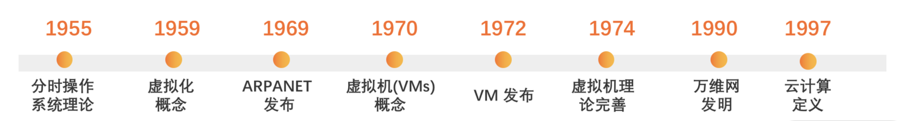
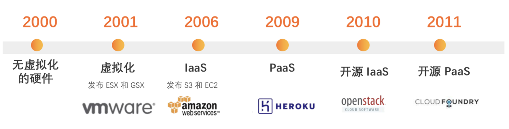
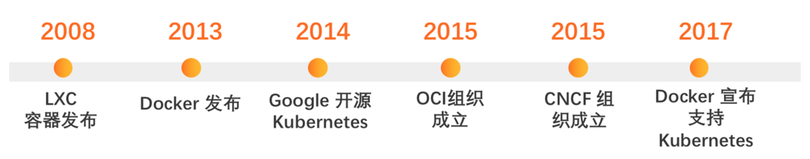
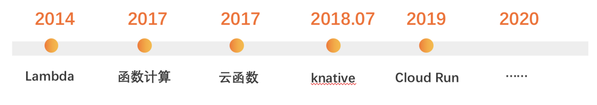

#### Serverless 

Serverless 是最近几年业界很火的技术名词，你可以在国内外各种技术大会上看到它的身影，主流云服务商也不断地推出 Serverless 相关的云产品和新功能（比如 AWS Lambda、阿里云函数计算、腾讯云云函数），各种关于 Serverless 的商业和开源产品也层出不穷（比如 Serverless Framework、OpenFaaS、kubeless）。

在这个背景下，开始使用 Serverless 的产品，用它来解决实际问题，比如用 Serverless 技术实现自动化运维、开发小程序、开发服务端应用。

但是我们是否思考过 Serverless 为什么这么火呢，换句话说，Serverless 架构兴起的必然因素是什么？

在说到Serverless之前，就不得不说云计算，因为云计算的发展史就是 Serverless 的兴起史。

纵观云计算的历史，我们可以将其分为物理机时代、虚拟机时代、容器时代、Serverless 时代，所以接下来，就让我们深入云计算的发展史，去寻找 Serverless 架构兴起的必然因素。

#### 物理机时代

但是对于云计算的概念其实可以追溯到 60 多年前，最早的说法是图中的“分时操作系统”，也就是通过时间片轮转的方式把一个操作系统给多个用户使用。同时还在发展的是虚拟化技术，也就是把一台物理机隔离为多台虚拟机，这样就能把一个硬件给多个用户使用。

1997年，Ramnath Chellapa 教授把云计算定义成“一种新的计算范式，其中计算的边界将由经济原理决定，而不仅仅是技术限制”，通俗来讲就是，云计算不只是虚拟化技术，还是云服务商提供计算资源，使用者购买计算资源。

总的来说，在2000年之前，互联网刚刚兴起，而云计算还处于理论阶段，也就是物理机时代。如果这个时候你想在创业，开发一个电商网站，上线就需要经过以下步骤：

* 购买一台服务器（物理机）.

* 找个机房并给服务器通上电、连上网线.

* 在服务器上安装操作系统.

* 在服务器上安装数据库和网站环境.

* 部署网站.

* 测试.

这时你的网站架构是单机版的单体架构，数据库、应用、Nginx 等服务全都在一台你自己管理的服务器上。

网站上线之后，你将会遇到各种各样的问题，一旦停电，就会导致网络中断，服务器也会停机，那网站就没办法访问了，因此呢，用户不能再不断去买。于是为了避免断电、断网，大概率会选择把服务器托管到电信机房，那里停电的概率低很多，但是每个月得多付一些租金。

但是没想到半年后，问题又出现了，服务器 CPU 烧毁了！这不是简单换一台服务器就能解决的事情，原来服务器上的数据如何迁移？新的环境如何与原来保持一致？怎么保证网站持续可用，各种问题接连而至......

总的来说，物理机时代，网站上线和稳定运行面临的最大问题就是服务器等硬件问题，你既要购买服务器，还要承担服务器的场地、电力、网络等开销，并且还需负责服务器的维护。好在随后几年随着虚拟化技术逐渐成熟，云计算逐渐进入虚拟机时代，这也给我们带来了希望。

#### 虚拟机时代

虚拟机发展历程中的重要节点。其中一个重要里程碑之一就是 2001 年 VMWare 带来的针对 x86 服务器的虚拟化产品，使虚拟化技术逐渐普及。对云厂商来说，通过虚拟化技术，它可以把一台物理机分割成多台虚拟机提供给多用户使用，充分利用硬件资源，而且创建速度和弹性也远超物理机。对于开发者来说，就不用再买硬件了，直接在云平台买虚拟机，成本更低了。

2001 年之后，虚拟化技术日渐成熟， 因此也出现了很多基于虚拟化的云厂商和产品（开篇我也提到了）。最初云厂商都是卖硬件，AWS 的 EC2、阿里云 ECS、Azure Virtual Machines，这种云计算形态也被叫作 IaaS（基础设施即服务）。后面随着业务形态发展，云厂商发现可以抽象出一些通用的平台，比如中间件、数据库等，于是就把这些功能做成服务，也放在云上去卖，这就是 PaaS（平台即服务）。

那有了 IaaS 之后，你就可以把电商网站迁移到虚拟机上了， 再也不用担心断电断网和硬件故障。不过，当你的电商网站越做越强，用户越来越多，数据库每天都有几千万条数据写入，数据库性能很快就会达到瓶颈，就会出现用户因付款太慢放弃付款的情况；除此之外，每天也有上百万图片存到磁盘，磁盘也快要耗尽了。如果网站出现崩溃，就直接导致用户流失，甚至资损。

为了降低服务器负载，我们把数据库迁移到了云厂商提供的云数据库上，把图片存储迁移到对象存储：

云数据库有专门的服务器，并且还提供了备份容灾，比自己在服务器上安装数据库更稳性能更强。

对象存储能无限扩容，不用担心磁盘不够了。

这样一来，服务器就只负责处理用户的请求，把计算和存储分离开来，既降低了系统负载，也提升了数据安全性。并且单机应用升级为了集群应用，通过负载均衡，会把用户流量均匀分配到每台服务器上。

不过在服务器扩容的过程中，你还是会遇到一些麻烦。 比如购买服务器时，会发现之前服务器型号没有了，只有新的型号，并且每次新扩容一台服务器，都需要在上面初始化软件环境和配置，还需要保证所有服务器运行环境一致，这是个非常复杂还容易出错的工作。

总的来说，虚拟机可以让你不用关心底层硬件，但是如果能让我们不用关心运行环境就更好了。于是，容器技术诞生了。

#### 容器时代

2013 年 Docker 的发布，代表着容器技术替代了虚拟化技术，云计算进入容器时代。 容器就是把代码和运行环境打包在一起，这样代码就可以在任何地方运行。有了容器技术，你在服务器上部署的就不再是应用了，而是容器。当容器多了的时候，如何管理就成了一个问题，于是出现了容器编排技术，比如 2014 年 Google 开源的 Kubernetes。

基于容器，你部署网站的方式也有了改变：

* 搭建 Kubernetes 集群；

* 构建容器镜像；

* 部署镜像。

我们部署架构也演进得更现代化了：

不仅使用了容器，还使用了 Kubernetes 来做管理容器集群。基于 Kubernetes 和云厂商提供的弹性能力，你可以实现网站的自动弹性伸缩。这样在流量洪峰到来时，就可以自动弹出更多的资源；当流量低谷时，自动释放多余的资源。

想到这儿，我们肯定多多少少有些兴奋，但时间一久，问题也随之出现。因为你需要去规划节点和 Pod 的 CPU、内存、磁盘等资源，需要编写复杂的 YAML 去部署 Pod、服务，需要经常排查 Pod 出现的异常，需要学习专业的运维知识，渐渐地，你好像变成了 Kubernetes 运维工程师， 如果能完全不关心运维，只专注于产品的开发就好了，这样能节省很多时间，以更快的速度完成产品迭代上线。

而且你也没想到，由于提前准备不够充分，双十一来的时候，零点的订单量远超预期，网站又崩了！集群虽然感知到了需要弹出更多的资源，但由于服务器弹出需要一定时间，没来得及应对这种瞬时流量，要是能够支持秒级弹性就好了。于是，Serverless 时代来临了。

#### Serverless 时代

Serverless 是指构建和运行不需要服务器管理的一种概念。

对于 Serverless，目前我们得到的还是一个比较抽象的概念，这是因为这项技术尚处于发展阶段。现阶段关于 Serverless 的实现主要是基于 FaaS（函数即服务） 和 BaaS （后端即服务）的方案。

* FaaS 提供了运行函数代码的能力，并且具有自动弹性伸缩。基于 FaaS，我们应用的组成就不再是集众多功能于一身的集合体，而是一个个独立的函数。每个函数实现各自的业务逻辑，由这些函数组成复杂的应用。

* BaaS 是将后端能力封装成了服务，并以接口的形式提供服务。比如数据库、文件存储等。通过 BaaS 平台的接口，我们运行在 FaaS 中的函数就能调用各种后端服务，进而以更低开发成本实现复杂的业务逻辑。

说了这么多到底什么是serverless呢?

广义的Serverless:

通常来讲，广义的 Serverless 是指：构建和运行软件时不需要关心服务器的一种架构思想。 虽然 Serverless 翻译过来是 “无服务器”，但这并不代表着应用运行不需要服务器，而是开发者不需要关心服务器。而基于 Serverless 思想实现的软件架构就是 Serverless 架构。

那与 Serverless 对应的概念就是 Serverful。我们直接在虚拟机上部署网站的架构，就是 Serverful 的架构，在这种架构下，如果要保证网站持续稳定运行，就需要解决很多问题。

* 备份容灾： 要实现服务器、数据库的备份容灾机制，使一台服务器出故障不影响整个系统。

* 弹性伸缩： 系统能根据业务流量大 小等指标，响应式地调整服务规模，实现自动弹性伸缩。

* 日志监控： 需要记录详细的日志，方便排查问题和观察系统运行情况，并且实现实时的系统监控和业务监控。

解决这些复杂的问题需要投入大量的人力、物力，小公司几乎无法自己去解决。而对开发者来说，Serverful 的架构开发成本也非常高，原本几行代码就可以搞定一个简单的业务逻辑，但你却得添加庞大的框架，比如 RPC（Remote Procedure Call，远程调用）、缓存等。

Serverless 就是为了解决这些问题诞生的。 它可以把底层的硬件、存储等基础资源隐藏起来，由平台统一调度、运维。并将常用的基础技术抽象、封装（比如数据库、消息队列等）以服务的方式提供给开发者。开发者只专注于开发业务逻辑，所有业务无关的基础设施，都交给 Serverless 平台。

因此呢， Serverless 和 Serverful 的架构有这样几个区别。

* 资源分配： 在 Serverless 架构中，你不用关心应用运行的资源（比如服务配置、磁盘大小）只提供一份代码就行。

* 计费方式： 在 Serverless 架构中，计费方式按实际使用量计费（比如函数调用次数、运行时长），不按传统的执行代码所需的资源计费（比如固定 CPU）。计费粒度也精确到了毫秒级，而不是传统的小时级别。

* 弹性伸缩： Serverless 架构的弹性伸缩更自动化、更精确，可以快速根据业务并发扩容更多的实例，甚至允许缩容到零实例状态来实现零费用，对用户来说是完全无感知的。而传统架构对服务器（虚拟机）进行扩容，虚拟机的启动速度也比较慢，需要几分钟甚至更久。

所以，一个应用如果是 Serverless 架构的，必须要实现自动弹性伸缩和按量付费，这也是 Serverless 的核心特点。

狭义的 Serverless:

广义的 Serverless 更多是指一种技术理念，狭义的 Serverless 则是现阶段主流的技术实现。之所以说是狭义的，是因为 Serverless 架构正在持续发展中，未来可能有更好的技术方案。

在我看来，狭义的Serverless 是 FaaS 和 BaaS 的组合,为什么呢？

既然 Serverless架构可以让你不关心服务器，那怎么用 Serverless 架构去实现这个功能呢？答案就是 FaaS。

FaaS（Function as a Service）本质上是一个函数运行平台，大多 FaaS 产品都支持 Node.js、Python、Java等编程语言，你可以选择你喜欢的编程语言编写函数并运行。函数运行时，你对底层的服务器是无感知的，FaaS 产品会负责资源的调度和运维，这是它的特点之一，不用运维。

另外，FaaS 中的函数也不是持续运行的，而是通过事件进行触发，比如 HTTP 事件、消息事件等，产生事件的源头叫触发器，FaaS 平台会集成这些触发器，我们直接用就行，这是 FaaS 的第二个特点，事件驱动。

FaaS 的第三个特点是按量付费。 FaaS 产品的收费方式，都是按照函数执行次数和执行时消耗的 CPU、内存等资源进行计费的。除此之外，FaaS 在运行函数的时候，会根据并发量自动生成多个函数实例，并且并发理论是没有上限的，这是它的第四个特点，弹性伸缩。

基于 FaaS 和 BaaS 的架构，是一种计算和存储分离的架构。 计算由 FaaS 负责，存储由 BaaS 负责，计算和存储也被分开部署和收费。这使应用的存储不再是应用本身的一部分，而是演变成了独立的云服务，降低了数据丢失的风险。而应用本身也变成了无状态的应用，更容易进行调度和扩缩容。

基于 FaaS 和 BaaS ，你的应用就实现了自动弹性伸缩、按量付费、不用关心服务器，这正是 Serverless 架构的必要因素。所以说狭义的 Serverless 是 FaaS 和 BaaS 的组合。

Kubernetes 本身也不是 Serverless，只是在概念方面有些类似。 Kubernetes 是一种容器编排技术。在 Kubernetes 中应用运行的基本单位是 Pod（容器组），Pod 是应用及运行环境的集合，所以你也不用关心服务器了。基于 Kubernetes，你能很方便地进行 Pod 的管理，并且实现应用的弹性伸缩。

但从运维的角度来看，主流的 Kubernetes 服务提供商，如 EKS (Amazon Elastic Kubernetes Service) 和 ACK（阿里云容器服务），提供的都是 Kubernetes 集群托管和运维服务，开发者可以方便地管理 Kubernetes 集群中硬件、存储、Pod 等资源，但上层应用的运维和调度还是需要开发者自己进行。

从成本的角度来看，Kubernetes 也无法做到按代码执行次数和实际消耗资源计费，还是和传统的 Serverful 一样，按照资源数量计费。

所以，Kubernetes 是介于 Serverful 和 Serverless 中间的产物。

而云原生指的是原生为云设计的架构模式，就是应用一开始设计开发就按照在云上运行的方式进行，充分利用云的优势。Serverless 几乎封装了所有的底层资源调度和运维工作，让你更容易使用云计算基础设施，极大简化了基于云服务的编程。

因此 Serverless 是云原生的一种实现，云原生的另一种实现是 Kubernetes。

Serverless 的优缺点:

没有一项技术是十全十美的，Serverless 也一样。了解它的优缺点，可以让你今后更好地进行技术选型，决定是否用 Serverless 进行应用开发。根据 Serverless 的定义，Serverless 的优点主要有：不用运维、弹性伸缩、节省成本、开发简单、降低风险、易于扩展。 但它也存在缺点。

* 依赖第三方服务

要用 Serverless，就要用云厂商提供的 Serverless 产品，比如 FaaS、BaaS，这样业务就和第三方云厂商绑定了。并且一旦你选择了一个云厂商，要想从一个云移到另一个台，成本很高（因为现在 Serverless 还没有一个统一的标准，云厂商各做各的，Serverless 产品也都不一样）。所以，依赖第三方服务是优点也是缺点。当然，我觉得这是大势所趋，让专业的人做专业的事，可以极大提高生产力。

* 底层硬件的多样性

目前 Serverless 的技术实现是 FaaS 和 BaaS。你的应用代码在 FaaS 上运行，但其底层的硬件资源多样，也不确定，云厂商可以灵活地选择服务器来运行你的代码，这就让运行函数的物理环境变得不同，甚至有的函数会运行在不同代的 CPU 上。 如果代码不依赖底层 CPU，那影响可能是不同 CPU 性能有差异；如果代码必须运行在某种类型的 CPU 或 GPU 上，那就需要云厂商提供这种能力了。这其实也暴露了云厂商的目的，就是最大化平衡资源利用效率与成本。当然，如果你不是特别关注底层硬件，影响也不大。

* 应用性能瓶颈

基于 Serverless 架构的应用，函数运行前需要现初始化函数运行环境，这个过程需要消耗一定时间。因为函数不是持续“在线”的，而是需要运行的时候才启动（不像传统应用，服务是一直启动的）。

从资源利用率来讲，这种模式可以节省资源，但从应用性能上来讲，这就会降低应用性能，并且还要靠云厂商实现性能优化（让延时只有几毫秒或者几十毫秒，毕竟一个接口最大的耗时是在网络上，可能长达几百毫秒）。但如果你的应用对性能非常敏感，就需要考虑一下怎么去优化应用性能了。

* 函数通信效率低

传统的 MVC（Model-View-Controller） 架构模式中，View 层方法调用 Model 层方法，都是在内存中进行的。而在 Serverless 应用中，函数与函数之间就完全独立了。如果两个函数的数据有依赖，需要进行通信、交换数据，就要进行函数与函数之间的调用（调用方式是 HTTP 调用）。相比之前的内存调用，数据交互效率显然低了很多。而这个问题的本质，是 FaaS 还没有比较好的数据通信协议或方案。

开发调试复杂

Serverless 架构正处于飞速发展的阶段，其开发、调试、部署工具链并不完善（基本是每个云厂商各玩各的）。 另外，应用依赖的第三方云服务也很难进行调试。要想在本地开发调试 Serverless 应用，还是比较复杂。

但是，虽然 Serverelss 存在缺点，但是相信伴随着技术的不断成熟，这些问题在未来都能得到很好的解决，Serverless的应用面也会越来越广阔!
