#### QUIC网络传输协议 

QUIC 全称 quick udp internet connection，“快速 UDP 互联网连接”,（和英文 quick 谐音，简称“快”）是由 Google 提出的基于 UDP 进行可靠传输的协议。QUIC 在应用层实现了丢包恢复、拥塞控制、滑窗机制等保证数据传输的可靠性，同时对传输的数据具备前向安全的加密能力。HTTP3 则是 IETF(互联网工程任务组)基于 QUIC 协议基础进行设计的新一代 HTTP 协议。

QUIC/HTTP3 分层模型及与 HTTP2 对比：

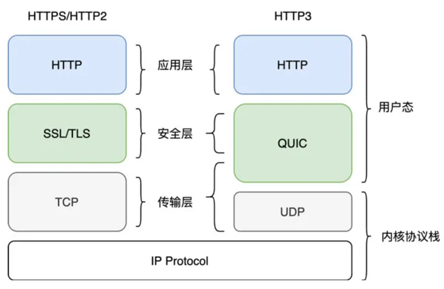

#### QUIC 核心优势是什么？

1.0-RTT 建立连接

QUIC 基于的 UDP 协议本身无需握手，并且它早于 TLS 1.3 协议，就实现了自己的 0-RTT 加密握手。下图分别代表了 1-RTT 握手（首次建连），成功的 0-RTT 握手，以及失败回退的握手。

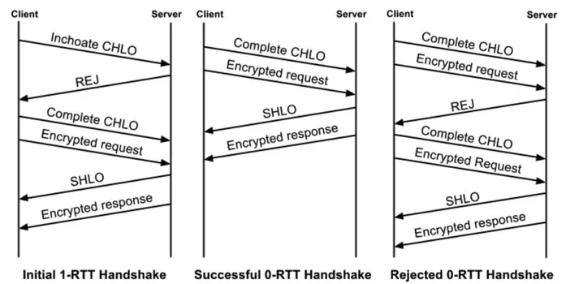

2.无队头阻塞的多路复用

相比于 HTTP/2 的多路复用，QUIC 不会受到队头阻塞的影响，各个流更独立，多路复用的效果也更好。

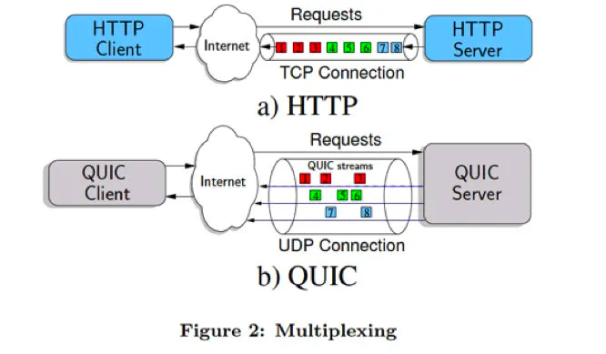

3.连接迁移

跟TCP用四元组标识一个唯一连接不同，QUIC 使用一个 64 位的 ConnectionID 来标识连接，基于这个特点，QUIC 的使用连接迁移机制，在四元组发生变化时（比如客户端从 WIFI 切换到蜂窝网络），尝试“保留”先前的连接，从而维持数据传输不中断。

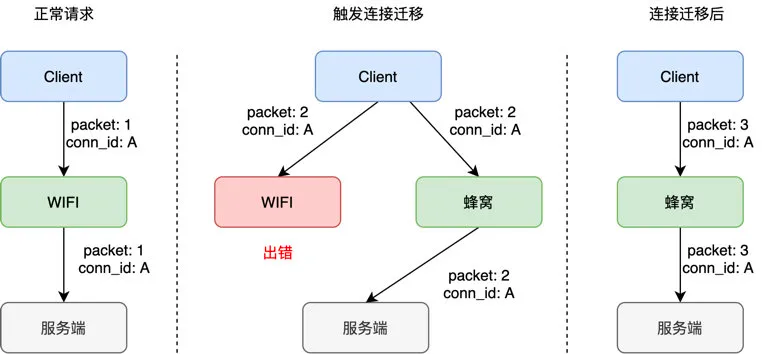

4.全应用态协议栈

QUIC核心逻辑都在用户态，能灵活的修改连接参数、替换拥塞算法、更改传输行为。而TCP核心实现在内核态，改造需要修改内核并且进行系统重启，成本极高。

#### QUIC 网络协议栈的选型

虽然 QUIC 各个特性看上去很美好，但需要客户端或者服务端的网络协议栈都支持 QUIC 协议。截止目前，除 `iOS15` 在指定接口 `NSURLSession` 及限制条件前提下，支持了 HTTP3，其他系统及主流网络库均不支持 QUIC。

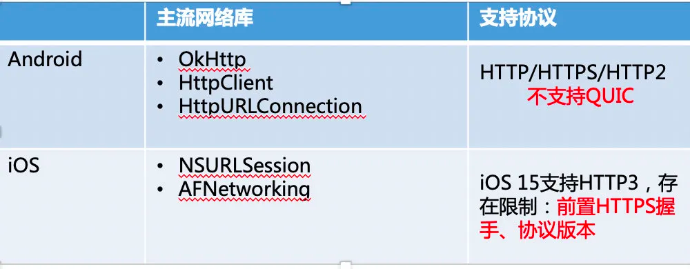

如何让业务快速将QUIC协议用起来，用这些先性加速网络性能？ QUIC 协议栈的实现成本非常高，主要体现在两方面：

* 实现复杂度很高，如上面介绍，QUIC/HTTP3 横跨传输层、安全、应用层，相当于要把TCP+TLS+HTTP 重新实现一次。

* QUIC 一直保持着高速发展，分为 gQUIC（Google QUIC）、iQUIC(IETF-QUIC)两大类，衍生的 QUIC 子版本有几十个。

为了快速把 QUIC 协议落地，给业务提升网络性能，我们选择了开源的 Chromium `cronet` 网络协议栈作为基础。Chomium，作为占领全球浏览器绝对地位的 Chrome 的开源代码,有 Google 强大的研发团队支撑，其网络协议栈是一个相对独立的组件，被称为 Cronet。

* 协议栈完整性：完善的 QUIC 协议栈，还包括 `HTTP2`,`WEBSOCKET`, `FTP`,`SOCKS` 协议；
* QUIC 版本支持：支持 gQUIC 和 iQUIC，并且还在不断保持更新；
* 跨平台性：非常好，基于 chrome 的跨平台能力，对于各类操作系统、终端都有适配。

####  QUIC 协议栈的工程实践

Cronet 能直接用起来吗？结合我们的实践与业务同学的反馈，直接使用的问题和接入困难度是比较大的。

问题一：代码体积过大，逻辑层级多，不利于集成和安装包体积控制（移动端）

Cronet 核心及关联的第三方库代码有大概 85w 行，涉及 2800 多个类。但其实 Cronet 里大部分代码都与 QUIC 没有关系，由于其作为浏览器的网络协议栈，集成了大量浏览器行为逻辑，而这些能力对于网络协议栈是不需要的。

其次，QUIC 协议只是 Cronet 里众多通信协议之一，除 QUIC 外的其他协议，通用的平台或软件（例如 Nginx）本身就已经有实现，没有必要重复建设,这些协议的存在除了增加协议栈内部逻辑复杂度，还增大了整个库的体积，例如在安卓平台上，cronet 动态库的体积接近 3MB，这对于一些体积敏感的应用是一个巨大的挑战。

针对体积问题，我们进行了代码精简和 lib 体积缩减的探究。

第一步，分析归纳:

* 通过对 cronet 代码的分析和理解，冗余的代码被我们分成了三种：

* 无用的内部逻辑，例如 HTTP 模块里包含了很多浏览器才会用到的代码和功能；

* 无需用到的的协议，例如 FTP、Websocket等；

* 与quic 无关的功能模块，例如 tcp 连接池等。

第二步，代码裁剪:

针对分析归纳中的三种问题，我们做了针对性的裁剪。首先是精简了关键类，例如协议管控的类中，核心流程步骤被从 21 步压缩到了 5 步，函数数量从 146 个减少到 24 个，将浏览器相关的冗余逻辑去除。

接着对用不到的协议类型、模块组件做了剔除。裁剪后的效果如下：

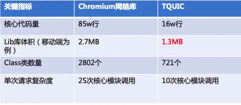

#### QUIC协议栈的易用性

虽然在工程方向，解决了体积大小和编译集成的问题。实际接入使用时，Cronet 的易用性依然不够好。

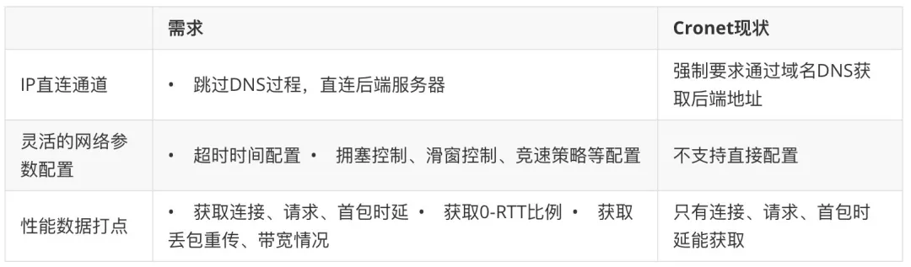

在通道直连方面，我们将底层 udp socket 粒度的接口进行封装后直接对外可见，用户可通过 socket 粒度的接口直接发起 IP 直连的 QUIC 请求，同时也保留了 DNS 建连能力，在保持原生能力的同时，拓展了用户的使用场景。

在网络参数配置和性能数据打点能力上，我们深入协议栈细节，逐个分析了多个核心模块，将关键的参数和性能数据抽象出来。并且在控制面上将配置参数、性能打点整合对外呈现。

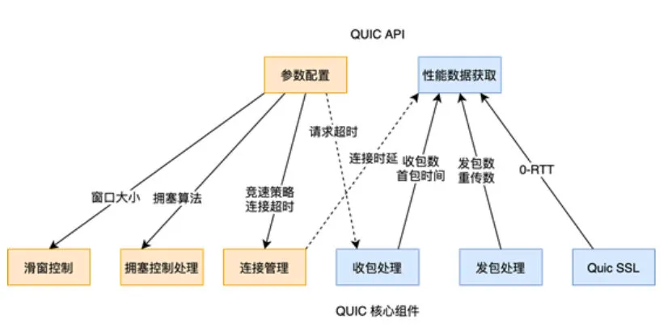

#### 私有协议和明文传输

在 Cronet 中，要想使用 QUIC 协议，应用层传输的报文必须是 HTTP，也就是所谓的 HTTP3 协议。但 HTTP 报文对于游戏、音视频等业务是个巨大的阻碍，它们当前都是通过 TCP 或者 UDP 传输自定义的协议的，如果为了接入 QUIC 而把应用层数据从私有协议强行改为 HTTP3，无疑是本末倒置。另外，由于是自定义协议，这些报文一般不需要 QUIC 进行加密，但加密是 QUIC 协议的标配，这会消耗额外的性能。

为此，在仔细研究了 Quic 核心代码后，研发对私有协议、明文传输的支持，来满足业务传输自定义协议的需求。首先是在 QuicStream 中，允许 stream 直接收发数据报文，HTTP 流程只是其中一个选择。

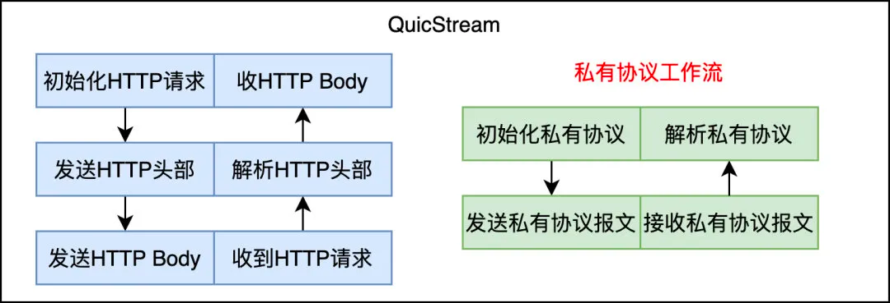

为了实现明文传输，如果直接去改加解密流程，对代码的入侵较大，如果考虑不周容易引入未知风险。为了尽量较少代码入侵以及维护原生实现的安全运行，我们将 QuicFramer 中的加解密套件选择处进行了 hook，引入了 FakeEncrypt或者FakeDecrypt 替换真实的加解密套件，以极小的入侵代价低成本的实现了明文传输。

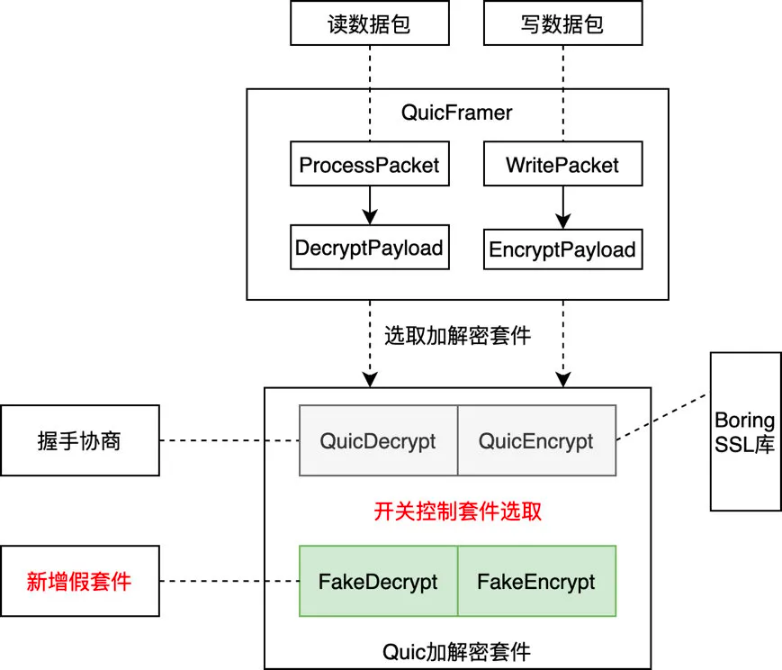

在做完明文传输方案后，我们意识到由于这是一个非常底层的修改，对于客户端和服务端来需要高度一致的，要么双端都选择加密，要么双端都选择明文。如果双端不统一，则握手就会失败。为了使兼容性更好，减少运维成本和失败风险，我们在握手协商过程中，加入了明文传输的协商。

如下图流程，当前的握手过程，使用了 AEAD 这个 tag 标识了待协商的加密算法。

改进后，AEAD 可以携带明文的加密算法，客户端如果也认可，则在下一次 CHLO 中选择该算法，则之后两边都进行明文传输。

#### 弱网优化之实时传输

实时传输是 QUIC 的一个拓展功能，目前在 IETF 草稿阶段。实时传输适用于对数据可靠性要求不高，但非常注重数据实时性的业务。例如音视频传输、互动游戏等。实时传输在 QUIC 中的定位，以及与可靠传输的区别如下：

* 相同点：

1. 在 QUIC 连接建立、创建 QUIC 数据包、数据加解密这些基础功能，不可靠数据与可靠数据都是共用的。

2. 不可靠传输也有拥塞控制、ACK机制，与可靠传输一致。

* 不同点：

1. 不可靠数据不受滑动窗口限制，滑窗窗口满只限制可靠数据传输。

2. 发生丢包重传时，只重传可靠数据帧，不可靠数据帧不进行重传。

不可靠数据没有 quic stream 概念，只是frame 粒度。这其中，一个关键点在于数据是否重传，IETF 草稿的定义对这块比较开放，可以完全不重传，也可以选择性重传。

为此，QUIC 在实现实时传输时，做了灵活的改造，对于实时传输的数据，提供多种重传策略供使用者选择，可以完全不重传，也可以选择性重传某个重要的数据（比如关键帧），我们也在尝试做动态重传控制，依托我们的弱网判断模型，动态调整重传策略。

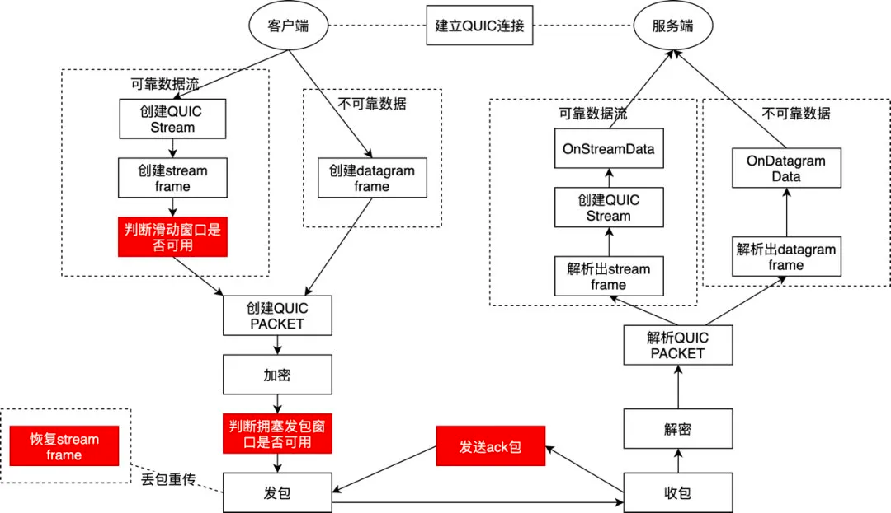

